---
date: 2023-04-19
metadata: true
concepts: []
status: 'pre-lecture'
docs: 
cite: ['rithm']
---

## Goals

-   Understand strategies for “component decomposition”
-   Practice designing a React app!
-   Learn to how pass functions between components

## Component hierarchies

### Lucky 7 Game

demo/dice-game/src/Lucky7.js
```jsx
import { useState } from "react";
import { getRolls, sum } from "./utils";
import "./Lucky7.css";

/** Luck Game: roll 2d6 and win with 7! */

function Lucky7() {
  const [dice, setDice] = useState(getRolls(2));
  const won = sum(dice) === 7;

  function roll() { setDice(getRolls(2)); }

  return (
    <main className="Lucky7">
      <h1>Lucky7 {won && "You won!"}</h1>
      <section className="Lucky7-dice">
        <div className="Lucky7-die">{dice[0]}</div>
        <div className="Lucky7-die">{dice[1]}</div>
      </section>
      <button onClick={roll}>
        Roll Again!
      </button>
    </main>
  );
}
```

-   This component is doing a lot!
-   It’s also inflexible
    -   It always rolls 2 dice
    -   It always wins on 7
-   There aren’t reusable parts
    -   Showing a set of dice
    -   Show an individual die
-   Let’s do better!

### Requirements

- A set components for:
	-   Play a dice game with _numDice_ number of dice
	-   Shows a win message when total equals _goal_
	-   A “roll again” button that re-rolls all the dice
- What props do we need? What state do we need? And where?

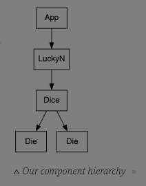

### Die Component

-   Props
    -   val: number
-   State
    -   none!
-   Events
    -   none!

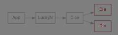

die component
```jsx
/** Single die. */

function Die({ val }) {
  return (
      <div className="Die">
        {val}
      </div>
  );
}
```

### Dice Component

-   Props
    -   dice: `[n, ...]`
-   State
    -   none!
-   Events
    -   none!

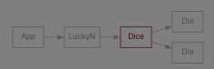

dice component
```jsx
/** Shows a set of dice. */

function Dice({ dice }) {
  return (
    <section className="Dice">
      {dice.map((v, i) =>
        <Die key={i} val={v} />)}
    </section>
  );
}
```

### LuckyN Component

-   Props
    -   numDice
    -   goal
-   State
    -   dice: `[n, ...]`
-   Events
    -   roll()

luckyn
```jsx
/** Luck Game: roll numDice & d6 and win with goal! */

function LuckyN({ numDice, goal }) {
  const [dice, setDice] = useState(getRolls(numDice));
  const won = sum(dice) === goal;

  function roll() { setDice(getRolls(numDice)); }

  return (
      <main className="LuckyN">
        <h1>Lucky{goal} {won && "You won!"}</h1>
        <Dice dice={dice} />
        <button onClick={roll}>
          Roll Again!
        </button>
      </main>
  );
}

```

### App Component

-   Props
    -   none!
-   State
    -   none!
-   Events
    -   none!

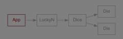

demo/dice-game/src/App.js
```jsx
/** Site with dice games. */

function App() {
  return (
    <div className="App">
      <Lucky7 />
    </div>
  );
}
```

### State design principle

> Lift state as high as needed —  
> but no higher.

Where should the dice-rolls state live?

- [❌|25](https://twemoji.maxcdn.com/v/14.0.2/svg/274c.svg)App: don’t need it, so shouldn’t lift it
-    LuckyN: this is the game itself!
-    Dice: should just be about showing a hand
-   ![❌]|25(https://twemoji.maxcdn.com/v/14.0.2/svg/274c.svg) Die: need to know roll total; not just for one>)

- & lift the state component up as high as needed - but no higher.

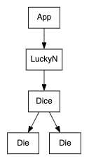

### Decoupling logic from presentation

- Generally, aim to have components be one of two types:
	- Presentational 
		- Doesn’t have state; is primarily about appearance/UI.
		- “dumb components”
	- Logical 
		- Has state or related logic; isn’t about a specific UI.

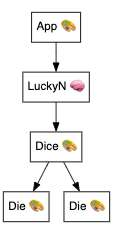

## Getting logic out of views

demo/dice-game/src/utils.js
```jsx
/** Gets random integer: [1..6]. */

function d6() {
  return Math.floor(Math.random() * 6) + 1;
}

/** Get n rolls => [num, ...]. */

function getRolls(n) {
  return Array.from({length: n}, () => d6());
}

/** Get sum of nums. */

function sum(nums) {
  return nums.reduce((prev, cur) => prev + cur, 0);
}

export { d6, getRolls, sum };
```

- Not everything needs to done in your component function:
	-   common logic can be shared
	-   even if only used once,  
	    this can still be very useful:
	    -   can be unit tested
	    -   can be mocked

### LuckyN

```jsx
/** Luck Game: roll numDice & d6 and win with goal! */

function LuckyN({ numDice, goal }) {
  const [dice, setDice] = useState(getRolls(numDice));
  const won = sum(dice) === goal;

  function roll() { setDice(getRolls(numDice)); }

  return (
      <main className="LuckyN">
        <h1>Lucky{goal} {won && "You won!"}</h1>
        <Dice dice={dice} />
        <button onClick={roll}>
          Roll Again!
        </button>
      </main>
  );
}
```

-   LuckyN takes numDice and goal
-   What if we wanted a more different game?
-   One where you had to roll less than a number?
-   Right now, logic for winning is in this function

### Passing a function as a prop

- In JavaScript, functions are _first-class objects_ — you can pass them around!
- LuckyN Component is about weby stuff - how it renders and how it looks - and now it doesn’t actually need to know how the game is won - this is now contained in the function 
- 

- We can pass a winCheck(dice) function to our LuckyN game!
```jsx
/** Possible game strategy: sum of dice < 4. */
function lessThan4(dice) {
  return sum(dice) < 4;
}

<LuckyN numDice={3} winCheck={lessThan4} />
```

```jsx
/** Luck Game: roll numDice & d6 and win with goal! */

function LuckyN({ numDice, winCheck }) {
  const [dice, setDice] = useState(getRolls(numDice));
  const won = winCheck(dice);

  // ...
}
```

- ~ Note: That could also be inlined
	- Given how simple the logic for that particular win condition is, this could even be inlined in the rendering of the function:
	```jsx
	<LuckyN
	  numDice={3}
	  winCheck={dice => sum(dice) < 4)} />
	```
	- However, that would make it much harder to unit test the condition or mock it, so this is probably not a good idea.

- & This is a very powerful idea — now, our LuckyN component is about the  _view_ our our app, and it can take *configurable logic*.

## Decomposing components

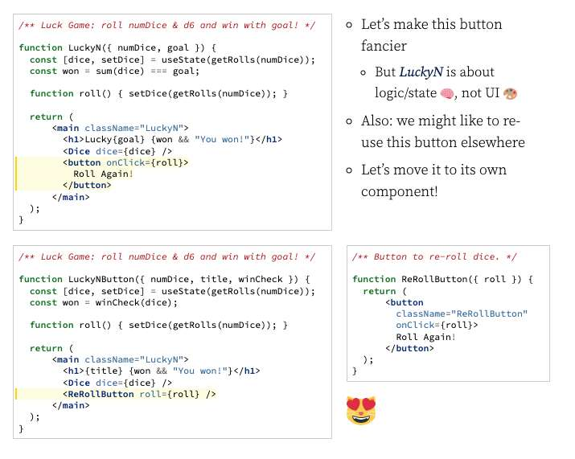

-   Let’s make this button fancier
	- But LuckyN about logic/state, not UI
-   Also: we might like to re-use this button elsewhere
-   Let’s move it to its own component!
	- Lets you use fancy button for whatever thing you want it to do -
		- That’s the fx you pass to it

### Passing functions to child

-   It’s common to pass a function to a child, for them to execute as needed.
-   Our dice state is in the game, so button can’t change it directly.
-   Our roll() function changes the state, so game with re-render.

### Making button more reusable

- Even better — we can make our button even more generic!
	- Click - function called onClick
	- Label - the label on button
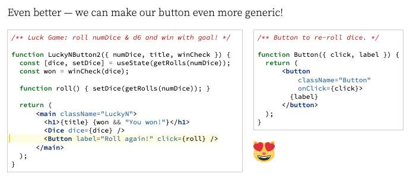

## Function passing

### New feature: re-rolling individual dice

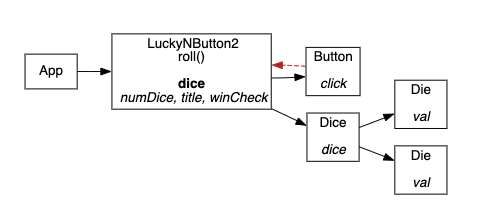

- How could we add a feature to re-roll an individual die when it’s clicked on?
- We can’t add it to LuckyNButton2 _or_ Die without changes!

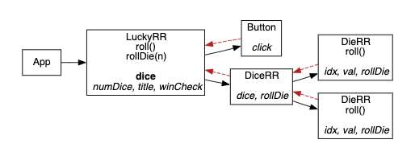
-   Add rollDie(n) to game component
-   Pass it to Die _through_ Dice
-   Each Die needs to know its “position” from Dice loop
-   On click, Die will call roll() which calls rollDie(myIndex)

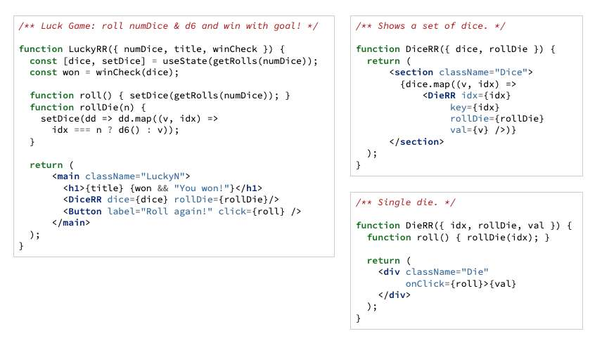

### How data flows

- This shows a common pattern in React:
	-   A parent component defines a function
	-   The function is passed as a prop to a child component
	-   The child component invokes the prop function
	-   The parent function is called, usually setting new state
	-   The parent component is re-rendered along with its children

- ~ Alternative strategy: pass “custom function” to Die
	- Right now, DiceRR passes rollDie() through Dice to each Die.  
	- Dice has to tell each die their index:
	LuckyRR
	```jsx
	<DiceRR dice={dice} rollDie={rollDie}/>
	```
	DiceRR
	```jsx
	{dice.map((v, idx) =>
	  <DieRR idx={idx} key={idx} rollDie={rollDie} val={v} />
	)}
	```
	DieRR
	```jsx
	function DieRR({ idx, rollDie, val }) {
	  function roll() { rollDie(idx); }
	
	  return <div className="Die" onClick={roll}>{val}</div>;
	}
	```
	- We could instead pass a _custom function_ to each child:
	LuckyRR
	```jsx
	<DiceRR dice={dice} rollDie={rollDie}/>  // unchanged
	```
	DiceRR
	```jsx
	{dice.map((v, idx) =>
	  // making bespoke `rollMe` for each Die
	  <DieRR idx={idx} rollMe={idx => rollDie(idx)} val={v} />
	)}
	```
	DieRR
	```jsx
	function DieRR({ rollMe, val }) {
	  return <div className="Die" onClick={rollMe}>{val}</div>;
	}
	```
	- Which is better?
		-   Using arrow functions in the parent simplifies the child
		-   However, there are performance optimization considerations
		-   Prefer passing rollDie to Die over a custom arrow function for now

## Learning design

- Designing a React application is a new skill will take practice to master.

### Components

- Generally, components should be small & do one thing.
- This often makes them more reusable.
- Example: component that displays a todo w/task could be used in lots of “lists”.

### Presentational Components

- Often, small components are simple & don’t have state:
```jsx
function Todo(props) {
  return <div className="Todo">{ props.task }</div>;
}
```

- This can be used like:
```jsx
function ListOfTodos() {  // ... lots missing
  return (
    <div className="ListOfTodos">
      todos.map(t => <Todo task={t} />
    </div>
  );
}
```

- Components like Todo are called “presentational” or “dumb” _\[in a good way!\]_

### Don’t Store Derived Info

- & If one thing can be calculated from another, don’t store both:
```jsx
function TaskList() {
  const [todos, setTodos] = useState(["wash car", "wash cat"]);
  const [numTodos, setNumTodos] = useState(2);

  return (
    <div>
      You have {numTodos} tasks ...
    </div>
  );
}
```

- ! Yuck! Just calculate the number of todos as needed!

## Coming Up

-   Learning to “route” in React applications
-   Learning how to handle “side effects” in a component
-   Learning other ways to pass data around

- ~ Using arrow functions for components
	- Components are just functions. We can write them with arrow syntax if we choose.
	If the component only renders, you can make use of an arrow function’s implicit return.
	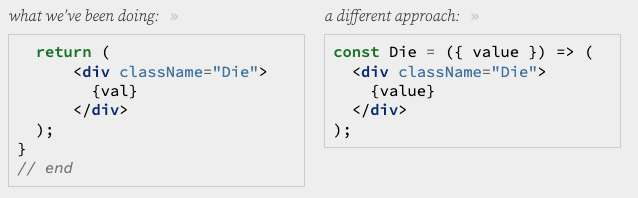
	- *Should you use arrow functions for components?* We recommend ✗ no — but, as always, follow the style of existing code.
	- You should understand the syntax so you recognize it in some documentation, code examples, etc.
	- Whichever you choose: be consistent.


## Additional Component Design Examples:

- From *Productiv* mini-sprint: 
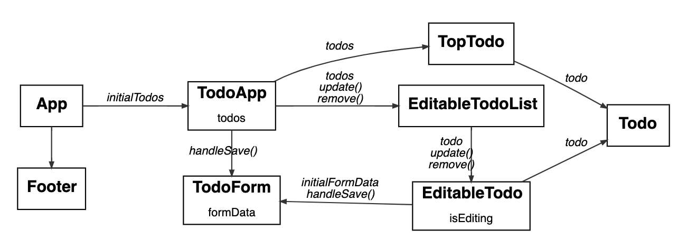
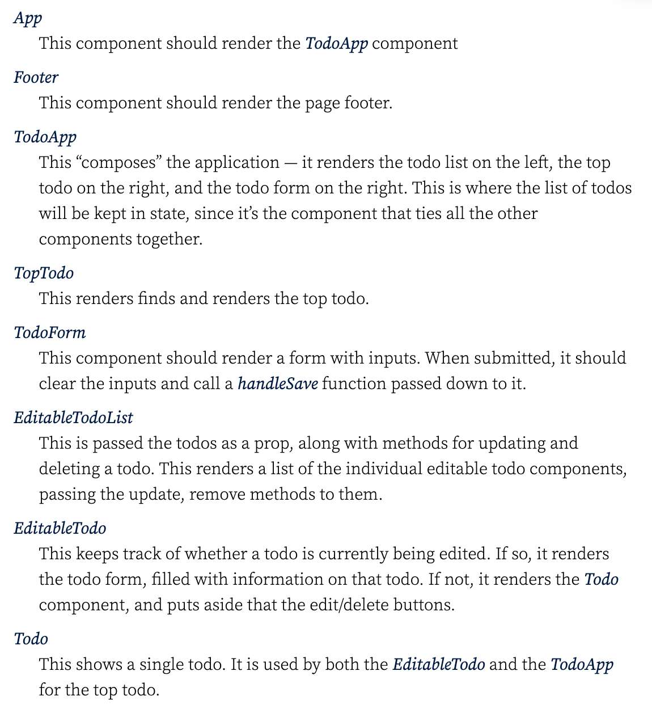
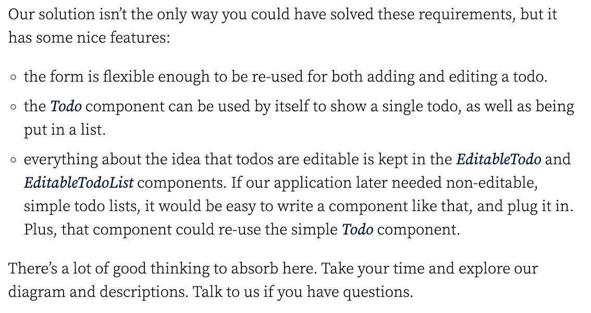
