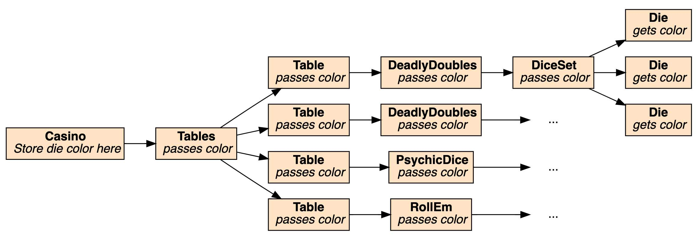
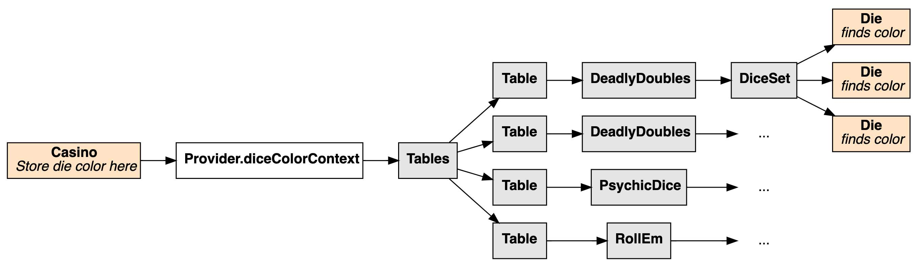
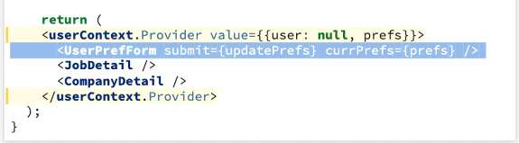

---
date: 2023-04-27
metadata: true
concepts: ['react', 'context']
status: 'pre-lecture'
docs: 
cite: ['rithm']
---

## Goals

-   Explain what context is
-   Use the Context API to provide and consume context

## Motivation

### What is Context?

-   Universal data across your application
-   Data accessible across all components

### When Is It Useful?

- Useful for global themes, shared data:
	-   Passing a user’s name around
	-   User currency preferences
	-   Light or dark mode theme selection

## Creating Context

demo/user-context/src/userContext.js
```jsx
import { createContext } from "react";

const userContext = createContext();

export default userContext;
```

- This gives us a component:
-   `<userContext.Provider>`: can provide a value to context

### Provider

- Note: context created inside of App.js
demo/user-context/src/JoblyApp.js
```jsx nums {5, 17, 21}
import { useState } from "react";
import UserPrefForm from "./UserPrefForm";
import JobDetail from "./JobDetail";
import CompanyDetail from "./CompanyDetail";
import userContext from "./userContext";

const DEFAULT_PREFS = {color: "dark", currency: "USD"};

function JoblyApp() {
    const [prefs, setPrefs] = useState(DEFAULT_PREFS);

    function updatePrefs(newPrefs) {
        setPrefs(newPrefs);
    }

    return (
    <userContext.Provider value={{user: null, prefs}}>
      <UserPrefForm submit={updatePrefs} currPrefs={prefs} />
      <JobDetail />
      <CompanyDetail />
    </userContext.Provider>
  );
}
```

- Any component descending from the Provider can access the context value.
	- & Meaning any component that has the `<userContext.Provider etc...>` wrapped around it *can access that context*

### useContext

demo/user-context/src/JobDetail.js
```jsx nums {1-2, 5, 10}
import { useContext } from "react";
import userContext from "./userContext";

function JobDetail({ title, description, salary }) {
  const { prefs } = useContext(userContext);

  return (
    <div>
      <h2>Fake Job!</h2>
      <p>You should apply! It pays lots of {prefs.currency}.</p>
    </div>
  )
}
```

- & In order to get the value, we need the `useContext `hook.
-   `useContext` looks for a matching context, and reads its value.
-   When value inside of context changes, components accessing that context will re-render.
-   Components that read from context with `useContext` are sometimes called _consumers_ (as opposed to providers).

### Storing User in Context

```jsx nums {15}
function JoblyApp() {
  // same as before but also...

  const [user, setUser] = useState(null);

  function login({username, password}) {
    // lots of logic here, but then ...
    const userFromAPI = {get_this_from_api};
    setUser(userFromAPI);
  }

  return (
  <userContext.Provider value={{user, prefs}}>
    {/* same, plus ... */}
    <LoginForm submit={login} />
  </userContext.Provider>
  );
}
```

- ! Be careful here about what information gets stored in context
	- $ username, name –> probably fine
	- !! SSN, mother’s maiden name, etc. 

- & Usually context is a piece of state
	- If you want to update that state - it needs to be updated in the same place that the context is defined.

## Demo Time

### Deadly Doubles

- A casino of different dice table games.

- Try it out: [https://react-deadly-doubles.surge.sh/](https://react-deadly-doubles.surge.sh/)

### Without Using Context


- Can you see the challenge?
- All components between Casino and Die don’t care about color for dice

### Using Context



- Now those components don’t need to pass down props they don’t care about

### React Features

- A generic component, *Table*, which can render different games.
- React’s context manager: *Casino* lets you choose a favorite color,  and *Die* (several layers down) can access the color you chose.

### Should I Use Context For Passing Everything?

- No!
- Passing the “real data” down as traditional props is better — it’s clear, obvious, and how React is meant to be used.
	- Note, like in earlier example, if something is used explicitly, should be passed explicity as a prop anyway
	- Here, prefs is pass to UserPrefForm explicity even though it is available in context:

- Context is good for cases where lots of different components need incidental access to *non-core-data*, and is convenient for them to to it easily.
	- Maybe don’t put the whole user object in context, but just username or aspects that are used and needed. 


## Documentation for context

- Put in docstring if context is relied on for that particular component 
	- But no need to document this for the in-between components

- $ So in this example, would document it for:
	- $ Casino - where context stored
	- $ Die - that relies on the color stored in context
- !! But Not:
	- !! Tables, Table , DeadlyDoubles, DiceSet
