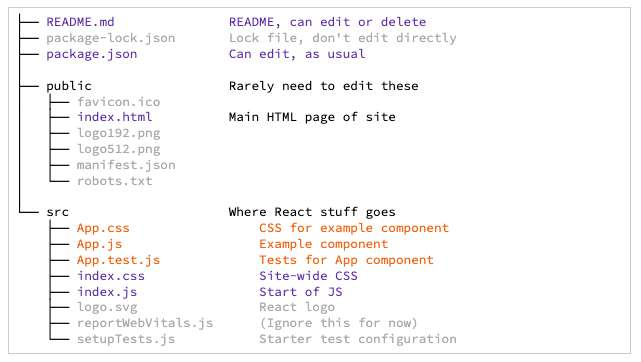

---
date: 2023-04-17
metadata: true
concepts: ['react', 'create-react-app']
status: 'pre-lecture'
docs: 
cite: ['rithm']
---
 
## Goals

-   Understand what **Create-React-App** is and how to use it
-   Use ES2015 modules to share code across files
-   Compare default vs. non-default exports
-   Using assets (images and CSS) in components

## Create React App

- React is a front-end library — you don’t need server-side stuff.
- You _can_ get `react.js` and `react-dom.js` from a CDN.
- You _can_ transpile JSX in the browser at runtime.
- But there’s a better way!

- **Create-React-App** is a utility script that:
	-   Creates a skeleton React project
	-   Sets it up so that JS files are run through Babel automatically
	-   Lets us use super-modern JavaScript features/idioms
	-   Makes testing & deployment much easier

### npx

- To scaffold a project with Create React App, we’ll use **npx**.
- **npx** will download Create React App and execute it.
- You can think of **npx** as being an alternative to installing packages globally.

Example
```shell
$ npx create-react-app my-app-name
```

### Skeleton

- This provides a nice starter skeleton:
```
├── README.md               README, can edit or delete
├── package-lock.json       Lock file, don't edit directly
├── package.json            Can edit, as usual
│
├── public                  Rarely need to edit these
│   ├── favicon.ico
│   ├── index.html          Main HTML page of site
│   ├── logo192.png
│   ├── logo512.png
│   ├── manifest.json
│   └── robots.txt
│
└── src                     Where React stuff goes
    ├── App.css                 CSS for example component
    ├── App.js                  Example component
    ├── App.test.js             Tests for App component
    ├── index.css               Site-wide CSS
    ├── index.js                Start of JS
    ├── logo.svg                React logo
    ├── reportWebVitals.js      (Ignore this for now)
    └── setupTests.js           Starter test configuration
```



### Starting Your App

```shell
$ npm start
```

- & Important: Remove Boilerplate Code
	- CRA will create a basic, boilerplate app for you – you should go ahead and remove the things you don’t need:
		- & Change the App component so it returns an empty div.
		- Delete the logo.svg file.
		- Delete the favicon.ico file (or replace with your own!)
		- & Remove the <React.StrictMode> tags around the <App /> component in index.js. React Strict mode will render _all of your components twice_, to test that they will render the same way when given them same input. This can be confusing to beginners who are still learning how React works, and when each component is rendered.

- create-react-app does strict mode for you

### Webpack

- CRA is built on top of Webpack, a JS utility that:
	- Enables module importing/exporting
	    - Packages up all CSS/images/JS into a single file for browser
	    - Dramatically reduces # of HTTP requests for performance
	- Hot reloading: when you change a source file, automatically reloads
	    - Is very clever and tries to only reload relevant files
	- Enables easy testing & deployment

- ~ Note: *The Webpack Rabbit Hole*
	- Webpack is a powerful tool, and configuring it can be quite complicated. Create React App abstracts away that configuration from you, which is great when you’re first learning. It’s not worth your time right now to learn too much about webpack other than the high-level bullet points we’ve outlined. If you’re curious, you can always to go to the [Webpack website](https://webpack.js.org/), but be warned: Webpack is a rabbit hole it’s easy to go down and isn’t terribly important at this stage in your learning.

## Modules

- CRA uses ES2015 “modules”
- This is a newer, standardized version of Node’s `require()`
- You use this to export/import classes/data/functions between JS files

### Sample Component

demo/my-app-name/src/App.js
```jsx nums {1-3, 22}
import React from 'react';
import logo from './logo.svg';
import './App.css';

function App() {
  return (
    <div className="App">
      <header className="App-header">
        
        <p>Edit <code>src/App.js</code> and save to reload.</p>
        <a
          className="App-link"
          href="https://reactjs.org"
        >
          Learn React
        </a>
      </header>
    </div>
  );
}

export default App;
```

### Importing “Default” Export

- Export default is going to be the *main* thing you are exporting from that file. 
- You can only export *one* thing as the default, though you can export other things as well.
	- In this case, don’t need curly braces
	- ! When importing a default export - possible to rename, but really bad idea to do so. 

demo/import-export/mystuff.js
```jsx
function myFunc() {
  console.log("Hi");
}

export default myFunc;
```

demo/import-export/index.js
```jsx
// Must start with dot --- "mystuff" would be a npm module!

import myFunc from './mystuff';
```

### Importing Non-Default Named Things

demo/import-export/mythings.js
```jsx
function otherFunc() { 
  console.log("Hey");
}

const luckyNumber = 13;

export { otherFunc, luckyNumber };
```

demo/import-export/index.js
```jsx
import { otherFunc, luckyNumber} from "./mythings";
```

### Importing Both

demo/import-export/both.js
```jsx
function mainFunc() {
  console.log("Ok");
}

const msg = "Awesome!";

export default mainFunc;
export { msg };
```

demo/import-export/index.js
```jsx
import mainFunc, { msg } from "./both";
```

### To Default or Not?

- Joel’s opinion and Minority opinion:
	- if export default, it makes things a little more confusing
	- other opinion is that exporting default provides a way of declaring this is the main thing. 

- Conventionally, default exports are used  
    when there’s a “most likely” thing to export.
- For example, in a React component file, it’s common to have the component be the default export.
- You never *need* a default export, but it can be helpful to indicate most important thing in a file.

## CRA and Components

- Good style:
	- Each React component goes in separate file
	    - `src/Car.js` for Car component
	    - `src/House.js` for House component
	- Define your function component, then export it as the default
	- Skeleton assumes top object is App in `App.js`
	    - Best to keep this

## Assets and CRA

- To include images and CSS, you can import them in JS files!
demo/my-app-name/src/App.js
```jsx nums {2-3, 9}
import React from 'react';
import logo from './logo.svg';
import './App.css';

function App() {
  return (
    <div className="App">
      <header className="App-header">
        
        <p>Edit <code>src/App.js</code> and save to reload.</p>
        <a
          className="App-link"
          href="https://reactjs.org"
        >
          Learn React
        </a>
      </header>
    </div>
  );
}

export default App;
```

### CSS

- Make a CSS file for each React component
    - `House.css` for House component
- Import it at the top of `House.js`
    - Create-React-App will automatically load that CSS
- & Conventional to add `className="House"` onto House div
    - And use that as prefix for sub-items to style:
```jsx
<div className="House">
  <p className="House-title">{ props.title }</p>
  <p className="House-address">{ props.addr }</p>
</div>
```

### Images

-   Store images in src/ folder with the components
-   Load them where needed and use imported name where path should go:

Animal.js
```jsx
import puppy from "./puppy.jpg";

function Animal() {
  return (
	<div>
	  
	</div>
  );
}
```

### Building for Deployment

- `npm run build` makes `build/` folder of static files
- You can serve from a web server.
