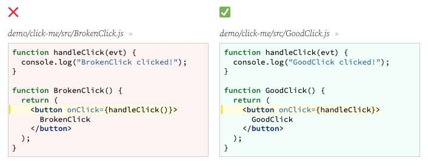

---
date: 2023-04-18
metadata: true
concepts: ['react', 'state']
status: 'pre-lecture'
docs: 
cite: ['rithm']
---

## Previous review

- Components should be named after the thing they represent
	- more noun-y names vs verb-y names
- React says: my job is to produce the DOM - just be aware of this when using bootstrap


## Goals

-   Attach event handlers to components in React
-   Define React state
-   Initialize and change state with `useState` (a hook)
-   Write event handlers to change component state

## Events in React

### DOM vs. React

-   Traditional DOM manipulation: in-line event handlers
```html
<button onclick="activateLasers()">
  Activate Lasers
</button>
```

-   More familiar: add an event listener
```html
<button id="laserButton">
  Activate Lasers
</button>
```

```js
button = document.getElementById('laserButton')
button.addEventListener("onclick", activateLasers)
```

### Example

```html
<button onclick="activateLasers()">
  Activate Lasers
</button>
```

- This is slightly different in React:

```jsx
<button onClick={activateLasers}>
  Activate Lasers
</button>
```

-   React events are _camelCase_, rather than _lowercase_.
-   With JSX you pass a function as event handler, rather than a string.

### Event Attributes

- Any event you can listen for in JS, you can listen for in React.
	-   Mouse events: `onClick`, `onMouseOver`, etc
	-   Form events: `onSubmit`, etc
	-   Keyboard events: `onKeyDown`, `onKeyUp`, `onKeyPress`
-   [Full list](https://reactjs.org/docs/events.html#supported-events)

### An example in a component

demo/click-me/src/GoodClick.js
```jsx nums {9}
import React from "react";

function handleClick(evt) {
  console.log("GoodClick clicked!");
}

function GoodClick() {
  return (
    <button onClick={handleClick}>
      GoodClick
    </button>
  );
}

export default GoodClick;
```

### Functions vs. Invocations

- & Remember: event listeners expect to receive _functions_ as values.
- !! Don’t invoke your function when you pass it!



## React State

### Core React Concepts

- **Component**
	- Building block of React; combines logic and presentation.
- **Prop**
	- Data passed to a component _(or found via defaults)_.  
	- & Immutable; component cannot change its own props.
- **State**
	- Data specific to an instance of a component; *can change!*

### What common things belong in state

-   A variable that decides whether to hide or show something
-   Data fetched from an API
-   Form data
-   For a piece of information, ask: _will this ever change?_
    -   If so, it should be somewhere in state!

### State

- In React, state is created using `useState`
	- `useState` must be imported from react
```jsx
const [mood, setMood] = useState("happy");
```

-   This returns an array of two items:
    -   The value of that state (this can change!)
    -   A function to change it
-   You must call `useState` in the component, not outside it
-   Best: keep `useState` calls at the top of your component

- ! Warning: You can’t call useState in loops or if-blocks
	- It’s important that React knows exactly how many times useState is called, and that it is the same number of times every time a component function is called. Therefore, it is not valid to call useState inside of a for loop, or inside an if body.

### Naming conventions

```jsx
const [mood, setMood] = useState("happy");
```

-   The name of the hook is called `useState`.
-   You can call the two returned values whatever you’d like.
-   *Very conventional:* paired names, like `foo` and `setFoo`.

## Initial State

- Pass an argument to useState to be the **initial value** of the state:
```jsx
import React, { useState } from "react";

function Person() {
  const [mood, setMood] = useState("happy");

  return (
    <div> Your mood is {mood} </div>
  );
}
```

- While our component runs every time it renders the initial value is ignored after the first time it runs  
	- _(otherwise it would overwrite mood with “happy” each time)_
- Mounting - initializing the state of a component

### Complex Initial State

- If the initial state is a time-intensive calculation, you can pass a callback function instead. React will only call this the first time:
```jsx
import React, { useState } from "react";

function MyGame() {
  const [board, setBoard] = useState(makeEmptyBoard);

  function makeEmptyBoard() { return [ /* ... */ ] }

  return(
    <div> ... </div>
  );
}
```

### No Initial State

- If you don’t pass anything in to `useState`, the **initial value** of the state will be undefined.
```jsx
import React, { useState } from "react";

function Person() {
  const [mostRecentMeal, setMostRecentMeal] = useState();

  return(
    <div> You ate {
      (mostRecentMeal !== undefined)
        ? mostRecentMeal
        : "nothing"
      } today!
    </div>
  );
}
```

## Changing State

- We’ll do this using our setMood function!
- Whatever we pass to this function will be set as the new value of mood during the next re-render
	- & setMood - sets the *new* value of mood for the *next* re-render

Like this…
```jsx
import React, { useState } from "react";

function Person() {
  const [mood, setMood] = useState("happy");

  function getExcited() {
    setMood('excited');
  }

  return (
    <div>
      <div> Your mood is {mood} </div>
      <i onClick={getExcited}> Change! </i>
    </div>
  );
}
```
- first item in array from result of useState() is the variable, the second item is the set function for that variable.

-   setMood is called
-   The component re-renders
-   In this re-render, mood will be set to excited
-   Remember: the initial state is only used the first time a component renders

- setWHATEVER triggers a re-render

### In-lining a Callback


(There’s nothing special about using the arrow function syntax in the second case; you could also use a more traditional function expression — all that really matters is that you pass a _function_, not _call_ the function you want for the handler)

- ~ Hint: Deciding between a named function or inlining function
	- Very simple functions (like `setMood` in the example) might be a good candidate for inlining, but if your function isn’t a single expression, or if its purpose would be clearer if it had a name, make it a traditional, named function.

### Click Rando

- Let’s see another example!


- creating a component
- creating a piece of state for `[num, setNum]`
- Refreshing the page remounts the entire application

### Multiple Pieces of State

- You can call `useState` multiple times if a component needs multiple pieces of state.

demo/click-me/src/Complex.js
```jsx nums {4-5, 10-11}
/** An example of a component with state/props/children. */

function Complex({ maxNum, initialMsg }) {
  const [pushed, setPushed] = useState(false);
  const [num, setNum] = useState(getRandom(maxNum));

  console.log("Complex", pushed, num);
  
  function handleClick(evt) {
    setPushed(true);
    setNum(getRandom(maxNum));
  }

  return (
    <button className="btn" onClick={handleClick}>
      <b>{pushed ? `Number: ${num}` : initialMsg}</b>
    </button>
  );
}
```

## State vs Props

- What belongs in state and what belongs in props?
	- If the data will ever change, it needs to be in state!
- Prop
	- Immutable
- State
	- things can change

### Example: Let’s build a game

-   If we want to build a game with a board, we might want a component called GameBoard.
    -   current score: props or state? –> State
    -   width of board: props or state? –> props
    -   names of the players: props or state? –> props

## Documenting Components

- Components should be documented for:
	- the props they take
	- their state
	- what components render them/what they render

```jsx
/** Order entering system before it ships.
 *
 * Props:
 * - orderId
 * - price (before tax)
 * - salespersonId
 *
 * State:
 * - isConfirmed: true/false
 *
 * Customer -> Order -> OrderItem
 */

 function Order({ orderId, price, salespersonId }) {
   // ...
 }
```

## Wrap Up

-   More on state
-   More on events
-   Passing functions that change state
-   Testing!