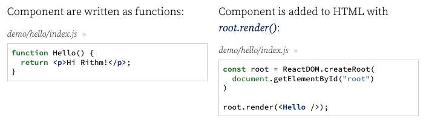
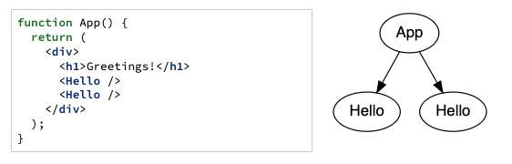
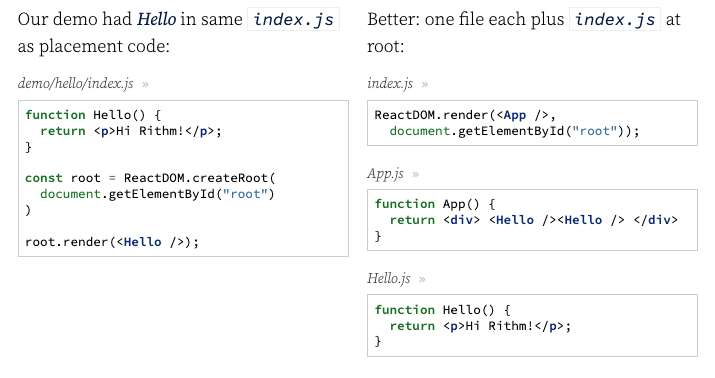

---
date: 2023-04-17
metadata: true
concepts: ['react']
status: 'pre-lecture'
docs: 
	babel: 'https://babeljs.io/'
	react-developer-tools: 'https://chrome.google.com/webstore/detail/react-developer-tools/fmkadmapgofadopljbjfkapdkoienihi'
cite: ['rithm']
---

## Goals

-   What is React?
-   Components
-   JSX & Babel
-   Properties
-   Styling React

## Front End Frameworks

-   Larger JS libraries
-   Provide “blueprint” for apps
-   “Opinionated”
    -   “This is how you should design a JS app”
-   Often: provide for code re-use
-   Often: provide templating of HTML (like Jinja)

### Popular Front End Frameworks

-   Angular
-   Ember
-   Vue
-   React
-   Svelte

- There are many others, but these are among the most popular.
- There are differences between them but they largely share lots of common ideas and after learning one framework, you’ll be in a better position to learn about others.

- ~ Is JQuery a “framework”?
	- Most people would consider it a “library”, but not a “framework”. Often, people distinguish between these based on questions like:
		-   is it large and complex? (frameworks often are)
		-   does it push you toward a particular way of thinking about the app design? (frameworks almost always do)
		-   is it “in charge”, calling out to your code as needed? (often, frameworks do this).

## React

-  Popular, powerful front-end framework.
- Developed by and sponsored by Facebook.
-   Make it easy to make reusable “view components”
    -   These “encapsulate” logic and HTML into a single function
-   Often make it easier to build modular applications

### Goal


- React reshapes this separation of concerns - *the component* is the concern, with all the html, css, and js into 1-2 files.

## Components

-   The building blocks of React
-   Pieces of UI & view logic
- & Functions that *know how to render themselves into HTML*

(a bit like this)
```js
function Cat() {
  const name = "Fluffy";

  return `<p>Meow! I'm ${name}!</p>`;
}
```

- & Must always begin with a capital letter
- You don’t actually ever call these yourself 
- 
### Demo: Hello

demo/hello/index.html
```html nums {6}
<!DOCTYPE html>
<html>
<head><title>Hello 1</title></head>
<body>

<div id="root"> <!-- component will go in this div --> </div>

<script src=
  "https://unpkg.com/react/umd/react.development.js"></script>
<script src=
  "https://unpkg.com/react-dom/umd/react-dom.development.js">
</script>

<script src="https://unpkg.com/babel-standalone"></script>

<script src="index.js" type="text/jsx"></script>

</body>
</html>

```


- That _renders_ the Hello component and puts the resulting HTML in `div#root`.

- ~ Tip: A warning you may see in the Chrome Console
	- If you happen to see the following in the Chrome Console:
	- *Warning: You are importing createRoot from “react-dom” which is not supported. You should instead import it from “react-dom/client”.*
	- No need to worry - this will not impact anything with your application and will be addressed in an upcoming lecture when we use Create React App.

## JSX

demo/hello/index.js
```jsx nums {2, 9}
function Hello() {
  return <p>Hi Rithm!</p>;
}

const root = ReactDOM.createRoot(
  document.getElementById("root")
)

root.render(<Hello />);
```
- What’s this thing in our JavaScript?

- JSX is like DOM structures embedded in JavaScript:
```jsx
if (score > 100) {
  return <b>You win!</b>; // <-- JSX
}
```

- You can also “re-embed” JS expressions in JSX:
```jsx
if (score > 100) {
  return <b>You win, { playerName }</b>;
}
```
(evaluates JavaScript expression `playerName`)
- JS expression must be in { }
- expression = anything that can go on the right hand side of = 
- says evaluate this thing and put the result inside of these curly braces

-   Files with JSX aren’t legal JavaScript
    -   They have to be “transpiled” to JavaScript
-   You can do this with [Babel](https://babeljs.io/)
	- by just putting a script tag in html
	- need this because jsx is not legal js
	- doesn’t need to be installed

### Transpiling JSX in Browser

-   Easy for getting started — nothing to install!
-   Load Babel standalone library:
    ```js
    <script src="https://unpkg.com/babel-standalone"></script>
    ```
    
- & Mark JSX files with `type="text/jsx"`:
	- Type *must* be specified
	    ```js
	    <script src="index.js" type="text/jsx"></script>
	    ```

- ~ Note: Use Babel on Command Line
	- While it’s convenient to transpile JSX into JavaScript directly in the browser like this, it’s not suitable for real-world deployment: it takes a second to do the conversion, leading to a poor experience for users.
	- Better for deployment is to convert JSX to JavaScript once, via the command line, and then save and use the converted JS directly.
	- To do this:
		1.  You need to install [npm](http://npmjs.com/)
		2.  Then use npm to install Babel and settings for React:
		    ```
		    $ npm install @babel/core @babel/cli @babel/preset-react
		    ```
		3.  To convert a file:
		    ```
		    $ node_modules/@babel/cli/bin/babel.js --presets @babel/react
		    `file.jsx > file.js
		    ```

### Serving Demo

- & For security reasons, Babel won’t work with file:// scripts
	- Cant just drag and drop file into a browser
	- Need to serve it under http protocol instead
- Run files under a simple static server:
```shell
$ python3 -m http.server
```

- Then you can visit at _http://localhost:8000/yourfile.html_

### JSX Rules

- Elements in JSX must either:
	- Have an explicit closing tag: `<b> ... </b>`
	- Be explicitly self-closed: `<input name="msg" />`
	    - Cannot leave off that `/` or will get syntax error

- $ JSX must have a single top element:
```jsx
const out = <b>Hi</b>;
```

- !! They cannot have multiple top elements:
```jsx
const out = <b>Hi</b> <i>!!!</i>;
```

- $ You can always wrap those in a top-level element:
```jsx
const out = <div> <b>Hi</b> <i>!!!</i> </div>;
```

## Applications

- Real world applications are made up of many components.
- It is very conventional to name the “top” component *App*.
- This renders all the other components:

- This way, readers of code know where to start
- *App* is the only thing rendered in `index.js`

### Files

- Our demo had Hello  in same `index.js` as  placement code.
- Better: one file each plus `index.js` at root:
	- index.js: 
		- Renders top level App component in root div (condenses those two lines  from left example into one)
		- This is the only thing that goes in this file
	- Many other files - every other component has its own file
		- named with capital component name: 
			- App
			- Hello

- This makes it really easy to reuse components within and across projects

### Order of Script Tags

index.html
```html nums {7-9}
<script src="http://unpkg.com/react/umd/react.development.js"></script>
<script src="http://unpkg.com/react-dom/umd/react-dom.development.js">
</script>

<script src="http://unpkg.com/babel-standalone"></script>

<script src="Hello.js" type="text/jsx"></script>
<script src="App.js" type="text/jsx"></script>
<script src="index.js" type="text/jsx"></script>
```

- & Make sure any components you need in a file are loaded by a previous script tag.
	- *(We’ll learn about a better way to manage imports soon.)*

## Props

- A useful component is a reusable one.
- This often means making it configurable or customizable.

Hello.js
```js
function Hello() {
  return <p>Hi Rithm!</p>;
}
```

- It would be better if we could _configure_ our greeting.
- Our greeting will be _Hi \_\_\_\_\_\_ - \_\_\_\_\_\__.
- Let’s make two “properties”:
	- *to*
		- Who we are greeting
	- *author*
		- Who our greeting is from

### Demo: Hello Props

- & Components take one argument: props that get passed by the attributes of the jsx returned from that function.

demo/hello-props/App.js
```jsx nums {2}
function App() {
  return <Hello to="you" author="me" />;
}
```

- Set properties on element; get using *props.propName*, (where *props* is first argument to component function)

demo/hello-props/Hello.js
```jsx nums {1, 6}
function Hello(props) {
  return (
    <div>
      <p>Secret Message: </p>
      <p>
        Hi {props.to} - {props.author}
      </p>
    </div>
  );
}
```

### Reusing Component

- You can use a component many times:

App.js
```js
function App() {
  return (
    <div>
      <Hello to="Kay" author="Kim" />
      <Hello to="you" author="me" />
    </div>
  );
}
```

### Properties Requirements

-   Properties are for _configuring_ your component
-   Properties are immutable
-   Properties can be strings:
```jsx
<User name="Jane" title="CEO" />
```
-   For other types, embed JS expression (JSX) *using the curly braces*:
      *“evaluate this expression and put it here”*
```jsx
<User name="Jane" salary={ 100_000 }
  hobbies={ ["bridge", "reading", "tea"] } />
```
- ~ Note: underscores in numbers are in place for commas
	- because commas not allowed in js

### Destructuring Props

- You can write this:
App.js
```jsx
function Hello(props) {
  return <b>Hi { props.to } - { props.author }!</b>;
}
```

- But it’s often nicer to _destructure_ the props in the signature:
App.js
```jsx
function Hello({ to, author }) {
  return <b>Hi { to } - { author }!</b>;
}
```

### Default Properties

- & By doing the destructuring, you can supply default arguments:

App.js
```jsx nums {1}
function Hello({ to, author="Joel" }) {
  return <b>Hi { to } - { author }!</b>;
}
```

- ~ Another way to configure default properties
	- There’s another way to configure a component to have default properties, using `.defaultProperties`.
	```jsx
	function Hello(props) {
	  return (
	    <p> Hi {props.to} - {props.author} </p>
	  );
	}
	
	Hello.defaultProps = {
	  to: "Bob",
	  author: "Jenny",
	};
	```
	- This is a bit more verbose and clunky, but it can be useful when you can’t destructure your props easily because the property names aren’t valid JavaScript identifier names.

## Conditionals in JSX

- A function component can return either:
	-   a **single valid** DOM object (`return <div>...</div>`)
	-   an **array** of DOM objects (but don’t do this yet!)
	-   null to show nothing (undefined is not ok!)

- You can put whatever logic you want in your function for this:
```jsx
function Lottery({ winner }) {
  if (winner)
    return <b>You win!</b>;
  else
    return <b>You lose!</b>;
}
```

- ! But note, *cannot* have if/else statements *inside* JSX expression `{}`  because the if/else isn’t an expression that can fit on right side of an equal sign

### Ternary

- It’s very common to use ternary operators:
```jsx
function Lottery({ winner }) {
  return (
    <b>You {winner ? "win" : "lose"}!</b>
  );
}
```

### Demo: Slots

demo/slots/Machine.js
```jsx nums {7}
function Machine({ s1, s2, s3 }) {
  const winner = s1 === s2 && s2 === s3;

  return (
    <div className="Machine">
      <b>{s1}</b> <b>{s2}</b> <b>{s3}</b>
      <p>You {winner ? "win!" : "lose!"}</p>
    </div>
  );
}
```

demo/slots/App.js
```jsx
function App() {
  return (
    <div>
      <h1>Casino!</h1>
      <Machine s1="X" s2="X" s3="X" />
    </div>
  );
}
```
(if this was a real game, would have dynamic code for s1, s2, s3)

## Looping in JSX

- It’s common to use `array.map(fn)` to output loops in JSX:
app.js component
```jsx
<Messages msgs={ [
    {id: 1, text: "Greetings!"},
    {id: 2, text: "Goodbye!"},
  ] } />
```

```jsx nums {4}
function Messages({ msgs }) {
  return (
    <ul>
      { msgs.map(m => <li>{m.text}</li>) }
    </ul>
  );
}
```

### Demo: Friends

demo/friends/Friend.js
```jsx nums {6}
function Friend({ hobbies, name }) {
  return (
    <div>
      <h1>{name}</h1>
      <ul>
        {hobbies.map(h => <li>{h}</li>)}
      </ul>
    </div>
  );
}
```

- Hobbies is a list –> which is a js thing and not just text, and therefore need to put inside of curly braces to evaluate the JSX 

demo/friends/App.js
```jsx
function App() {
  return (
    <div>
      <Friend name="Jess" hobbies={["Tea", "Python"]} />
      <Friend name="Jake" hobbies={["Chess", "Darts"]} />
    </div>
  );
}
```

- ~ Note: Warnings about key props
	- If you look in the console, you’ll see that React is mad at you for not adding something called a “key” prop when you map over an array and render components. You don’t need to worry about this for now; later on, we’ll talk more about what’s happening here.

## Styling React

- You can add CSS classes in JSX.
- However: since class is a reserved keyword in JS, spell it className in JSX:
```jsx
function Message() {
  return <div className="Message">Emergency!</div>;
}
```

```jsx
function Message({ urgencyColor }) {
  return <div className={urgencyColor}>Emergency!</div>;
}
```

- You can inline CSS styles, but *style takes a JS object*:
	- also want to be careful when you do this
```jsx
function Box({ favoriteColor, otherColor, message }) {
  const myStyles = {
    color: favoriteColor,
    backgroundColor: otherColor,
  };

  return <b style={myStyles}>{message}</b>;
}
```


## Debugging React

- Install [React Developer Tools](https://chrome.google.com/webstore/detail/react-developer-tools/fmkadmapgofadopljbjfkapdkoienihi)
- & Keep your console & dev tools open when working with React

