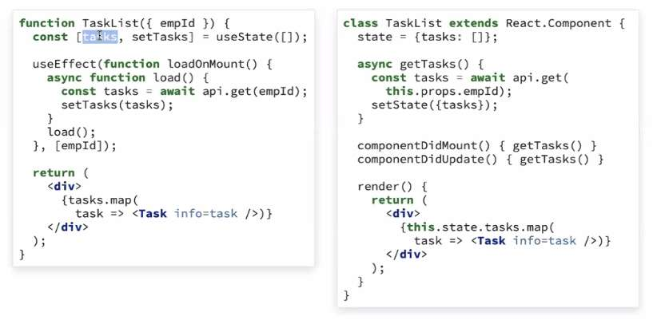
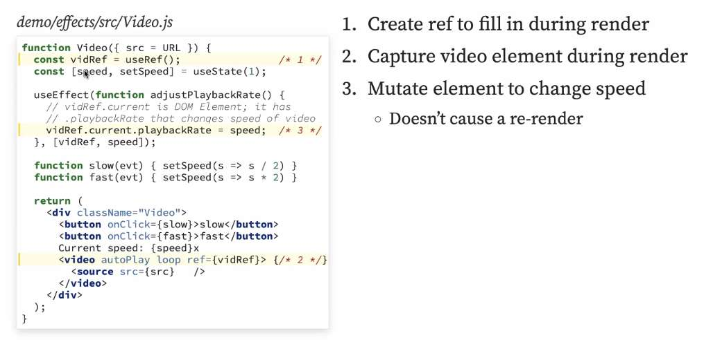

---
date: 2023-05-05
metadata: true
concepts: []
status: 'pre-lecture'
docs: 
cite: ['rithm']
---

## React Core Ideas

-   Props
-   State
-   Effects - when this first happens, when state changes
-   Context
-   Router

### discussion from class

- reusability
- redefining separation of concerns: component design - mixing html with jsx
- pushes us toward kate is in charge of x, brit is in charge of y, etc. 
- gives us very sharp distinctions - where should this fact live
- What do you not think of with react? 
	- Don’t have to think about manipulating the DOM yourself
	- just write what you want it to look like
- All front end frameworks have a similar:
	- tell the state, and it will handle the rendering

## Class components

- We’ve been writing components as functions…
- Another way to build components: as classes rather than functions
	- This is how most people built React components until 2021; some still do, and there’s lots of code out there using this
	- lifecycle methods
	- can mix and match, it doesn’t change/matter


```jsx
function TaskList({ empId }) {
  const [tasks, setTasks] = useState([]);

  useEffect(function loadOnMount() {
    async function load() {
      const tasks = await api.get(empId);
      setTasks(tasks);
    }
    load();
  }, [empId]);

  return (
    <div>
      {tasks.map(
        task => <Task info=task />)}
    </div>
  );
}
```

```jsx
class TaskList extends React.Component {
  state = {tasks: []};

  async getTasks() {
    const tasks = await api.get(
      this.props.empId);
    setState({tasks});
  }

  componentDidMount() { getTasks() }
  componentDidUpdate() { getTasks() }

  render() {
    return (
      <div>
        {this.state.tasks.map(
          task => <Task info=task />)}
      </div>
    );
  }
}
```

## useRef

- useRef is a hook for holding onto a piece of data (often times variable or DOM pointer)
- It returns a *mutable* object (initially set to the default), which persists across renders
	- Mutating the ref object does not trigger a re-render.
- This is often useful for:
    - Accessing an underlying DOM element
    - Setting up / clearing timers

### Use: Manipulating a DOM Element

- Need to access a DOM element to for a non-React API or to integrate some other JavaScript library?
- This is a great time to use a ref!



demo/effects/src/Video.js
```jsx nums {2, 8, 19}
function Video({ src = URL }) {
  const vidRef = useRef();                /* 1 */
  const [speed, setSpeed] = useState(1);

  useEffect(function adjustPlaybackRate() {
    // vidRef.current is DOM Element; it has
    // .playbackRate that changes speed of video
    vidRef.current.playbackRate = speed;  /* 3 */
  }, [vidRef, speed]);

  function slow(evt) { setSpeed(s => s / 2) }
  function fast(evt) { setSpeed(s => s * 2) }

  return (
    <div className="Video">
      <button onClick={slow}>slow</button>
      <button onClick={fast}>fast</button>
      Current speed: {speed}x
      <video autoPlay loop ref={vidRef}> {/* 2 */}
        <source src={src}   />
      </video>
    </div>
  );
}
```
-vidref is just an object you get back here
-Note: can just rewrite effect as not an effect and just write what you want it to do.

1.  Create ref to fill in during render
2.  Capture video element during render
3.  Mutate element to change speed
    -   Doesn’t cause a re-render

### Use: Timers

- Another great time to use a ref is with timers like setInterval.
- setInterval returns a timer ID, which we need to stop the timer from running.
- We can store that ID in a ref, and then stop the timer when component unmounts.

demo/effects/src/TimerWithRef.js
```jsx nums {2, 7, 13, 20}
function TimerWithRef() {
  const timerId = useRef();               /* 1 */
  let [count, setCount] = useState(0);

  useEffect(function setCounter() {
    console.log("setCounter");
    timerId.current = setInterval(        /* 3 */
        () => setCount(c => c + 1),
        1000);

    return function cleanUpClearTimer() {
      console.log("cleanUpClearTimer");
      clearInterval(timerId.current);     /* 4 */
    };
  }, [timerId]);

  return (
    <div>
      <h1>{count}</h1>
      timerId: {timerId.current}        {/* 2 */}
    </div>
  );
}
```

1.  Make ref to fill in later
2.  Can use variable during render
3.  Mutate to update value of ref
    -   Does not trigger a rerender
4.  During unmount, can use ref
    -   Stops timer

- ! Warning: Be Careful of Misuse
	- Since refs can expose DOM elements for us, it can be tempting to use them to access the DOM and make changes (toggle classes, set text, etc).
	- This is **not** how refs should be used. React should control the state of the DOM!
	- [From the docs:](https://reactjs.org/docs/refs-and-the-dom.html#dont-overuse-refs)
	- Your first inclination may be to use refs to “make things happen” in your app. If this is the case, take a moment and think more critically about where state should be owned in the component hierarchy.

### Refs Wrap Up

- useRef provides a mutable object that you can treat like a variable
    - Common: remember a DOM element so you can interact with it
    - Common: remember a non-state piece of information, like a timer ID

- & useful for *non-state* information

## Reducers

- For sites with complex state, can centralize state logic into a single complex state and a _reducer_ function
- ! This is way overkill for a small site

### What is a reducer?

- Function accepting two objects:
    - current **state**
        - `{ count: 1 }`
    - **action** describing change to make
        - `{ type: "+" }`
- *Pure* functions
    - Don’t mutate anything; rely only on args
- Use action to make & return a new state
    - `reducer(st, action) // { count: 2 }`

```jsx nums {}
function reducer(state, action) {
  if (action.type === "+") {
    return { count: state.count + 1 };
  }
  if (action.type === "-") {
    return { count: state.count - 1 };
  }

  return state;
}
```

Advantages:
- highly testable
- keep predicable

- & You don’t call the reducer fx yourself, react calls it for you
	- by using useReducer and dispatch
	- Calls reducer for you
	- reducer figurs out what new state should be
	- then components update

### Reducer example: Counter

demo/counter/src/Counter.js
```jsx nums {1, 12-13, 15-16}
function reducer(state, action) {          /* 1 */
  if (action.type === "+") {
    return { count: state.count + 1 };
  }
  if (action.type === "-") {
    return { count: state.count - 1 };
  }
  return state;
}

function Counter() {
  const [state, dispatch] = useReducer(    /* 2 */
      reducer, initState);

  function dec() { dispatch({type: '-'}) } /* 3 */
  function inc() { dispatch({type: '+'}) } /* 3 */

  return (
    <div>
      Count: {state.count}
      <button onClick={dec}>-</button>
      <button onClick={inc}>+</button>
    </div>
  );
}
```

1.  Reducer function
    -   Takes curr state & action
    -   Returns new state
    -   Isn’t called directly
2.  Hook to make dispatch function
    -   Dispatches action to reducer
3.  Dispatching an action

### Patterns with useReducer

- Main idea:
	- & Get the state out of components - when things get really complex
- Patterns:
	- Keep reducer in own file to unit test
	- Can pass reducer around easily with useContext

demo/counter/src/rootReducer.js
```jsx
const INITIAL = { count: 0 };

function reducer(state = INITIAL, action) {
  if (action.type === "+") {
    return {count: state.count + 1};
  }
  if (action.type === "-") {
    return {count: state.count - 1};
  }

  return state;
}
```

### Benefits of reducer pattern

- Gives a way to formalize this: 
	- can look in one reducer file, and see all transformations
- Capture your state for a particular resource/element
- Easier to test functions that change your state
- Can use with useState if needed; doesn’t have to be only approach
	- mostly useState could still be used for small state that is specific for that component: e.g. formData handlechange

### useState vs useReducer

- An independent piece of state to manage? useState
- State relies on another part of state to update? useReducer
- Complex nested data type in state? useReducer
- Tips:
    - Don’t just use reducers because you have lots of state
    - Start with useState, move to useReducer when you need to
    - deeply nested, multiple things change upon state, etc. 
    - When it gets really hard to keep track of all state, then move to useReducer pattern

- History:
	- Redux: one of the react founders created this. said its for super smart ppl.


- ~ Effects and Functions: Function Dependencies
demo/use-callback-example/src/NumberFactNoCallback.js
```jsx nums {}
function NumberFactNoCallback({
  baseUrl = "http://numbersapi.com/", initialNum = 42
}) {
  const [num, setNum] = useState(initialNum);
  const [fact, setFact] = useState("");
  async function getFact(newNum) {
    let response = await axios.get(`${baseUrl}${newNum}?json`);
    setNum(newNum);
    setFact(response.data.text);
  }

  useEffect(() => { getFact(initialNum) }, [initialNum, getFact]);

  return (
    <div>
      <NumberInput getFact={getFact} initialNum={initialNum} />
      {fact ? <div><h3>{num}</h3><p>{fact}</p></div> : <p>Loading...</p>}
    </div>
  );
}
```


useCallback

-   useCallback is a built-in hook that accepts a function  
    and an array of dependencies
-   It returns a function that won’t be re-declared on subsequent renders,  
    as long as the dependencies don’t change
-   This allows you to add functions as dependencies to useEffect  
    without hitting infinite render issues

demo/use-callback-example/src/NumberFactUseCallback.js
```jsx nums {}
function NumberFactUseCallback({
  baseUrl = "http://numbersapi.com/", initialNum = 42
}) {

  const [num, setNum] = useState(initialNum);
  const [fact, setFact] = useState("");

  const getFact = useCallback(async newNum => {
    let response = await axios.get(`${baseUrl}${newNum}?json`);
    setNum(newNum);
    setFact(response.data.text);
  }, [baseUrl]);

  useEffect(() => { getFact(initialNum); }, [initialNum, getFact]);

  return (
    <div>
      <NumberInput getFact={getFact} initialNum={initialNum} />
      {fact ? <div><h3>{num}</h3><p>{fact}</p></div> : <p>Loading...</p>}
    </div>
  );
}
```

Here’s a common scenario in React:

-   You have a function you want to call inside of an effect  
    that depends on props or state.
-   Since it depends on props / state, it should be listed as a dependency.
-   But if the function is defined inside of the component,  
    this can cause infinite render loops!

useMemo

-   useMemo is another built-in hook in React
-   Like useCallback, but for remembering values other than functions
-   Accepts a function returning a value and an array of dependencies
-   React won’t recompute the values if the dependencies stay the same
-   Helpful for caching the results of expensive operations

demo/more-hooks/src/NumberDivisors.js
```jsx nums {}
import React, { useMemo } from "react";
import { getDivisors } from "./helpers";

function NumberDivisors({ num }) {
  // don't recompute the divisors
  // if the number is unchanged
  let divisors = useMemo(() => getDivisors(num), [num])

  return (
    <div>
      Here are all the divisors of {num}!
      <ul>
        {divisors.map(divisor => (
          <li key={divisor}>{divisor}</li>
        ))}
      </ul>
    </div>
  );
}
```

## React.memo

- “Memoize” component rendering
	- “memoize” = caching a fx
- Performance improvement for component
    - Don’t re-render if props/state/context are same
    - Normally: re-renders when parent does
- React.memo: function wrapping a component

demo/use-reducer-memes/src/Meme.js
```jsx nums {13}
function Meme({ top, bottom, url }) {
  console.log("Meme rendered!")

  return (
    <div className="Meme container">
      <i className="top">{top}</i>
      
      <i className="bottom">{bottom}</i>
    </div>
  );
}

export default React.memo(Meme);
```

## Webpack

- Create React App includes [Webpack](https://webpack.js.org/):
	- Lets you use JS modules (import / export)
	- Combines your JS into one file
	- Can easily use NPM modules in your JS
You can use this in your non-CRA projects: [Webpack Getting Started](https://webpack.js.org/guides/getting-started/)

## Babel

- Babel transpiles JSX/ultra-modern JS into conventional JS
	- You can [experiment with this online](https://babeljs.io/repl)
	- Or [install it a a command-line tools](https://babeljs.io/setup)

## Useful Add-Ons

### PropTypes

- Can document/verify that types of props are as expected:
```shell
$ npm install prop-types
```
- used to be a part of react, they broke it off as a separate thing
- preceded typescript - lets you formalize types of props

```jsx
import PropTypes from 'prop-types';

class Greeting extends Component {
  render() {
    return (
      <h1>Hello, {this.props.name}</h1>
    );
  }
}

Greeting.propTypes = {
  name: PropTypes.string
};
```

[PropTypes docs](https://reactjs.org/docs/typechecking-with-proptypes.html)

### Styled Components

- Can make “CSS-wrapped components” from your components:
	- brings css into js file
	- ppl passionately are for or against this

```jsx
const Title = styled.h1`
  font-size: 1.5em;
  text-align: center;
  color: palevioletred;
`;

const Wrapper = styled.section`
  padding: 4em;
  background: papayawhip;
`;

function Demo {
  return (
    <Wrapper>
      <Title> Hello World! </Title>
    </Wrapper>
  );
}
```

[Getting Started With Styled Components](https://www.styled-components.com/docs/basics)

## Redux

- An add-on library that is sometimes used with React
- Use the “reducer” pattern that useReducer does
    - But even larger and more featureful
- To use with React, use react-redux

### Redux vs useReducer

- Redux has excellent developer tools
- Redux has additional middleware for complex state management
- A good place to start:
    - Use useState for apps with straightforward state
    - Use useState + useReducer + useContext for intermediate complexity
    - Use useState/useReducer + Redux for very complex state
    - [https://www.robinwieruch.de/redux-vs-usereducer](https://www.robinwieruch.de/redux-vs-usereducer)

- only good when determined that useState is not a good choice

### Other state-management libraries

- Typical pattern - doing complex things to not mutate:
```jsx
setCompanes(cs => cs.map(c, idx) => {...c, color: red})
```
- These libraries make writing these a bit more natural and easier:
- Extensions to Redux: **redux-saga** / **redux-thunk** / **reselect**
	- not worth researching unless applying to company that specifically says they work with one of these
- Simplify changing state without mutating: **immer** or **immutable.js**
- Alternatives to redux: **MobX**, **Xstate**, **recoil**

## React Wrap-Up

- React pushes you toward:
	- Separating your logic/presentational concerns
	- Component composability/reusability
	- Thinking about your state & how to render component in each state
	- Testable, pure components

### Does everyone use React?

- No.
- There are plenty of code bases in the world (including new ones) that use imperative approaches using vanilla JS or jQuery
- But larger, opinionated frameworks are increasingly popular
- React is the most popular, but Angular, Vue, and Svelte are also common

### Other places for React

- Building backends using React ideas: **Next.js**, **Gatsby**
	- instead of writing view fxs - you write backend components
- Building mobile-native (iOS, Android) apps: **React Native**
	- will have to learn a lot about mobile dev
	- but lets you reuse maybe 50% of your react code

