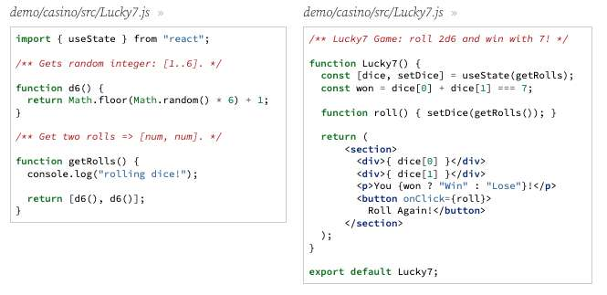
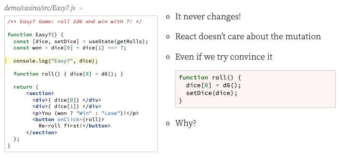
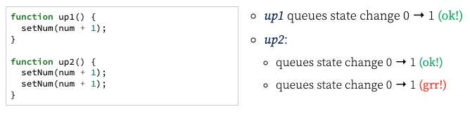
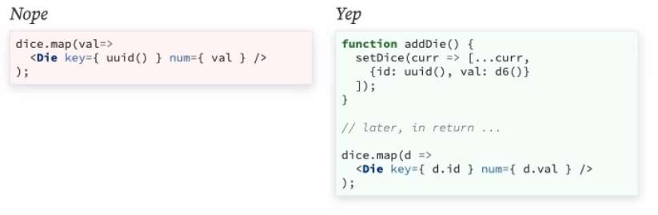

---
date: 2023-04-19
metadata: true
concepts: ['react', 'state']
status: 'pre-lecture'
docs: 
cite: ['rithm']
---

## Review Previous

- 

## Goals

-   Learn why mutating React state variables doesn’t work
-   Learn how to update state that depends on the previous state
-   Understand *key* prop that React asks for when mapping over data

## State Review

- Change state using the setter function returned by .useState().
```jsx
const [data, setData] = useState(initialState);
```

- During initial render, returned state (data) is equal to _initialState_.
	- initial state is used only the *first time the component renders*
- setData(newVal) enqueues state change & re-rendering
	- Brit refers to as setState fx
	- setState does not immediately cause component to rerender
		- instead, react keeps a todo list: 
			- re-render Game component
				- if it already has on list, is smart, doesn’t put it on 2x
- Convention: name second arg **setX** where _X_ is name of first arg
- Normally, variables disappear when their scope ends — but state variables are preserved by React.

## Mutable State

- It’s fine to have _mutable variables_ as your state in React.
- Let’s look at a game with a piece of state that is mutable.

### Lucky 7 Game


- & Note: *not* invoking getRolls within useState - just passing the fx definition
	- if it was invoked, would be called on *every* single render, but react would ignore all other returned values except for the very first one.
- #tip Brit - add a console.log of your state, with name of state, as close to the top of the page with your state as you can

- That works fine — the state is a mutable array, but when it changes, we’re just reassigning a set of dice rolls. Everything works!

### Easy 7 Game

- Our customers complained that Lucky 7 is too hard!  
- We’ll make the game easier — you can re-roll just the first die.
- The new dice roll will be \[new-die-roll, whatever-was-here\].

- Let’s do that by trying to mutate state.
	- note just the function roll should be highlighted - this is the only change
		- mutating`dice[0]`

-   It never changes!
-   React doesn’t care about the mutation
	- & Only rerenders when you call the setState component
-   Even if we try convince it
	- By manually calling setDice(dice) with the same component
	- React still says no
-   Why?
	- React sees this as the “same array” with the “same identity” and says “why bother rendering?” when it’s the same info

### Changing State Requires a New Identity

-   React only actually changes the state if it has a new _identity_
    -   If it’s a _new_ Array, _new_ Object, etc.
-   So: let’s make a _new_ set of dice
```jsx
function roll() {
  const newDice = [d6(), dice[1]];
  setDice(newDice);
}
```
-   It works!
    -   But there’s one more improvement to make here…

## Depending on Previous State

- Sometimes your new state depends on the value of your previous state.

demo/casino/src/Counter.js
```jsx nums {5}
function Counter() {
  const [num, setNum] = useState(0);

  function up1() { setNum(num + 1); }
  function up2() { setNum(num + 1); setNum(num + 1); }

  return (
    <div>
      <h3>Count: {num}</h3>
      <button onClick={up1}>Up By 1</button>
      <button onClick={up2}>Up By 2</button>
    </div>
  );
}
```

- What’s the problem here?


- If your new state depends on the previous state, you should use the
	-  _callback pattern_ for useState
- Setter function returned by useState can accept a callback function.
- Callback is called when all _already requested_ state changes have finished.
	- if you pass a cb fx to a setState fx, this fx gets invoked after all other changes have finished
-  It is passed the state as an argument & should return new state.

- $ A better approach:
demo/casino/src/BetterCounter.js
```jsx nums {4-8}
function BetterCounter() {
  const [num, setNum] = useState(0);

  function up1() { setNum(n => n + 1); }
  function up2() {
    setNum(n => n + 1);
    setNum(n => n + 1);
  }

  return (
    <div>
      <h3>Count: {num}</h3>
      <button onClick={up1}>Up By 1</button>
      <button onClick={up2}>Up By 2</button>
    </div>
  );
}
```

- ~ Tip: An even better fix
	- Of course, for this example, there’s an even better fix:
	demo/casino/src/BestCounter.js
	```jsx nums {5}
	function BestCounter() {
	  const [num, setNum] = useState(0);
	
	  function up1() { setNum(n => n + 1); }
	  function up2() { setNum(n => n + 2); }
	
	  return (
	    <div>
	      <h3>Count: {num}</h3>
	      <button onClick={up1}>Up By 1</button>
	      <button onClick={up2}>Up By 2</button>
	    </div>
	  );
	}
	```
	- Given that now there’s only one place where the state is being set, it would also work if that was just a simple (non-callback) use of setNum, like setNum(num + 2).
	- However, if this code changed and another set to the state happened, the code might break again. It’s always best to follow this rule:
		- *if the new state depends on the old state, use the functional pattern.*

### Our Fix for Easy 7

- Now, we can fix Easy 7 properly:
```jsx
function roll() {
  // since this relies on current state, use cb
  setDice(curr => [d6(), curr[1]]);
}
```

## Functional Patterns for State

### Zero 7 Game

- Now, we have a new game: you roll 3 dice and can “zero” out the first die.
- So \[2, 3, 5\] would turn into \[0, 3, 5\].
- Since our new state depends on the old state, we’ll use the callback form!

demo/casino/src/Zero7.js
```jsx nums {6-10}
function Zero7() {
  const [dice, setDice] = useState(getRolls);
  const won = sum(dice) === 7;

  function zeroFirst() {
    setDice(curr => {
      curr[0] = 0;
      return [...curr];
    });
  }

  return (
      <section>
        <div>{ dice[0] }</div>
        <div>{ dice[1] }</div>
        <div>{ dice[2] }</div>
        <p>You {won ? "Win" : "Lose"}!</p>
        <button onClick={zeroFirst}>
          Zero First
        </button>
      </section>
  );
}

```

- We’re using the callback form for setDice since we depend on previous state.
- It works!
- But we can find a nicer way to do this.

### Functional Patterns

- Remember .map(cb) and .filter(cb)?
	- `arr.map( (item, idx) => … )`
	- `arr.filter( (item, idx) => … )`

### Better Zero First

```jsx
function zeroFirst() {
  setDice(curr => curr.map(
    (val, i) => i === 0 ? 0 : val));
}
```

Another useful map
```jsx
function zeroSixes() {
  setDice(curr => curr.map(
    val => val === 6 ? 0 : val));
}
```

A useful filter
```jsx
function removeEvens() {
  setDice(curr => curr.filter(
    val => val % 2 !== 0));
}
```

- These are very useful for changing mutable things without mutation.

### Nested State

- These ideas can also be used for changing parts of nested objects.
- Imagine: we want to re-roll the second die — but now, a die is an object. It has a color (which doesn’t need to change now) and a value (which does).

```jsx
[
  { color: "pink", val: 2 },
  { color: "blue", val: 6 },  // <-- re-roll yet keep color
  { color: "tan", val: 5 },
]
```

```jsx
[
  { color: "pink", val: 2 },
  { color: "blue", val: 6 },  // <-- re-roll yet keep color
  { color: "tan", val: 5 },
]
```

```jsx
function reroll(pos) {
  setDice(curr =>
    curr.map( (die, i) =>
      i === pos
        ? { ...die, val: d6() }
        : die
      ));
}
```

-   We get a new array of dice (a new identity — so setDice works!)
-   Dice that don’t change don’t need a new identity
-   But the die that is being re-rolled gets a object via spread

- It can take a while for this to feel natural.
- Practice this skill — this is a very useful way to transform objects!

## Lists and Keys

### Add 7 Game

- We have another new game! Keep adding dice to your rolls, aiming for 7.
- We know how to manage our changing state without mutation.
- But now, the number of dice are variable.

demo/casino/src/Add7.js
```jsx
function Add7() {
  const [dice, setDice] = useState([]);
  const won = sum(dice) === 7;

  function addDie() {
    setDice(curr => [...curr, d6()]);
  }

  return (
      <section>
        { dice.map(val => <div>{ val }</div>) }
        <p>You {won ? "Win" : "Lose"}!</p>
        <button onClick={ addDie }>
          Add Die
        </button>
      </section>
  );
}
```

- We use the callback form to setDice.
- It works!
- But there’s scary warning in the console:
```jsx
Warning: Each child in a list
should have a unique "key" prop.

Check the render method of `Add7`.
```

- What’s that about? Is it a real problem?

### Keys

-   Keys help React identify which items are changed/added/removed.
-   Keys should be given to elements in an array to provide a _stable identity_.
	- & When you have an array as state, need a *key* prop
	- helps react determine what actually changed in the DOM

- What should you use for a key? 
	- Something *stable* and *unique* 
	- Like a primary key in a database
- If there’s a natural key, use it:
	```jsx
	books.map( b =>
	  <Book key={ b.isbn } title={ b.title } /> );
	```
- If not, you can use the loop index:
	```jsx
	dice.map( (val, i) =>
	  <Die key={ i } num={ val } />
	);
	```
	- There can be problems using the index, though!
		- like what happens in delete 7 game 
		- the index and therefore the *key* shifts as one item is deleted, so this is not a great option

### Delete 7 Game

- We have another game! Now, you start with 6 dice.
- When you click a button, you get rid of the first remaining die.

demo/casino/src/Delete7.js
```jsx nums {6-7, 12-13}
function Delete7() {
  const [dice, setDice] = useState(getRolls);
  const won = sum(dice) === 7;

  function removeFirst() {
    setDice(curr =>
        curr.filter((d, i) => i !== 0));
  }

  return (
      <section>
        {dice.map((val, i) =>
          <div key={i}>{ val }</div> )}
        <p>You {won ? "Win" : "Lose"}!</p>
        <button onClick={removeFirst}
                disabled={dice.length === 0}>
          Remove First
        </button>
      </section>
  );
}
```

- Handling state-depending-on state!
- Using a nice idiom with filter
- Have a key for loop
- But this still might break!
- The keys aren’t _stable_
- This can cause strange errors
    - Performance problems
    - Inaccurate rendering

### Making stable identities

- At times like this, you’ll need to make a stable identity for our die:

- We can make a simple counter:
```jsx
class Counter {
  i = 0;
  next = () => this.i++;
}

const counter = new Counter();

// now, counter.next() will return
// a new ID each time.

```

- Can use a library:
```jsx
import { v4 as uuid } from "uuid";

// now uuid() will return a new ID
// each time its called

```

- You have to determine the unique identity of the die when you create the die, not when you render the die!
	- otherwise not stable/ they would change every time


Otherwise, they change every time.

## Wrap Up

-   Don’t mutate state!
-   Instead, create a new identity (new Array/Object).
-   Use the callback form of state setters if new state depends on old.
-   Learn and practice the functional idioms for transforming state.
-   Things rendered in an array require a key prop
    -   Use a natural key if you have one
    -   Can use the loop index _if_ they’re stable
    -   If no natural key, and loop indexes aren’t stable, make a key

### Demos

Lucky 7

Used mutable state, but was replaced on click. Works!

Easy 7

Tried to mutate state and never had a “new identity”.

Zero 7

Replacing clunky patterns with map/filter.

Add 7

Renders a dynamic list, which requires a key prop. The indexes are stable, so can use them for the key.

Delete 7

Now items are being deleted, so the keys are not stable. Will have subtle bugs until a stable key is used.