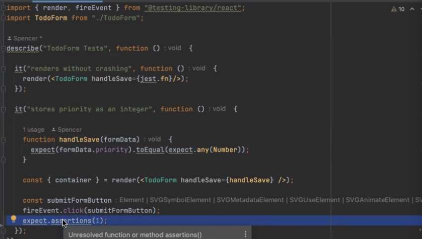

---
date: 2023-04-21
metadata: true
concepts: []
status: 'pre-lecture'
docs: 
cite: ['rithm']
---

- Probably best for ensuring priority is a number to live in TodoForm because this is where the data comes in, and if someone were to use just this form, want it to clean up its own mess, and you are giving them the data you expect.

- 


- & Use the callback pattern whenver your new state depends on the old state
	- setFoo(foo => … )

- you need to have a new identity to have setFoo() work and have react re-render the component

- Key Prop:
	- Needed when rendering array in a component
	- If you don’t, there is a warning, not a bug technically
	- react compares what was there previoulsy, and what changes
	- those ids need to be globally unique

- would indexes also be a problem b/c not 
- globally unique

- rerendering the *entire* DOM or the *component*

- shadow dom- react dom that has in its head

- Fancy technique
	- when you have an object literal 
	- when you don’t know it advance what you want the key name to be, can set it to evaluate it `[]`
```js
joel = {
name: "Joel",
state: "CA"
}

let nameOfUnit = "province";

kadeem = {
	name: "Kadeem",
	[nameOfUnit]: "Ontario"
}
```

- Should always control component
	- only have uncontrolled components if interfacing with vanilla js

- Don’t want any cleverness in your test, or abstractness in your test
	- Want to be as clear and straightforward as possible so you can have the most confidence in the tests

- How do test less as you go up the test pyramid?
	- once you’ve proven with your unit tests that something works
	- Don’t need to test as extensively as you go further up
	- long title / short title lives on ___test
	- EditableTodo - doesn’t need long title/short title, etc.

- Tests with mock function:
	- can test - expect(mockSave).toHaveBeenCalled()

- Start writing tests from the bottom up

- OOP and closures - 
	- Both provide statefulness
	- Anything you can do with a closure you can do with OOP


- #tip  Joel - once you’ve figured out your state, you’ve figured out 70% of your app

- Think about what things would need to re-render as a part of what to break out into separate components

- State:
	- Don’t store the same fact into 2 places
	- Lift the state as high as needed - but no higher
	- State in a parent may be/can often be a prop in a child
	- Game - only gets set once
		- State can be okay for - Stuff that we answer once 
			- Can’t be a prop b/c don’t know the answer at beginning yet - waiting for api
			- OR Refactor:
				- App calls GameLoader
				- GameLoader
					- talk to server
					- show server once it has data
					- renders game, passing the data as prop to Game
				- Game
					- Then takes game as props

- All the front end frameworks (angular, vue, svelte, etc.)
	- build components
	- describe how they get rendered
	- let framework deal with the wiring for that