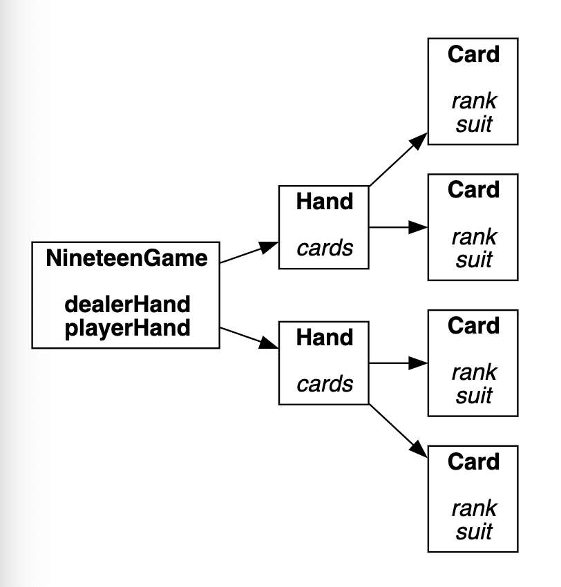
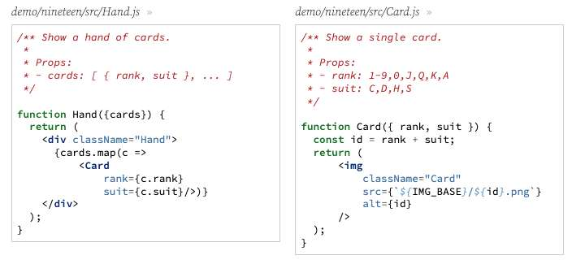

---
date: 2023-04-18
metadata: true
concepts: ['react', 'testing']
status: 'pre-lecture'
docs: 
	react-testing-library: 'https://github.com/testing-library/react-testing-library'
cite: ['rithm']
---

## Review previous

- Figuring out what the state is often the most challenging piece - once you’ve figured that out, you’ve pretty much figured out your component

## Goals

-   Meet the hot new gambling game *Nineteen*
-   Learn to integrate existing testing techniques into React
-   Learn how to test components
-   Learn how to test interactions

## Nineteen

-   Player is dealt two cards
-   Player can draw one more card or pass
-   Dealer then draws two cards and passes
-   Scoring:
    -   Hand score is total of points
    -   But only counts last digit!
    -   Dealer wins all ties


### Component Hierarchy



Props - italics
State - lower bold (dealerHand, playerHand)

- #tip  Joel - Good idea to start with this drawing, then start by building the smaller things. 

### Card and Hand



### Game

demo/nineteen/src/NineteenGame.js
```jsx nums {19, 23}
function NineteenGame() {
  const [playerHand, setPlayerHand] = useState(getPair);
  const [dealerHand, setDealerHand] = useState([]);
  /** Player draws a card and then dealer plays. */
  function takeCard() {
    setPlayerHand(h => [...h, getRandomCard()]);
    playDealer();
  }
  /** Dealer draws a pair and then hand is scored. */
  function playDealer() {
    setDealerHand(getPair());
  }
  const result = dealerHand.length > 0 ? score(playerHand, dealerHand) : null;

  return (
      <main>
        <Hand cards={dealerHand} />
        <Hand cards={playerHand} />
        {result === null && <p>
          <button id="draw" onClick={takeCard}>Draw</button>
          <button id="pass" onClick={playDealer}>Pass</button>
        </p>}
        {result !== null && <p>{result}</p>}
      </main>
  );
}
```

- Note lines 19 vs 23
	- cause we can’t have if/else in jsx
	- clever way to work around this
	- using determining subparts of &&

### Testing Nineteen

- How can we start testing an application like this?
- Start by designing it well!

## Unit Testing

- Part of designing a React app for testing is moving logical parts outside of components, so they can be unit tested.
- For Nineteen, all the logic around drawing cards and scoring is in a non-React set of functions, so they can be easily tested or re-used.

### Nineteen Game Logic

demo/nineteen/src/nineteen.js
```jsx
/** Return a random card: { rank, suit } */
function getRandomCard() {
  return { rank: choice(RANKS), suit: choice(SUITS) };
}

/** Return random pair: [ { rank, suit }, { rank, suit } ] */
function getPair() {
  return [getRandomCard(), getRandomCard()];
}

/** Score a hand: score is the last digit of rank sums */
function scoreHand(hand) {
  let sum = 0;

  for (let card of hand) {
    sum += RANK_TO_VALUE[card.rank] || +card.rank;
  }

  return sum % 10;
}

/** Score game: player loses ties to dealer. */
function score(playerHand, dealerHand) {
  return scoreHand(playerHand) > scoreHand(dealerHand)
      ? "You win!"
      : "You lose!";
}
```

### Testing a Function

demo/nineteen/src/nineteen.test.js
```jsx
describe("scoreHand", function () {
  test("scores 2 cards", function () {
    const hand = [{ rank: "A", suit: "S" }, { rank: "9", suit: "C" }];
    expect(scoreHand(hand)).toEqual(0);
  });

  test("scores 3 cards", function () {
    const hand = [
      { rank: "A", suit: "S" },
      { rank: "9", suit: "C" },
      { rank: "7", suit: "D" },
    ];
    expect(scoreHand(hand)).toEqual(7);
  });
});
```

- This is **Unit testing**: testing a function just in isolation

### Mocking a Function

demo/nineteen/src/nineteen.test.js
```jsx
import * as random from "./random";

random.choice = jest.fn(); // Replacing random.choice with jest mock

test("getPair", function () {
  random.choice
      .mockReturnValueOnce("A") // first call returns A
      .mockReturnValueOnce("S") // second call returns S (spade)
      .mockReturnValueOnce("9") // third call returns 9
      .mockReturnValueOnce("C"); // fourth call returns C (club)
  const pair = getPair();
  expect(pair).toEqual([
    { rank: "A", suit: "S" },
    { rank: "9", suit: "C" },
  ]);
});
```

- We can test our function without relying on `random.choice()`

- It would have been virutally impossible to test this logic if random part was grouped all into that one component.
	- Breaking it out the random piece allows for us to test all the other logic code by  mocking
	- To test random fx - could test calling the fx 100x and make sure it doesn’t return the same thing more than 20x, etc.

### Run these Tests

```shell
$ npm test src/nineteen.test.js

  PASS  src/nineteen.test.js
  ✓ getRandomCard (2ms)
  ✓ getPair (1ms)
  scoreHand
    ✓ scores 2 cards
    ✓ scores 3 cards (1ms)
  score
    ✓ player win
    ✓ player lose: lower count
    ✓ player lose: ties (1ms)

Test Suites: 1 passed, 1 total
Tests:       7 passed, 7 total
Snapshots:   0 total
Time:        1.315s
Ran all test suites matching /src/nineteen.test.js/i.
```

- Jest is set up to _watch_ — it will re-run tests as you save code.
```shell
Active Filters: filename /src/nineteen.test.js/
 › Press c to clear filters.

Watch Usage
 › Press a to run all tests.
 › Press f to run only failed tests.
 › Press o to only run tests related to changed files.
 › Press q to quit watch mode.
 › Press p to filter by a filename regex pattern.
 › Press t to filter by a test name regex pattern.
 › Press Enter to trigger a test run.
```

### Designing Your App

- There’s nothing React-specific about this — but remember:  
	- small, discrete functions with good separation of concerns will always make testing much easier and more pleasant!

## React Testing Library

-   React _can_ use any testing framework
-   create-react-app ships with *jest* and *react-testing-library*
-   npm test is set up to find & run jest tests
    -   Files like `*.test*`, `*.spec*`, or in `__tests__` folder
    - & We prefer `_MyComponent_.test.js` in same folder as code to test
-   npm test runs all tests; can optionally specify a file

[React Testing Library](https://github.com/testing-library/react-testing-library)

> “The more your tests resemble the way your software is used, the more confidence they can give you.
> —React Testing Library guiding principle

- & Tests are about how users interact with apps, not the implementations of those apps.

## Testing Components

### Testing Card Component

- Here’s the simplest possible test: does it render without crashing?

demo/nineteen/src/Card.test.js
```jsx
import React from "react";
import { render } from "@testing-library/react";
import Card from "./Card";

it("renders without crashing", function () {
  // this is a low-value test, but better than nothing
  render(<Card rank="A" suit="C" />);
});
```

- This type of _does it even run?_ tests are sometimes called _smoke tests_. They don’t add a lot of value, but they’re a basic place to start. If you’re pressed for time, they’re better than testing nothing.

## Testing Using the DOM

- The render method returns many things, of which we’ll use two:
	-   **container**: an DOM component of a div that holds what you rendered
	-   **debug(elem)**: a method that returns debugging information about elem
[Full list](https://testing-library.com/docs/react-testing-library/api/#render-result)

```jsx
it("has the correct alt text & src", function () {
  const { container, debug } = render(<Card rank="A" suit="C" />);
  const img = container.querySelector("img");
  debug(img);

  expect(img.getAttribute("alt")).toEqual("AC");
  expect(img.getAttribute("src")).toContain("AC.png");
});

```

- We can use standard DOM methods like querySelector and getAttribute!

### Testing a Snapshot

- Once you’ve decided that a component works (either via tests or in the browser), it can be useful to ensure there are no presentational regressions — that the component renders in the same way it did when it worked.
- You can take a _snapshot_ to catch regressions.
	- For *each component* upon mount
	- After specific points within the app (at win, at loss, etc.)

```jsx
it("matches snapshot", function () {
  const { container } = render(<Card rank="A" suit="C" />);
  expect(container).toMatchSnapshot();
});
```

- The first time you run a snapshot test, it will take a snapshot and output:
	- ! This happens whether or not the function works - beware of this!
	- Taking the DOM that the function emits and checking that it’s the same
```
Snapshot Summary
 › 1 snapshot written from 1 test suite.
```

- & Always want real tests (more than just snapshot tests)
- But snapshots can be really useful to track code changes
	- & Wait to take snapshots until you have other tests “proving” that your code works
- snapshots part of jest - can also use them with express.

### Catching Regressions

- Now, if you edit that component such that it renders anything different (even by a single character), you will be able to detect that change.
```
› 5 snapshots failed. Inspect your code changes
   or press u to update them.
```

- If the change is something you want, press u to update the snapshot so that the new rendering is what is expected on future test runs.
- Jest stores these in `__snapshots__/` _(they’re surprisingly readable)_
- You should keep this folder in Git — so others can test for regressions.

## Testing Interactions

### Testing the Full Game

- If we know the game renders properly at the start, we can prevent regressions with a snapshot test of that. We’ll need to mock the function that makes choices, so we can get a chosen hand:

demo/nineteen/src/NineteenGame.test.js
```jsx
random.choice = jest.fn();
```

- Then our snapshot test is easy to write:

demo/nineteen/src/NineteenGame.test.js
```jsx
  it("matches initial player hand: 2C 3C", function () {
    _feedChoice("2C 3C");
    const { container } = render(<NineteenGame />);
    expect(container).toMatchSnapshot();
  });
```
- `_feedChoice()` just abstracts the mocking fx code


### Testing Interactions

- To test our full game, we’ll need to test events: we need to click the “pass” or “draw” buttons and have the game be scored.

demo/nineteen/src/NineteenGame.test.js
```jsx
  it("matches winning game: 2C 3C 4C > 5C 6C", function () {
    _feedChoice("2C 3C 4C   5C 6C");
    const { container } = render(<NineteenGame />);
    fireEvent.click(container.querySelector("#draw"));
    expect(container).toMatchSnapshot();
  });
```

- Now we can be certain that exact hand/play is rendered the same.

- If you want to 

### Don’t Just Use Snapshot Tests

- It’s often easy to write snapshot tests, that it’s tempting to only do that.
	- snapshot tests are just change detection systems
- A risk is that they only test if things _keep working_ and you may not have established yet that things ever did work properly for all cases.
- Another risk is that if you’re actively building your app, you’ll often tweak the rendering in tiny way, and break those tests, and will update the snapshots casually. Make sure you have real tests telling you if it works.

### A Specific Test for Nineteen

- Here’s a good test to make sure the right number of cards are rendered, and the result text is rendered properly:

demo/nineteen/src/NineteenGame.test.js
```jsx
  it("deals to player on draw", function () {
    _feedChoice("2C 3C 4C   5C 6C");
    const { container, debug } = render(<NineteenGame />);

    expect(container.querySelectorAll(".Card").length).toEqual(2);
    fireEvent.click(container.querySelector("#draw"));

    // now player has 3 cards (=9) and dealer has 2 cards (=11)
    expect(container.querySelectorAll(".Card").length).toEqual(5);

    debug(container);
    expect(container.querySelector("p")).toContainHTML("You win!");
  });
```

## APIs

### The Basics

```jsx
import React from "react";
import { render, fireEvent } from "@testing-library/react";

test("my test", function () {
  const { container, debug } = render(
    <MyComponent with="these" as="my-props" />);
});

```

### Additional Matchers

- Create React App configures us to be able to use additional matches than the ones that normally come with Jest:
- `.toHaveClass()`
	- Check whether an element has a certain class
- `.toBeInTheDocument()`
	- Check whether an element is in the document
- `.toContainHTML()`
	- Check whether the element contains a certain HTML string
- `.toBeEmpty()`
	- Check whether the element has any content

[Full list](https://github.com/testing-library/jest-dom#custom-matchers)

### Testing Events

- React Testing Library provides a fireEvent method that you can use to mimic user interaction with your app.
- `.fireEvent.click(HTMLElement)`
	- Fire a click event
- `.fireEvent.submit(HTMLElement)`
	- Fire a submit event
- `.fireEvent.input(HTMLElement)`
	- Fire an input event

[Documentation](https://testing-library.com/docs/dom-testing-library/api-events)

## Debugging Testing

### Debugging from render

- **render** provides a debug method that will console.log a component’s DOM structure.

```jsx
const { debug, container } = render(<MyComponent />)
debug(container);  // see the structure of the component

fireEvent.click(container.querySelector("#my-button"));
debug(container);  // how has the structure changed?
```

### Debugging Tests

- If you want to set break points, edit your package JSON to include:
	- & copy paste this!
package.json
```json
"scripts": {
  // ... keep other things and add this
  "test:debug": "react-scripts --inspect-brk test --runInBand"
}
```

- Add debugger line in test or component you want to test
- And now `npm run test:debug` will run tests where you can use Chrome debugger!
	- Visit _chrome://inspect_ to debug in Chrome.

## Wrap Up

- Design your apps for testability
    - Break things into small, discrete functions
    - Unit test things that can be kept outside of component
- & Test every component, even if it’s a “smoke test”
- Write snapshot tests to notice regressions — but don’t be too cavalier that those alone prevent bugs
	- These are just change detection tests
- Don’t forget the debug() method in tests
- Get comfortable using the debugger with Jest


## Joel’s suggested order of operations for tackling app now

- write function literal without react, just in jsx
- write docstring
- write tests
- write react part

- & Start with the little pieces