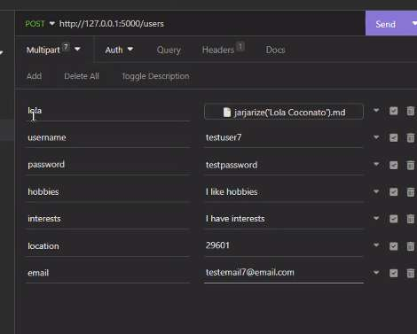

## What is insomnia?
- A GUI for making HTTP requests.
	- [https://insomnia.rest/](https://insomnia.rest/)

## Advantages of insomnia
- You can’t pull this data from insomnia directly into your javascript code, but it is INCREDIBLY useful for visualling that data, and seeing the drill-down structure you need to access it.
- Also SAVES your previous requests - so you don’t have to remember/go digging for these again.
- When building your own API, you can test by sending requests to your own API.
- Prettier tool than the console or Network debugger for exploring data graphically.
- & Note: Insomnia is NOT AJAX, because it’s not javascript in the browser
	- This can be an advantage, to just see the request regardless of the functionality of your JS file(s)
	- Also means you can get data from sites that wouldn’t let you get that data using AJAX (b/c it isn’t AJAX, not subject to the same origin policy)

## Practicing with Insomnia
- If you want extra practice, check out https://jsonplaceholder.typicode.com/

## Multipart form

