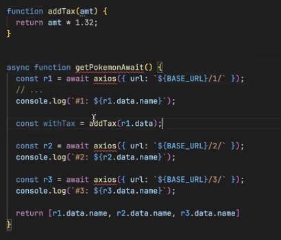
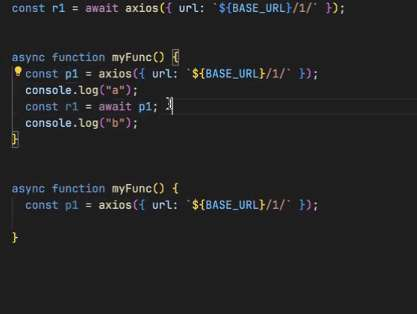
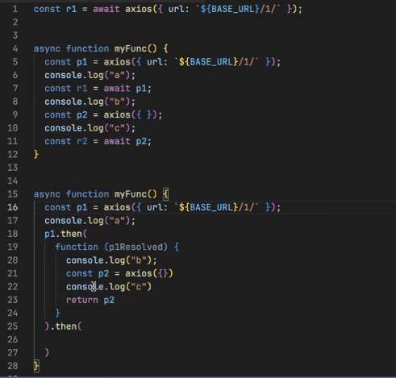

- In a scenario where you send a request off to retrieve data, and then you want to do something else based on the response from that data, we need to find a way to chain these requests together. 

## Old way with callbacks
- Previously, when callbacks were used to retrieve and use this data, it would look something like this (as a simple example):
```js
const getDataCallback = (num, callback) => {
	setTimeout(()=>{
		if (typeof(num) === 'number') {
			callback(undefined, num * 2);
		} else {
			callback('Number must be provided');
		}
	}, 2000)
};

getDataCallback(2, (err, data) => {
	if (err) {
		console.log('err');
	} else {
		getDataCallback(data, (err, data) => {
			if (err) {
				console.log(err);
			} else {
				console.log(data);
			}
		});
	}
});
```
- Problem with this method is the code is very nested and hard to understand & work with –> This is the type of code known as ‘callback hell’
- Better way to accomplish is with Promise chaining

## Promise chaining
- Promise chaining reduces nesting of code, making code easier to understand and work with. 
- When you return a promise from another promise’s handler, you create promise chaining
```js
const getDataPromise = (num) => new Promise ((resolve, reject) => {
	setTimeout(() => {
		typeof (num) === 'number' ? resolve(num * 2) : reject('Number must be provided')
	}, 2000);

});

getDataPromise(2).then((data) => {
		return getDataPromise(data);
	}).then((data) => {
		return getDataPromise(data);
	}).then((data) => {
		console.log(data); // 16 (2*2 = 4*2 = 8*2 = 16)
	}).catch((err) => {
		console.log(err);
	});
```
- Can add any amount of promises/chaining without increasing the complexity
- Error handling: `.catch()` takes a single argument (a function) to handle any reject occurences that happen along the chain
- Even more updated way of accomplishing: [[fetch]]

### Returning-other-data-with-then
- With promise chaining, you do not have to return a promise from `then()` (or pass as an argument to `then()`)
- This expands the usefulness of promise chaining, like this example:
```js
const newPuzzle = (wordCount) => {
	return fetch(`https://puzzle.mead.io/puzzle?wordCount=${wordCount}`, {}).then(
	(response) => {
		if (response.status === 200) {
			return response.json();
		} else {
			throw new Error("Unable to fetch data");
	}
	})
	.then((data) => {
		return data.puzzle; // data.puzzle is a string
	});
};
```
- From invoking “newPuzzle(“2”), a string is returned (data.puzzle). 
	- This string is then passed to `.then` as puzzle, which is logged to the console.
```js
newPuzzle("2").then((puzzle) => {
	console.log(puzzle);
}).catch((err) => {
	console.log("Error: ", err);
});
```


## Rithm










// #QUESTION: diff when to use all vs allSettled - gives reason for failure, can get other results
– best for if one of them fails, still gets rest of data, and if there is a failure, gives reason for it


rely on the status - as you loop thru - use conditional, display error message if not present


for awaited results - recommend putting it in a try/catch block
anything awaited into a try/catch

