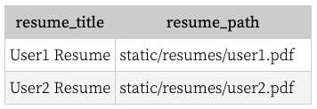

---
date: 2023-05-02
metadata: true
concepts: ['cloud-storage', 'aws']
status: 'pre-lecture'
docs: 
cite: ['rithm']
---

## Cloud Storage

- Databases are great for storing _data_, but not great for storing _files_:
	- files typically will be served directly to browser; you shouldn’t need to involve the db/web app to do so
	- databases have complex transactions/replication requirements
	- large files bloat databases, reducing query/index efficiency
		- slows the database down, even if you don’t ask for that file in your query for your database
			- this is cause every record - including the file needs to be read for each query
- For files, it’s better to store them as files

### Storing Files

- If your site needs to store files, you could:
	- Have a web form with a file input
	- On submission of the form, you could write a file to disk, _and_ store some metadata about the file (title, path, etc) in the database
	  


```jsx
<a href="{{ user.resume_path }}">{{ user.resume_title }}</a>
```

- But this isn’t ideal
	- What if your site grows? 
		- And you need multiple servers.
	- Security risk
		- having the application and disk on the same location, and then allowing others to write to this location
		- you need write permissions in order 

### Scaling

- What if your site grows, and you have multiple application servers?
- You can build replication that copies the files across all servers.
- What are the security risks of writing to the same disk as your app?
- These are solvable, but there’s a common good choice.

### Object Storage

- Different cloud services providers have created object storage — like Dropbox or Google Files, but for developers
	- Can serve files for you, freeing up your server from doing that
	- Can backup your files so even hardware failure won’t lose them
	- Can replicate and serve your files around the world
	- Can offer extremely granular security
		- more specific ways to manage security and permissions
			- Who can read/write to these group of files
	- Can have low, extremely predictable pricing

## About AWS

- Amazon is the largest provider of on-demand computing services.
	- Great for huge sites that need massive scale, like Netflix
	- Great for small sites that can’t afford to build their own infrastructure
	- Almost all services are charged by unit, making it easy to experiment

### Free Tier

- Many (but not all) AWS services fall under their “free tier”, where you can use a fully-working version of the service free for one year.
- Some services (like SNS/SQS) even have a permanent free threshold: you can use them forever for free, assuming you use less than x amount.
  [https://aws.amazon.com/free/](https://aws.amazon.com/free/)

## Creating an Account

- Get an AWS account: [http://aws.amazon.com](http://aws.amazon.com/).

- ~ Creating an account
	- This process takes a few minutes. You’ll need to provide Amazon with your contact information and a valid credit card number. The type of server used in this lecture is free for the first month and $5 afterwards. Unlike some other subscription-based services, though, you really can cancel easily anytime, and you’re only charged for the time you use.
	- Amazon will prompt you for the level of service contract you’d like for your account. Assuming you’d like to stay in the free tier, choose “Basic”.
	- Steps to create an AWS account
		**1.** On the [Amazon Web Services homepage](https://aws.amazon.com/), click **Sign In to the Console** in the top right-hand corner of the screen.
		
		**2.** Enter your email address and select **I am a new user**
		
		**3.** Enter your login credentials on the next page and click **Create account**.
		
		**4.** Enter your contact information.
		
		**5.** Enter payment information. AWS accounts themselves are free, but higher levels of support and various AWS services are paid. You are required to enter a valid credit card number to create an account, but you may select to remain on the basic, free tier later in this process.
		
		**6.** AWS will confirm your identity through a phone call. Enter your phone number and click **Call me now**.
		
		You will receive a PIN on the screen. You should soon receive an automated call from AWS and you will be prompted to enter the PIN on your keypad during the call.
		
		After you have successfully entered the PIN during the phone call, your screen should refresh and you will see **Identity verification complete**.
		
		**7.** Choose your support plan. Assuming you’d like to stay in the free tier, choose “Basic”.
		
		**8.** You will be redirected back to the AWS homepage, where you should see a **Complete Sign Up** button in the top right-hand corner of the screen. Click that button to finalize your account creation.
		

### Amazon Credentials

- Once you’ve done that, go to your account’s Security Credentials, and create a new Access Key.
- & Make sure you save the access key ID and secret key — you’re never shown the secret key a second time!
	- & Make sure this never ends up in github
	- If it does, delete repo immediately
	- disable amazon keys
	- otherwise bots can rack up thousands $ in charges

## Using S3

### Manage via Web Dashboard

[https://s3.console.aws.amazon.com/s3/home](https://s3.console.aws.amazon.com/s3/home)

### Manage via shell

[https://aws.amazon.com/cli/](https://aws.amazon.com/cli/)

```shell
$ aws s3 ls s3://your-bucket
$ aws s3 cp localfile s3://your-bucket/
```

### Manage via Python

[https://aws.amazon.com/sdk-for-python/](https://aws.amazon.com/sdk-for-python/)

```python
s3 = boto3.client(
  "s3",
  "us-west-1",
  aws_access_key_id="...",
  aws_secret_access_key="...",
)

upload_file(file_name, bucket, object_name)
```
### Manage via Javascript
- Can be more difficult in JS vs Python b/c docs are worse


### Getting Amazon to Serve Files

- Check that your bucket security allows it!
	- How to make files publicly available
- Get a URL or “presigned URL” (time-expiring) via the API

## Alternatives to AWS S3

Amazon is a problematic company

_(Offered as a personal aside by Joel)_

Amazon is ubiquitous in the technology landscape, but is a problematic company with practices that many not align with your values.

Some areas to consider:

- Their CEO is the wealthiest person _in the world_, yet is not involved in any meaningful contributions to supporting less affluent people.
- Despite their massive corporate wealth, their factory employees work in extremely poor conditions, denied job protections and union representation
- Their business practices combine elements of both a monopoly and a monopsony.
- The consolidation of computer power in a single component has considerable risks for innovation and electronic freedom

Of course, however, since they are the largest player in this scene, it is almost unavoidable that you’ll work with them in your career. It’s useful to have some experience with their services.

There are alternatives to AWS, however, and you can explore if you’d like and make your own judgements about using AWS.

_/Joel steps off sandbox._

- [DigitalOcean](https://www.digitalocean.com/) offers S3-compatible storage and other services like S3
    - They have a different pricing model: $5/month for a bucket with no other charges
- [Microsoft Azure](https://azure.microsoft.com/) offers similar services, and many other things like Amazon

### Why do I need to know about cloud storage?

- 95% of serious web applications use a service like this, with the majority using AWS.
- It is very likely that you’ll end up at a company utilizing cloud storage!

### Your turn

- Using AWS S3 is a **requirement** for the CYOA sprint.
- We have intentionally omitted specific step-by-step instructions because we want you to do the research/setup on your own.
- Once you decide on the technologies you’ll be using for your project, get S3 setup and working so that you’re able to store files and serve them publicly.
- This will take longer than you think, so do not put this off to the very end!

## When to use

- When users need to upload something, then need to use cloud service for this
- Database, repo’s all remain the same


## CYOA

- How to send files from front end to back end
- !! Do not try to upload a file from your front end to Amazon S3
	- Anything from the front end is discoverable
- Don’t put off doing S3 part
	- Figure out back end tech
	- then set this up
- Best things to do:
	- build it simply
	- front end form → back end → s3
- Project management as software engineer
	- what’s the tech stack
	- bare minimum
	- reach goals
	- reasonable benchmarks
- pixly: libraries are your friend
	- python library: pillow
	- lean on other libraries, things others have done before
- When you ask questions, hone in on:
	- what you’ve tried
	- what isn’t happening that you don’t expect
- Be more specific in slack request of what is needed
- Talk through design with staff first

