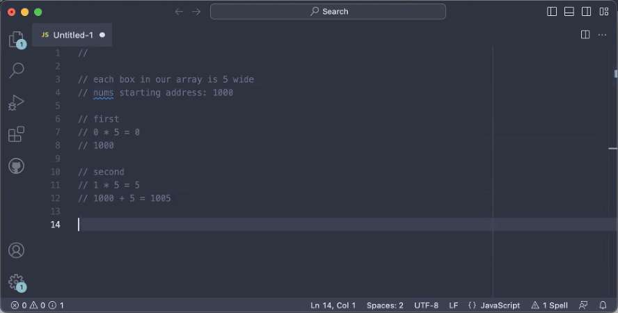
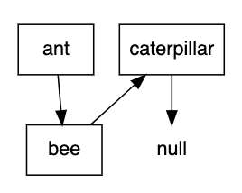

---
date: 2023-05-29
metadata: true
concepts: ['data-structures', 'arrays', 'linked-lists']
status: 'pre-lecture'
docs: 
cite: ['rithm']
---

## Goals

-   Describe what an “abstract data type” means
-   Compare different types of arrays
-   Define singly and doubly linked lists
-   Compare performance characteristics of arrays and lists
-   Implement linked lists in JavaScript

## Lists

- A _list_ is an _abstract data type(ADT_
- It describes a _set of requirements_, not an exact implementation.
	-   Keep multiple items
	-   Can insert or delete items at any position
	-   Can contain duplicates
	-   Preserves order of items

- there’s another type of ADT - called a bag
	- does not preserve order
- Good idea to give these ADTs names, because it makes it easier to not to overbuild something when solving a problem.

## Arrays

- Arrangement of items at equally-spaced, sequential addresses in memory
	- equally spaced = same sized
		- & Needs to be same size so that we can jump to any location just using multiplication
			- Multiply the size by where you are going

- Therefore, inserting or deleting an item requires moving everything after it.
- Analogy: 
	- Joel’s written his list on ruled paper.
	- If he wants to put something else as his #2, has to erase and rewrite things in the sequential order

#### Determining location with Arrays b/c of same size:

- Formula: 
  Starting address + (Size of Array (needs to always be same size) X Index of array)


### Array Runtimes

- Retrieving by index
    - O(1)
- Finding
    - O(n)
- General insertion
    - O(n)
- General deletion
    - O(n)

### Direct Arrays / Vectors

- This kind of array is often called a _direct array_ or _vector_
- & Direct arrays only work if items are same size:
	- all numbers
	- all same-length strings
- ! Don’t work well when items are varied sizes:
	- different length strings
	- subarrays or objects
- They’re not commonly used, but JavaScript provides these as [Typed Arrays](https://developer.mozilla.org/en-US/docs/Web/JavaScript/Typed_arrays)
	- JS provides this as an option for very large scale, specific computations
	- Or 
	- Interfaces with lower level languages like C, where this consistent size, many computations is very common

### Indirect Arrays

- In any _indirect array_, the array doesn’t directly hold the value.
- It holds the memory address of the real value.
- This lets an array store different types of data, or different length data.

```
["ant", "bee", "caterpillar"]
```


### What Does JavaScript Use?

- Indirect arrays — since you can store different-length things in them

- ~ Note: JS Arrays: It’s Complicated
	- JavaScript uses indirect arrays, but it’s a bit more complicated. Some implementations have specialized or adaptive structures to handle edge cases like sparse arrays.
	```js
	const items = [];
	
	items[3] = "hello";
	
	console.log(items) // [undefined, undefined, undefined, "hello"];
	```
	- If you create a sparse array, JavaScript uses a different data structure that’s better suited for this scenario.

### Amortized Runtime
pronounce: ah-meh-tor-ized

- What happens when you run out of available spots?


- Everything must be moved when you add an item to an array without any available spots
- Sooner or later adding something to the end of an array will be O(n)
- Everything gets moved and new empty spots are allocated
- Mathematically, this averages out to be O(1) — this is amortized runtime
	- even though occasionally this is O(n)

## Linked Lists

- If you’ve taken your list of favorite movies and attached them with string
	- Find a fav movie: find first movie card, follow the string to the next index card



- Items aren’t stored in contiguous memory; instead, each item references the next item in the sequence.
- Can rearrange without having to move other items in memory.

- This is a lot faster than having to move everything around in a big list.

### A Node

- The basic unit of a linked list is a node.

ant, bee, and caterpillar are nodes.

- A basic Node has two attributes:
- val
	- the information the node contains 
	  (could be string, int, instance, etc)
- next
	- reference to next node  
	  (for last item, this is null)


```js
antNode;
// {val: "ant", next: beeNode}

beeNode;
// {val: "bee", next: caterpillarNode}

caterpillarNode;
// {val: "caterpillar", next: null}

```

### The Node Class

demo/linkedlist.js
```js
/** Node class for item in LL. */

class Node {
  val = null;
  next = null;

  constructor(val) {
    this.val = val;
  }
}
```

```js
let antNode = new Node("ant");
let beeNode = new Node("bee");
let catNode = new Node("caterpillar");

antNode.next = beeNode;
beeNode.next = catNode;
```


```js
antNode;
// {val: "ant", next: beeNode}

beeNode;
// {val: "bee", next: catNode}

catNode;
// {val: "caterpillar", next: null}
```

### Smarter Node Class

- Some people make a Node class which accepts optional next argument:

```js
class Node {
  constructor(val, next=null) {
    this.val = val;
    this.next = next;
  }
}
```

- Then you can add a chain of nodes:
	- Gives exact same result as above
		- this one is just slightly harder to read, but saves some lines of code
```js
let antNode = new Node("ant",
                new Node("bee",
                  new Node("caterpillar")));
```

- This ends up exactly the same, but can be harder to read at first.

## LinkedList Class

- A Linked List is just a bunch of nodes linked sequentially.
- The only attribute it *must* have is a reference to its first node, called the head.
- Since the list starts empty, the head is initially null.

```js
class LinkedList {
  head = null;
}
```

```js
let insects = new LinkedList();
```

### In Pictures…

- An empty Linked List:


- A Linked List with nodes in it:


### Things you might want to do

-   Print each node
-   Find a node by its data
-   Append to end
-   Insert at specific position
-   Remove a node

## Traversing

- Assumption: we’ve already built list, leaving the actual construction for later.
- We’re just going to traverse the list and print it.


demo/linkedlist.js
```js nums {}
/** print(): traverse & console.log each item. */

  print() {
    let current = this.head;

    while (current !== null) {
      console.log(current.val);
      current = current.next;
    }
  }
```

### Searching

- Like printing—but stop searching once we find what we’re looking for.

demo/linkedlist.js
```js nums {7}
  /** find(val): is val in list? */

  find(val) {
    let current = this.head;

    while (current !== null) {
      if (current.val === val) return true;

      current = current.next;
    }

    return false;
  }
```

## Appending/Removing Nodes

### Append a Node

**Q:** How do we append a node to the end of a linked list?


**A:** Walk to the end and add it there.

(But wouldn’t it be faster to append if we “know” the end?)


- This way, appending is always O(1)
- This becomes easier if we add a *tail* attribute onto our list.  
- This way, we don’t have to traverse the list every time we add a node.
- We can do this with just *head*, but why if we can add a *tail*?
```js
class LinkedList {
 constructor() {
   this.head = null;
   this.tail = null;
 }
```


- What do we need to do to add “dragonfly”?
	- make new node dragonfly
	- make caterpillar.next a reference to dragonfly
	- make list.tail a reference to dragonfly
- $ Success!


- & Don’t forget to handle case of an empty list!

- What do we need to do to add “ant”?
	-   make new node ant
	-   make list.head a reference to ant
	-   make list.tail a reference to ant
- $ Success!

demo/linkedlist.js
```js
  /** push(val): add node w/val to end of list. */

  push(val) {
    let newNode = new Node(val);

    if (this.head === null) this.head = newNode;

    if (this.tail !== null) this.tail.next = newNode;

    this.tail = newNode;
  }
```

```js
let insects = new LinkedList();

insects.push("ant");
insects.push("bee");
insects.push("caterpillar");
```

### Remove a Node (by value)

- What would you need to change to remove:
	-   the head (“ant”)
	-   the middle (“bee”)
	-   the tail (“caterpillar”)


- All we are doing to “remove” a node from the list is redirecting the reference (or next) of a node to the one after the node we’re looking for.
- There are many tricky ways of doing this.
- We’re going to rely on a “daisy-chaining” effect and the fact that any given node’s next is just a node, which has its own val and next.

- The code is a bit complex, since we need to handle:
	- removing only item in linked list
	    - Don’t forget to update head _and_ tail to null
	- removing first item
	    - Don’t forget to update the head!
	- removing an item in the middle
	- removing the last item
	    - Don’t forget to update the tail!

## Runtime of Linked Lists

- Walk to next node from a node/Going to “next” item
	- O(1)
- Get by arbitrary index
	- O(n)
	- & Different from arrays - arrays O(1)
- Searching for value
	- O(n)
- General insertion or deletion
	- O(n)
- Inserting at start
	- O(1)
	- & Different from arrays - arrays O(n)
- Appending to end
	- O(1) if know tail; O(n) if don’t
- Deleting at start
	- O(1)
- Deleting from end
	- O(n)
	- & Different from arrays - arrays O(1)

How do these compare to arrays?

## Code Implementation

- Can write with classic OO:
```js
class Node { /* ... */ }

class LinkedList {
  constructor() {
    this.head = null;
    this.tail = null;
  }

  find(val) { /* ... */ }
}


let antNode = new Node("ant");
let insects = new LinkedList();

insects.find("ant");
```

- ~ Note: Other Possibilities, too!
	- Less commonly, you may see implementations that use arrays or tuples to hold nodes, such that the linked list is series of nested arrays or tuples. These tend to be more common in languages without OO, and tend to be more complex to visualize or understand.

## Doubly-Linked Lists

- Sometimes, linked lists have next and a prev (the “previous node”)

- & Now, if we wanted to delete from the end –> O(1) time
	- b/c of prev property 
- n.b. While doubly-linked lists are relatively common and useful in actual programming, most interview questions are asking about a singly-linked list.

## Resources

[What’s a Linked List, Anyway? \[Base CS\]](https://medium.com/basecs/whats-a-linked-list-anyway-part-1-d8b7e6508b9d)


- Doubly linked lists comes with python
- js didn’t always have sets, now been added, etc.


## Next day Review

### Structuring the code:


- Handling each case individually
	- more code, but may be clearer
	- easier to get it right/ not miss a case in an effort to not duplicate code


