---
date: 2023-05-31
metadata: true
concepts: ['data-structures', 'hash-tables']
status: 'pre-lecture'
docs: 
cite: ['rithm']
---

## Binary Search Trees

### A List of Words

- Imagine this list of words:
	- apple, fence, ghost, jackal, just, money, mystic, nerd, pencil, zebra

### Binary Search Tree

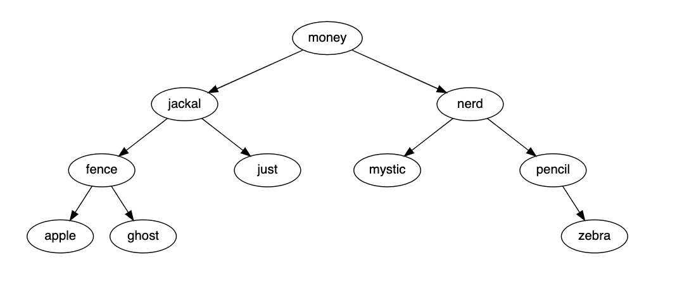
- Also a tree, made of nodes
- But each node has a left and right child
- Has a “rule” for arrangement
    - Often used for fast searching
    - rule: have maintain order
        - All nodes to the *LEFT* must be  *less* than the current node
            - OR ONE side of the rule
        - All nodes to the *RIGHT* must be *greater* than the current node
            - OR the OTHER side of the rule

## Implementing BSTs

### Node Class

Node class is same as any other binary Node class:

```js
class BinarySearchNode {
  constructor(val, left=null, right=null) {
    this.val = val;
    this.left = left;
    this.right = right;
  }

  // other methods here
}
```

### Tree Class

- Just like with n-ary trees (general tree), may not _always_ need class for tree.
	- & But it very useful for keeping track of root of tree:
```js
class BinarySearchTree {
  constructor(root) {
    this.root = root;
  }

  // other methods here
}
```

## Searching

### Binary Search Tree Find

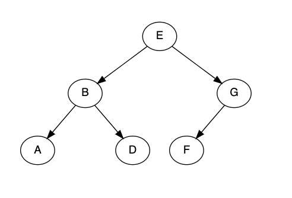

demo/bst.js
```js
class Node { // ...
  find(sought) {
    let current = this;

    while (current) {
      if (current.val === sought) 
        return current;

      current = (sought < current.val)
        ? current.left
        : current.right;
    }
  }
}
```

- Starting at E, looking for C:
1.  C comes before E, so go left to B
2.  C comes after B, so go right to D
3.  C comes before D, so go left to `None`
4.  Drop out of `while` loop and return `None`

- Every choice we make reduces # options by half!
- For n nodes, we need to search, at most O(log n) nodes
- We can search >1,000 nodes in only 10 steps!
- We can search >1,000,000 nodes in only 20 steps!

## Balancing

### Valid But Badly Balanced

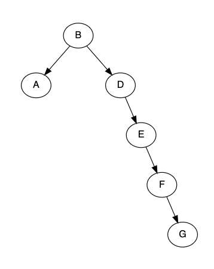
- Can find A efficiently
- Can find missing C efficiently
- Can’t find G efficiently
- Tree needs to be “balanced”

### Balancing Trees

- Easy ways to get reasonably balanced trees:
	- shuffle values for tree randomly, and then insert
	- or sort values, then insert from the middle working out

### Self-Balancing Trees

- There are algorithms for BSTs that can balance themselves.
- You don’t need to understand how they work, but you might see them referenced:  
	- one common type is called an AVL Tree.

## Traversal

- Often, you don’t want to look at every node in a BST
- That’s the point — you can search without looking at each!
- But sometimes you will want to traverse entire tree

### In Order Traversal

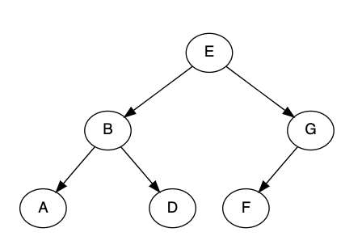

```js
traverse(node) {
  if (node === null) return;
  traverse(node.left);
  console.log(node.val);
  traverse(node.right);
}
```

“traverse left, myself, traverse right” is “in-order”:

A → B → D → E → F → G

### Pre Order Traversal


```js
traverse(node) {
  if (node === null) return;
  console.log(node.val);
  traverse(node.left);
  traverse(node.right);
}
```

“myself, traverse left, traverse right” is “pre-order”:

E → B → A → D → G → F

### Post Order Traversal


```js
traverse(node) {
  if (node === null) return;
  traverse(node.left);
  traverse(node.right);
  console.log(node.val);
}
```

“traverse left, traverse right, myself” is “post-order”:

A → D → B → F → G → E

## Maps

### Map

- Map
	- Map is an Abstract Data Type (ADT) for mapping _key_ → value
- Hash Table (also called Hash Map)
	- Efficient implementation for the Map ADT

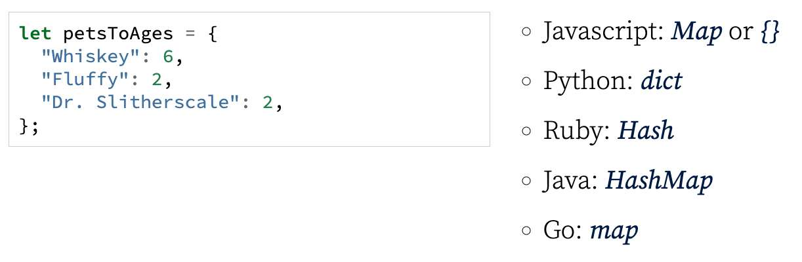

```js
let petsToAges = {
  "Whiskey": 6,
  "Fluffy": 2,
  "Dr. Slitherscale": 2,
};
```

-   Javascript: Map or {}
-   Python: dict
-   Ruby: Hash
-   Java: HashMap
-   Go: map

### Typical API

- set(key, val)
	- Sets key to val
- get(key)
	- Retrieve values for key
- delete(key)
	- Delete entry for key
- has(key)
	- Is there an entry for key?
- size()
	- Number of items in the map
- keys()
	- Iterable of keys
- values()
	- Iterable of values
- entries()
	- Iterable of key/value pairs

## Hash Tables

```js
let fruits = {apple: "red", berry: "blue", cherry: "red"};
```

- It’d be awesome to keep this in some sort of magic array
    - Get O(1) time for many operations

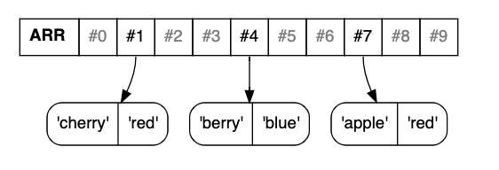
- But how could we know that “apple” is index #7?
	- Hashing!

### Hash Table

```
apple → 7
berry → 4
cherry → 1
```
_Oh no!_ Two keys hash same?
- Handling a collision
- at each end is a bucket, an array, to hold each of these values
- then searches the keys in that bucket to find matching one and return that value
```
apple → 7
berry → 4
cherry → 1
durian → 4
```

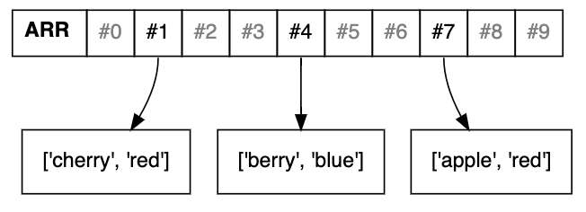
_Solution:_ Each _bin_ is array of `[key, val]`s
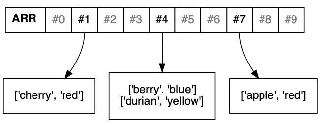

## HashTable Runtimes

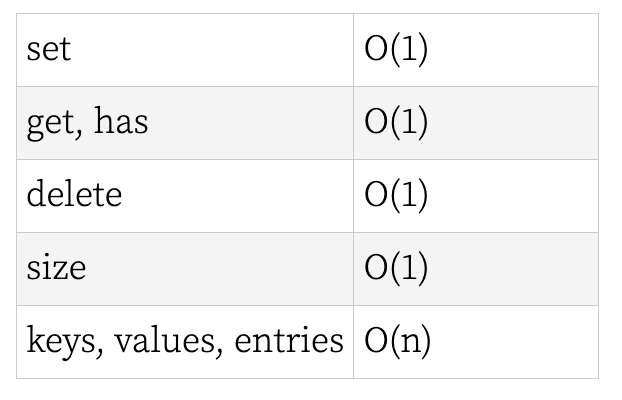

<table><colgroup><col width="58%"> <col width="42%"></colgroup><tbody><tr><td>set</td><td>O(1)</td></tr><tr><td>get, has</td><td>O(1)</td></tr><tr><td>delete</td><td>O(1)</td></tr><tr><td>size</td><td>O(1)</td></tr><tr><td>keys, values, entries</td><td>O(n)</td></tr></tbody></table>

### Resizing

- Over time, some of those buckets may be a bit too full
- To ensure efficiency, good implementation shrink/grow array
    - Often aiming to keep it ~75% occupied
- This means _some_ .set() and .delete() calls will take longer
    - If shrink/grown by proportion _(eg, double/halve)_, will be “amortized O(1)”

## Sets

```js
fruits = new Set(['apple', 'berry', 'cherry', 'durian'])
```
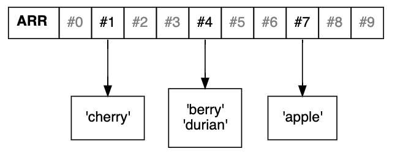
- A Set is just a Map without values
	- also relies on a hash table under the hood
- Same runtime characteristics

## JavaScript Types

### Object

-   POJO; can use for mapping
-   Prior to Map (2015), was only way!
-   Keys can only be strings
    -   Numbers stringified: 1 → “1”
-   Keys **not always** in order of insertion
-   Amortized O(1) for set/get/delete
-   Better to use Map for mapping

```js
let fruits = {
  "apple": "red",
  "berry": "blue",
};

fruits.cherry = "red";
fruits["durian"] = "yellow";

let berryColor = fruits.berry;
let cherryColor = fruits["cherry"];

// how many items in my object?
Object.keys(fruits).length;  // O(n)
```

- Keys can be a few other less common things, such as Javascript “Symbol” types, though these are uncommon for use in mapping (this is more common when making special methods for OO). The ordering of keys can also at times be a bit complex when you have different types of keys.

- ~ Important: Insertion order not guaranteed!
	- & Do note carefully that JS objects **do not guarantee** that keys are returned in the same order they were added. When keys are “number-like” (keys are strings, but a number-like key would be a string of a number, like “42”), they are **not** kept in order of addition, but instead are always returned in strict numerical order, before all other keys.
	```js
	let o = {
	  b: 10,
	  a: 20,
	  7: 30,
	  2: 40,
	};
	
	Object.keys(o);  // ['2', '7', 'b', 'a']
	```
	- When you want to preserve the order of addition, use a Map:
	```js
	let o = new Map([
	  ["b", 10],
	  ["a", 20],
	  [7, 30],    // works the same with key = "7"
	  ["2", 40],
	]);
	
	o.keys();  // MapIterator {'b', 'a', 7, '2'}
	```

### Map

-   Built-in type for mapping
-   Keys can be any type
    -   Retrieval uses \=== to match
-   Keeps keys in order of insertion
-   Amortized O(1) for set/get/delete

```js
let fruits = new Map(
  [["apple", "red"],["berry", "blue"]]);

fruits.set("cherry", "red");

// some methods return map, so can chain
fruits.set("cherry", "red")
      .set("durian", "yellow")
      .delete("apple")

let berryColor = fruits.get("berry");

// how many objects in my Map?
fruits.size;  // O(1)
```

### Set

-   Built-in type for sets
-   Keys can be any type
    -   Retrieval uses \=== to match
-   Keeps keys in order of insertion
-   Amortized O(1) for set/get/delete

```js
let fruits = new Set(["apple", "berry"]);

fruits.add("cherry");
fruits.has("apple");  // true
```

## Python Types

### Dictionary

-   Built-in type for mapping
-   Keys can be any _immutable_ type
-   Keeps keys in order of insertion
-   Amortized O(1) for set/get/delete

```python
fruits = {"apple": "red", "berry": "blue"}

also_can = dict(apple="red", berry="blue")

fruits["cherry"] = "red"

fruits["berry"]      # error if not there
fruits.get("cherry") # or None

# dict comprehension
{x: x * 2 for x in numbers if x > 5}
```

### Set

-   Built-in type for sets
-   Keys can be any _immutable_ type
-   Key order not guaranteed
-   Amortized O(1) for set/get/delete
-   Has awesome built-in set operations
    -   Union, intersection, symmetric difference, subtraction
    -   For JS, can get with lodash library

demo
```python
moods = {"happy", "sad", "grumpy"}

dwarfs = set(["happy", "doc", "grumpy"])

# union, intersection, and symmetric diff:
moods | dwarfs  # {happy, sad, grumpy, doc}
moods & dwarfs  # {happy, grumpy}
moods ^ dwarfs  # {sad, doc}

# subtraction
moods - dwarfs  # {sad}
dwarfs - moods  # {doc}

# set comprehension
{n for n in some_list if n > 10}

```

## Binary Trees vs Hashmap

How do they compare?
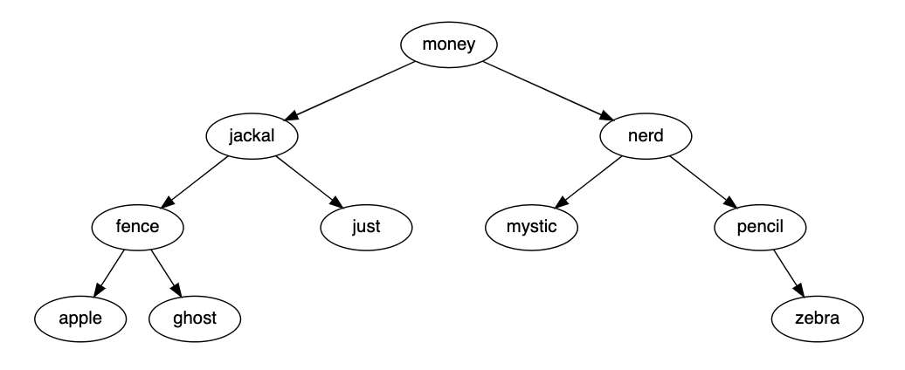

Hashmaps
-   O(1) lookup/addition/deletion
-   Have know exactly what you’re looking for
-   Can’t find “first word equal or after banana”
-   Can’t find range of “words between car and cat”

Binary Search Trees
-   O(log n) lookup/addition/deletion
-   Can search for exact value, or inequalities
-   Can search for ranges
-   Often used to implement indexes in databases

## Resources

[Leaf It Up To Binary Trees](https://medium.com/basecs/leaf-it-up-to-binary-trees-11001aaf746d)

[Trees & Binary Search Trees video](https://dev.to/vaidehijoshi/trees--binary-search-trees--basecs-video-series-5e38)

[Taking Hash Tables Off the Shelf](https://medium.com/basecs/taking-hash-tables-off-the-shelf-139cbf4752f0)

[Hashing Out Hash Functions](https://medium.com/basecs/hashing-out-hash-functions-ea5dd8beb4dd)

