---
date: 2023-06-01
metadata: true
concepts: ['data-structures', 'graphs']
status: 'pre-lecture'
docs: 
cite: ['rithm']
---

## Intro

### Goals

- Learn what a graph is
- Compare and contrast different types of graphs
- Code a graph implementation
- Check if two nodes are connected

### Graphs

**Facebook friends**
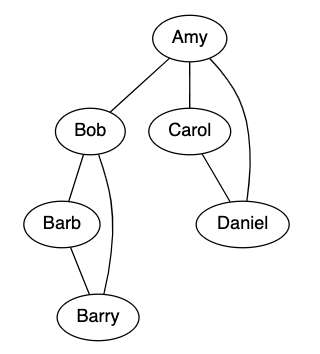
_Undirected_: Amy and Bob are friends with each other

**Twitter followers**
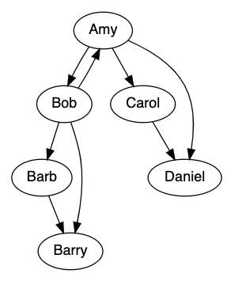
_Directed_: Amy follows Carol — but Carol doesn’t follow Amy

### Differences from Trees

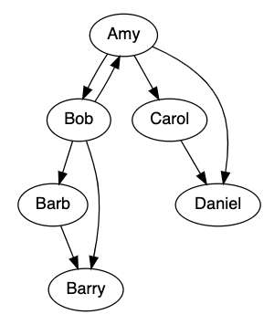
- Trees are always directed; graphs may be undirected  
    (this graph is directed)
- Trees have a root node;  graphs do not always have a root  
    (eg, we could draw with Bob at the top)
- Tree nodes cannot have more than one parent  
    (eg, Barry has two parents)
- Graphs can contain _cycles_ (loops)  
    (eg, Amy → Bob → Amy → Bob …)

### Terminology

- Node (or Vertex)
	- basic unit
- Edge (or Arc)
	- connects two nodes
- Adjacent
	- two nodes are “adjacent” if they share an edge
- **Weight** (optional)
	- each edge can have a weight (ex: price, or distance)

- ~ Hint: Node? or Vertex?
	- Some people refer to an item in a graph as a “vertex” and others call it a “node”. The terms are interchangeable, so you may work with other programmers or libraries that a different name here than the one you are used to.
	- It’s more common in Computer Science textbooks to call these “nodes”, but more common in Math textbooks to call these “vertexes” \[or “vertices”\], so what people call them is usually just a difference in where they first encountered them academically.
	- The same story applies for “edge” and “arc”.

## Examples
### Food Chain

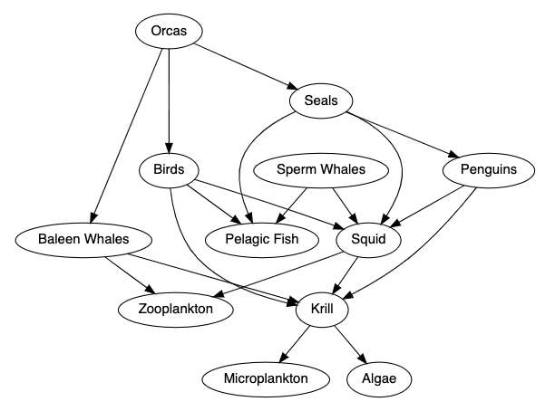

- This graph is **directed**, showing “what eats what”
- Penguins’ adjacency list: `[Squid, Krill]`

### Facebook Friends (or LinkedIn)

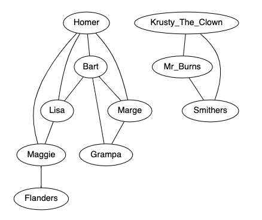

- This graph is **undirected**
- Homer’s adjacency list: `[Bart, Lisa, Maggie, Marge]`
- Lisa’s adjacency list: `[Maggie, Bart, Homer]`

### Processes: Making Cupcakes


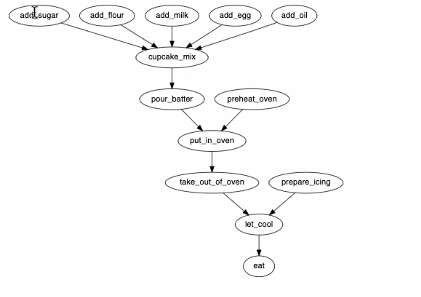
- Don’t want to do a step until the necessary prerequisites are done!
- Similar idea for manufacturing processes, supply chains, etc.

### Markov Chains

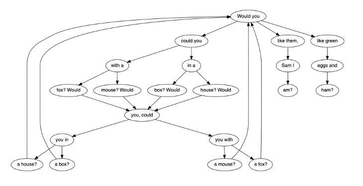

- Other Markov chains: states of health and disease, finance

- Now you can answer questions like:
	- what are the fewest number of words to reach ham?
- Chat API:
	- large markov chain

### Airline Route Map

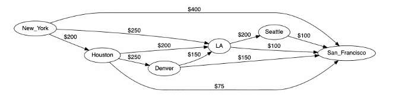
- Each node is an airport. Each edge is a flight.
- The weight of each edge is the price.
- What is the cheapest way to go from New York to San Francisco?

### Carpooling

- Each node is a rider, and edges represent possible carpooling matches.  
- Only two people can carpool together at a time.  
- How can we match the maximum number of pairs of riders?
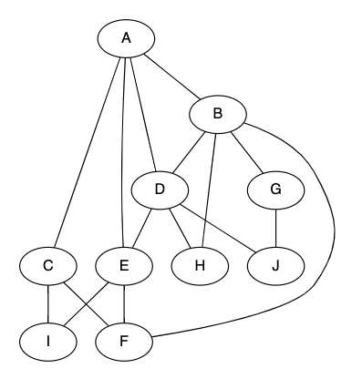
- There exists a solution where everyone gets a pair. Can you find it?
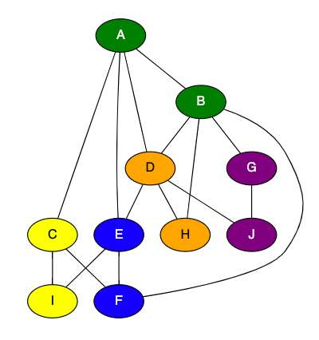

## Graphs

-   Graphs are often used to model relationships between things
-   Trees are a subset of **directed**, **acyclic** (not cyclic) graphs
-   All trees are graphs, but not all graphs are trees
-   Trees always have hierarchy, graphs do not

### Linked Lists, Trees, and Graphs

- Linked lists, trees, and graphs are all structures that have a relationship, much like squares, rectangles, and parallelograms do. A linked list is a special, more-restricted form of a tree, and a tree is a special, more-restricted form of a graph.
- & A tree is a graph with more rules
	- All trees are graphs
	- Not all graphs are trees
- Joel moment:
	- Trees are fancy linked list
	- Grapys are ____ trees
	- The point that you realize it’s a stack problem, you’re 60% there
	- Same rule applies here: once you realize it’s a graph problem, great starting point. often find that at that point you have a good insight into the problem.

- Linked List
	- Nodes have 0 or 1 follower; acyclic and directed
- Tree
	- Nodes have 0+ children and 0 or 1 parent; acyclic and directed; only one designated root node
- Graphs
	- Nodes have 0+ connections; cyclic or acyclic; directed or undirected; disconnected or connected; optional weights

- There are other possibilities, including:
	- there are “circular linked lists,” where the linked list can contain a cycle (A points to B points to C which points to B). These do not have tails, as there’s no single end-point.
	- there are “forests,” which are collections of directed, acyclic graphs but without a single root node. This essentially is a set of trees, hence a “forest.”

## Code

### Modeling graph relationships

- Two common ways to model graph relations in code:
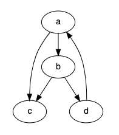

_Adjacency list_: for node, keep list  
of adjacent nodes
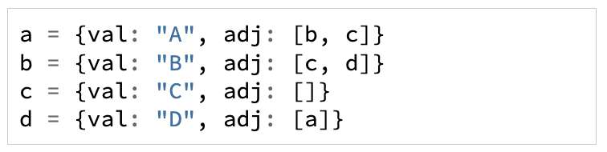
```js
a = {val: "A", adj: [b, c]}
b = {val: "B", adj: [c, d]}
c = {val: "C", adj: []}
d = {val: "D", adj: [a]}
```

_Adjacency matrix_: store in 2d matrix:
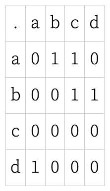
<table><colgroup><col width="20%"> <col width="20%"> <col width="20%"> <col width="20%"> <col width="20%"></colgroup><tbody><tr><td>.</td><td>a</td><td>b</td><td>c</td><td>d</td></tr><tr><td>a</td><td>0</td><td>1</td><td>1</td><td>0</td></tr><tr><td>b</td><td>0</td><td>0</td><td>1</td><td>1</td></tr><tr><td>c</td><td>0</td><td>0</td><td>0</td><td>0</td></tr><tr><td>d</td><td>1</td><td>0</td><td>0</td><td>0</td></tr></tbody></table>

- We’ll use adjacency lists:
	- they’re more common as an implementation
	- matrices might be used for graphs that are highly connected.

### Node and Graph Class

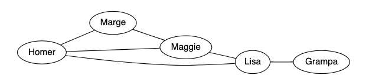

demo/friends.js
```js
class PersonNode {
  constructor(name, adjacent = new Set()) {
    // Create person w/friends adjacent
    this.name = name;
    this.adjacent = adjacent;
  }
}
```
- use a Set because you can’t have any duplicates

demo/friends.js
```js
class FriendGraph {
  // Graph for people & friendships.
  constructor() {
    this.nodes = new Set();
  }

  addPerson(person) {
    // Add a person to our graph
    this.nodes.add(person);
  }

  setFriends(person1, person2) {
    // Set two people as friends
    person1.adjacent.add(person2);
    person2.adjacent.add(person1);
  }

  addPeople(people_list) {
    // Add list of people to graph
    for (let person of people_list) {
      this.addPerson(person);
    }
  }
}
```

### Creating our Graph

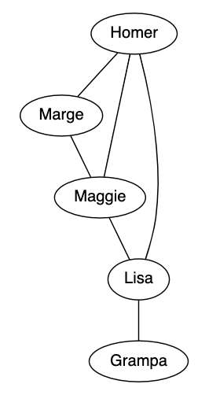

demo/friends.js
```js
let homer = new PersonNode("Homer");
let marge = new PersonNode("Marge");
let maggie = new PersonNode("Maggie");
let lisa = new PersonNode("Lisa");
let grampa = new PersonNode("Grampa");

let friends = new FriendGraph();
friends.addPeople([homer,marge,maggie,lisa,grampa]);

friends.setFriends(homer, marge);
friends.setFriends(homer, maggie);
friends.setFriends(homer, lisa);
friends.setFriends(marge, maggie);
friends.setFriends(maggie, lisa);
friends.setFriends(lisa, grampa);
```

## Graph Traversal

- Write a function that checks if two people are connected.

### Is Marge connected to Grampa?

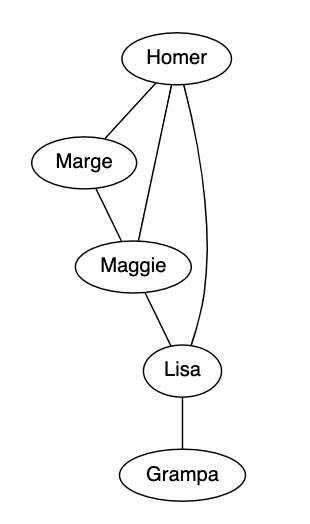

- Yes
- But, graphs can be cyclical - so need to be careful to not have a never-ending loop 

### Is Marge connected to Moe?

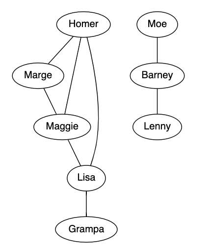

- No
- Still need to to be careful - know that you have checked all and that Moe is not connected to Marge

### How do we figure this out?

- We need to traverse through the graph
- We want to make sure we only visit each vertex once
- But how do we search through it?
    - _BFS_: go to all closest neighbors and work your way outwards
    - _DFS_: continue on a path until it’s exhausted

### Not like your tree traversal

- This one is a bit different!
- & Since graphs can have cycles, we need to be sure not visit same node again!
- How can we mark a node as visited?

## Graph Breadth First Search

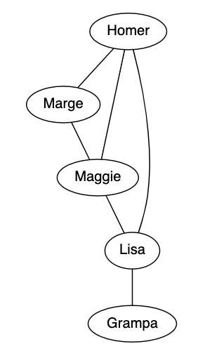

demo/friends.js
```js
areConnectedBFS(person1, person2) {
  let toVisitQueue = [person1];
  let seen = new Set(toVisitQueue);

  while (toVisitQueue.length > 0) {
    let currPerson = toVisitQueue.shift();
    
    if (currPerson === person2) return true

    for (let neighbor of currPerson.adjacent) {
      if (!seen.has(neighbor)) {
        toVisitQueue.push(neighbor);
        seen.add(neighbor);
      }
    }
  }

  return false;
}
```

- & This is a _breadth-first_ search (would be _depth-first_ if we used a stack)

- ! Warning: Using an array for a queue is suboptimal
	- Remember that, since queues enqueue at the end and dequeue from the beginning, arrays are a poor choice for large data sets, since Array.shift is an O(n) operation. A better choice might be a linked list, which can both add at the end and shift from the beginning in constant time.
	- We’re just using an array here to keep this example code self-contained and simple.

## Graph Depth First Search

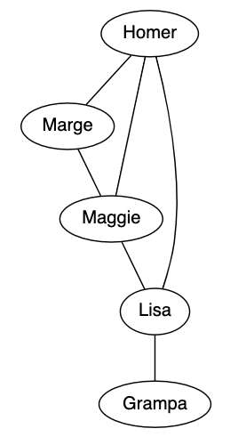

demo/friends.js
```js nums {6}
areConnectedDFS(person1, person2) {  
  let toVisitStack = [person1];
  let seen = new Set(toVisitStack);

  while (toVisitStack.length > 0) {
    let currPerson = toVisitStack.pop();

    if (currPerson === person2) return true;

    for (let neighbor of currPerson.adjacent) {
      if (!seen.has(neighbor)) {
        toVisitStack.push(neighbor);
        seen.add(neighbor);
      }
    }
  }

  return false;
}
```

### Recursive Solution

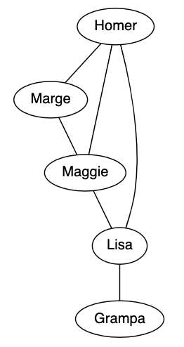

demo/friends.js
```js
areConnectedRecursive(p1, p2, seen=new Set([p1])) {
  if (p1 === p2) return true;

  for (let neighbor of p1.adjacent) {
    if (!seen.has(neighbor)) {
      seen.add(neighbor);
      if (this.areConnectedRecursive(neighbor, p2, seen)) {
        return true;
      }
    }
  }

  return false;
}
```

- This is a recursive _depth-first_ search

- Starting any recursive problem:
	- find the base case
		- when thinking about your base case: ask, can I go a step further?

## Resources

[Gentle Introduction to Graph Theory](https://medium.com/basecs/a-gentle-introduction-to-graph-theory-77969829ead8)

[BFS Graph Traversal](https://medium.com/basecs/going-broad-in-a-graph-bfs-traversal-959bd1a09255)

[From Theory to Practice: Representing Graphs](https://medium.com/basecs/from-theory-to-practice-representing-graphs-cfd782c5be38)

-   Visualizations: [Visualgo.net](https://visualgo.net/en)
-   [Problem Solving with Algorithms and Data Structures](https://runestone.academy/ns/books/published/pythonds/index.html)  
    (awesome FREE book!)
-   Graph Database: Neo4j
-   Joe Celko, _SQL for Smarties_ (graphs and trees in SQL)