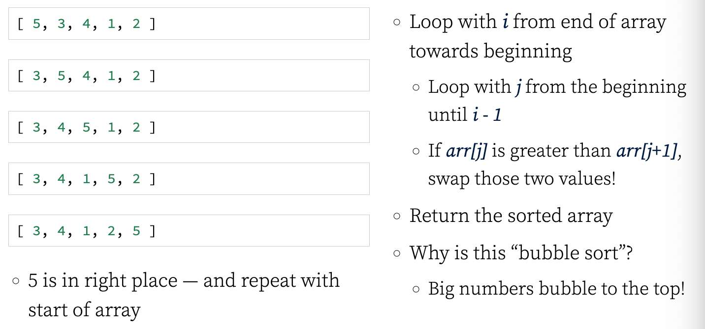
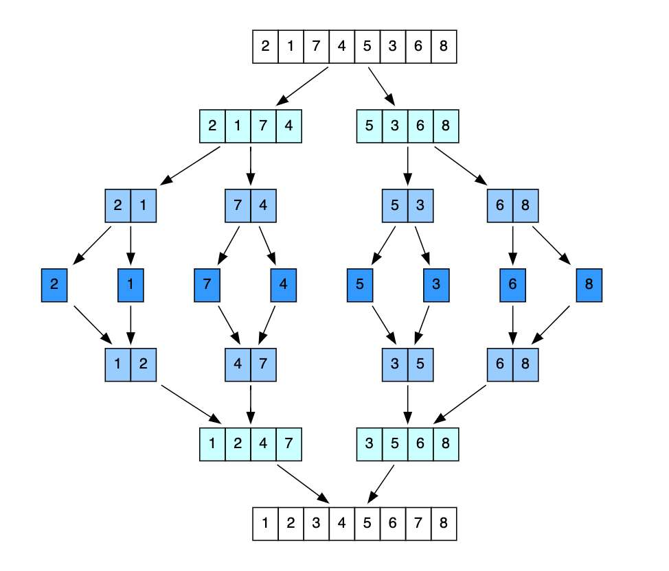
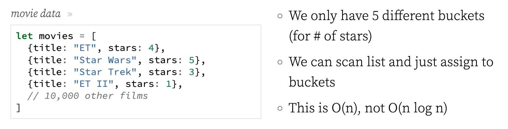

---
date: 2023-06-02
metadata: true
concepts: []
status: 'pre-lecture'
docs: 
cite: ['rithm']
---

## Goals

-   Explore a more basic sorting algorithm
-   Explore a more complex sorting algorithm
-   See where to learn more

### What is sorting?

Rearranging items in a collection so that the items are in some kind of order.

-   Sorting numbers from smallest to largest
-   Sorting names alphabetically
-   Sorting movies based on release year
-   Sorting movies based on revenue

### Why Care?

-   Long-term area of computer science study
    -   Great place to understand runtime
    -   Great place to learn algorithm design
-   Common interview questions

### Why Are There Different Algorithms?

-   Different runtimes: O(n<sup>2</sup>), O(n log n)
-   Some perform better with different input
    -   eg, Some can sort almost-sorted much faster
-   Some are easier/harder to write/understand

## Simple Algorithms

### BubbleSort

A sorting algorithm where the largest values bubble up to the top!

-   Loop with i from end of array towards beginning
    -   Loop with j from the beginning until i - 1
    -   If arr\[j\] is greater than arr\[j+1\],  
        swap those two values!
-   Return the sorted array
-   Why is this “bubble sort”?
    -   Big numbers bubble to the top!
-   5 is in right place —  and repeat with start of array



### Quadratic Sorts

-   Bubble sort is O(n<sup>2</sup>) (quadratic)
-   Simple and fun to tinker with
-   Other common O(n<sup>2</sup>) sorts
    -   Selection sort
    -   Insertion sort
-   Both are much faster than bubble sort!
-   But all _scale_ in quadratic time

## Intermediate Sorting Algorithms

-   The sorting algorithms we’ve learned so far don’t scale well
-   Try out bubble sort with 100000 elements—will take quite some time!
-   O(n log n) is fastest possible runtime
    -   (for a “comparative sort”, which is what we typically mean)
    -   n because you have to touch every item in list once
    -   log n because best possible strategy is divide and conquer method
    -   Both merge sort and quick sort use this strategy
-   This has been proven with a mathematical proof — no comparative sorting algorithm will be faster than O(n log n)

### Merge Sort

-   It’s a combination of two things: merging and sorting!
-   Exploits fact that arrays of 0 or 1 element are always sorted
-   Strategy:
    -   Decomposing array into smaller arrays of 0 or 1 elements
    -   Building up a newly sorted array from those

### Merging Arrays

-   To implement merge sort, we first need a helper function
-   This helper should take in two sorted arrays,  
    and return a new array with all elements in sort order
-   Should run in O(n + m) time/space and be pure

### Merging Arrays Pseudocode

-   Create empty out array
-   Start pointers at beginnings of arrays a and b
    -   If a value %3C= b value, push a value to out & increase a pointer
    -   Else, push b value to out & increase b pointer
-   Once we exhaust one array, push all remaining values from other array

### mergeSort Pseudocode

-   Recursively:
    -   Split array into halves until you have arrays that have length of 0 or 1
    -   Merge split arrays and return the merged & sorted array

### Merge Sort in an Image



## Choosing an Algorithm

-   Performance for your requirements
    -   For small n, simple sorts can be faster
-   Runtime
-   Likely Structure of your data:
    -   Random?
    -   Almost reversed?
    -   Almost sorted?
    -   Likely duplicates?

- Space requirements — ie, does it need to make a copy of the list to run? Or create a receptacle for the result list to land?

- Some properties your list’s data might have almost sorted or lots of duplicates. These conditions can affect runtime.

- Insertion sort wins super hard at sorting almost sorted lists.

- For example, quick sort is very fast at sorting almost random lists, but insertion sort is much much faster at sorting lists with a lot of duplicates.

- To explore advantages and disadvantages of the algorithms, check out this page, which visualizes it for you and then click through to read the descriptions.
  [http://www.sorting-algorithms.com/](http://www.sorting-algorithms.com/)

### Adaptive Sorting Algorithms

Adaptive sorts examine input data, and can:

-   Choose underlying sorting algorithm to use
-   Switch between algorithms during same sort
    -   Example: starting sorting with merge sort, switch to insertion sort  
        once subarrays get small (typically faster than merge sorting all)

### What Do Python and JavaScript Use?

-   JavaScript:
    -   Chrome & Node: “Timsort”, an adaptive Merge Sort/Insertion Sort
    -   Firefox: Merge Sort
-   Python:
    -   “Timsort”

## Sorting Topics

### Comparators

-   JavaScript built-in sort method accepts optional _comparator function_
-   Can provide this function to decide how two items compare
-   Comparator takes pair of elements (a & b) and returns sort order
    -   Returns negative number: a should come before b
    -   Returns positive number: a should come after b
    -   Returns 0: a and b sort equally

numeric sort
```js
let numbers = [100, 60, 1000, 2000];

numbers.sort()                  // [100, 1000, 2000, 60]
numbers.sort((a, b) => a - b)   // [60, 100, 1000, 2000]
```

sort by “name” property of objects
```js
const instructors = [
  { name: "Elie",   favLang: "English" },
  { name: "Joel",   favLang: "Python" },
  { name: "Alissa", favLang: "JS" },
];

// sort the instructors by name alphabetically
instructors.sort();  // not going to help!

instructors.sort((a, b) => {
  if (a.name < b.name) return -1;
  if (a.name > b.name) return 1;
  return 0;
});
```

### DSU Pattern

-   Comparator functions may have to run O(n log n) times — a lot!
-   Some sorting libraries don’t use comparators & use a “DSU pattern”
    -   _Decorate:_ wrap item with “key” for sorting it
    -   _Sort:_ using that key
    -   _Undecorate:_ remove that wrapper to reveal original item
-   This can be faster than comparators, but often uses more memory

Python uses DSU, not comparators:

sort by “name” key of dictionaries
```python
instructors = [
      { "name": "Elie",   "fav_lang": "English" },
      { "name": "Joel",   "fav_lang": "Python" },
      { "name": "Alissa", "fav_lang": "JS" },
];

instructors.sort(key=lambda item: item['name'])
```

### Stable Sorts

- Sometimes, you are sorting items that are different but would sort same:

For example, to sort these by priority:
```python
tasks = [
  { priority: 1, title:"Make logo" },
  { priority: 2, title:"Set up server" },
  { priority: 1, title:"Hire team" },
  { priority: 3, title:"Launch" },
];
```

- A “stable sort” guarantees that _Make logo_ sorts before _Hire team_ — even though both have equal priorities, they started in that order
- Python & modern JavaScripts all promise a stable sort

### Collations

How two strings compare in a language is controlled by their _collation_:

-   Capitalization: does “a” sort before or after “Z”?
-   Does “é” sort with “e”? After “e” and before “f”? At the end?

-   Some languages/frameworks/databases let you choose  
    a collation for a sort
-   In others, you’d have to do this manually, in a complex comparator/DSU

### Natural Sort

- Humans often expect things to sort “intelligently”, like these addresses:

mixing intelligently numeric & lexicographic sorting
```
24 Apple Street
100 Apple Street
100 Berry Street
500 Cherry Street Apt #34
500 Cherry Street Apt #100
```

Or these 80s band names:

not considering unimportant words, like leading “The”
```
The Clash
Cyndi Lauper
The Smiths
Talking Heads
U2
```

These are examples of “natural sorts”

### Comparative/Non-Comparative Sorts

- Most sorting algorithms are “comparative”:  
	- Items need to be compared against each other to know how to sort them
- Comparative sorting can never be better than O(n log n)
- But not all sorting requires comparison!



movie data
```js
let movies = [
  {title: "ET", stars: 4},
  {title: "Star Wars", stars: 5},
  {title: "Star Trek", stars: 3},
  {title: "ET II", stars: 1},
  // 10,000 other films
]
```

-   We only have 5 different buckets  
    (for # of stars)
-   We can scan list and just assign to buckets
-   This is O(n), not O(n log n)

- To sort by just # of stars, we don’t need to compare!

Learn more about [non-comparative sorts](http://pages.cs.wisc.edu/~paton/readings/Old/fall08/LINEAR-SORTS.html)

## Resources

### What Do You Need To Know

Need to know:

-   Best possible “comparative” sort is O(n log n)
-   Sorting in JavaScript:
    -   How to use .sort() method
    -   Remember: JS sorting is *lexicographic*, not numeric, by default!
    -   How to write a comparator function
-   Important concepts: stable sorts, natural sorts

- Perhaps useful to know:
	-   How to implement merge sort

### Resources

[Sorting Out The Basics Behind Sorting Algorithms](https://medium.com/basecs/sorting-out-the-basics-behind-sorting-algorithms-b0a032873add)

[Timsort](https://en.wikipedia.org/wiki/Timsort)

[Visualizing Sorts](https://visualgo.net/en)


## Sorting Appendix

### Selection Sort

- Similar to bubble sort, but instead of first placing large values into sorted position, it places small values into sorted position

```
[ 5, 3, 4, 1, 2 ]
[ 5, 3, 4, 1, 2 ]
[ 5, 3, 4, 1, 2 ]
[ 5, 3, 4, 1, 2 ]
[ 1, 3, 4, 5, 2 ]
1 is now in its sorted position
```

### Selection sort

-   Store the first element as the smallest value you’ve seen so far.
-   Compare this item to the next item in the array until you find a smaller number.
-   If a smaller number is found, designate that smaller number to be the new “minimum” and continue until the end of the array.
-   If the “minimum” is not the value (index) you initially began with, swap the two values. Repeat this with the next element until the array is sorted.

### Insertion Sort

Builds up the sort by gradually creating a larger left half which is always sorted

```
[ 5, 3, 4, 1, 2 ]
[ 3, 5, 4, 1, 2 ]
[ 3, 4, 5, 1, 2 ]
[ 1, 3, 4, 5, 2 ]
[ 1, 2, 3, 4, 5 ]
```

### Insertion Sort Pseudocode

-   Start by picking the second element in the array
-   Now compare the second element with the one before it and swap if necessary.
-   Continue to the next element and if it is in the incorrect order, iterate through the sorted portion (i.e. the left side) to place the element in the correct place.
-   Repeat until the array is sorted.

## Quick Sort

-   Like merge sort, exploits the fact that arrays of 0 or 1 element are always sorted
-   Works by selecting one element (called the “pivot”) and finding the index where the pivot should end up in the sorted array
-   Once the pivot is positioned appropriately, quick sort can be applied on either side of the pivot

### Pivot Helper

-   In order to implement merge sort, it’s useful to first implement a function responsible arranging elements in an array on either side of a pivot
-   Given an array, this helper function should designate an element as the pivot
-   It should then rearrange elements in the array so that all values less than the pivot are moved to the left of the pivot, and all values greater than the pivot are moved to the right of the pivot
-   The order of elements on either side of the pivot doesn’t matter!
-   The helper should do this in place, that is, it should not create a new array
-   When complete, the helper should return the index of the pivot

### Picking a pivot

-   The runtime of quick sort depends in part on how one selects the pivot
-   Ideally, the pivot should be chosen so that it’s roughly the median value in the data set you’re sorting
-   For simplicity, we’ll always choose the pivot to be the first element (we’ll talk about consequences of this later)

### Pivot Helper Example

```js
let arr = [ 5, 2, 1, 8, 4, 7, 6, 3 ]

pivot(arr); // 4;

arr;
// any one of these is an acceptable mutation:
// [2, 1, 4, 3, 5, 8, 7, 6]
// [1, 4, 3, 2, 5, 7, 6, 8]
// [3, 2, 1, 4, 5, 7, 6, 8]
// [4, 1, 2, 3, 5, 6, 8, 7]
// there are other acceptable mutations too!
```

- All that matters is for 5 to be at index 4, for smaller values to be to the left, and for larger values to be to the right

### Pivot Pseudocode

-   It will help to accept three arguments: an array, a start index, and an end index (these can default to 0 and the array length minus 1, respectively)
-   Grab the pivot from the start of the array
-   Store the current pivot index in a variable (this will keep track of where the pivot should end up)
-   Loop through the array from the start until the end
-   If the pivot is greater than the current element, increment the pivot index variable and then swap the current element with the element at the pivot index
-   Swap the starting element (i.e. the pivot) with the pivot index
-   Return the pivot index

### Quicksort Pseudocode

-   Call the pivot helper on the array
-   When the helper returns to you the updated pivot index, recursively call the pivot helper on the subarray to the left of that index, and the subarray to the right of that index
-   Your base case occurs when you consider a subarray with less than 2 elements

### Quicksort Resources

-   [Quicksort intro](https://www.youtube.com/watch?v=aQiWF4E8flQ) (6 min YouTube)
-   [Tim Roughgarden Quicksort](https://class.coursera.org/algo-006/lecture) (Quicksort-Algorithm, first two lectures)
-   [“An Intuitive Explanation of Quicksort”](http://www.quora.com/What-is-an-intuitive-explanation-of-QuickSort)

