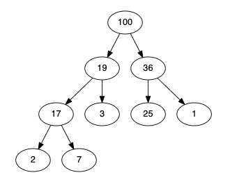

---
date: 2023-05-29
metadata: true
concepts: ['data-structures', 'stacks', 'queues']
status: 'pre-lecture'
docs: 
cite: ['rithm']
---

## Goals

-   Describe what an “abstract data type” means
-   Compare different types of arrays
-   Define singly and doubly linked lists
-   Compare performance characteristics of arrays and lists
-   Implement linked lists in JavaScript

## Lists ADT

- A list is an abstract data type
- It describes a set of requirements, not an exact implementation.](<Remember: an _abstract data type_ defines requirements.>)

ADT for list:
- Keep multiple items
- Can insert or delete items at any position
- Can contain duplicates
- Preserves order of items

### Where’s the Bug?

movieTicketSales.js

```js nums {8}
// list, in order, of people who want tickets
let ticketBuyers = ["Elie", "Alissa", "Matt", "Michael"];

// ... lots of code

// sell tickets, in order
while (ticketBuyers.length) {
  buyer = ticketBuyers.pop();
  purchase(buyer);
}
```

- Is it right to sell tickets out of order?
- Of course: it’s hard to see this bug 500 lines later

### What’s the Performance Problem?

movieTicketSales.js
```js nums {6}
// list, in order, of people who want tickets
let ticketBuyers = ["Elie", "Alissa", "Matt", "Michael"];

// sell tickets, in order
while (ticketBuyers.length) {
  buyer = ticketBuyers.shift();
  purchase(buyer);
}
```

- It’s O(n) to remove from start of array
    - Given that we’re removing from the start, a LL would be better
- Of course: it’s hard to know _how_ a general list will be used

### Constraints Are Useful

- In both cases, we only need _some_ of the requirements of the List ADT
	- add new item (ticket buyer) to end
	- remove first item (ticket buyer) from start
- Knowing this, we could pick a better data structure!
- If done well, we could prevent misuse (like buying out of order)
- Let’s meet two new _ADTs_ for collections

## Queues

- Add at end, remove from beginning
	- **FIFO** for “First-in, first-out”
- Generally, will construct as classes
	- Have a queue instance, that has the below methods

### Like a List, Except…

- Items are _only_ added to a queue by **enqueueing** them at the _back_
- Items are _only_ removed from a queue by **dequeueing** them at the _front_
- Thus, newer items are near back of queue, older items are near front
- **FIFO** for “First-in, first-out”

### Typical methods

- enqueue(item)
	- Add to end
- dequeue()
	- Remove & return first item
- peek()
	- Return first item, but don’t remove
- isEmpty()
	- Are there items in the queue?
- We can’t introduce a bug like we had with our ticket buying example, there are no methods for adding to the beginning or removing from the end!
- Sometimes there are other common methods, like .length()
- Sometimes enqueue and dequeue are called push and pop
- & Only write the methods you know you need - prevent introduction of bugs like from the example above

### Implementation

- What’s a good implementation for queues?
	- Arrays?
	- Linked Lists?
	- Doubly Linked List?
	- Objects?
- !! _Array_: no, dequeing would be O(n)
- $ _Linked List_: yes, both enqueue & dequeue are O(1) _(head is top)_
- $ _Doubly Linked List_: yes, both enqueue & dequeue are O(1)
- !! _Object_: no, dequeuing is O(n) _(have to scan whole obj to find low key)_
	- objects can add/remove and find in O(1)
	- BUT no way of keeping track of what key is the lowest key, and this makes it O(n)

## Stacks

- **A** → “I want to order pizza for our party!”
    - **B** → In order to do that, I call the pizza place
        - **C** → They ask me how many I want
            - **D** → I put them on hold to ask my boss the budget
                - **E** → She gives amount in CAD, but pizza place takes USD
                    - **F** → I look up USD→CAD conversion rates in my web browser
                - Now I can convert budget to CAD
            - Now I can tell pizza place my budget
        - …

Like function calls — you return to “previous state” when you pop top task

### Like a List, Except…

- Items are _only_ added to a stack by **pushing** them onto the _top_
- Items are _only_ removed from a stack by **popping** them off the _top_
- Thus, newer items are near top of stack, older items are near bottom
- **LIFO** for _Last-in, first-out_
- Examples: the function call stack, most laundry hampers

### Typical methods

- push(item)
	- Add to “top” of stack
- pop()
	- Remove & return top item
- peek()
	- Return (but don’t remove) top item
- isEmpty()
	- Are there items in the stack?
- & Only write the methods you know you need - prevent introduction of bugs like from the example above

### Implementation

- What’s a good implementation for stacks?
	- Arrays?
	- Linked Lists?
	- Doubly Linked List?
	- Objects?

- $ _Array_: yes, both push & pop are O(1)
- $ _Linked List_: yes, both push & pop are O(1)
	- Note: this requires some clever thinking w/r/t which end would be the top of the stack.
	- Would need to add/remove from the HEAD to keep this as O(1)
- $ _Doubly Linked List_: yes, both push & pop are O(1)
- !! _Object_: no, popping is O(n) _(have to scan whole obj to find high key)_
	-  objects can add/remove and find in O(1)
	- BUT no way of keeping track of what key is the lowest key, and this makes it O(n)

## Deques
pronounce: DECK

- An _ADT_ for a “double-ended queue” — push, pop, shift & unshift
- Less common than stack or queue

### Use Case

- A ticket buying application:
	- Get in queue to buy ticket: added to end
	- Buy ticket: removed from front
	- VIP customers:
	    - There are VIP customers and they don’t go to end of line to buy tickets
	    - VIP customers should be helped next and get added to front of the line

### Typical Methods

Method names vary across implementations, but one set:

- appendleft()
	- Add to beginning
- appendright()
	- Add to end
- popleft()
	- Remove & return from beginning
- popright()
	- Remove & return from end
- peekleft()
	- Return (don’t remove) beginning
- peekright()
	- Return (don’t remove) end
- isEmpty()
	- Are there items in the deque?
- & Only write the methods you know you need - prevent introduction of bugs like from the example above

### Implementation

- What’s a good implementation for deques?
	- Arrays?
	- Linked Lists?
	- Doubly Linked List?
	- Objects?

- !! _Array_: no, appendleft & popleft would be O(n)
- !! _Linked List_: no, popright would be O(n)
- $ _Doubly Linked List_: yes — everything is O(1)
- !! _Object_: no, popleft & popright would be O(n)
	-  objects can add/remove and find in O(1)
	- BUT no way of keeping track of what key is the lowest key, and this makes it O(n)

– Need to be able to both things from both sides

## Priority Queue

- An _ADT_ for a collection:
	- Add item (with priority)
	- Remove highest-priority item

- Examples: Productiv (to-do list apps)

### Typical Methods

- add(pri, item)
	- Add item to queue
- poll()
	- Remove & return top-priority item
- peek()
	- Return (don’t remove) top-priority item
- isEmpty()
	- Are there items in queue?
- & Only write the methods you know you need - prevent introduction of bugs like from the example above

### Implementation

- What’s a good implementation for priority queues?
	-   Arrays?
	-   Linked Lists?
	-   Doubly Linked List?

- Consider with two strategies:
	-   Keep unsorted, add to end, find top priority on poll
	-   Keep sorted, add at right place, top priority is first

- Keep unsorted, add to end, find top priority on poll:
	- !! _Array_: no, peek & poll would be O(n)
	- !! _Linked List_: no, peek & poll would be O(n)
	- !! _Doubly Linked List_: no, peek & poll would be O(n)

- Keep sorted, add at right place, top priority is first:
	- !! _Array_: no, add & poll would be O(n)
	- !! _Linked List_: no, add would be O(n)
	- !! _Doubly Linked List_: no, add would be O(n)

- $ Solution: Make a heap instead

### Heaps

- $ Data structure optimized for priority queues: _heap_


## Building Stacks/Queues

- How should you build stacks and queues?
- We want to use arrays and linked lists:
	- But with the correct API _(eg, push/pop for stack)_
		- even though its an array under hood, none of this functionality is accessible to the user
	- Without having to mix the _interface_ with the _implementation_
- & Only write the functionality/methods etc. that you *need* and do *NOT* introduce any extra functionality

### Stack: Delegation

- Arrays are a great implementation for a stack
- Create a Stack class that itself uses an array
    ```js nums {}
    class Stack {
      constructor()  { this._array = []; }
    
      push(item)     { this._array.push(item); }
      pop()          { return this._array.pop(); }
      // ... also should have peek & isEmpty
    }
    ```
- _Users_ of this class don’t have know that it “delegates” to an array
- Enforces the “right API” and makes it obvious that it is a stack
- A class that just delegates elsewhere is called a _facade_.
	- (this class just uses an array underneath)

- ~ Important: Why \_array for the name?
	- As usual, the leading-underscore-name suggests “this is a private implementation detail” and other programmers should know not to use it directly.

### Queue: Delegation

- Linked lists are a good implementation for a queue:
    ```js
    class Queue {
      constructor()  { this._ll = new LinkedList(); }
    
      enqueue(item)  { this._ll.push(item); }
      dequeue()      { return this._ll.shift(); }
      // ...
    }
    ```
- Sometimes, you might “cheat” and use an array _(which is often fine)_:
	- (fine if there is only ever finite number of elements)
	    ```js
	    class Queue {
	      constructor()  { this._array = []; }
	      // ...
	    }
	    ```
- _Users_ of this won’t need to do anything if your implementation changes

- ~ Note: A less-appealing alternate approach
	- For a stack, you could subclass the built-in JavaScript Array class and prevent invalid methods by throwing errors for those not allowed:
	```js
	class Stack extends Array {
	  shift() { throw new Error("Not allowed") }
	  unshift() { throw new Error("Not allowed") }
	}
	```
	- Here, this doesn’t _delegate_ to a real array — it **is** a real array, but it blocks inappropriate API methods with errors.
	- There are plenty of non-stack methods that arrays have, so you’d need to block splice, slice, and _all_ other non-stack methods.
	- Considerations
		-   This implementation requires that you get everything exactly right, taking care to block every single method that should not be allowed.
		-   What if you forget to block a method?
		-   If a new JavaScript Array method is added to the class, you’ll need to remember to update your class to block the newly added method too. This approach could be more work to maintain long-term.
	- (Of course, this would be the same with a Queue class that extended either the JS Array class or your LinkedList class.)

### Or use Array with good names…. but…. 

- **At the very-very-least**, use a built-in-type — but make it clear that its a stack or queue in the name:
```js
let buyersQueue = [];

let processesStack = [];
```
- ! This is not great — if you want to move to a better implementation later, you might have to change code in several places.
- This is here in mind for:
	- some breadth and search algos that aren’t focusing on stacks/queues
	- when you are really really short on time, or just writing something for yourself that you know you’re going to upgrade later
	- $ But always better to take the 5 mins to write the stack/queue class right

## Resources

[Stacks and Overflows](https://medium.com/basecs/stacks-and-overflows-dbcf7854dc67)

[To Queue or Not To Queue](https://medium.com/basecs/to-queue-or-not-to-queue-2653bcde5b04)

[Learning to Love Heaps](https://medium.com/basecs/learning-to-love-heaps-cef2b273a238)

[Rithm School Lecture on Heaps](https://rithm-students-assets.s3.us-west-1.amazonaws.com/r19/lectures/dsa-pqueues/handout/index.html)


## Stack/queue question

- For nodes within stack:
	- is the “next” value pointing “down” to the lower pancake, cause the more important aspect is where to go next when this is popped off the stack? 