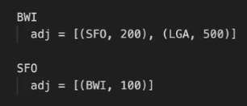
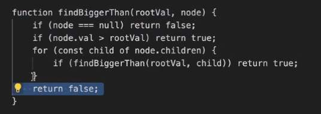

---
date: 2023-06-02
metadata: true
concepts: []
status: 'pre-lecture'
docs: 
cite: ['rithm']
---

## How do I know the right data structure?

- Depends on what you need

- Are challenges that its difficult to see what you need:
	- Balanced brackets
		- `([])`
			- have to close square brackets before ()
			- Stack-like problem
- Think about you need
- Sometimes you don’t know what you need
	- like in context free challenges (leetcode, etc.)
	- Think about data structures in your daily life
		- stacky things: terrible conversationalist, interupts you, adds topics to stack
		- queue like problems:
		- sorting really unlocked this
	- keep list of these types of problems and try to see the patterns

- Specific example: highest ranking consuela
	- possible to find with Depth first search


## Where do we put data about weights in weighted graphs?

BWI → SFO $200
SFO → BAL $100

```js
class Node:
	adj = [(node, weight)]

BWL
	adj = [(SFO, 200), (LGA, 500)]

SFO
	adj = [(BWI, 100)]
```




## Recursion problem example

1. Figure out your base cases
	1. Test your base cases
2. What’s the next smallest case



## Helper recursion

- Joel advice:
	- don’t want us to worry about this
	- solve it the other way
	- because other problems can’t be solved this way
- helper recursion can be performance enhancement for recursion
- But if you actually want performance boost
	- use recursion, just recursive thinking
	- would instead use a stack & loop

## DS resources for JS

- O’reilly hedgehog book
- Data structures and Algorithms with JS by Michael McMillan
- base CS posts medium

