---
date: 2023-05-31
metadata: true
concepts: ['data-structures', 'trees', 'binary-trees']
status: 'pre-lecture'
docs: 
cite: ['rithm']
---

## Trees

### Goals

-   Introduce terminology
-   Create a tree class and methods
-   Learn uses for trees

### Terminology

- node
	- basic unit
- children
	- nodes directly below a node
- descendants
	- nodes below a node
- parent
	- node that is directly above a node
- ancestor
	- node that is above a node
- root node
	- the single node at the top of tree
	- & tree can only have one root node
- leaf node
	- node without any children

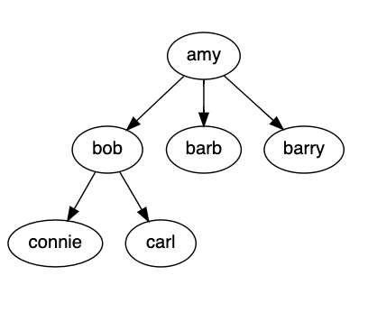

### An Org Chart is a Tree

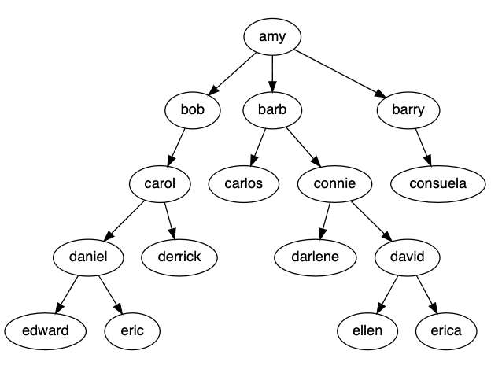
- Amy is CEO
	- everyone else branches down from amy
	- VP’s: bob barb barry
	- Managers: carol, connie (even daniel and david)

### A Filesystem is a Tree

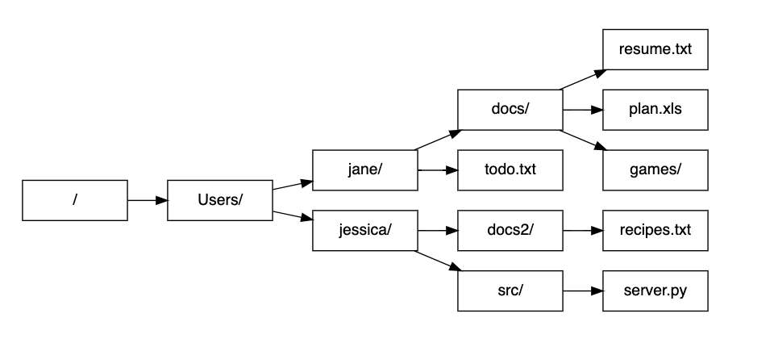
- root directory
- leaf nodes are our files

### HTML DOM is a Tree

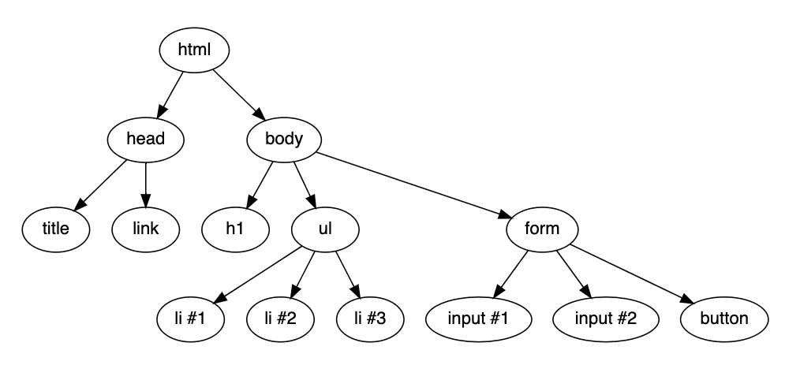

### A Taxonomy is a Tree

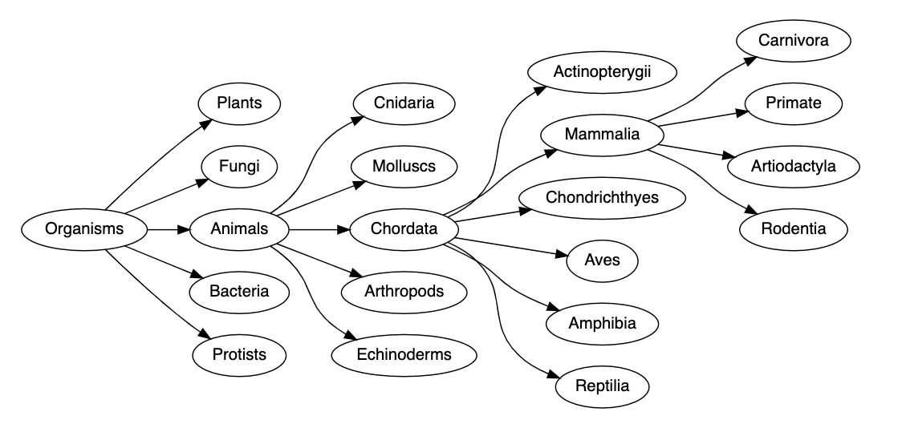

### This Is Not a Tree

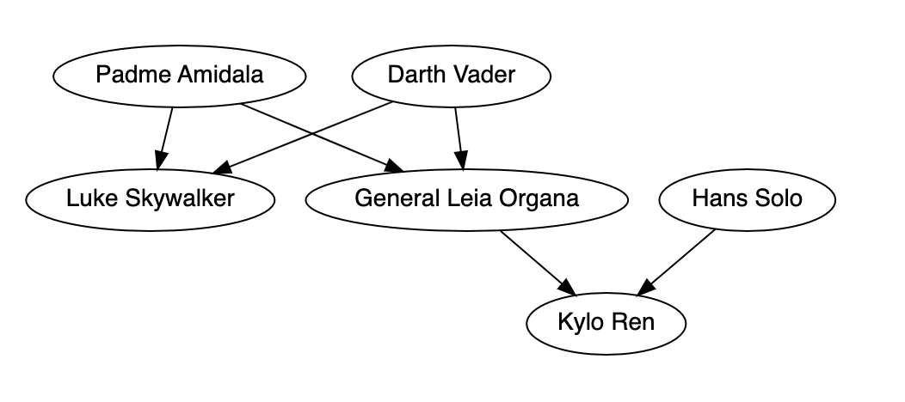

-   Trees need a root node — we don’t have one!
-   A node can only have one parent

### Binary Trees/Binary Search Trees

- These are different—and we’ll cover later!
	- Binary trees and BST are special kinds of trees
- General trees are sometimes called “**n-ary**” trees, since 
	- & they can have _n_ (any) number of children.

## Trees in JavaScript

### Node Class

- A Node needs to know:
	- what is my val
	- who are my children = array
```js
class Node {
  constructor(val, children = []) {
    this.val = val;
    this.children = children;
  }
}
```

```js
let amy = new Node("amy");

amy.children.push(new Node("bob"));
amy.children.push(new Node("barb"));
amy.children.push(new Node("barry"));
```

```js
let amy = new Node("amy",
  [new Node("bob"),
   new Node("barb"),
   new Node("barry")])
```

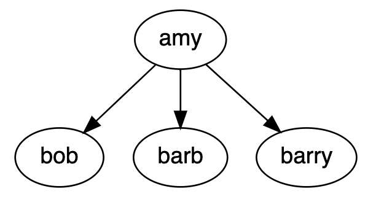

### Finding a Node

_Depth First Search_ (uses stack)
- exploring every octopus’ tentacle before switching to the next tentacle

- Starting at Amy, find Connie:
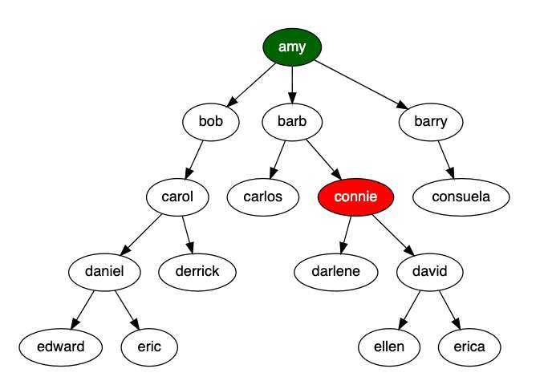
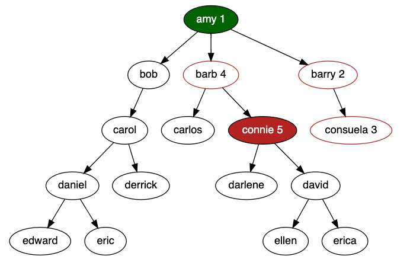

- find: method on a node
`amy.find("connie")
```js nums {}
  find(val) {
    let toVisitStack = [this];

    while (toVisitStack.length) {
      let current = toVisitStack.pop();

      if (current.val === val)
        return current;

      for (let child of current.children)
        toVisitStack.push(child)
    }
  }
```
- when first invoked, “this” is amy node

### Highest-Ranking Consuela

_Breadth First Search_ (uses queue)
- Searches top to bottom, left to right, rank by rank

We hire another Consuela & we want to find highest-ranking one
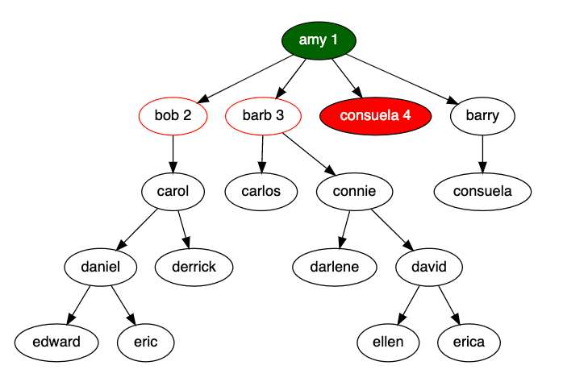

`amy.findBFS("consuela")
```js nums {5}
  findBFS(val) {
    let toVisitQueue = [this];

    while (toVisitQueue.length) {
      let current = toVisitQueue.shift();

      if (current.val === val)
        return current;

      for (let child of current.children)
        toVisitQueue.push(child)
    }
  }

```

- & Note: the only difference between these two is the the *data structure* used
	- is *always* depth first if using a stack
	- is *always* breadth first if using a queue

### Tree Class

```js
class Tree {

  constructor(root) {
    this.root = root;
  }
}
```

```js
class Node {
  constructor(val, children = []) {
    this.val = val;
    this.children = children;
  }
}
```

```js
let org = new Tree(
  new Node("amy",
    [new Node("bob"),
     new Node("barb"),
     new Node("barry")]))
```

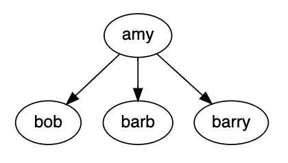

### Do You Really Need a Tree Class?

- Each node is, itself, a tree
- It’s useful to have a Tree class, though:  
	- then, you can find or change the root node
- Can delegate to the root node for many operations:
  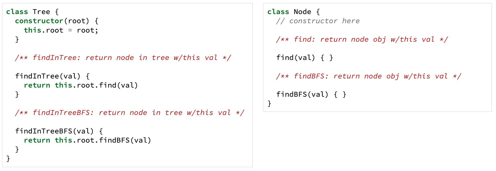
```js
class Tree {
  constructor(root) {
    this.root = root;
  }

  /** findInTree: return node in tree w/this val */

  findInTree(val) {
    return this.root.find(val)
  }

  /** findInTreeBFS: return node in tree w/this val */

  findInTreeBFS(val) {
    return this.root.findBFS(val)
  }
}
```

```js
class Node {
    constructor(val, children = []) {
	    this.val = val;
	    this.children = children;
  }

  /** find: return node obj w/this val */

  find(val) { }

  /** findBFS: return node obj w/this val */

  findBFS(val) { }
}
```

### Also

Every linked list is a tree —  but not every tree is a linked list

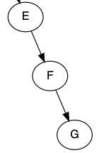

## Binary Trees

- General n-ary trees have nodes with 0+ children.
- Binary tree nodes can have 0, 1, or 2 children.

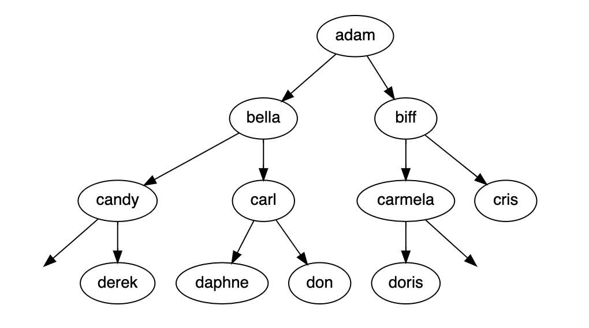
- Binary tree nodes are usually structured with left and right properties, rather than an array of children:
```js
class BinNode {
  constructor(val, left=null, right=null) {
    this.val = val;
    this.left = left;
    this.right = right;
  }
}
```

### What Are They Good For?

- Sometimes they’re used to store data in a normal hierarchy, like a tree.
- Often times, they have a “rule” about the arrangement:
	- binary search trees
	- min/max heap

### Other Trees

- Less commonly, there are other _n_ trees
- One example is “quad-trees”, often used for geographic programs, to keep track of N/S/E/W information from a node.

## Advanced Ideas

### Moving Up

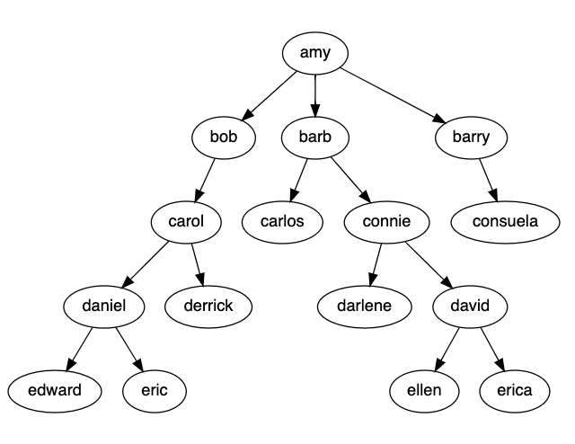

```js
barb.children // carlos and connie nodes
```

- It’s not possible to “move up”:
```js
barb.findAncestors()   // can't do easily
```

### Some Trees Point Up

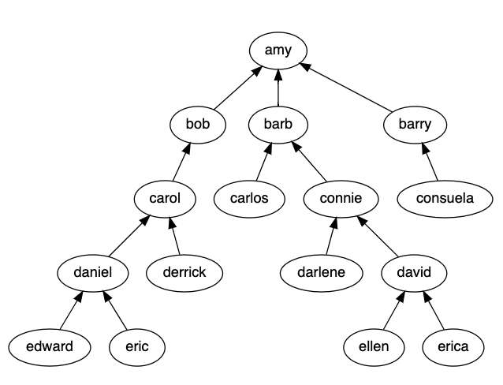

```js
class ReverseNode {
  constructor(val, parent) {
    this.val = val;
    this.parent = parent;
  }
}
```

- All relationships are the same
	- Difference here is how you navigate the tree
	- Amy is still root
	- edward, eric, ellen, erica still leaf nodes
- Of course, then you can’t move down!
- Tree class is important here:
	- Need to keep a list of all leaf nodes

### Some Point Both Ways

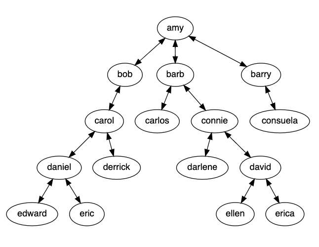

```js
class BidirectionalNode {
  constructor(val, parent, children = []) {
    this.val = val;
    this.parent = parent;
    this.children = children;
  }
}
```

## Resources

[How to Not Be Stumped By Trees](https://medium.com/basecs/how-to-not-be-stumped-by-trees-5f36208f68a7)

