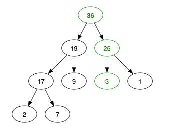

---
date: 2023-06-02
metadata: true
concepts: []
status: 'pre-lecture'
docs: 
cite: ['rithm']
---

## Goals

-   Overview of how heaps work
-   Lightly introduce other DSAs
-   Overview what is most important to study, and how to do so

## Heap

-   Often used to implement priority queues
-   Often used as part of a larger algorithm/data structure
- All Heaps must be **complete**

### Max Heap

Each parent must be greater than children


We’ll use a “complete max binary heap”

-   **complete**: filled top → bottom, left → right
-   **max**: each parent is greater than children
-   **binary**: parent can have at most two children
-   **heap**: tree with rule between parent/children

### Adding Item

- When worried about completeness - always only one place where something can go.

- Add at bottom right


- Swap upward until correct


### Removing Top Item

- Highest-priority item is top of tree! (100)

If we just remove it, our tree won’t have a head

- Put bottom right node at top (swap the “last” node with the head)


- Swap downward until correct

(Swapped with 36, not 19, as 19 < 36)
1. Pick the bigger of your children, and swap that (swap with 36, not 19)
	1. swap 3 and 36
2. Pick the bigger of children, swap that
	1. swap 3 and 25
- sink downward, swap downward

- & Max number of swaps will always be log n
	- To get out/remove highest priority 
	- To add an item

- Binary tree, for a totally diff purpose than a Binary Search Tree
- Heaps used all the time - 
	- by your computer for reprioritizing tasks
- can make reasonable priority thing out of a queue, but heaps way better

### Runtime

- Adding to bottom right is O(1)
- Swapping top & bottom right is O(1)
- The swapping up & down limits the runtime
-   **bubbleUp:** O(log n) _(max # swap up = height)_
-   **sinkDown:** O(log n) _(max # swap down = height)_

### Implementation


-   When you have a complete binary tree it can be represented as an array
    
    ```
    [36, 19, 25, 17, 9, 3, 1, 2, 7]
    [#0,  1,  2,  3, 4, 5, 6, 7, 8]
    
    ```
    
-   Can easily find arr\[i\]’s children:
    -   Left: `2 * i + 1`
    -   Right: `2 * i + 2`
-   Can easily find arr\[i\]’s parent:
    -   Left: `Math.floor((i - 1)/2)`
    -   Right: `Math.floor((i - 2)/2)`

- Java uses heap sort as it’s underlying algorithm

## Path Finding + Ordering

### Path Finding

- Algorithms for finding the most efficient path in weighted graphs:
	-   [Dijkstra’s algorithm](https://en.wikipedia.org/wiki/Dijkstra%27s_algorithm)
		- (Dykestra) top # 1 - 2 top computer scientists
		- BUT can’t deal will negative weights
	-   [A*](https://en.wikipedia.org/wiki/A*)
		- Can deal with negative weights
		- Not good to “play with” or study - Joel’s studied it multiple times and forgot


- Traveling salesmen:
	- instensly impossible to do with a large n
	- factorial
	- n-p hard
		- non-polynomial

### Topological Sort

- sometimes just called a “top sort”
- can be done in O(n) time


-   Takes an **acyclic**, **directed graph** and returns a list of nodes where each node appears before all the nodes it points to.
	- acyclic: can’t have any loops
-   A graph can have more than one valid topological sort
-   Here are the two possible topological sorts for this graph:
    ```
     [put_in_oven, take_out_of_oven, prepare_icing, let_cool, eat]
     [put_in_oven, prepare_icing, take_out_of_oven, let_cool, eat]
    ```
-   This algorithm can be done in O(n) time
-   [Wikipedia: Topological Sorting](https://en.wikipedia.org/wiki/Topological_sorting)
-   [Interview Cake: Topological Sort](https://www.interviewcake.com/concept/javascript/topological-sort)
    

## What Do You Need To Know?

### The “Must Knows”

-   Understanding what an ADT is and why they’re useful
	- abstract data type
		- tells you what you need, not how to do it
		- implementation: how to do this adt
	- if you know what you need to do with it, can help you choose which one to pick
	- examples: binary trees, stack, queue, 
	- ADT:
		- List: what I need
		- Implementation: Linked list
-   Knowing when to use arrays, objects, LLs, trees, and graphs
-   Big O notation & runtime of common operations in these
	- constant: to add remove from object
	- linear: shift/unshift from an array
-   Identifying recursive problems
	- when data has a nested structure
	- same operation, on smaller set of data over and over
-   Traversal in LLs, trees, and graphs via BFS and DFS
-   Searching and traversing of binary search trees
-   _Very lightly_: a conceptual understanding of how hashing/hash tables work
	- don’t build them yourself
	- apple-th index, berry-th index

### What Are You Likely To Be Asked About?

-   Selecting a data structure
-   Big O Notation
-   Solving problems with algorithms

### Should You Study This?

- Some time studying this: Absolutely yes
- Totally solid everything further study:  It depends
    - On your developer goals
        - backend larger scale
    - On your interest/aptitude for it
- Focus on the _must knows_

## Resources

### Books


-   Fantastic friendly deeper dive into DSAs
-   Uses Python for its examples but is language-independent
-   Our first and best pick for confirming/learning more


[Cracking the Coding Interview](https://books.google.com/books?id=jD8iswEACAAJ)

- excellently organized overview of data structures by an expert
- book for everyone: beginners - and experts
	- problems get harder and harder also for senior engineers
		- get hysterically difficult
	- Better for learning than leetcode:
		- problems vary in quality and jump around randomly
	- Do it in an organized fashion, will get better.
-   Overview of common DSAs
-   Challenges with hints & solutions
-   Excellent, well-organized
-   Code is in Java, but very readable


[Algorithmic Puzzles](https://books.google.com/books?id=fY1pAgAAQBAJ)

-   Logic problems for engineers
-   Code-free! _(focusing on thinking)_
-   Helps learn to think algorithmically

### Online

-   Rithm-developed [Algorithms & Data Structures Masterclass](https://www.udemy.com/js-algorithms-and-data-structures-masterclass/)
    -   JavaScript-focused overview of this material
-   [Interviewing.io](https://interviewing.io/recordings/)
    -   Watch recorded interviews that focus on DSAs
-   [Problem Solving with Algorithms and Data Structures using Python](http://interactivepython.org/runestone/static/pythonds/index.html)
    -   Free online textbook with interactive exercises
    -   Written in Python, but ideas are same in JS

### Practice Online

General challenges:
-   [LeetCode](https://leetcode.com/)
-   [HackerRank](https://www.hackerrank.com/)
-   [Codewars](https://www.codewars.com/)

- Good for weekly pop quiz: be surprised by which problem 

Deeper dives:

-   [Interview Cake](https://www.interviewcake.com/)