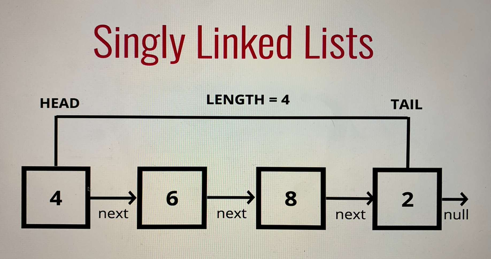

---
date: 2023-04-27
metadata: true
concepts: ['data-structures', 'linked-lists']
status: 'null'
docs: 
cite: ['udemy-data-structures']
---

## Linked lists 

- Linked lists have:
	- head
	- tail
	- length
- DO NOT have indices
- Each element = node
- Each node has a value, and a pointer to another node or null
- Connected *ONE directionally* to the next node via *next* pointer
- Random access not allowed (can’t just access 10th item)
- But better at insertion and deletion than arrays
- You can have whatever data in each node (string, number, array, etc.)
- Analogy
	- Like a skyscraper with no elevators (and self locking doors as you go up)



## Compared to arrays

- arrays indexed in order
- can quickly be access at a specific index
- insertion/deletion can be expensive –> requires re-indexing of all remaining elements


## Big O Singly linked lists

- Insertion - O(1)
- Removal - O(n)  (or O(1) if start)
- Searching - O(n)
- Access - O(n)

## Foundation for

- Stacks
- Queues


```js
class Node{
	constructor(val) {
		this.value = val;
		this.next = null;
	}
}

class SinglyLinkedList{
	constructor() {
		this.head = null;
		this.tail = null;
		this.length = 0;
	}

	push(val) {
		const newNode = new Node(val);
		if (this.length === 0) {
			this.head = newNode;
			this.tail = newNode;
		} else {
			this.tail.next = newNode;
			this.tail = newNode;
		}
		this.length++;
		return this;
	}

	// pop - first way tried
	pop() {
		if(this.length === 0) return undefined;
		const val = this.tail.value;
		let node = this.head;
		for (let i=1; i < this.length; i++){
			if (i === this.length -1) {
				node.next = null;
				this.tail = node;
				this.length--;
			} else {
				node = node.next;
			}
		}
		return val;
	}


	// pop - colt solution before refactor
	pop() {
		if(this.length === 0) return undefined;
		
		let curr = this.head;
		let newTail;
		
		while(curr.next) {
			newTail = curr;
			curr = curr.next;
		}
		
		this.tail = newTail;
		this.tail.next = null;
		this.length--;
		if(this.length === 0) {
			this.head = null;
			this.tail = null;
		}
		
		return curr;
	}

	shift() {
		if (this.length === 0) return undefined;
		const prevHead = this.head;
		this.head = this.head.next;
		prevHead.next = null;
		this.length--;
		if(this.length === 0) {
			this.tail = null;
		}
		return prevHead;
	}


	unshift(val){
		const newNode = new Node(val);
		if (this.length === 0) {
			this.head = newNode;
			this.tail = newNode;
		} else {
			newNode.next = this.head;
			this.head = newNode;
		}
		
		this.length++;
		return this;
	}

	// Note: colt solution used while loop instead of for loop
	get(idx) {
		if (idx < 0 || idx >= this.length) return null;
		
		let node = this.head;
		
		for (let i=0; i < idx; i++){
			node = node.next;
		}
		return node;
	}

	set(idx, val){
		const node = this.get(idx);
		if (node === null) {
			return false;
		} 
		
		node.value = val;
		return true;
	}

	insert(idx, val){
		if (idx < 0 || idx > this.length) {
			return false;
		} else if (idx === 0) {
			this.unshift(val);
		} else if (idx === this.length) {
			this.push(val);
		} else {
			const newNode = new Node(val);
			const nodeBefore = this.get(idx - 1);
			const nodeAfter = nodeBefore.next;
			nodeBefore.next = newNode;
			newNode.next = nodeAfter;
			this.length++;
		} 
		return true;
	}

	remove(idx){
		if (idx < 0 || idx >= this.length) {
			return undefined;
		} 
		if (idx === 0) return this.shift();
		if (idx === this.length-1) return this.pop();
		
		let nodeBefore = this.get(idx-1);
		let currNode = nodeBefore.next;
		
		nodeBefore.next = currNode.next;
		currNode.next = null;
		this.length--;
		
		return currNode;
	}

	reverse(){
		let prevHead = this.head;
		this.tail = this.head;
		let nextItem1 = this.tail.next;
		let storePrevnext = nextItem1.next;
		nextItem1.next = this.tail;
		currItem = storePrevnext;

		let curr = this.head;
		let prevNext;
		let count = 0;
		while(count < this.length){
			curr = curr.next;
			prevNext = curr.next;
			
		}
		
	}
}
```