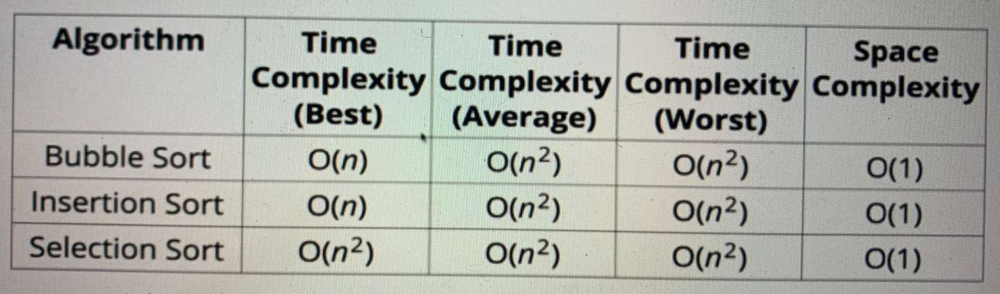

---
date: 2023-04-21
metadata: true
concepts: ['data-structures', 'sort', 'comparison']
status: 'pre-lecture'
docs: 
cite: ['udemy-data-structures']
---

## Quadratic Sorting Algos

- & These 3 are all roughly equivalent as quadratic sorting algos and can perform well when data set is small

- Bubble Sort
	- Performs better on *almost sorted data* than other algos that are otherwise “better sorting algos”
- Insertion Sort
	- Performs better on *almost sorted data* than other algos that are otherwise “better sorting algos”
	- This also performs well in continuous sorting – like sorting on insertion – maintaining a “running sort”
	- online algo - for already sorted dataset
- Selection Sort
	- Not good for almost sorted data because it iterates 
	- Simple to understand (pretty much only +)

