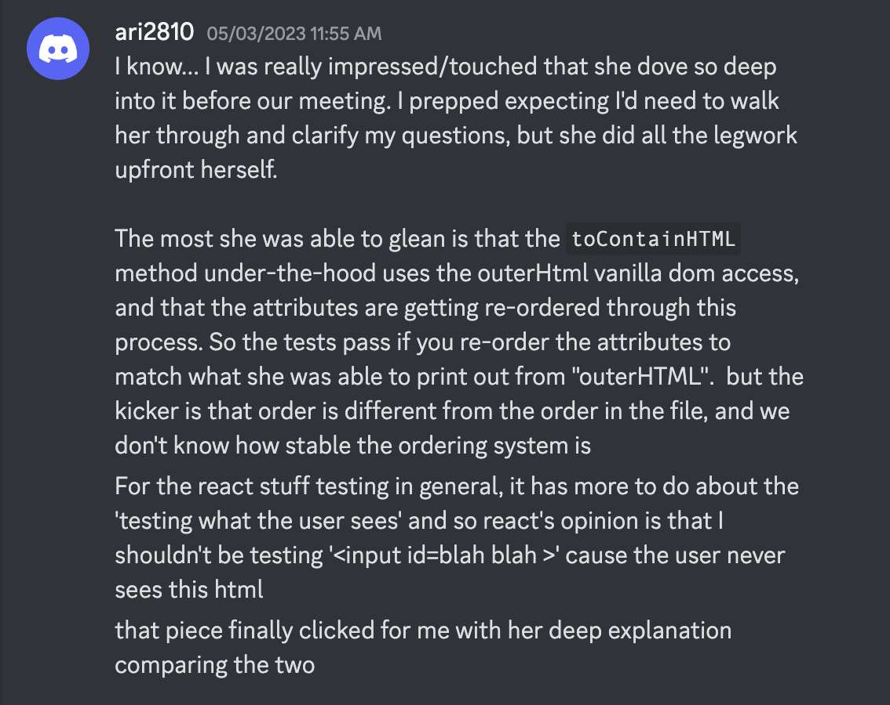

---
date: 2023-06-09
metadata: true
concepts: []
status: 'pre-lecture'
docs: 
cite: ['rithm']
---

- & Remember that react focuses on testing from a user interactive perspective - to an extreme
	- don’t test dom attributes directly (i.e. no classes, no ids, etc.)
	- test that the user can see target components
	- test that when they click on X, then now they can see Y, etc.

from Brit debugging react testing toContainHtml:
