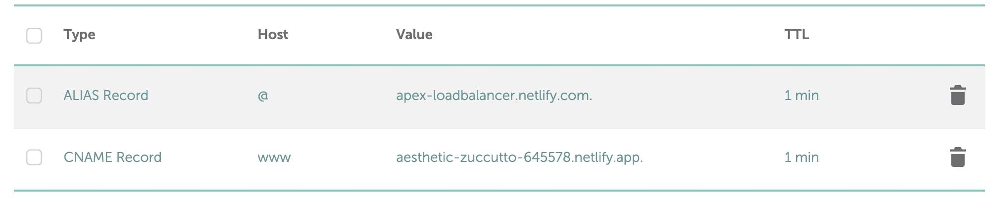

---
date: 2023-07-02
metadata: true
concepts: []
status: 'pre-lecture'
docs: 
cite: ['rithm']
---

## 7-2-23

- Attempted to deploy through github pages, then netlify, and DNS was not resolving. 
	- Due to CNAME file for github page hosting, github.io site was not visible to check that site was hosted/deployed
	- Switched to netlify, could confirm that netlify site was hosted and working. 
	- Researched namecheap (DNS provider) docs, found that hostname for ALIAS record should be `@` not `adenary.dev`
	- working solution:
