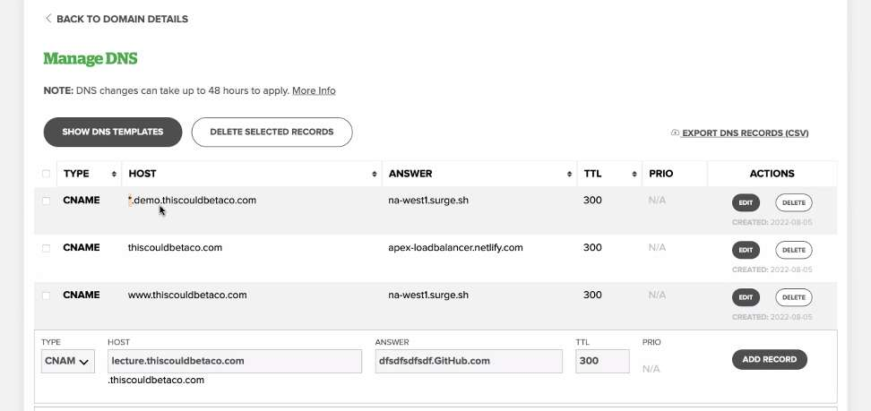
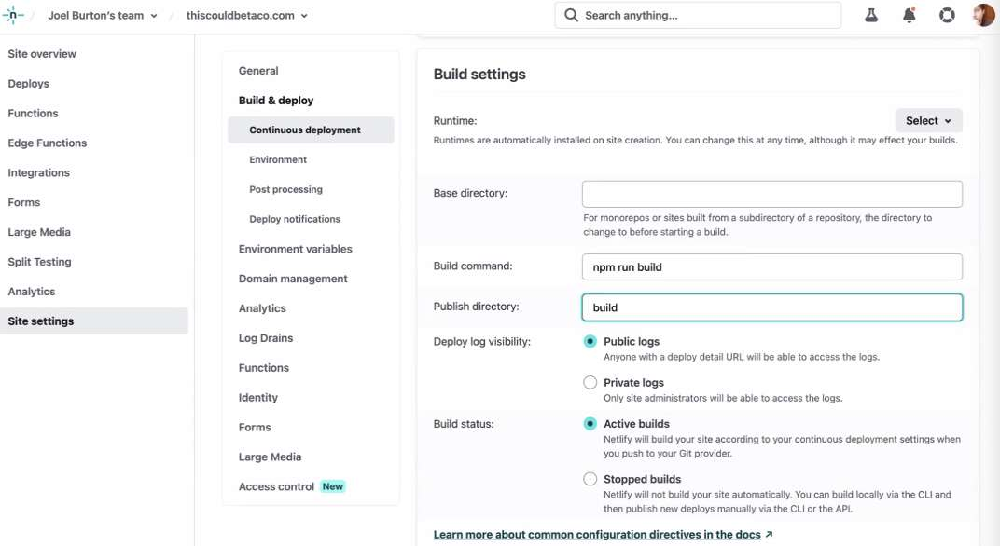
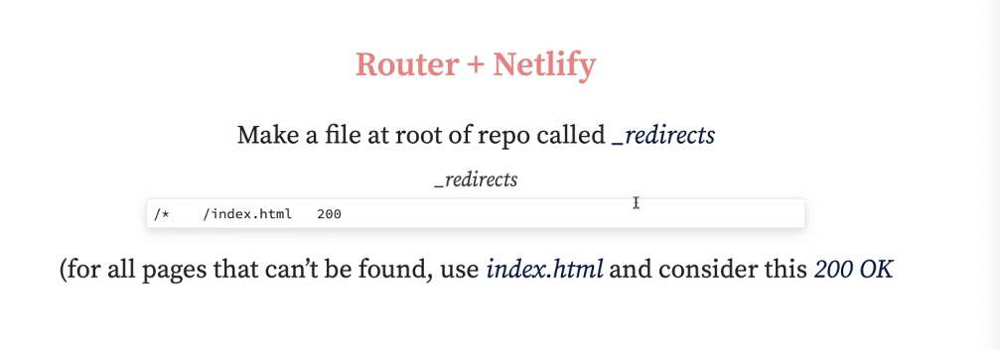

---
date: 2023-05-12
metadata: true
concepts: []
status: 'pre-lecture'
docs: 
cite: ['rithm']
---

## Intro

-   Getting your own domain name
-   Quick & easy deployment for demos via Surge
-   Awesome real-world deployment via Netlify
-   React & React Router
-   Heroku
-   Getting your own cloud server via AWS Lightsail

### Custom Domains

- You can buy your own domain name for a few dollars/year
- This is an **excellent idea** for personal branding!

### WHOIS

- Domain name sellers sell you an annual listing in the “WHOIS” records
- They also often provide (for free or add-ons):
	-   DNS service
	-   Email addresses at your domain (web-based email)
	-   Click-and-drag site builders _(yuck)_

### Finding a Vendor

- There are a bunch of domain name sellers — they all do the same things
- Feel free to pick the cheapest
- Don’t want to stress out? [name.com](https://name.com/) is perfectly fine
- They also offer free DNS service & a bit more

## Set up

- Nameservers: computers that tell where your site is at

- A record: A stands for address - IP address
- CNAME: cannoical name record
- Wherever you are hosting will give you one of these records

`*` wildcard in host 


- TTL:
	- time to live
	- how long is this information meant to be fresh
	- If you have a lot of traffic - then you’d want to choose a larger number
	- For your small stuff, choose a small number

`dig thiscouldbetaco.com`
`dig hostname`
- tells you where to point this server

- can forward email to your personal email

## Surge

- Awesome, free, easy, fast place to host static sites!
- Just once, ever: install surge command line program

macOS:
```shell
$ npm install -g surge
```

Linux/WSL:
```shell
$ sudo npm install -g surge
```

### Uploading Your Site

It’s super simple:
```shell
$ surge
```

Pick your own descriptive surge subdomain:
```shell
$ surge . your-name-here.surge.sh
```

### Using Your Own Domain Name

Using [http://your-domain.com](http://your-domain.com/) with Surge:
-   Add CNAME record at root (usually @) to na-west1.surge.sh
-   `surge . your-domain.com`

Good idea: use a “subdomain” of your domain for all demos:
-   Add CNAME record for \*.demo to na-west1.surge.sh
-   `surge . connect-four.demo.your-domain.com`

This is for HTTP; for a custom domain + HTTPS, you’ll need “Surge Plus” for $

- ~ Note: APEX CNAME records
	- Not all DNS providers let your have your top-of-domain (“apex”) record be a CNAME record, so these instructions may not work.
	- If it doesn’t, you have a few options:
		-   Add a CNAME record for www to na-west1-surge.sh; you can then publish & visit your site at _http://www.your-domain.com_
		-   Add a A record to the IP address for Surge (45.55.110.124).
	- You can read more at [https://surge.sh/help/adding-a-custom-domain](https://surge.sh/help/adding-a-custom-domain)

### Surge Is Really Awesome For

- Super easy deployments for demos, hackathons, & more!
- Just frontend: html, js, etc.

## Netlify

- Netlify is a bit more setup than Surge, but provides:
	-   Integration with Github (automatically re-publish when you push)
	-   Can provide HTTPS for your custom domains
	-   Lots of plugins for integrating “serverless” things like Lambda functions

- intended for large scale front end deployment
- primarily for front end, but has some small backend stuff (Lambda functions)

### Using Netlify

1.  Visit [Netlify](https://netlify.com/)
2.  Choose “New Site From Git”
3.  Connect & authorize connecton to your Github
4.  When you push to Git, is automatically rebuilt!

`npm run build` - takes all files: convert jsx and convert to js and put in one big js file, get things ready for deployment
netlify.com:


### Custom Domains

- You can edit your DNS, like with Surge, to CNAME to Netlify
	-   Add a CNAME for @ to yourapp.netlify.com
	-   Add a CNAME for www to yourapp.netlify.com
- They will automatically handle HTTPS for you, too!

### Why Netlify Is Awesome

- Powerful, flexible, lots of growth & options
- Remember, though: all pushes become live!
- You should do work on branches & merge onto main carefully!

- wouldn’t recommend for portfolio site cause most likely you’re going to tweak it 2 hrs before interview and then it will crash, etc.

- Personal projects:
	- Put an issue
	- work on a branch
	- Put in a pull request
	- etc.

## React & React Router

- With *create-react-app*, you normally serve things via Webpack dev server
- Surge & Netlify serve _static files_
- So _make static files_

### Surge

```shell
$ npm run build
$ cd build
$ surge ...
```

- run `npm run build` to create those static files

- ~ Tip: Getting Fancy With Package JSON
	- Remember that you can add new “npm commands” in your package.json file, so, instead of having to things like by hand, you can add a command like “deploy” to the “scripts” part of that file:
```json
"scripts": {
  // other stuff here
  "deploy":
    "npm run build && cp build/index.html build/200.html && surge build "
}
```
- Then, to deploy your site, you can just say `npm run deploy`

### Netlify

Edit “Build and Deploy Settings”:
-   **Build command**: “npm run build”
-   **Publish directory**: “build”
Then, Netlify will make the static version & use those files

### React Router

- Remember how React Router works:
	-   When clicking a `<Link>`, it doesn’t really request from server
	-   It just changes the URL bar
- So: everything works great as you navigate around your site
	- Until you hit refresh or visit an “internal page” directly
- With Webpack’s dev server, this worked fine — it returned index.html for _every request_
	- Always got react
- On static hosts, like Surge/Netlify, these will be 404s
	- cause there is no file called `/companies` etc. for surge to serve up

### Router + Surge

- & Make a copy of your `build/index.html` file to `build/200.html`
	- if you have file called 200.html
	- and surge can’t find the page, it will serve up this page with a 200 instead
	- & Do this *inside your build folder* for surge
		- must be exactly like this:  `200.html `
- Now, for URLs that don’t map to in-directory resources, this will be used

### Router + Netlify

- Make a file at root of repo called `\_redirects `(for all pages that can’t be found, use index.html and consider this 200 OK
	- must be exactly like this:  `\_redirects `
- Then: change the “Build and Deploy Settings”:
	- **Build Command**: `npm run build && cp _redirects build`
		- this command will then copy the `_redirects` into the build folder




- for react app: must start with `REACT_APP_`
	- setting this requirement needed at the terminal step (due to surge?)

## Heroku

- part of salesforce

### How is Heroku Different?

- It doesn’t just serve static HTML — it runs _your own servers_!
- So: Express and Flask apps will need a server provider
	- like Heroku or Render

### Can Heroku Do Both?

- Yes
	- but not great for front end:
		- goes to sleep after 5ish mins of no visits, so would take a while and nothing would show up if you used heroku or render for your front end
- But, it’s tricky to set up with custom domains & costs money for HTTPS
- It also has a 10 second “warmup” for your pages until you pay. Meh.
- Best of Both: use Surge/Netlify for frontend and Heroku for backend!

## Cloud Servers From AWS/LightSail

### Your Own Server

- You can get your own complete cloud server!
- This is complexity overkill for hosting a simple site.
- But: it’s useful if you want to play with servers / devops

- Always pay more to have someone else host your site 
- Most responsibility
- devops/ linux
	- a bit like macos, most likely for cloud base servers

### AWS EC2

- Amazon’s EC2 is the most common place for cloud servers — and they’re free for a year if you pick the (generous!) free plan
	- 10x bigger than all other players
	- Not scaled well for small users - quite complex to get it set up

### Lightsail
-charges $5 month for the easy access

- But: AWS’s interface is complex & full of so many options, it’s a struggle to start
- AWS offers a simplified, beginner-friendly service called Lightsail
- It gives you a normal, real EC2 server, but with common choices and easier set up
- Heads up: there’s a learning curve to setting up a server yourself!

## Personal Website / Portfolio Tips

### The Purpose of the Portfolio

- The purpose of your personal site / portfolio is mainly:
	- impress recruiters
	- build a professional-looking online presence for yourself
	- provide opportunity to practice writing about yourself / your story

### Your Site / Portfolio Will…

- Probably be glanced at very briefly by a recruiter or hiring manager
- Ideally supplement a weaker resume or lack of experience
- Help you establish an online presence as an engineer

### Your Site / Portfolio Should…

- Look nice 
- Be deployed 
- Feature your best 2 or 3 projects 
    - That’s as far as recruiter / hiring manager will get
- Not take up all of your time to perfect.
    - Just good enough  to get you considered

### Social Media / GitHub Tips

- It’s helpful to be on social media, but you don’t _need_ to
- But assume that everyone interviewing you has Googled you beforehand.
- If you _are_ active, make sure there’s nothing obviously offensive
- Highly recommended: LinkedIn, AngelList, GitHub, Twitter
	- AngelList: startups and ppl who want to work at startups
	- Twitter - wjoelburton
	- mastadon - alternative to twitter

### Your GitHub Profile

- Pin the repositories you’re most proud of
- Don’t worry about removing old repositories
- Don’t agonize over code contribution streak (GH green squares)
    - … but be mindful of it