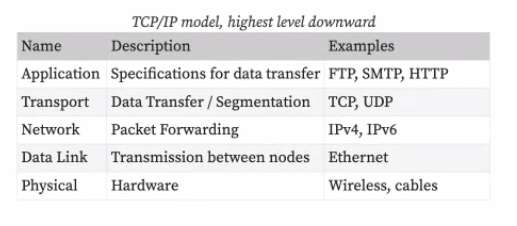
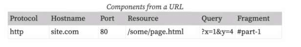
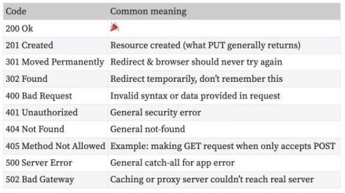

---
date: 2023-06-07
metadata: true
concepts: []
status: 'pre-lecture'
docs: 
cite: ['rithm']
---

## Whiteboarding review 

- split windows to show pseudocode separate from code
- use your editor to show your ln and columns for grid like questions
- if you are given time left:
	- hands off keyboard
	- stop typing - review what you’ve done
	- don’t rush through your code
	- walk through your pseudocode
	- if your solution is mostly working
		- walk through a test case
		- note any bugs
	- Focus: now is your chance to talk with your interviewer and explain your ideas

## Goals

## Terminology check

- Domain name
	- A name like _rithmschool.com_, which contain many servers.
	- You buy a domain name
- Host name
	- The name of a computer on a network
	- You serve from a host name
	- unique name of a computer on network
	- when you can type in the name of a computer on a network, that is the host name
	- sometimes this may be the same as a domain name
- IP address
	- The unique address of a machine on the internet
- Localhost
	- A name pointing to this computer; `127.0.0.1`

## TCP / IP model

A way to break down network communication into layers.

TCP/IP model, highest level downward

- Network: Ip address:
	- WHO are you trying to talk to
- Transport
	- HOW are you going to send the info
	- Two protocols: TCP, UDP

- TCP: Transportation Control
	- Entire message will always be delivered
	- Pieces of data all arrive
	- May not arrive in same order
	- If any are missing, those are requested again
	- reliable, but a lot of overhead
- UDP: 
	- pieces are missing and that’s okay

- ~ **An analogy for TCP/IP**
	- A commonly-used analogy for the TCP/IP model is the postal network. Here’s an article that goes into detail on that analogy: [Analogy between the postal network and TCP/IP](http://bpastudio.csudh.edu/fac/lpress/471/hout/netech/postofficelayers.htm).
	- Here’s a summary of the analogy at each level (the text comes directly from the article linked above):
		-   _Application Layer_: Someone writes a letter to a friend in New York, addresses it, and drops it in a mailbox. The friend opens the letter and reads it with a smile on his face. Neither of them think about how the letter got there. They are communicating directly with each other, unaware of the underlying delivery mechanism.
		-   _Transport Layer_: If you accidentally write the wrong address on a letter, a postal employee will stamp it “address unknown” and it will be returned to you. You will be unaware of the details of the error message delivery system, and it will be up to you to decide what to do next.
		-   _Internet Layer_: Airplanes move letters between cities. The pilot does not pay attention to who the letters are addressed to or from, what they say, or whether they contain photos and drawings or only written words.
		-   _Data Link Layer_: Trucks move letters within a city.
		-   _Physical Layer_: People use pens and paper to write letters, and the recipient reads them using reflected light and sometimes glasses.

### IP addresses

- On IP networks, like the internet, every _network interface_ gets an IP address.
```shell
$ ifconfig
lo0: flags=8049<UP,LOOPBACK,RUNNING,MULTICAST> mtu 16384
     inet 127.0.0.1 netmask 0xff000000                          # <- 127.0.0.1
en0: flags=8863<UP,BROADCAST,SMART,RUNNING> mtu 1500
     inet 10.0.1.13 netmask 0xffffff00 broadcast 10.0.1.255     # <- 10.0.1.13
```
-   127.0.0.1 is the _loopback address_, it always means “this computer”
-   10.0.1.13 is the wireless address
    -   This address is a [private address](https://en.wikipedia.org/wiki/Private_network)
    -   Real servers will have a non-private, Internet routable address

## Getting web pages

#interviewQuestions 
- What happens when you type this into a browser bar?
_http://site.com/some/page.html?x=1&y=4#part-1_

- First, break the URL into pieces:
Components from a url

- Fragments never sent to server - only ever used by the browser

1.  _foo.com_ (hostname) is resolved into an IP address via DNS
2.  Browser makes HTTP request to that address on port 80 (443 for HTTPS)
	1. port 80 for *http* request by default (when you don’t see it, its port 80 for http)
	2. port 443 for *https* by default
3.  Browser sends message with HTTP method (GET) along with headers
4.  Server responds with response code (200, 404, etc), headers, & body
5.  Browser parses response
6.  If further things are needed (eg, CSS, JS, images), repeats from step 2 or 3
	1. Browser makes additional requests for each of these resources

Analogy: want to call brit
1. Ask elie for Brit’s number
2. type in phone number and dial
3. Then ask Brit “what’s your favorite flavor of ice cream”
4. Brit responds “mint chocolate chip” or "404 I don’t know"
5. Joel parses that response
6. by classic model, Joel calls back to ask for picture of that, styling of that green/white, etc.

### A typical request/response


- when browser reaches out to server
	- browser is going to look back and see, was I asked to send any info? 
	- if so, then always sends cookies
- different than tokens:
	- specific to authorization

## DNS

_Domain name system_ translates _hostname_ (eg, _rithmschool.com_) to IP address

```shell
$ host -v -t A rithmschool.com
# ...
rithmschool.com.      300     IN      A       104.27.191.189
# ...
```

`300` is TTL (_time-to-live_): your computer will keep giving this cached info for 300 secs.
Might be cached in:
- browser
- server
- internet service provider

domain name: what you pay to have control over, but you may not have it connected
if you take that domain and set up a server by typing in flufflyisawesome.com
host name: is a computer on the internet that you can hae. a convo
host name is a nickname for that computer

```shell
$ host joelburton.com
```

the things that you look up in DNS is hostnames

## HTTP headers

- Headers send metadata about request/response along with that request or response.
- A great way to examine headers is Dev Tools ‣ Network ‣ {Resource} ‣ Headers.

### Common request headers

-   Accept: type of data accepted _(eg, html, json, xml)_
-   Cache-control: specify caching behavior
-   Cookie: cookies browser has from earlier response
-   User-Agent - application (typically browser) making request
-   …and [other request headers](https://en.wikipedia.org/wiki/List_of_HTTP_header_fields#Request_fields)!

### Common response headers

-   Access-Control-Allow-Origin: specify CORS settings
-   Content-type: content type of response _(eg, html, css, etc)_
-   Location: used by redirects to specify new location
-   Set-Cookie - key/value pairs for browser to store
-   …and [other response headers](https://en.wikipedia.org/wiki/List_of_HTTP_header_fields#Response_fields)!

### Request & response example

Request
```
GET / HTTP/1.1                     # GET request for /
Host: site.com                     # Header in request
Cookie: favorite_color=blue
```

Response
```
HTTP/1.1 200 OK                        # HTTP Ver & Response Code
Date: Mon, 20 Apr 2018 07:09:16 GMT    # Date Header
Server: Apache                         # Server version
Content-Type: text/html                # This is HTML content

<!doctype html>                        # Body of response
<html>
  <body>...</body>
</html>
```

## Status codes

- meta data about the request/response
- not a header, just a status code


- There are [more](https://en.wikipedia.org/wiki/List_of_HTTP_status_codes), but these are the common ones.

## Cookies and sessions


- Remember, the web is _stateless_.
- Cookies and sessions allow applications to preserve info between requests.

### Cookie Facts

-   Server tells client to store data using the Set-Cookie header.
    -   Syntax: `Set-Cookie: key1=val1;key2=val2;`
-   Browser sends cookies on all future requests to same server  
    (inside of the Cookie header).
-   Server can set an expiration date for cookie.
    -   You can manually delete cookies from your browser.

- ~ Note: **Why are cookies called cookies**
	- Students are often quite curious about the origin of the term _cookie_ to describe these small pieces of text that are exchanged between clients and servers. There are conflicting accounts of where the name comes from. Here are a couple of theories, courtesy of [Why Are Cookies Called Cookies?](https://www.bonkersabouttech.com/internet/why-are-cookies-called-cookies/508) article:

> There are many explanations as to where browser cookies got its name. Some believe that the word cookie got its name from “magic cookies” which is a packet of data a program receives and sends back unchanged, used by Unix programmers. Others believe that Xerox made a computer system that saved some of the data about the user, who was logged in on the client side and that the data was saved in a small file called a “cookie”. It was so-called named as such after a character from the popular (at that time) Andy Williams Show. This “Cookie Bear” character would follow Andy around asking for a cookie. And so in honour of Cookie Bear, the Xerox programmers decided to call the little file a cookie.

### Cookie limitations

-   You can only store text
    -   Everything else will be turned into text
-   You can only store a certain amount of it
-   You may not want to let the client know all of the server’s business

### Sessions

-   Sessions are an _abstraction_ over persistent data in HTTP
    -   They are not a part of HTTP specification, as cookies are
-   Common: frameworks will use cookies for session data
    -   Can store rich data (not just text) and longer sizes
    -   Session id typically _signed_ so server can detect if it was tampered with

## Web security

### Same origin policy

- The same origin policy specifies how a document from one origin can and cannot request information from a different origin.

-   A resource’s origin is the combination of _protocol_, _port_, and _host_.
-   A document from _rithmschool.com_ can’t make requests to _twitter.com_
-   The same origin policy provides an important security layer.
-   It’s also why you can’t use some APIs with AJAX.
-   Some media is exempt from same origin policy  
    (eg, images, CSS, JS files in script tags).

### CORS

-   Stands for _cross-origin resource sharing_.
-   Grants servers capability to respond to requests from different origins.
-   Implement via response headers
    -   (Access-Control-Allow-Origin, Access-Control-Allow-Methods, and more).
-   Requests can be _preflighted_; an OPTIONS request is sent  
    to determine if original request will be accepted by server.
-   Who should learn about CORS? [Everyone, really](https://developer.mozilla.org/en-US/docs/Web/HTTP/CORS#Who_should_read_this_article).

### CSRF

-   **Cross-Site Request Forgery** is the ability for malicious websites to make requests to legitimate websites on your behalf and without your knowledge
-   Typically used for state-changing actions (transferring money, posting a malicious status update, etc.)
-   How do CSRF tokens prevent these types of attacks?


## Further Study

- [How the Internet Works: A Code.org Video Series](https://www.youtube.com/playlist?list=PLzdnOPI1iJNfMRZm5DDxco3UdsFegvuB7)
- [How Does the Internet Work?](https://web.stanford.edu/class/msande91si/www-spr04/readings/week1/InternetWhitepaper.htm)
- [A cute webcomic about how DNS works](https://howdns.works/)

