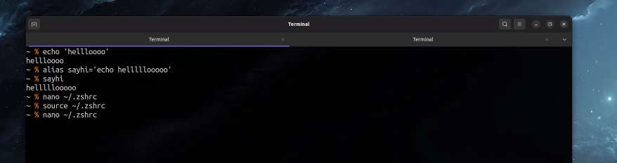
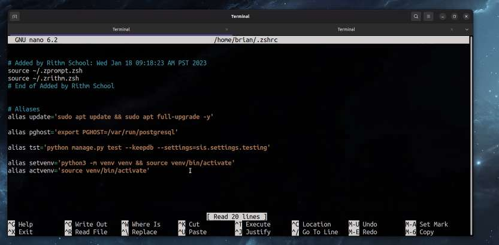

---
date: 2023-05-12
metadata: true
concepts: []
status: 'pre-lecture'
docs: 
cite: ['rithm']
---

## Styling Markdown and Inserting into HTML - Evan

- Can’t just insert html into jinja template
	- need to use `{{ html | safe }}`

- pygments
	- has some built in themes
	- can change 

## Aliasing - Brian

## Langchain - Sean

- creates composable approach

## Numbers API - madelyn

- xpath
- webscrapers/webcrawlers

## Django - Violet

## Pair Programming - Claudia

## Magic trick - Huse