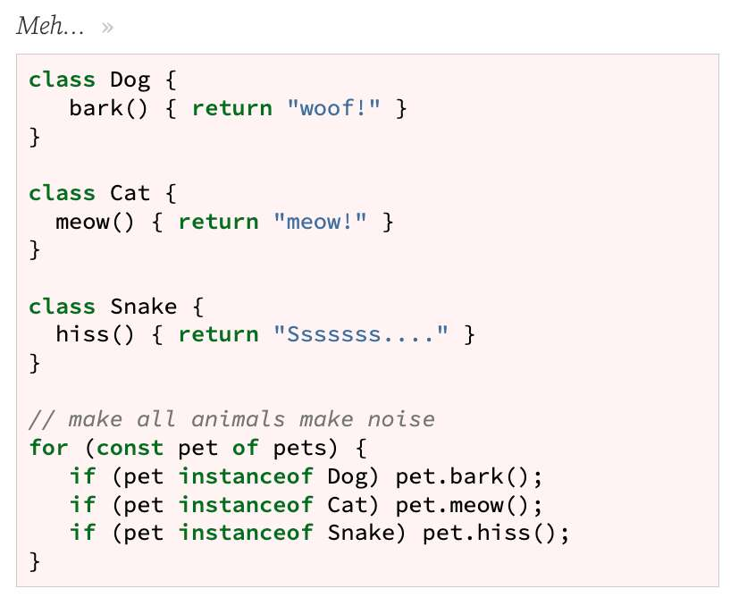
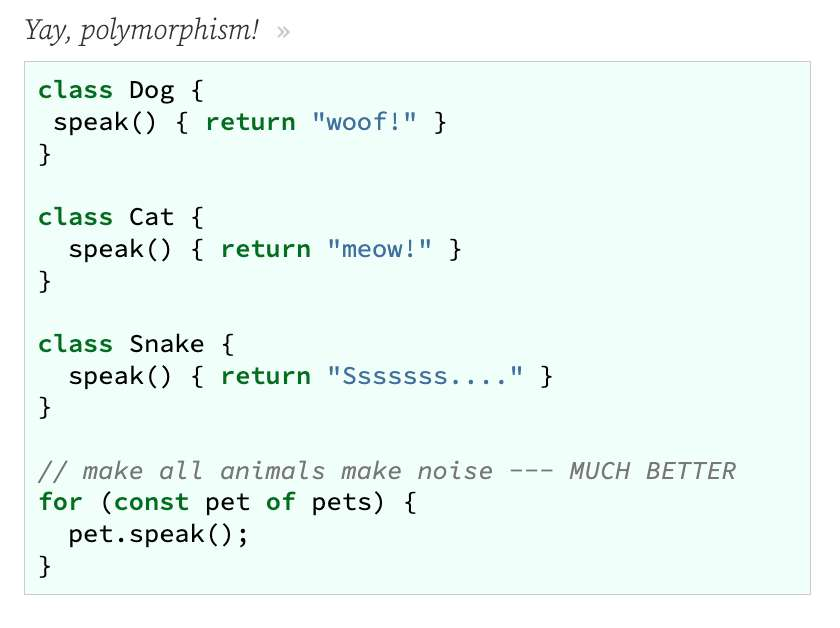
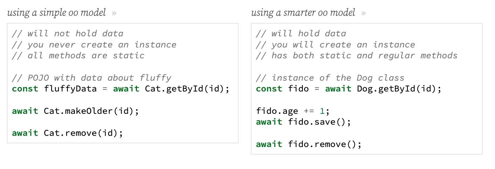

---
date: 2023-04-06
metadata: true
concepts: ['express', 'oop', 'orm']
status: 'pre-lecture'
docs: 
	sequalize: 'http://docs.sequelizejs.com/'
cite: ['rithm']
---

## Goals

-   Refactor our Express apps to separate view logic _(routing)_ from model logic _(data)_
-   Compare different OO designs for interfacing with our database
-   Borrow useful ideas from ORMs to build our own model layers

## Current Design

routes
```js nums {4}
/** get all cats: [{id, name, age}, ...] */

router.get("/meh", async function (req, res, next) {
  const result = await db.query(`SELECT id, name, age FROM cats`);
  const cats = result.rows;
  return res.json(cats);
});
```

- It’s _ok_, but it’s better to get SQL out of routes

### Why No SQL In Routes?

-   You tend to have lots of routes
    -   So lots of copy-and-paste of similar SQL
-   It’s nice to centralize validation, schema, etc.
-   Separation of concerns: routes should be about web-stuff

## Object Orientation Review

- Why do we use Object Orientation?
- To help organize our code!
- Often makes it easier to manage complex software requirements

### Abstraction

- OO can offer **abstraction**  
	- *(to hide implementation details when not needed)*
-   Not everyone should have to understand everything
    -   Only one person has to worry about SQL, validation, etc

### Encapsulation

- OO can offer **encapsulation**  
	- *(to group functionality into logical pieces)*
-   To get in a “capsule”
    -   Everything related to cat data/functionality lives in Cat

### Inheritance

- OO can offer **inheritance**  
	- *(ability to call methods/get properties defined on ancestors)*
-   One class subclasses another, inheriting properties and methods
    -   A ColoredTriangle is a kind of Triangle; it should have sides a and b,  
        and can use Triangle methods for getting the area and hypotenuse
    -   These are _inherited_; we only need to define what is different about ColoredTriangle

### Polymorphism

- OO can offer **polymorphism**  
	- _(making classes interchangeable when similar)_
-   The ability to make similar things work similarly
    -   We could have other kinds of animals with same API
        -   e.g. dogs and cats could both have a speak() method, even though it works differently _(“Meow” vs “Woof”)_





## Simple OO Model

-   We can make a single class for “all cat-related functions”
-   It _won’t_ hold data
-   You won’t ever instantiate it!
-   All the methods are static (called on Cat)
- & Benefit: help organization, gets SQL out of routes

### Getting All Cats

Cat model
```js
  /** get all cats: returns [{id, name, age}, ...] */

  static async getAll() {
    const result = await db.query(
        `SELECT id, name, age 
           FROM cats
           ORDER BY id`);
    return result.rows;
  }
```
(that’s a method inside class Cat)

routes
```js
/** (fixed) get all cats: [{id, name, age}] */

router.get("/", async function (req, res, next) {
  const cats = await Cat.getAll();
  return res.json(cats);
});
```

### Getting A Cat

Cat model
```js
  /** get cat by id: returns {id, name, age} */

  static async getById(id) {
    const result = await db.query(
        `SELECT id, name, age
           FROM cats
           WHERE id = $1`, [id]);
    const cat = result.rows[0];

    if (!cat) throw new NotFoundError(`No such cat: ${id}`);
    return result.rows[0];
  }
```

routes
```js
/** get cat by id: {id, name, age} */

router.get("/:id", async function (req, res, next) {
  const cat = await Cat.getById(req.params.id);
  return res.json(cat);
});

```

### Creating a Cat

Cat model
```js
  /** create a cat: returns {id, name, age} */

  static async create(name, age) {
    const result = await db.query(
        `INSERT INTO cats (name, age)
           VALUES
             ($1, $2)
           RETURNING id, name, age`, [name, age]);
    const cat = result.rows[0];

    return cat;
  }
```

routes
```js
/** create cat from {name, age}: return {name, age} */

router.post("/", async function (req, res, next) {
  if (req.body === undefined) throw new BadRequestError();
  const cat = await Cat.create(req.body.name, req.body.age);
  return res.json(cat);
});
```

### Deleting a Cat

Cat model
```js
  /** delete cat with given id */

  static async remove(id) {
    const result = await db.query(
        `DELETE
           FROM cats
           WHERE id = $1
           RETURNING id`, [id]);
    const cat = result.rows[0];

    if (!cat) throw new NotFoundError(`No such cat: ${id}`);
  }
```

routes
```js
/** delete cat from {id}; returns "deleted" */

router.delete("/:id", async function (req, res, next) {
  await Cat.remove(req.params.id);
  return res.json("deleted");
});
```

### Aging a Cat

- What if we want to something special?
- Like, age a cat by one year?
- @ #rithmQ  How does aging a cat work if there are no instances of the cat?
	- Instances are *in the database* instead of in js

Cat model
```js
  /** age cat by 1 year, return new age */

  static async makeOlder(id) {
    const result = await db.query(
        `UPDATE cats
         SET age=age + 1
           WHERE id = $1
           RETURNING age`, [id]);
    const cat = result.rows[0];

    if (!cat) throw new NotFoundError(`No such cat: ${id}`);
    return cat.age;
  }
}
```

routes
```js
/** age cat: returns new age */

router.post("/:id/age", async function (req, res, next) {
  const newAge = await Cat.makeOlder(req.params.id);
  return res.json(newAge);
});
```

- ! Meh. Annoying to have to make special function.
- $ Instead, can make special “update-data” function.

## Smarter OO Model

-   We can make a more traditional OO class
- &  You _will_ instantiate it — once per dog!
-   It will hold data specific to each dog
-   It has static methods
    -   To get all dogs, get a particular dog
-   It has regular methods
-   It’s like a mini-ORM

### Simple vs. Smarter

- ! Simple Model
	- Will not hold data
	- Never create an instance
	- All methods are static
using a simple oo model
```js
// POJO with data about fluffy
const fluffyData = await Cat.getById(id);

await Cat.remove(id);

await Cat.makeOlder(id);
```
- $ Smater Model
	- Will hold data
	- Will create instances
	- Has both static and regular methods
using a smarter oo model
```js
// instance of the Dog class
const fido = await Dog.getById(id);

fido.age += 1;
await fido.save();

await fido.remove();
```

### Dogs

- We’ll make a “smarter model” for dogs.

Dog model
```js
  constructor({ id, name, age }) {
    this.id = id;
    this.name = name;
    this.age = age;
  }
```

### Getting All Dogs

Dog model
```js nums {7}
/** get all dogs: returns [dog, ...] */

  static async getAll() {
    const result = await db.query(
        `SELECT id, name, age
           FROM dogs`);
    return result.rows.map(dog => new Dog(dog));
  }
```

routes
```js
/** get all dogs: [{id, name, age}, ...] */

router.get("/", async function (req, res, next) {
  const dogs = await Dog.getAll();
  return res.json(dogs);
});
```

- & We get Dog instances, but Express can turn them into JSON

### Getting A Dog

Dog model
```js nums {12}
  /** get dog by id: returns dog */

  static async getById(id) {
    const result = await db.query(
        `SELECT id, name, age
           FROM dogs
           WHERE id = $1`, [id]);
    const dog = result.rows[0];

    if (!dog) throw new NotFoundError(`No such dog: ${id}`);

    return new Dog(dog);  
  }
```

routes
```js
/** get dog by id: {id, name, age} */

router.get("/:id", async function (req, res, next) {
  const dog = await Dog.getById(req.params.id);
  return res.json(dog);
});
```

### Creating a Dog

Dog model
```js nums {11}
  /** create a dog: returns dog */

  static async create(name, age) {
    const result = await db.query(
        `INSERT INTO dogs (name, age)
           VALUES
             ($1, $2)
           RETURNING id, name, age`, [name, age]);
    const dog = result.rows[0];

    return new Dog(dog); 
  }
```

routes
```js
/** create dog from {name, age}: return id */

router.post("/", async function (req, res, next) {
  if (req.body === undefined) throw new BadRequestError();
  const dog = await Dog.create(req.body.name, req.body.age);
  return res.json(dog);
});
```

### Deleting a Dog

Dog model
```js
  /** delete dog */

  async remove() {
    await db.query(`DELETE FROM dogs WHERE id = $1`, [this.id]);
  }
```

routes
```js nums {5-6}
/** delete dog from {id}; returns "deleted" */

router.delete("/:id", async function (req, res, next) {
  const dog = await Dog.getById(req.params.id);
  await dog.remove();  
  return res.json("deleted");
});
```
- & Notice: it’s just a method that acts on current dog!

### Aging a Dog

- Now, we don’t need special functionality to age a dog
- We can just update age on instance and *.save()* it!

Dog model
```js
  async save() {
    await db.query(
        `UPDATE dogs
         SET name=$1,
             age=$2
           WHERE id = $3`, [this.name, this.age, this.id]);
  }
```

routes
```js nums {5-6}
/** age dog: returns new age */

router.post("/:id/age", async function (req, res, next) {
  let dog = await Dog.getById(req.params.id);
  dog.age += 1; 
  await dog.save(); 
  return res.json(dog.age);
});
```

### Simple vs. Smarter



## Which Is Better?

-   “Simple class” _(no data, only static methods)_
    -   Can be easier to write class
    -   Fewer SQL queries may fire (compare delete between Cat and Dog)
    -   Doing more interesting things can be trickier
-   “Smarter class” _(data, real methods)_
    -   Real attributes can be handy!
    -   Can do things like `fluffy.speak()` rather than `Cat.speak(id)`

### Are There ORMs For JavaScript?

- Yes!
- There’s a nice one called [Sequelize](http://docs.sequelizejs.com)
- Not as popular as ORMs in other languages, though.