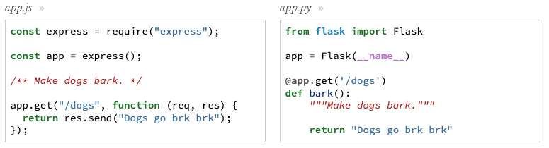
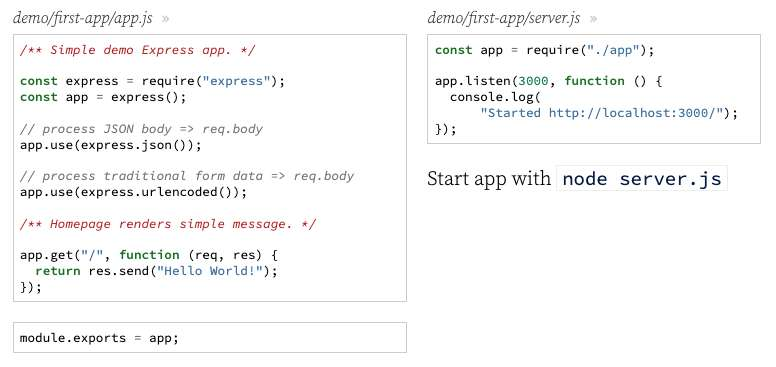

---
date: 2023-04-05
metadata: true
concepts: ['express']
status: 'pre-lecture'
docs: 
cite: ['rithm']
---

## Goals

-   Learn what Express.js is
-   Compare Express in Node to Flask in Python
-   Respond to HTTP requests with route handlers
-   Extract request data from the URL or the body
-   Handle errors in Express
-   Debug Express applications

## Express.js

### What is Express.js?

-   Minimalist web framework
-   Conceptually very similar to Flask
-   Most popular in the Node ecosystem

### What Can We Build?

- Express can be used to build traditional applications that return html or be used to build APIs
- We built so many html returning applications in Flask, so we’re going to be mostly building APIs in Express for practice.

### A Server In A Few Lines

1. import express
2. create an app
3. listen for requests

```js
const express = require("express");   

const app = express();

app.listen(3000, function () {
  console.log("App started at http://localhost:3000/");
});
```

-   App doesn’t do anything except respond 404s, but server is running!
-   *app.listen* takes a port and a callback.
    -   Binds the server to port & listens for requests there.
    -   Calls callback once server has started up.

## How Does Express Work?

### Apps

- Express apps are like Flask apps:
	- Both import
	- Both create app
	- Both specify type of request and have view fx
	- Both respond with text (or HTML) to requests at */dogs*


### Route Handler Callbacks

```js
app.get("/dogs", function (req, res) {
  return res.send("Dogs go brk brk");
});
```

-   `app.get('/dogs')` listens for a GET request to */dogs* endpoint
-   Every route has a callback:
    -   *req:* request object about *incoming request* (query string, url params, form data)
    -   *res:* response object about *outgoing response*(methods for returning html, text, json)
    -   It is conventional to name these parameters *req* and *res*
    -   Express builds *req/res* for every request and passes to callback
-   `res.send("...")` issues response of text or HTML

### The Request-Response Cycle

- When you start the server, Express runs through the (`app.js`) file and registers all the event listeners *in order* before the server starts.
- When a request is made, Express invokes *first matching route handler* until a response is issued via a method on `res` object.
	- This is different from flask in that flask would match the *most specific* route if there were multiple matches.
	- & With Express, the *order of the routes matters*
- This is called the _request-response cycle_ for Express.
	- When a response is issued, this *concludes the request-response cycle*.

```js
app.get("/staff/:fname", function (req, res) {
  return res.json({"staff": fname});
});

// this will never get matched b/c all fnames would be caught in above
app.get("/staff/kate", function (req, res) {
  return res.json({"staff": fname});
});
```
- First route handler gets matched because it was registered first.
- Second handler *never* matched because a response is issued in the previous handler, thus concluding the request cycle.

### Route Methods

- Routing by path and HTTP method:
	-   `app.get(path, callback)`
	-   `app.post(path, callback)`
	-   `app.put(path, callback)`
	-   `app.patch(path, callback)`
	-   `app.delete(path, callback)`
	-   `app.all(path, callback)` (all methods)

## First Express app

```shell nums {4}
$ mkdir first-express-app
$ cd first-express-app
$ npm init -y
$ npm install express@next
```

- & Important: Make sure you install `express@next`
	- We’re using the very latest version of Express, which is not yet out of beta. It’s has some important and helpful differences from the most recent non-beta version (version 4). By asking for “express@next”, you’ll get the latest version, even if its still in beta.

- An Express app should contain at least two files:
	- & `app.js` file, always exported
	- & `server.js` file, imports `app` & has the code to listen on port/start up server
	  
	  
- & Start app in shell 
```shell
$ node server.js      # node - need to restart server with every change
# or
$ nodemon server.js   # nodemon to have server live reload on changes
```


### URL Parameters

- Specify parameters in the route by prefixing them with a colon `:`.

demo/first-app/app.js
```js
/** Show info on instructor. */

app.get("/staff/:fname", function (req, res) {
  return res.send(`This instructor is ${req.params.fname}`);
});
```

- All of our parameters become keys in an object found at `req.params`
- & The values are _always_ strings
	- No possibility for ints/numbers like there is in flask.

### Other Useful Request Properties

-   Query string (_GET_ requests): `request.query`
-   HTTP headers: `request.headers`
-   What about the body of the request? *POST*, *PUT*, etc

### Parsing the Body

- We have to tell Express to parse request bodies for form data and JSON:
	- Copy/paste *both* these lines as boilerplate for that file, so regardless of what comes in (JSON or HTML), it’ll be found on `req.body`.

demo/first-app/app.js
```js
// process JSON body => req.body
app.use(express.json());

// process traditional form data => req.body
app.use(express.urlencoded());
```

- ~ Tip: body-parser
	- A recent update to Express added the method `express.json()`. Previously you had to utilize an add-on library called [body-parser](https://expressjs.com/en/resources/middleware/body-parser.html) to do this. So if you see body-parser in existing Express code, it does the same thing.

- Access form or JSON data with `req.body`:
demo/first-app/app.js
```js
/** Add a new instructor. */

app.post("/api/staff", function (req, res) {
  // ... Do some database operation here...
  // ... then return something as JSON ...
  if (req.body === undefined) throw new BadRequestError();
  return res.json({
    fname: req.body.fname,
  });
});
```

- ! Attention: req.body, Error Handling, and Optional Chaining
	- `req.body` defaults to undefined as of the most recent update to Express. Due to this, it is a good idea to check that `req.body` exists and throw a BadRequestError if not, as seen above.
	- There are some cases where you may prefer to assign a variable to undefined if there is no request body, rather than throwing an error. This is a great time to use optional chaining: `fname = req.body?.fname`
	- Optional chaining will check if `req.body `exists before trying to access `.fname `on it. If it does not exist, it will simply evaluate to undefined rather than throwing an error for trying to access a property on undefined.

### Returning JSON

- It’s straightforward:

demo/first-app/app.js
```js
/** Show JSON on instructor */

app.get("/api/staff/:fname", function (req, res) {
  return res.json({ fname: req.params.fname });
});
```

### Status Codes

- To issue status codes with the responses, call the `res.status(code)` method *first*, and then chain `.json()` to finish the response.
	- & Order matters - need to call `res.status(code)` *first*
	- Only need to specify if it’ll be different than the default

demo/first-app/app.js
```js
/** Sample of returning status code */

app.get("/whoops", function (req, res) {
  return res
    .status(404)
    .json({ oops: "Nothing here!" });
```

## Error Handling in Express

### Validation and Errors

- ! This will work to start, but  we can do better:
demo/first-app/app.js
```js nums {8-10}
/** Sample of validating / error handling */

app.get("/users/:id", function (req, res) {
  const user = USERS.find(u =>
      u.id === req.params.id
  );

  if (!user) {
    return res.status(404).json({ err: "No such user"});
  }

  return res.json({ user });
});

```

### Throwing errors

- An easy way is to throw a general error:
demo/first-app/app.js
```js nums {8-10}
/** Throwing Error */

app.get("/users2/:id", function (req, res) {
  const user = USERS.find(u =>
      u.id === req.params.id
  );

  if (!user) {
    throw new Error("No such user");
  }

  return res.json({ user });
});
```

Result for /users2/missing
```json nums {4}
{
  "error": {
    "message": "No such user",
      "status": 500        // BUT, we want this to be 404
  }
}
```
- We’d like that to be a 404, not 500 (Internal server error)

### Using HTTP-specific errors

- $ Best is to throw a specific error:
demo/first-app/app.js
```js nums {8-10}
/** Throwing NotFoundError */

app.get("/users3/:id", function (req, res) {
  const user = USERS.find(u =>
      u.id === req.params.id
  );

  if (!user) {
    throw new NotFoundError("No such user");
  }

  return res.json({ user });
});

```

- & This way changes the JSON *and* the actual status code that’s sent with the response. (can view in insomnia or dev tools network tab)
Result for /users2/missing 
```json
{
  "error": {
    "message": "No such user",
      "status": 404
  }
}
```

- & Need to import/require these specific errors:
	- Copy `expressError.js` to project and import NotFoundError from it:
```js
const { NotFoundError } = require("./expressError");
```

- Error classes available:
	-   `NotFoundError (404)`
	-   `UnauthorizedError (401)`
	-   `BadRequestError (400)`
	-   `ForbiddenError (403)`
	-   `ExpressError:` create with a message and a status code; used for any other status code to return.

- & Note: Rithm created these HTTP-specific error classes
	- These are classes that Rithm wrote and we use throughout our examples and sites. Since Express doesn’t include HTTP-specific errors, most users end up creating classes like these for convenience.
	- It may be interesting to look at the code for these; these all inherit from the base ExpressError class, which is a nice OO pattern.

### Handling general 404s

- & To return a 404 when no route matches, put this *below* all other routes:
```js
/** 404 handler: matches unmatched routes. */
app.use(function (req, res) {
  throw new NotFoundError();
});
```
- Then, since no other route matched, this will match and throw a 404.
- Flask did this for us, but with Express, need to *explicitly* create route for 404.

### Providing errors as useful JSON

- Normally, Express returns a plain HTML error page for errors.
- To return JSON (with useful info for developers), add a “global error handler”.
- & Put this *below all routes*, including below the 404 route:
	-  Just copy/paste this or keep in your boilerplate. 

demo/first-app/app.js
```js
/** Error handler: logs stacktrace and returns JSON error message. */
app.use(function (err, req, res, next) {
  const status = err.status || 500;
  const message = err.message;
  if (process.env.NODE_ENV !== "test") console.error(status, err.stack);
  return res.status(status).json({ error: { message, status } });
});
```

- & Important: Make sure that takes four parameters!
	- An interesting quirk of Express is that it only treats an function like this as the global error handler if it takes exactly four parameters: (err, req, res, next). So, a global error handler must have that as the exact signature.
	- Later, we’ll cover what the *next* parameter is used for.

## Debug express

- Small things - `console.log()`
- Bigger apps - [chrome-dev-tools](../../chrome-dev-tools.md)

