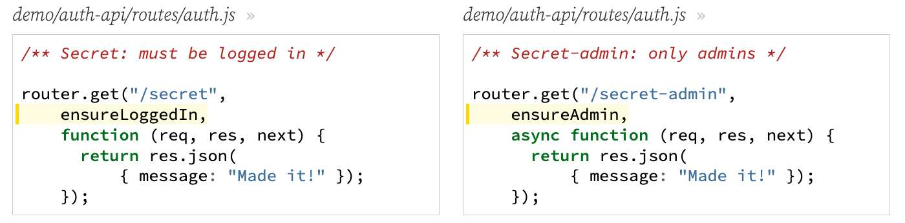

---
date: 2023-04-10
metadata: true
concepts: ['express', 'middleware', 'authorization']
status: 'pre-lecture'
docs: 
cite: ['rithm']
---

## Goals

-   Use middleware to simplify route security
-   Test routes that require authentication and authorization
-   Set up a configuration file for environment variables

## Protected Routes

- Protected Routes = routes that not everyone can access
- After client receives token, they should send with every future request that needs authentication.
- For our demo, we’ll look in `req.query` or `req.body` for a token called `_token`

Front End JS
```js
// get token from login route
let resp = await axios.post(
    "/login", {username: "jane", password: "secret"});
let token = resp.data;

// use that taken for future requests
await axios.get("/secret", {params: {_token: token}});
await axios.post("/other", {_token: token});
```

- & Means that you need to save the token that gets returned from login

### Verifying a token

demo/auth-api/routes/auth.js
```js nums {5, 9}
/** Secret-1 route than only users can access */

router.get("/secret-1", function (req, res, next) {
  // try to get the token out of the query string
  const tokenFromQueryString = req.query?._token;

  // verify this was a token signed with OUR secret key
  // (jwt.verify raises error if not)
  jwt.verify(tokenFromQueryString, SECRET_KEY);

  return res.json({ message: "Made it!" });
});
```

- That works, but can we refactor this?
	-   We don’t want to repeat this one every route
	-   How can we intercept the request and verify the token?
	-   **Middleware!**

## Middleware

### Authentication vs Authorization

- It’s best to _separate these security concerns:_
	-   **Authentication**: are you who you claim to be?
	-   **Authorization**: are you allowed to do this thing?

- ~ Note: You don’t always do something in both parts
	- There are cases where you don’t need any specific authorization: I might let anyone into my party, but if you show me a passport at my door, I’ll make sure it’s really yours. If you don’t show me a passport (or perhaps if its obviously a forgery), I _might_ still let you in — but I won’t trust that I know who you are. That’s _authentication_: *have you proven who you really are?*
	- Obviously, though, I might only let into a party if they were on the guest list. That *“are you on the guest list?”* is _authorization_ \[are you allowed do to this\]. However, in this case, I’d also need to authenticate you — otherwise, you could say say you’re my friend Jane, and if I don’t verify that, my security is terrible.
	- There are cases, though, where there might be authorization without authentication. Perhaps no one is allowed to come to my otherwise-open party after midnight. If I just want to turn away everyone, I might not even care to look at your passport. I don’t need to know who you are; no one is allowed to do this. That would be authorization without authentication.
	- Keeping these ideas separate in code is very helpful, as it lets you reason about the realities of security clearly and with well-understood terminology.

### Authentication Middleware

- & Authentication Middleware typically applied *globally*. 
	- Everyone’s ID is checked at the door

demo/auth-api/middleware/auth.js
```js
/** Auth JWT token, add auth'd user (if any) to res. */

function authenticateJWT(req, res, next) {
  try {
    const tokenFromRequest = req.query?._token || req.body?._token;
    const payload = jwt.verify(tokenFromRequest, SECRET_KEY);
    res.locals.user = payload;
    return next();
  } catch (err) {
    // error in this middleware isn't error -- continue on
    return next();
  }
}
```
(Stores user data on res.locals for later requests)

- `res.locals`
	- `res` has a key called `locals` in express
		- Analogous to Flask’s g
	- Data on `res.locals` is available for the life of that request


- ~ Tip: What HTTP status code should you return?
	- There are bunch of status codes APIs might return, but two important ones here are 401 UNAUTHORIZED and 403 FORBIDDEN.
	-   **401**: you have not presented valid credentials that would help the site establish that you should be able to do these things (perhaps you didn’t supply a valid password, or perhaps you didn’t even attempt to log in.)
	-   **403**: it’s not your fault or related to your password or other credentials. Instead, this is disallowed for everyone.
	- Using our earlier examples: if you aren’t on the guest list for my party, I should return a *401 UNAUTHORIZED* to you. If you try to arrive after midnight (which is globally disallowed), I should return a *403 FORBIDDEN* to you.
	- These aren’t the only status codes, of course — if someone has simply failed to provide all the required data for a route, that’s just a *400 BAD REQUEST,* and if someone looks for something that doesn’t exist, that’s still a *404 NOT FOUND*.

#### Using Middleware on All Routes

demo/auth-api/app.js
```js nums {10}
const express = require("express");
const routes = require("./routes/auth");
const { NotFoundError } = require("./expressError");
const { authenticateJWT } = require("./middleware/auth");

const app = express();

app.use(express.json());

app.use(authenticateJWT);
```

- & Middleware runs on all routes defined after this line.
	- Note: DONT call this function ourselves - pass it as a callback instead.

### Authorization Middleware

- & Authorization Middleware typically called on specific routes

demo/auth-api/middleware/auth.js
```js
/** Require user or raise 401 */

function ensureLoggedIn(req, res, next) {
  const user = res.locals.user;
  if (user && user.username) {
    return next();
  }
  throw new UnauthorizedError();
}
```

- We can have more specific authorization requirements.
- Here’s a version that requires the username be “admin”:

demo/auth-api/middleware/auth.js
```js
/** Require admin user or raise 401 */

function ensureAdmin(req, res, next) {
  const user = res.locals.user;
  if (user && user.username === "admin") {
    return next();
  }
  throw new UnauthorizedError();
}
```

- ~ Note: Better version
	- This is a simple check, useful for just understanding the idea that you might have more specialized authorization middleware.
	- A more realistic implementation of “make sure they’re admins” might use an `is_admin` field in the user table, and the JWT would include that field along with the username. Then, this middleware would check whether that value is in the JWT.

### Using Middleware on Specific Routes

- You typically need flexibility in route authorization; not just “all”.
- Some routes, like _/register_ and _/login_, need to be open
	- You can add as many middleware functions as you want



## Testing Auth

-   Before each request, create test users and service tokens for them
-   Store these tokens in global variables that can be used across tests

### Before hook

demo/auth-api/routes/auth.test.js
```js
let testUserToken;
let testAdminToken;

beforeEach(async function () {
  await db.query("DELETE FROM users");
  const hashedPwd = await bcrypt.hash("secret", BCRYPT_WORK_FACTOR);
  await db.query(
      `INSERT INTO users VALUES
      ('test', $1)`, [hashedPwd]);
  await db.query(
      `INSERT INTO users VALUES
      ('admin', $1)`, [hashedPwd]);

  // we'll need tokens for future requests
  const testUser = { username: "test" };
  const testAdmin = { username: "admin" };
  testUserToken = jwt.sign(testUser, SECRET_KEY);
  testAdminToken = jwt.sign(testAdmin, SECRET_KEY);
});
```

- @ In the effort to move SQL out of routes, would this also apply to tests? Like would we want to potentially make a “Test” class that would hold the sql used within the testing of routes?

### Protected Routes

- Sucessful/optimistic tests:
demo/auth-api/routes/auth.test.js
```js
describe("GET /secret success", function () {
  test("returns 'Made it'", async function () {
    const response = await request(app)
        .get(`/secret`)
        .query({ _token: testUserToken });
    expect(response.statusCode).toEqual(200);
    expect(response.body).toEqual({ message: "Made it!" });
  });
});
```

- & Don’t forget the pessimistic tests!
demo/auth-api/routes/auth.test.js
```js
describe("GET /secret failure", function () {
  test("returns 401 when logged out", async function () {
    const response = await request(app)
        .get(`/secret`); // no token being sent!
    expect(response.statusCode).toEqual(401);
  });

  test("returns 401 with invalid token", async function () {
    const response = await request(app)
        .get(`/secret`)
        .query({ _token: "garbage" }); // invalid token!
    expect(response.statusCode).toEqual(401);
  });
});
```

## Common Configuration

-   As application scales, variables like `SECRET_KEY` used all over.
    -   Don’t redefine in every file — tedious and bug-prone!
-   Create a file, `config.js`, at app route, and export vars from there

demo/auth-api/config.js
```js
/** Common settings for auth-api app. */

const DB_URI = process.env.NODE_ENV === "test"
    ? "postgresql:///auth_api_test"
    : "postgresql:///auth_api";

const SECRET_KEY = process.env.SECRET_KEY || "secret";

const BCRYPT_WORK_FACTOR = 12;

module.exports = {
  DB_URI,
  SECRET_KEY,
  BCRYPT_WORK_FACTOR,
};
```

- @ The  NODE_ENV === test  – how does it know if it’s in the testing environment? 
	-  In flask - set this with app.config = test

### Including ENV variables

- & Your `config.js` file is the *ideal* place to import your environment variables!
- You can do this using `process.env.NAME_OF_VARIABLE`
- To add and load environment variables, we will be using a module called `dotenv`

### Using dotenv

- First make sure to install the module, `npm install dotenv`
- Create a `.env` file in the root directory of your project.
- & Add environment-specific variables on *new lines* in the form of `NAME=VALUE`
- & In your `config.js`, load your variables using:
```js
require('dotenv').config()
```

- & Make sure you add `.env` to your `.gitignore` file!

