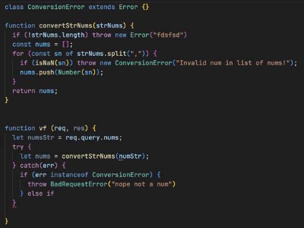

---
date: 2023-04-05
metadata: true
concepts: ['express', 'middleware', 'routes', 'views', 'supertest']
status: 'pre-lecture'
docs: 
	supertest: 'https://github.com/visionmedia/supertest'
cite: ['rithm']
---

#rithmRefactor  Summarize and place this code clip from Joel’s review of exercise:


## Goals

-   Learn how Express uses (and is built of!) _middleware_
-   Learn to write your own middleware
-   Learn how to break a large *app.js* into _routers_
-   Write integration tests with Supertest

## Middleware

- Express apps are made up of functions that do *one* of these things:
	- $ Send a response to the browser with res.send() or res.json()
	    -   These tend to be your “routes”, like _/user/:id_
	- !! Throw an error to the global error handler
	    -   Any function that throws an error will end up at the global handler
	- ~ Do neither of those things — proceed to the “next” function
	    -   These functions are called _middleware_

- **Middleware**:
	- In between express and the function that actually sends something to the browser
	- Kind of like `before_request()` in flask
- Examples of middleware functions:
	-   Print to terminal information about all incoming requests
	-   Examine request and make JSON in it available
	-   Examine request to decide if a user is logged in and throw an error if not

### Registering functions

app.js
```js
const express = require("express");
const app = express();

// Get a middleware function and register it for all routes
app.use(express.json());  // express.json is a fx that returns another fx, that's why this function is invoked

// Log all requests
app.use(myLoggingFunction);  // more typically, just pass the fx def, not invoked, to say "here's a function, I want you to call upon every request" (every request because no path specified and .use (not .get, .post))

// Log all requests (any HTTP method) when path **starts with** "/cats"
app.use("/cats", myLoggingFunction);

// Handle GET request when path equals "/cats"
app.get("/cats", myViewFn);

// Handle POST request when path equals "/cats"
app.post("/cats", otherViewFn);

// ... 404 and global err handler here ...

```

- Each of these ensure a request goes to the “next” thing in the chain of matching registration, ending up (hopefully!) in one of your view functions (those fx that actually return `res.json` or `res.send`)
- & The path does *not* have to match exactly – only *start with* what is passed for this arg.

### The chains

```js
app.use(express.json());
app.use(myLoggingFunction);
app.use("/cats", myLoggingFunction);
app.get("/cats", myViewFn);
app.post("/cats", otherViewFn);
app.use(our404Handler);
app.use(globalErrHandler);
```


- !! If an error thrown: goes directly to global error handler
- $ If `res.json() `or `res.send() `called, goes directly to client
- ~ If `next()` function is called, goes to next in chain

- In the image above, “myViewFn” and “otherViewFn” *shouldn’t* call `next()`, cause they’re supposed to be view functions, but this is a “human” delination, and they *can* technically do so. 
	- To express, middleware and view functions are all the same, they’re just the functions called within these files.

- ! Warning: Each routed function must do one of these things!
	- If you have a function that doesn’t any of these things, Express will never return _anything_ to the client and may eventually print a cryptic error message to the terminal.

### The next function

demo/routing/middleware.js
```js nums {3, 5}
/** Logger: prints log message and goes to next. */

function logger(req, res, next) {
  console.log(`Sending ${req.method} request to ${req.path}.`);
  return next();
}
```

- Express functions can take a third argument (a callback function), *next*
- To tell Express to go to next item in chain, call it!
- & This is how a function becomes middleware

- ~ Note: Supplying the next function
	- Only certain functions (middleware) need to list *next* in their function parameters, because only middleware will call that function. A normal view function won’t call `next()` — it will call `res.send()` or `res.json()`.
	- Express will always call a function with all three parameters *(req, res, and next)*, but you don’t need to put next in your function signature — JavaScript never complains if it passes arguments not in a function signature.
	- Therefore, for a non-middleware function, both of these will work:
```js
app.get("/cats", function(req, res) {
  res.send("meow!");
}

app.get("/cats", function(req, res, next) {
  // doesn't ever use `next` anyway
  res.send("meow!");
}
```

### Authorization middleware

demo/routing/middleware.js
```js
/** Check that name param must be Elie or raise Unauth. */

function onlyAllowElie(req, res, next) {
  if (req.params.name === "Elie") {
    return next();
  } else {
    throw new UnauthorizedError("Unauthorized");
  }
}
```

- We could register that globally with:
```js
app.use(onlyAllowElie);
```
- But this check might only be useful for one route. Let’s register middleware for just that route instead.

### Registering middleware for a route

- A registration can be of form:
	- & Alternative syntax for **middleware**:
```js
app.get(path, fx1, fx2, ...)
```

- & Each of these functions receives `req, res, next` as arguments.
	- Since these are all objects, any mutations that happen in one function affect the remaining functions in the chain. 

demo/routing/app.js
```js nums {5-6}
/** Greet user, only if it is Elie. */

app.get(
  "/hello/:name",
  // first function -- middleware function
  onlyAllowElie,
  // second function -- our view function
  function (req, res) {
    return res.json({ "greeting": `Hello, ${req.params.name}` });
  }
);
```

- & Note that it’s traditional to write the *view* function as an *inline* function argument.
- & For **middleware** though, it’s much more common to reuse these, so these are typically *named* functions. (e.g. onlyAllowElie)

### Using external middleware

-   Instead of our simple logger, we’ll a common one, *morgan*
-   When using external middleware, we follow a simple process:
    -   *install it *- `npm install morgan`
    -   *require it* - `const morgan = require("morgan");`   
    -   *use it* - `app.use(morgan('dev'));`
-   You can then see each request logged in the console —  route requested, HTTP verb, and more.

### Summarizing Middleware

-   We’ve already been using built in middleware like `express.json()`
-   Middleware are functions that can intercept the request/response cycle
-   When using external middleware: *install, require, and use.*

- ~ Note: The router is a piece of middleware!
	- It’s not important to use the router, but it’s interesting to realize that a router is an instance of the Router class which is callable and takes the usual req, res, next function. So the router is a piece of middleware — adding everything routed into the chain of things that might be called as part of servicing a request.

- % An older use for next
	- In modern Express, the `next() `function is used just to call the next item in the chain of matching functions, as described above.
	- In older versions, it had another purpose: it was also how you could signal that an error happened so that you could jump directly to the global error handler.
	- This was done by calling next() but *providing an argument to that call*. When `next() `is called without an argument, it goes to the next item in the chain. When it is called with an argument, it would go to the next item in the chain.
	- For example:
	  ```js
app.get("/donuts", function(req, res, next) {
  // calling next with arg will go to error handler!
  return next(new Error("Donuts not found! Oh no!"));
}
	```
	- This will still work in Express 5, but it’s easier just to throw an error rather than fiddling around with `next()` like that:
	  ```js
app.get("/donuts", function(req, res) {
  throw new Error("Donuts not found! Oh no!");
}
	```
	- (it would also work if next was supplied as the third argument to the latter example; it’s just not needed, since it’s not called in that version).
	- You may still see `next()` being used like this in real-world codebases you come across.

## Routers

-   Placing all routes in `app.js` gets messy quickly!
-   Routes can be elsewhere and used in `app.js`!

### A Router Outside of app.js

demo/routing/userRoutes.js
```js nums {4, 7, 12, 17}
const express = require("express");

const db = require("./fakeDb");
const router = new express.Router();

/** GET /users: get list of users */
router.get("/", function (req, res) {
  return res.json(db.User.all());
});

/** DELETE /users/[id]: delete user, return {message: Deleted} */
router.delete("/:id", function (req, res) {
  db.User.delete(req.params.id);
  return res.json({ message: "Deleted" });
});

module.exports = router;
```

### Using Our Router in app.js

- We apply the router to all _/users_ routes with app.use
	- This says *”Don’t even look at this file, unless it starts with `/users`“*
demo/routing/app.js
```js
const userRoutes = require("./userRoutes");

// apply a prefix to every route in userRoutes
app.use("/users", userRoutes);
```

### Benefits of the Express Router

-   We can make our `app.js` file smaller and more readable.
-   We can separate different RESTful resources into their own files:
    -   _/users_ has its own router inside `userRoutes.js`
    -   _/pets_ has its own router inside `petRoutes.js`

## Integration Tests in Express: Setup

-   Making sure the parts work together
-   Essential to have along with unit tests!
-   More involved than unit tests

### Integration Tests with Supertest

-   A library for testing Express applications
-   Our tool for integration testing
-   Like Flask’s test client: can make requests against app in tests
-   [Supertest Docs](https://github.com/visionmedia/supertest)

### Installing Supertest

```shell
$ npm i --save-dev supertest
```

### Modifying your package.json

- It’s helpful to tell node what the start program is for your app.
- Then you can run with just `nodemon` rather than `nodemon server`:

demo/testing/package.json
```json nums {5}
{
  "name": "supertest-demo",
  "version": "1.0.0",
  "description": "",
  "main": "server.js",
  "scripts": {
    "test": "echo \"Error: no test specified\" && exit 1",
    "start": "node server.js"
  },
  "keywords": [],
  "author": "",
  "license": "ISC",
  "dependencies": {
    "express": "^5.0.0-alpha.8"
  },
  "devDependencies": {
    "supertest": "^6.1.3"
  }
}
```
(You can also tell nodemon explicitly: `nodemon server.js`)


## Integration Tests in Express: An Example

### The application we are going to be building

-   A simple API for CRUD on cats!
-   We’re going to use a fake database for this example
-   We’ll abstract that into a file called fakeDb.js

demo/testing/fakeDb.js
```js
class Cat {
  static deleteAll()
  static all()
  static get(name)
  static add(cat)
  static delete(name)
  static updateName(name, newName)
}
```

### What our test setup looks like

demo/testing/routes/cats-routes.test.js
```js
const request = require("supertest");

const app = require("../app");
let db = require("../fakeDb");

let pickles = { name: "Pickles" };

beforeEach(function() {
  db.Cat.add(pickles);
});

afterEach(function() {
  db.Cat.deleteAll();
});
```

### What should I test?

-   Getting all cats
-   Getting a single cat
    -   What finding successfully looks like
    -   What happens when it is not found
-   Deleting a cat
    -   What deleting successfully looks like
    -   What happens when it is not found
-   Adding a cat
    -   What creating successfully looks like
    -   What happens when you create a duplicate cat
    -   What happens when you are missing required data

- & Remember to test *happy*  and *unhappy* paths

### Testing Reading

- When we make ‘fake’ web requests for testing, this too is *asychronous*.
	- Therefore must *await* result, and therefore must be *async function* 
demo/testing/routes/cats-routes.test.js
```js
/** GET /cats - returns `{cats: [cat, ...]}` */

describe("GET /cats", function() {
  it("Gets a list of cats", async function() {
    const resp = await request(app).get(`/cats`);

    expect(resp.body).toEqual({ cats: [pickles] });
  });
});
```

### Testing Creating

demo/testing/routes/cats-routes.test.js
```js
/** POST /cats - create cat from data; return `{cat: cat}` */

describe("POST /cats", function() {
  it("Creates a new cat", async function() {
    const resp = await request(app)
      .post(`/cats`)
      .send({             
        name: "Ezra"
      });
    expect(resp.statusCode).toEqual(201);
    expect(resp.body).toEqual({
      cat: { name: "Ezra" }
    });
  });
});
```

### Testing Updating

demo/testing/routes/cats-routes.test.js
```js
/** PATCH /cats/[name] - update cat; return `{cat: cat}` */

describe("PATCH /cats/:name", function() {
  it("Updates a single cat", async function() {
    const resp = await request(app)
      .patch(`/cats/${pickles.name}`)
      .send({
        name: "Troll"
      });
    expect(resp.body).toEqual({
      cat: { name: "Troll" }
    });
  });

  it("Responds with 404 if name invalid", async function() {
    const resp = await request(app).patch(`/cats/not-here`);
    expect(resp.statusCode).toEqual(404);
  });
});
```

### Testing Deleting

demo/testing/routes/cats-routes.test.js
```js
/** DELETE /cats/[name] - delete cat,
 *  return `{message: "Cat deleted"}` */

describe("DELETE /cats/:name", function() {
  it("Deletes a single a cat", async function() {
    const resp = await request(app)
      .delete(`/cats/${pickles.name}`);
    expect(resp.body).toEqual({ message: "Deleted" });
    expect(db.Cat.all().length).toEqual(0);
  });
});
```

### Debugging your tests

- You can always `console.log` inside of your test files
- Or use the [chrome-dev-tools](../../chrome-dev-tools.md)

### Coming Up

-   Adding PostgreSQL to Express
-   Testing using a Database