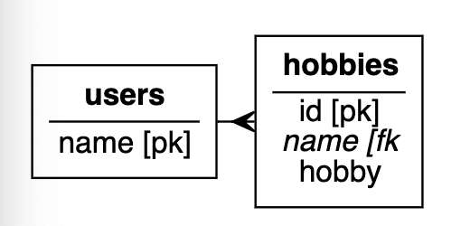
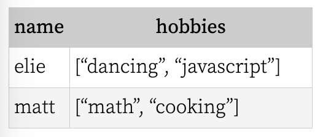

---
date: 2023-04-14
metadata: true
concepts: ['node', 'express', 'pug']
status: 'pre-lecture'
docs: 
	pug: 'https://pugjs.org/api/getting-started.html'
	helmet: 'https://www.npmjs.com/package/helmet'
	passport: 'http://passportjs.org/'
cite: ['rithm']
---

## Express

### Serving Static Files

- Can serve static HTML, CSS, images, etc:

```js
// serve static files (kept in static directory)

app.use("/js", express.static('static/js'));
app.use("/css", express.static('static/css'));
```

### Templating HTML

- [Pug](https://pugjs.org/api/getting-started.html) is a popular template system
- Unlike Jinja/Nunjucks, you don’t write HTML — you write simpler text:

```pug
doctype html
html(lang="en")
  head
    title= pageTitle
  body
    h1 Pug - node template engine
    #container.col
      if youAreUsingPug
        p You are amazing
      else
        p Get on it!
```

### Common Security Fixes

- [Helmet](https://www.npmjs.com/package/helmet)
	- Provides tools for dealing with CSRF and other concerns.

### Authentication/Login

- [Passport.js](http://passportjs.org/)
	- Provides common pattern for authentication.
	- Also provides login via Facebook, Twitter, etc.

### Dealing with Cookies

```js
const cookieParser = require('cookie-parser');

app.use(cookieParser());

app.get('/', function(req, res, next) {
  console.log('Cookies: ', req.cookies);
})
```

- Can also sign cookies, to make tamper-free cookies.

## Other Node Web Frameworks

### Koa2

- [Koa2](https://github.com/koajs/koa)
	-   Written by original author of Node
	-   A bit more modern & opinionated
	-   Not as popular as Express — perhaps one day?

### Sails

- [Sails](https://sailsjs.com/)
	-   Larger, more opinionated framework
	-   Similar to Django or Ruby on Rails
	-   Includes ORM, Waterline

## Node

### Popular Library: date-fns

- [date-fns](https://date-fns.org/)
	- Convenient functions for date manipulation & conversion.
	- Provides “humanized” dates, like “a few minutes ago”, “yesterday”.

```js
format(new Date(), "'Today is a' eeee")
//=> "Today is a Thursday"

formatDistance(subDays(new Date(), 3), new Date(), { addSuffix: true })
//=> "3 days ago"

formatRelative(subDays(new Date(), 3), new Date())
//=> "last Friday at 7:26 p.m."
```

### Popular Library: Validator.js

- [Validator.js](https://github.com/chriso/validator.js)
	- Popular library of string validators:
		-   is all uppercase?
		-   is email?
		-   is URL?
		-   and so on

### Popular Library: Lodash

- [Lodash](https://lodash.com/)
	- Useful set of small utility functions for common actions on arrays, objects, functions.
	- Grouping, filtering, transforming, and more!

### npm Scripts

`package.json` can define scripts to run:
```json
{
  "scripts" :
  {
    "test": "jest",
    "debug": "nodemon --inspect server.js",
  }
}
```

- Can then run like `npm test` and `npm run debug`

## PostgreSQL & Node/Express

### Query Builders

- There is software like **knex** that are “in-between” raw SQL and ORMs.
- They can take some of the finickiness out of building flexible SQL:

```js
// data = {'name': 'New Name', 'description': 'New Description'}

result = await knex('companies').update(data)
```

- You can [read more about it](https://www.rithmschool.com/blog/different-approaches-express) from Joel.

### Querying Relationships



```sql
CREATE TABLE users (
  name VARCHAR(25) PRIMARY KEY
  );

CREATE TABLE hobbies (
  id SERIAL PRIMARY KEY,
  user_name VARCHAR(25) REFERENCES users,
  hobby VARCHAR(25));

INSERT INTO users VALUES ('elie'), ('matt');

INSERT INTO hobbies (user_name, hobby) VALUES
    ('elie', 'dancing'),
    ('elie', 'javascript'),
    ('matt', 'math'),
    ('matt', 'cooking');
```

- If we want `{name, hobbies: [hobby, ...]}` …
	-   You could write a query and make the nested JSON in JS
	-   Or you could tell PostgreSQL to do it!
```sql
SELECT name, json_agg(hobby) AS hobbies
FROM users AS u
  JOIN hobbies AS h ON (u.name = h.user_name)
GROUP BY name;
```

 

## Websockets

-   We’ve used Node/Express to deal with HTTP requests
-   It can also serve HTTPS
    -   Though, typically, that’s handled elsewhere by DevOps
-   It can also serve “websocket” protocol

-   HTTP is a pretty wordy, heavy protocol
    -   So many things in headers!
-   HTTP is stateless
    -   Ask for answer, get answer, hang up connection
-   Websockets are tiny and stateful — they stay connected!
    -   They’re often used for “tell the browser something has changed”

### In Client

```js
const ws = new WebSocket(`ws://localhost:3000/chat`);

ws.onopen = function(evt) {
  // called when browser connects to server
};

ws.onmessage = function(evt) {
  // called when browser receives a "message"
  console.log("got", evt.data);
};

ws.onclose = function(evt) {
  // called when server closes connection
};
```

$to send a message to server$
```js
ws.send("this is a message from browser");
```

### In Server

- Library **express-ws** makes Websockets act like other routes

$app.js$
```js
const wsExpress = require("express-ws")(app);

app.ws("/chat", function (ws, req, next) {
  ws.on("open", function () {
    // called when connection is opened
  });

  ws.on('message', function (data) {
    // called when message is received from browser
  });

  ws.on('close', function () {
    // called when browser closes connection
  });
});
```

$to send a message to client$
```js
ws.send("this is a message from server");
```

## Goodbye, Node?

- Nope
- This is the end of our time with backend JS.
- But we’ll see that React apps are often made using Node —  to setup project, run tests, run dev server, etc.