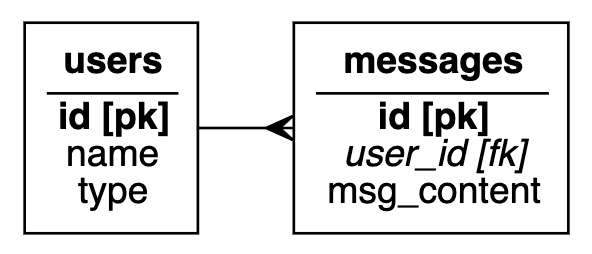
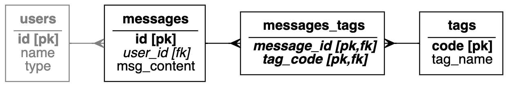
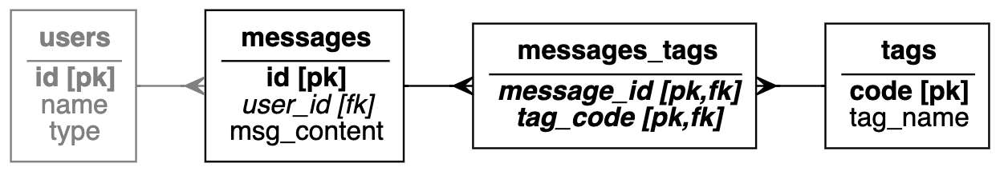
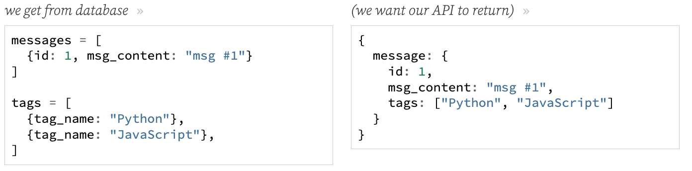

---
date: 2023-04-06
metadata: true
concepts: ['express', 'postgres', 'database', 'pg', 'sql']
status: 'pre-lecture'
docs: 
cite: ['rithm']
---

## Goals

-   Work with 1:M relationships in *pg*
-   Work with M:M relationships in *pg*
-   Handle missing data by sending 404s

## One to Many Relationships



```sql
CREATE TABLE users (
  id SERIAL PRIMARY KEY,
  name TEXT NOT NULL UNIQUE,
  type TEXT NOT NULL
);

CREATE TABLE messages (
  id SERIAL PRIMARY KEY,
  user_id INTEGER NOT NULL REFERENCES users,
  msg_content TEXT NOT NULL
);
```

- We want our API to include:
	- `GET /users/:id` 
		- Return details of user _and_ list of messages:
```js
{
  user: {
    id: 1,
    name: "Juanita",
    type: "admin",
    messages: [
      {id: 1, msg_content: 'msg #1'},
      {id: 2, msg_content: 'msg #2'}
    ]
  }
}
```

### `GET /users/:id` Route - user details with messages

- Creating route with *pg*:
demo/routes/users.js
```js nums {17, 23, 25}
/** Get User: => {
 *    user: {
 *      id,
 *      name, 
 *      type, 
 *      messages: [ {id, msg_content} ] 
 *    } 
 *  } */

router.get("/:id",
  async function (req, res, next) {
    const id = req.params.id;
    const uResults = await db.query(`
          SELECT id, name, type
          FROM users
          WHERE id = $1`, [id]);
    const user = uResults.rows[0];

    const mResults = await db.query(`
          SELECT id, msg_content
          FROM messages
          WHERE user_id=$1`, [id]);
    const messages = mResults.rows;

    user.messages = messages;
    return res.json({ user });
  });

```
- We just add property on user and populate with messages!

(results- parsed json)
```js
{
  user: {
    id: 1,
    name: "Juanita",
    type: "admin",
    messages: [
      {id: 1, msg_content: 'm#1'},
      {id: 2, msg_content: 'm#2'}
    ]
  }
}
```

- ~ Note: **Optimizing this code**
	- For ease of readability, we’ve awaited two database queries sequentially in the above code example. We could have just as easily run these queries in parallel by wrapping them in a Promise.all, since the message query doesn’t depend on the result of the user query.
	- You might also be wondering why we don’t use a join, and simply make one request to the database. What would be some advantages to using this approach? What might some disadvantages be?

## Many to Many Relationships


```sql
CREATE TABLE tags (
  code TEXT PRIMARY KEY,
  tag_name TEXT NOT NULL UNIQUE
);

CREATE TABLE messages_tags (
  message_id INTEGER NOT NULL REFERENCES messages,
  tag_code TEXT NOT NULL REFERENCES tags,
  PRIMARY KEY(message_id, tag_code) --reminder that this is a composite PK
);
```

- We want our API to include:
	- `GET /messages/1`
		- Return info about message _and_ associated tag names:
```js
{
  message: {
    id: 1,
    msg_content: "msg #1",
    tags: ["Python", "JavaScript"]
  }
}
```

### What about these queries?



```sql
SELECT id, msg_content
  FROM messages
  WHERE id = 1;

SELECT tag_name
  FROM messages_tags AS mt
    JOIN tags AS t ON mt.tag_code = t.code
  WHERE mt.message_id = 1;
```

### Restructuring This Data



demo/routes/messages.js
```js nums {17}
/** Get message: {message: {id, msg_content, tags: [name, name]} } */

router.get("/:id", async function (req, res, next) {
  const id = req.params.id;
  const mResults = await db.query(
    `SELECT id, msg_content
           FROM messages
           WHERE id = $1`, [id]);
  const message = mResults.rows[0];

  const tResults = await db.query(
    `SELECT tag_name
           FROM messages_tags AS mt
            JOIN tags AS t ON mt.tag_code = t.code
           WHERE mt.message_id = $1
           ORDER BY tag_name`, [id]);
  message.tags = tResults.rows.map(r => r.tag_name);

  return res.json({ message });
});

```

- & Note: Manipulating data
	- When it comes to handling these many-to-many relationships, you’ll find that you often need to manipulate arrays of objects in JavaScript. There are many helper libraries with utilities that can assist with this process (such as [lodash](https://lodash.com/)), but for now, we’ll focus on writing all of the business logic ourselves.

- ~ Could We Write This is One Query?
	- Yes! But it might not be better.
	- If we wrote this as one query joining all three tables, we’d get a result set repeating the message id and message text. If the message text isn’t very long, or there aren’t many tags for that message, there might be a small improvement to be made with one query rather than two.
	- However, if the message text was a page-letter note, and there were a dozen tags on it, that repeated message text would take longer (and more memory!) for the database to send that any savings from writing this as one query.
	- So: to really know which would be better, you need to think about your data.

## Handling Missing Resources

- We want:
	- `PATCH /messages/\[id\]`
		- Given `{msg_content}`, updates DB 
		  & returns `{message: {id, user_id, msg_content} }`

demo/routes/messages.js
```js nums {13}
/** Update message: 
 * {msg_content} => {message: {id, user_id, msg_content} } */

router.patch("/:id", async function (req, res, next) {
  if (req.body === undefined) throw new BadRequestError();
  const id = req.params.id;
  const results = await db.query(
    `UPDATE messages
           SET msg_content=$1
           WHERE id = $2
           RETURNING id, user_id, msg_content`,
    [req.body.msg_content, id]);
  const message = results.rows[0];

  return res.json({ message });
});
```
- Line 13 just returns undefined if not found!

demo/routes/messages.js
```js nums {13, 15}
/** Update message #2: 
 * {msg_content} => {message: {id, user_id, msg_content} } */

router.patch("/v2/:id", async function (req, res, next) {
  if (req.body === undefined) throw new BadRequestError();
  const id = req.params.id;
  const results = await db.query(
    `UPDATE messages
           SET msg_content=$1
           WHERE id = $2
           RETURNING id, user_id, msg_content`,
    [req.body.msg_content, id]);
  const message = results.rows[0];

  if (!message) throw new NotFoundError(`Not found: ${id}`);
  return res.json({ message });
});

```
- $ Throws error if message not found.


- ~ Note: *Don’t Forget about the debugger!*
	- Remember, if this code starts to become too hard to track, you can use the debugger to pause code execution and see what’s going on!
	- [chrome-dev-tools](../../chrome-dev-tools.md)

