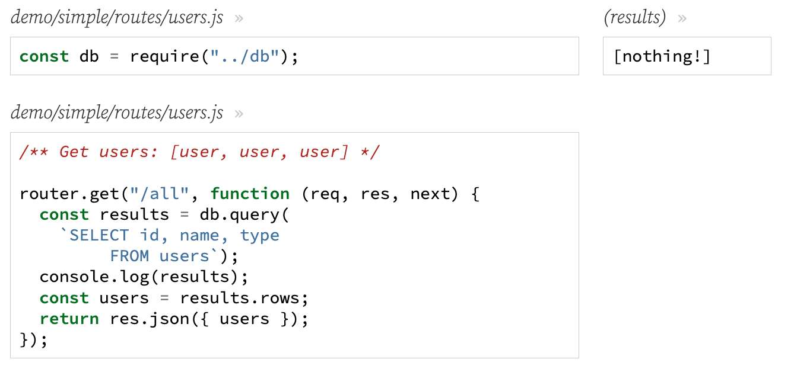
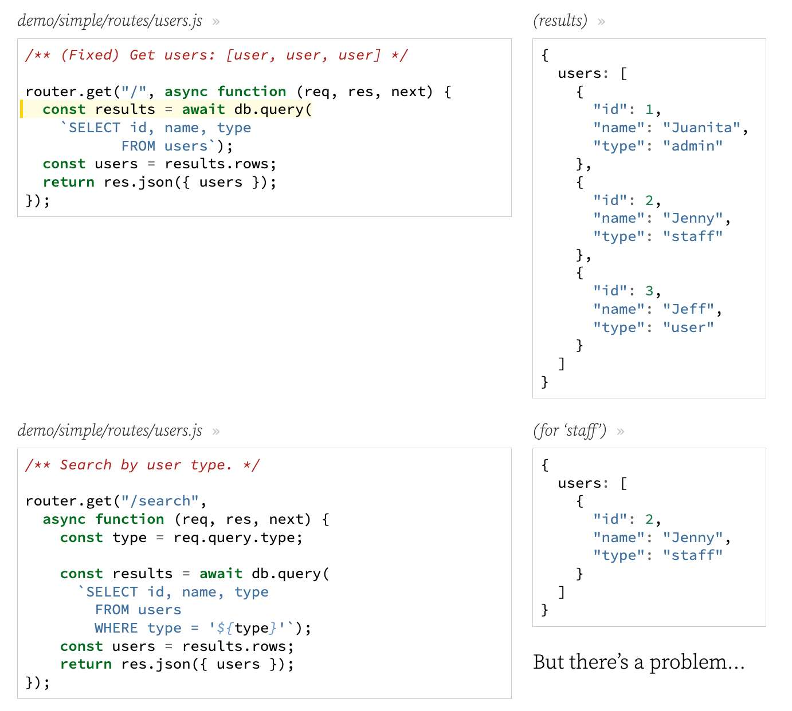
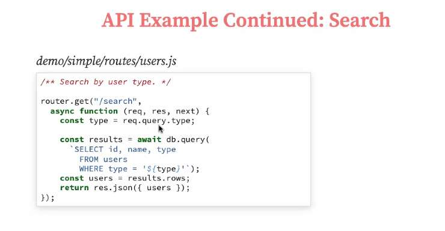
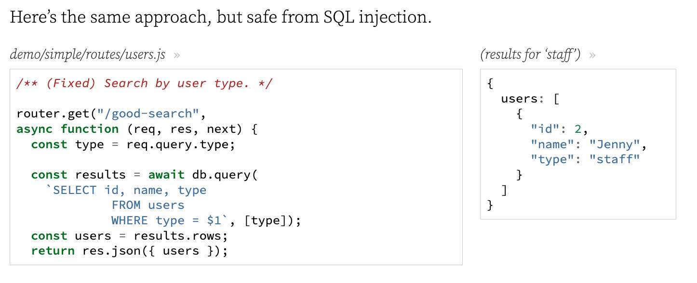
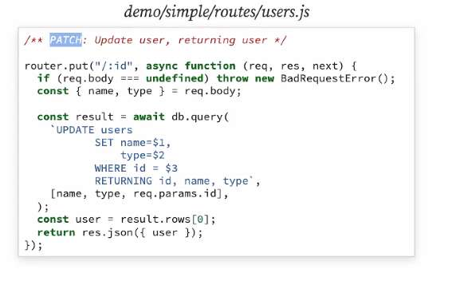
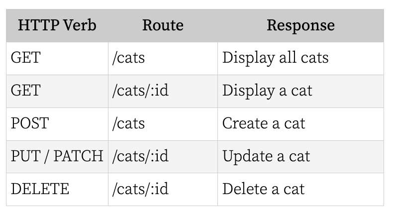

---
date: 2023-04-06
metadata: true
concepts: ['postgres', 'express', 'node', 'sql', 'pg']
status: 'pre-lecture'
docs: 
cite: ['rithm']
---

## Goals

-   Use *pg* to connect and execute SQL queries
-   Explain what SQL injection is and how to prevent it with *pg*
-   Examine CRUD on a single resource with Express and *pg*

## Introduction

### The Node SQL Ecosystem

- There are different ways to talk to the database:
	-   Use an ORM (what we did with Flask)
	-   Write the SQL yourself (what we will be doing in Express!)
	-   You can [read more about this](https://www.rithmschool.com/blog/different-approaches-express) from Joel

## PostgreSQL with Node

### Scaffolding

demo/simple/app.js
```js
/** Express app for pg-intro-demo */

const express = require("express");
const { NotFoundError } = require("./expressError");

const app = express();

// Parse request bodies for JSON
app.use(express.json());

const uRoutes = require("./routes/users");
app.use("/users", uRoutes);


// ... 404, global err handler, etc.
```

### pg

- *pg* stands for *postgres*
- Similar to *psycopg2* with python
- Connects code to database and executes SQL
```shell
$ npm install pg
```

- & It’s common to abstract this logic to another file, so let’s create a file `db.js`:
1.  Specify a database
    -   Use environmental variable
    -   Don’t trash real DB during testing
2.  Connect to DB
3.  Export DB to other files

demo/simple/`db.js`
```js
/** Database setup for users. */

const { Client } = require("pg");   // Pull Client class out of pg module

const DB_URI = process.env.NODE_ENV === "test"  // 1
    ? "postgresql:///simple_users_test"  // this code says: if in test
    : "postgresql:///simple_users";  // env, use test db, otherwise reg db

let db = new Client({
  connectionString: DB_URI
});

db.connect();                                   // 2

module.exports = db;                            // 3
```
- & This is great boilerplate code - Add to snippet #template

## Queries



- What’s the bug?
	- & DB queries are *asynchronous*! We have to wait for the query to finish before!

#### Using  async/await



#### API Example Continued: Search



## SQL Injection

- A technique where an attacker tries to execute undesirable SQL statements on your database.
- It’s a common attack, and it’s easy to be vulnerable if you aren’t careful!
- If the search type is `"staff"`, everything works fine.
- But what if the search type is `"bwah-hah'; DELETE FROM users; --'"` ?
```sql
SELECT id, type, name
FROM users
WHERE type='bwah-hah'; DELETE FROM users; --'
```
- !! Ut oh.

### Parameterized Queries

-   To prevent against SQL injection, we need to sanitize our inputs
-   ORMs typically do this for you automatically
-   We can sanitize our inputs by using **parameterized queries**

- ~ Note: **Prepared Statements**
	- It’s not the most important part to understand, but if you’re curious how the pg module does this, it uses a feature called “prepared statements”.
	- Prepared statements are a database tool used to templatize and optimize queries you plan on running frequently. You’ve seen prepared statements already when we worked with SQLAlchemy in Flask, though we didn’t specifically call them out as such.
	- You don’t need to worry about the details, but because of the way that prepared statements work on the database level, they naturally protect against SQL injection. If you’re curious about the details, check out [this](https://en.wikipedia.org/wiki/Prepared_statement) article on Wikipedia.


- $ Here’s the same approach, but safe from SQL injection.


- & **db** - instance of the Client class that comes from pg module
	- **results**: returned result from `db.query(sql, [parameterized-query])` is an object
		- `results.rows` -  
			- rows is a property on the **results** obj  that is an array of objects - array of the rows found from the query
			- & This is where the data from your query will be

### Parameterized Queries Overview

-   In your SQL statement, represent variables like *$1*, *$2*, *$3*, etc.
    -   You can have as many variables as you want
-   For the second argument to db.query, pass an array of values
    -   *$1* will evaluate to the first array element, *$2* to the second, etc.
- & Note: the variable naming is *1-indexed*!

## More CRUD Actions

### Example: Create

demo/simple/routes/users.js
```js
/** Create new user, return user */

router.post("/", async function (req, res, next) {
  console.log ("*** POST / req.body:", req.body);
  if (!req.body) throw new BadRequestError();

  const { name, type } = req.body;
  const result = await db.query(
    `INSERT INTO users (name, type)
           VALUES ($1, $2)
           RETURNING id, name, type`,
    [name, type],
  );
  const user = result.rows[0];
  return res.status(201).json({ user });
});

```

- ~ Note: Status Code 201
	- Note that we use HTTP status code 201 (`CREATED`) here, not 200 (`OK`).
	- Some APIs return 200 in cases like this, but the REST convention suggests that 201 is a better choice, so that’s what we’re using.

### RETURNING clause

- In SQL, for *INSERT/UPDATE/DELETE*, you can have a *RETURNING* clause.

This is to _return data_ that was inserted, updated, or deleted:
```sql
INSERT INTO users (name, type) VALUES (...) RETURNING id, name;
```

```sql
INSERT INTO users (name, type) VALUES (...) RETURNING *;
```

- !! Danger: Never use `*` in RETURNING clause
	- It’s a terrible idea to use `SELECT *` or `RETURNING *` in the SQL used in applications. That returns all columns and, if new sensitive columns were added after the code was written, it would risk returning that sensitive data.
	- It’s far better to explicitly list the columns that should be selected or returned.

### Example: Update

- Put example:


- #todo  fix below route with image code above - this is actually a put route
demo/simple/routes/users.js
```sql
/** Update user, returning user */

router.patch("/:id", async function (req, res, next) {
  if (req.body === undefined) throw new BadRequestError();
  const { name, type } = req.body;

  const result = await db.query(
    `UPDATE users
           SET name=$1,
               type=$2
           WHERE id = $3
           RETURNING id, name, type`,
    [name, type, req.params.id],
  );
  const user = result.rows[0];
  return res.json({ user });
});
```

- Can also do a patch route- just would need to actually put in this logic. 

### Example: Delete

demo/simple/routes/users.js
```sql
/** Delete user, returning {message: "Deleted"} */

router.delete("/:id", async function (req, res, next) {
  await db.query(
    "DELETE FROM users WHERE id = $1",
    [req.params.id],
  );
  return res.json({ message: "Deleted" });
});
```

### Committing

- With SQLAlchemy, you had to commit after all changes — because SQLAlchemy put all work into a db transaction.
- That isn’t the case with pg — so you don’t need to explicitly commit 
	- (each INSERT/UPDATE/DELETE commits automatically)

- @ #rithmQ Is there a way to have transactions with *pg*?
- Yes definitely - just execute commands:
	- BEGIN
	- COMMIT
	- ROLLBACK

## Testing our Database

### Adding test database

- We’re going to need a different database for testing, so let’s configure that!

demo/cats/db.js
```js
/** Database setup for users. */

const { Client } = require("pg");

const DB_URI = process.env.NODE_ENV === "test"
    ? "postgresql:///cats_test"
    : "postgresql:///cats";

let db = new Client({
  connectionString: DB_URI
});

db.connect();

module.exports = db;
```

### Running Tests

- Create test database first, otherwise running tests will mysteriously hang
```shell
$ createdb cats_test
$ psql cats_test -f cats.sql
```

- Once you have database, run your tests as usual
```shell
$ jest -i
```

- & Tip: Always include the `-i`
	- The `-i` flag tells Jest to run your tests “in-line” (that is, only running one test file at a time, rather than running several test files simultaneously).
	- If you let it run multiple tests files at the same time, some tests will fail because the database will suddenly change in the middle of a test.

### Test Setup/Teardown

- Setup at beginning:
demo/cats/routes/cats.test.js
```js
let testCat;

beforeEach(async function () {
  await db.query("DELETE FROM cats");
  let result = await db.query(`
    INSERT INTO cats (name)
    VALUES ('TestCat')
    RETURNING id, name`);
  testCat = result.rows[0];
});
```

## Testing CRUD Actions

### Our Restful JSON API

- What routes do we need for a RESTful JSON API with CRUD on cats?  
	- (ZOMG so many acronyms.)


### Testing Read

demo/cats/routes/cats.test.js
```js
/** GET /cats - returns `{cats: [cat, ...]}` */

describe("GET /cats", function () {
  test("Gets list", async function () {
    const resp = await request(app).get(`/cats`);
    expect(resp.body).toEqual({
      cats: [testCat],
    });
  });
});
```

demo/cats/routes/cats.test.js
```js
/** GET /cats/[id] - return data about one cat: `{cat: cat}` */

describe("GET /cats/:id", function () {
  test("Gets single cat", async function () {
    const resp = await request(app).get(`/cats/${testCat.id}`);
    expect(resp.body).toEqual({ cat: testCat });
  });

  test("404 if not found", async function () {
    const resp = await request(app).get(`/cats/0`);
    expect(resp.statusCode).toEqual(404);
  });
});

```

### Testing Create

demo/cats/routes/cats.test.js
```js
/** POST /cats - create cat from data; return `{cat: cat}` */

describe("POST /cats", function () {
  test("Create new cat", async function () {
    const resp = await request(app)
        .post(`/cats`)
        .send({ name: "Ezra" });
    expect(resp.statusCode).toEqual(201);
    expect(resp.body).toEqual({
      cat: { id: expect.any(Number), name: "Ezra" },
    });
  });

  test("400 if empty request body", async function () {
    const resp = await request(app)
        .post(`/cats`)
        .send();
    expect(resp.statusCode).toEqual(400);
  });
});
```

### Testing Update

demo/cats/routes/cats.test.js
```js
/** PATCH /cats/[id] - update cat; return `{cat: cat}` */

describe("PATCH /cats/:id", function () {
  test("Update single cat", async function () {
    const resp = await request(app)
        .patch(`/cats/${testCat.id}`)
        .send({ name: "Troll" });
    expect(resp.statusCode).toEqual(200);
    expect(resp.body).toEqual({
      cat: { id: testCat.id, name: "Troll" },
    });
  });

  test("404 if not found", async function () {
    const resp = await request(app)
      .patch(`/cats/0`)
      .send({name: "Troll"});
    expect(resp.statusCode).toEqual(404);
  });

  test("400 if empty request body", async function () {
    const resp = await request(app)
      .patch(`/cats/${testCat.id}`)
      .send();
    expect(resp.statusCode).toEqual(400);
  });
});
```

### Testing Delete

demo/cats/routes/cats.test.js
```js
/** DELETE /cats/[id] - delete cat,
 *  return `{message: "Cat deleted"}` */

describe("DELETE /cats/:id", function () {
  test("Delete single cat", async function () {
    const resp = await request(app)
        .delete(`/cats/${testCat.id}`);
    expect(resp.statusCode).toEqual(200);
    expect(resp.body).toEqual({ message: "Cat deleted" });
  });
});
```

## Looking Ahead

-   Associations with *pg*
-   Building our own lightweight ORM!