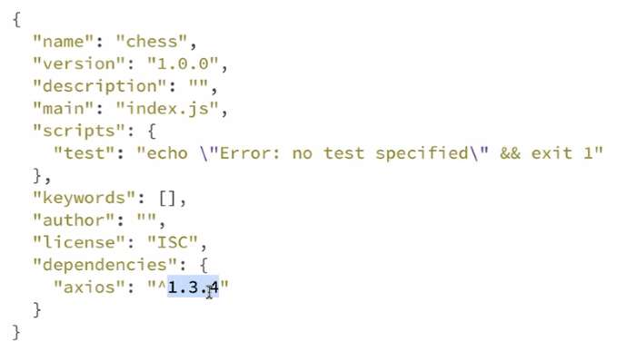
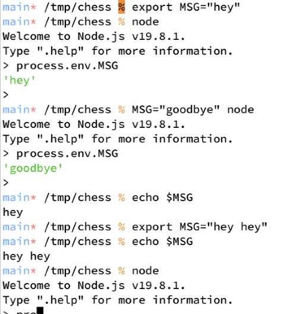

---
date: 2023-04-04
metadata: true
concepts: ['node']
status: 'post-lecture'
docs: 
	'node-process': 'https://nodejs.org/api/process.html'
cite: ['rithm']
---

## Node.js

-   A JavaScript environment that runs server-side
    -   It uses the Chrome V8 engine, but doesn’t require/use Chrome
-   Can be used to build any kind of server-side JS 
  (including your laptop that can run a server, not always some fancy far away server)
    -   Including building web applications!
    -   or as a general-purpose scripting language
    -   or anytime you want to use js in the terminal

### Why Node.js?

-   The entire stack (frontend/backend) can be JavaScript
	- May be able to reuse code as result
-   There is an extensive set of add-on libraries via *npm*
    -   Many can also be used in client-side JS
-   Widely used, quite popular

### Starting Node

(in directory with a file `myScript.js`)
```shell
$ node myScript.js
Hi there!
```

or, for an interactive REPL: (REPL is a way to ‘play’ Read-Eval-Print-Loop)
```shell
$ node
>
```
(.exit or Control-D to return to the normal terminal)

## NPM: Node Package Manager

-   Is both:
	- Massive registry of add-on libraries
	- Command line tool, *npm*, comes with Node
- *npm* provides easy dependency management for a project
- Register with npm to publish open-source or proprietary packages

### Starting a Project with NPM

```shell
$ cd my-project

$ npm init
```

-   Creates `package.json` with metadata & dependencies
-   In a hurry? Want the defaults? `npm init --yes` (or `npm init -y`)

### Example package.json

- Store your `package.json` in Git
```json
{
  "name": "node-files",
  "version": "1.0.0",
  "description": "Exercise to create file listing functions.",
  "main": "",
  "scripts": {
    "start": "node index.js"
  },
  "author": "Whiskey the Dog",
  "license": "GPL-v3",
  "dependencies": {
    "axios": "0.x"
  }
}
```

## Installing Packages

- In the root project directory:
```shell
$ npm install axios

(or shorthand:)

$ npm i axios
```
-   Adds latest version of axios to dependencies object in `package.json`
-   Installs the package in a local `node_modules` folder

### node_modules

- A directory containing all dependencies in the root directory of your project.
- $ Always add node_modules to .gitignore
- !! Don’t put node_modules in git
	-  (It’s just a collection of dependencies that can be reinstalled)

### Reinstalling Packages

- When you clone an existing project from GitHub or delete your  `node_modules`, here’s how you get those dependencies:
	-   `npm install` without arguments uses dependencies object in `package.json`
	-   Similar to `pip install -r requirements.txt` in Python

### NPM Summary

-   Install dependencies to project’s with `npm install <package_name>`
    -   This downloads and adds package to `node_modules` directory
    -   Dependencies are notated in `package.json` and `package-lock.json`
    -   `package-lock.json` locks in the exact versions as installed. 
        - & Do not modify `package-lock.json`, you will work with the `package.json`
    -   Always commit `package.json`, but *never* commit `node_modules`!
    -   Use `npm install` on a fresh repository to get a new `node_modules`

#### package.json vs package-lock.json

- `package.json` contains metadata & dependency _requirements_ whereas
   `package-lock.json` contains _exact_ versions actually installed.
- In *development*, want to included `package.json` in git, because any colloborating folks should get bug fixes or updated versions if they exist for dependencies.
- In *production*, want to include `package-lock.json` in git because the stakes are higher – you don’t want anything to break, so you want to ensure only the *exact* same versions are used.

#### Versioning

- **semantic versioning**/ **semver**: There is meaning to the versioning
	- *major-number*.*minor-number*.*patch-number* :  `"axios": “^1.3.4”`
		- Caret icon: 
			-  Means “use axios version 1.3.4 or greater” (because of ^ symbol)
				- Up to but not including 2.x.x (because major changes can break code)
			- For when others clone your project and install dependencies, may not get exactly version 1.3.4, but may get 1.3.7 which should be a compatible version.
		- major-number (1): may have large changes that could break code written with an older version
		- minor-number(3): add small feature
		- patch-number(4): only to fix small bugs

(Note in this example, the entry point is *index.js*  NOT *index.html*)


## Node *process* Library

- Node provides a global object, *process*, for managing the current script.
	- *process* is available in *Node*, but not in the browser.
- Using *process*, we can:
	-   Access environmental variables
	-   See the command-line arguments passed to the script
	-   Kill the script
- See [process documentation](https://nodejs.org/api/process.html) for a full list of functions.
- *process* library is kinda like Math library in js.  Automatically included/built in, and you do not need to ‘require’/import it explicitly. 

### process.env

```js
process.env.SECRET_KEY
```

- Get value of environmental variables from shell
- `process.env` is an object and its keys are the names of environment variables.

```shell
$ export SECRET_INFO=abc123
$ node
> process.env.SECRET_INFO
'abc123'
```



#rithmQ  #monday Check these ways to set env variables:

A few ways to create environmental variables:
- for just this terminal session:
	- Set env variable: `export MSG=“hey hey”`
	- Access variable: `echo $MSG`
- for just a specific command:
	- Set env variable: `MSG="goodbye" node`
	- Access variable: `process.env.MSG`
- for always (.zshrc)
	- Set variable by placing line in file that always runs before a terminal session, like `.zshrc`
- When deploying, use way to tell render(or other service)

### process.argv

```js
process.argv[index]
```

- `process.argv `is array of args given to shell to start this program
- Everything you run in the shell is treated as args.

demo/basics/showArgs.js
```js
const argv = process.argv;

for (let i = 0; i < argv.length; i += 1) {
  console.log(i, argv[i]);
}
```

```shell
$ node showArgs.js hello world
0 '/path/to/node'
1 '/path/to/showArgs.js'
2 'hello'
3 'world'
```

### process.exit

```js
process.exit(exit_code)
```

- Exit the program immediately and return an exit code to the shell.
- By convention, 0 is “no error”; other codes (1, 2, etc.) are script errors.

## The Module System

- Modules are the way to share code across different files in a Node project.
- You might hear this system referred to as _CommonJS Modules_ sometimes called *CJS*
	- (There are two different ways to do importing and modules - and node uses this one (*CJS*))
- There aren’t `<script>` tags in the Node ecosystem,  so you have to include other files by exporting/importing explicitly.

### Importing a Project File

- All imports use the *require* keyword.
- To import a local project file, specify a *relative path* to that file:

demo/modules/other.js
```js
const usefulStuff = require("./usefulStuff");

const results = usefulStuff.add(2, 3);

console.log(results);
```

- & `require`  path *always* needs to start with a `.` 
	-  `./` for current directory or
	-  `../` for parent directory
-   You don’t need to include the file extension for `.js` and `.json` files.

### Importing a Library

- To import a built-in module or NPM package, use the name.
- Node will look in its included core modules and `node_modules`.

demo/modules/google.js
```js
const axios = require("axios");

async function getGoogle() {
  const resp = await axios.get("https://google.com/"); // this is not ajax! cause its not js in browser
  console.log(resp.data.slice(0, 80), "..."); 
}

getGoogle();
```

### Destructuring Imports

- When importing an object, you can destructure into variables:

demo/modules/other2.js
```js
const { add, User } = require("./usefulStuff");

const results = add(2, 3);

console.log(results);
```

### Exporting from a File

- Use built-in `module.exports` to make things importable by other files:
	- `module.exports` is a magic term - must use this term
- & Need to always explicitly export with node.
	- No shortcut ways to get around this.

demo/modules/usefulStuff.js
```js nums {16-21}
const MY_GLOBAL = 42;

function add(x, y) {
  return x + y;
}

class User {
  constructor(name, username) {
    this.name = name;
    this.username = username;
  }
}

const notNeededElsewhere = "nope"; // I don't get exported!

// export an object
module.exports = {
  MY_GLOBAL: MY_GLOBAL,
  add: add,
  User: User,
};
```

### module.exports

- Typical assign `module.exports` to an object; this can easily export multiple things.

- While it is possible to set it to whatever you want:
 if just one fx exported (example.js)
```js
module.exports = function() {
  console.log('hello');
}
```
anotherFile.js
```js
const sayHello = require('./example');

sayHello();
// hello
```
- Because a function was exported, “sayHello” will be a function. 
	- In earlier example, “usefulStuff” was an object because an object was exported.

- $ Best to still export as an object, because in the future, likely to require less maintenance. (Other ppl don’t have to change their code when you likely end up exporting another thing from that file.)
usefulStuff.js
```js
const hello = function () {
  console.log('hello');
}

module.exports = { hello };  // same as module.exports = {"hello": hello}
```
anotherFile.js
```js
const { hello } = require("./usefulStuff");

hello(); 
```

### Modules Summary

-   Export things in file with module.exports _(usually an object)_
-   Import exports of local files with relative path: `require("./other")`
-   Import exports of installed libraries with name: `require("axios")`

- ~ Tip: Node Callbacks (an older pattern)
	- Many older Node library functions utilize asynchronous callbacks by default. It’s unlikely that you may encounter these, but if you do here is how we used to handle them before Promises and async/await
	- For example, to find the IP address for a hostname:
	  ```js
const dns = require("dns");

dns.lookup("rithmschool.com", cbFunction);
	 ```
	- That does an asynchronous lookup, and calls our callback when finished.
	- Node.js callbacks usually conform to an **“error-first” pattern.**
	-   Callback’s first parameter will be error.
	    -   Node will supply error object (if something bad happened)
	    -   If no error happened, this will be null
	-   Then follow the other parameters, if there are any:
	  ```js
dns.lookup("rithmschool.com", function (err, hostname) {
  if (err) {
    // handle error
  } else {
    console.log(hostname);
  }
});
	  ```
	- Good explanation of [error-first callback pattern](https://nodejs.org/api/errors.html#errors_error_first_callbacks).

### Handling Errors

- In the browser, there are different things to do with errors:
	-   Show some “an error happened” message in the DOM
	-   Pop up an alert box
	-   Log to the console
- In Node, you will often do one of these:
	-   Log the error to the console
	-   Exit the program with `process.exit(1)`

- ~ Tip: `util.promisify()`
	- Sick of callbacks? For an advanced reading, consider [promisifying your callbacks](https://nodejs.org/dist/latest-v8.x/docs/api/util.html#util_util_promisify_original).
	- Just don’t look at callbackify. _We don’t talk about callbackify_. 

## File System Module

### fs

- fs.promises module is built-in and provides interface to file system.
	-   *(but do still need to require/import it)*
	-   You’ll use it often read and write files.
	-   The underlying functions are *asynchronous and return promises*

```js
const fsP = require('fs/promises') // note P at end of name as reminder that this is promise version of library and not previous fs callback version.
```

### Reading Files

```js
fsP.readFile(path, encoding)   
```
-   *path:* path to file (relative to working directory)
-   *encoding:* how to interpret file
    -   for text files, this is almost always “utf8”
    -   for binary files (like an image), omit this argument

demo/files/read.js
```js
const fsP = require("fs/promises");

async function readMyFile() {
  try {
    let contents = await fsP.readFile("myFile.txt", "utf8");
    console.log("file contents", contents);
  } catch (err) {
    process.exit(1);
  }
}
```

### Writing Files

```js
fsP.writeFile(path, data, encoding)
```
-   *path:* path to file (relative to working directory)
-  *data:* data to output to file (typically a string)
-   *encoding:* how to write file
    -   for text files, this is almost always “utf8”
    -   for binary files (like an image), omit this argument
- & Remember that writing to a file *overwrites* any info that is there

demo/files/write.js
```js
const fsP = require("fs/promises");

const content = "THIS WILL GO IN THE FILE!";

async function writeOutput() {
  try {
    await fsP.writeFile("./files/output.txt", content, "utf8");
  } catch (err) {
    console.error(err);
    process.exit(1);
  }
  console.log("Successfully wrote to file!");
}
```

### Callback Versions

- The original API for the fs module used callbacks, not promises.
- That makes the code trickier to write and understand, but you will see lots of older code using *fs*, not *fs/promises*

### File System Summary

-   fs is a built-in module
-   The default methods are asynchronous reading and writing
-   Stringify file contents when writing with encoding (normally “utf8”)

## Node vs Browser JS

-   Most programmatic behavior is exactly the same (yay V8!)
- &  The “global object” isn’t window, it’s global
    -   This is where global vars go, where setTimeout is, etc
- &  Node doesn’t have document & DOM methods
-   Node provides access to filesystem & can start server processes
-   Many NPM libraries are “isomorphic” (can be used in web JS or Node)

### Advice: Experiment in the Console

- Open a Node console while programming in Node.
- This is convenient for quick experimentation in the console.

## Debug node

- Small things - `console.log()`
- Bigger apps - [chrome-dev-tools](../../chrome-dev-tools.md)

## Looking Ahead

-   File I/O Exercise
-   Writing our first servers with Express.js