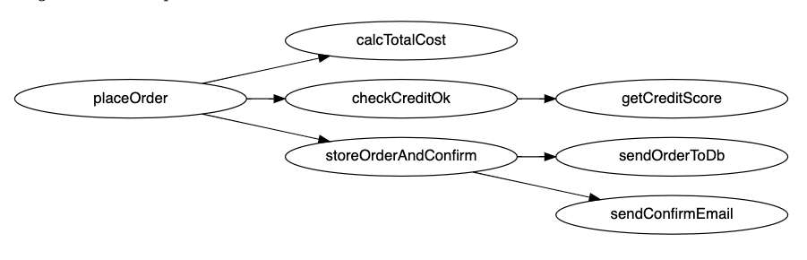
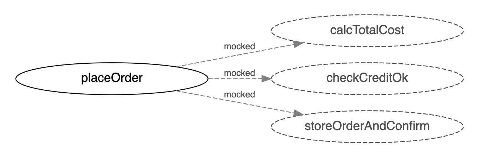

---
date: 2023-04-11
metadata: true
concepts: ['test-driven-dev', 'mocking', 'testing', 'express']
status: 'pre-lecture'
docs: 
cite: ['rithm']
---

## Goals

-   Revisit essential concepts with testing
-   Introduce Test-Driven Development
-   Learn about mocking functions
-   Learn to mock axios calls directly

## Good Testing Practices

- Make sure you write tests!
- Don’t forget to test pessimistic cases and edge cases
- Examine your coverage and decide where you need more testing
- & Make sure in your readme you specify how to run the tests!

### Test the Side-Effect

```js
/** POST /cats - create cat from data; return `{cat: cat}` */

describe("POST /cats", function () {
  test("Creates a new cat", async function () {
    const response = await request(app)
      .post(`/cats`)
      .send({
        name: "Ezra"
      });
    expect(response.statusCode).toBe(201);
    expect(response.body).toEqual({
      cat: { name: "Ezra" }
    });
  });
});
```

- ! We’re not testing if we actually created anything!
-   How should we test this? What do we test?

### One Option: Validate via Database

- Works, and some opinions say this is better strategy
```js nums {15-16}
/** POST /cats - create cat from data; return `{cat: cat}` */

describe("POST /cats", function () {
  test("Creates a new cat", async function () {
    const response = await request(app)
      .post(`/cats`)
      .send({
        name: "Ezra"
      });
    expect(response.statusCode).toBe(201);
    expect(response.body).toEqual({
      cat: { name: "Ezra" }
    });

    const catsRes = await db.query("SELECT name FROM cats;")
    expect(catsRes.rows).toEqual([{ name:"Ezra" }]);
  });
});
```

### Another Option: Validate via API

- $ Rithm recommended way because we’re “staying in one lane” 
	- & But most important to just be consistent
```js nums {15-16}
/** POST /cats - create cat from data; return `{cat: cat}` */

describe("POST /cats", function () {
  test("Creates a new cat", async function () {
    const response = await request(app)
      .post(`/cats`)
      .send({
        name: "Ezra"
      });
    expect(response.statusCode).toBe(201);
    expect(response.body).toEqual({
      cat: { name: "Ezra" }
    });

    const getCatsResp = await request(app).get(`/cats/ezra`)
    expect(response.body).toEqual({ cat: { name:"Ezra" } });
  });
});
```

### Which Is Better?

- Opinions vary, but we recommend the latter strategy
    - It’s helpful to “stay in one lane” with testing
    - Your data models should have their own independent unit tests
- & More important: be consistent with which approach you use

## Test Driven Development

- Write tests *first* - they will fail!
- Only write the code necessary to get the tests to pass
- Focus on completing the task/user story at hand
- As you write more code, keep running tests  and make sure they are passing

- *Red, Green, Refactor*
	-   Your tests fail (red)
	-   You write the code to get the tests to pass (green)
	-   You refactor!

### Benefits of TDD

- Writing tests first helps you understand what a function needs to do
- Writing tests first can prevent you from making bugs in the first place
- Writing tests first leads to higher-quality tests
	- If you write the tests after the code, you often write tests that pass based on your memory of the implementation—rather than the requirements

## Mocking


- Imagine the function placeOrder and what functions it calls:
- It would be very hard to write a function for placeOrder without worrying about all of those other functions!
- However, there may be important logic in placeOrder to test, and it might be useful to test that independently of other stuff
- We can _mock_ those other functions — when placeOrder calls them, the _mocked functions_ do nothing but return a reasonable fake result.



### Why Mock?

- When a function calls other functions and it becomes hard to test
- When a function relies on data that comes from other servers
- When a function relies on something random or hard to predict

### What kinds of things can you mock?

-   AJAX requests
-   Reading/Writing to files
-   _Impure_ functions like Math.random

- A pure function relies only on its input, and its results are never determined by state held elsewhere or a random choice.

## Mocking a Function

demo/mocks/casino.js
```js
const { d6 } = require("./dice");

/** You win if you roll 7! */

function lucky7Game() {
  return d6() + d6();
}

module.exports = { lucky7Game };
```

demo/mocks/dice.js
```js
/** Roll 6-sided die */

function d6() {
  console.log("d6 ran");
  return Math.floor((Math.random()*6)+1);
}

module.exports = { d6 };
```

demo/mocks/casino.test.js
```js
// Since we're mocking something in
// "./dice", must do this before
// loading anything else

const dice = require("./dice");
dice.d6 = jest.fn();

// Now we can do our normal imports:

const { lucky7Game } = require("./casino");

test("always roll 4", function () {
  dice.d6
      .mockReturnValue(4);
  expect(lucky7Game()).toEqual(8);
});
```

- You can provide individual values for each invocation:
demo/mocks/casino.test.js
```js
test("lucky 7!", function () {
  dice.d6
      .mockReturnValueOnce(3)
      .mockReturnValueOnce(4);
  expect(lucky7Game()).toEqual(7);
});
```

- You can see if the function was called as many times as you expect:
demo/mocks/casino.test.js
```js
test("make sure rolled 2d6", function () {
  dice.d6.mockClear();
  lucky7Game();
  expect(dice.d6).toHaveBeenCalledTimes(2);
});
```

## Mocking AJAX Calls

- If AJAX call is in a function, you can mock that function, as seen.
- It can be helpful to use a library specifically for mocking axios, though —  then you can test your API-calling function while still not calling a server.

demo/mocks/nums.js
```js
const BASE_URL = "http://numbersapi.com";
const axios = require("axios");

/** Fact about num from numbersapi */

async function getFact(num) {
  const url = `${BASE_URL}/${num}`;
  const resp = await axios.get(url);
  return resp.data.fact;
}

module.exports = { getFact, BASE_URL };
```

demo/mocks/nums.test.js
```js
const AxiosMockAdapter = require(
    "axios-mock-adapter");
const axios = require("axios");
const axiosMock = new AxiosMockAdapter(axios);

const { getFact, BASE_URL } = require("./nums");

test("fact about 7", async function () {

  axiosMock.onGet(`${BASE_URL}/7`)
      .reply(200, { fact: "7 is lucky" });

  const res = await getFact(7);
  expect(res).toEqual("7 is lucky");
});
```

- There are additional features, like:
	-   simulating slow servers,
	-   network errors,
	-   responding with cookies,
	-   and more!

## Wrap Up

-   Remember to test!
    -   Including pessimistic tests
    -   And examine your coverage to see important gaps
-   Writing tests first (TDD) can be very helpful
-   Mocking functions can be useful
    -   Test a function alone, without calling others
    -   Bypassing random or impure functions
    -   Faking AJAX requests and responses