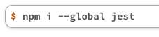
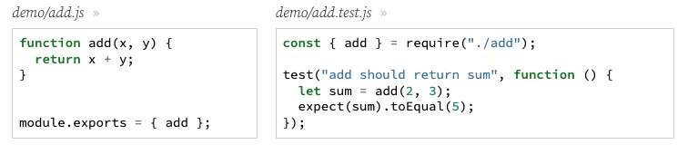
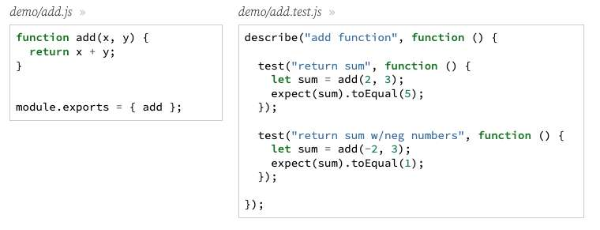
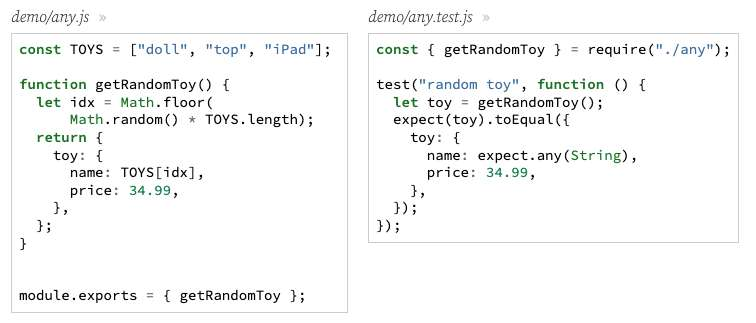
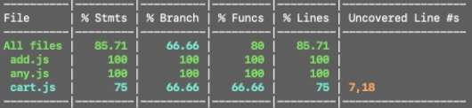

---
date: 2023-04-04
metadata: true
concepts: ['node', 'jest', 'testing', 'coverage']
status: 'pre-lecture'
docs: 
	'jest': 'https://jestjs.io/docs/en/using-matchers'
cite: ['rithm']
---

## Goals

-   Learn to run unit tests using Jest
-   Learn more about test matchers and expectations
-   Learn to use the browser debugger with Node applications

## An Introduction to Jest

### Jest

-   Jest is an open-source testing library
-   It’s built on top of Jasmine
-   Easy to test in environments that aren’t browser-based
-   Also very popular for testing React apps
-   More information: [jestjs.io](https://jestjs.io/)

### Installing Jest



- This installs jest globally so you can use it anywhere

## Organizing Tests

-   Test files should be named `{}NAME_OF_FILE}.test.js`
    -   You can place in the same directory as the JS file it tests, or
    -   You can organize all tests into a folder called `__tests__`
    - *(depends on personal preference)*
-   If you have a `package.json`, you don’t need additional configuration.
    -   If not, create `jest.config.js` file
        -   *(it can be empty, it just needs to exist).*
        - & But need one of these files: either `package.json` or `jest.config.js`
-   Run tests:
run all tests
```shell
$ jest
```
run individual test
```shell
$ jest {NAME_OF_FILE}
```

### Test

- Write tests inside of test function callbacks:


### Describe

- To group together related tests, wrap these in describe callback:
	- This keeps things tidy, particularly when you have many tests



## Expectations

```js
expect(1 + 1).toEqual(2);
```

- Expectations should go inside of <u>test function callbacks</u>
- A function can have several expectations —  but be thoughtful about keeping tests small and simple.

demo/add.test.js (same as above screenshot)
```js nums {5, 10}
describe("add function", function () {

  test("return sum", function () {
    let sum = add(2, 3);
    expect(sum).toEqual(5);
  });

  test("return sum w/neg numbers", function () {
    let sum = add(-2, 3);
    expect(sum).toEqual(1);
  });

});
```

### Matchers

- `.toEqual(obj)`
	- Has the same value (eg, different objects with same values match)
	- & Not the same thing as js === 
- `.toBe(obj)`
	- Is the same object (eg, different objects with same values do not)
- `.toContain(sought)`
	- Does object/array contain this item?
- `.not.`
	- Add before matcher to invert (eg `expect("hi").not.toEqual("bye")`)

… many others, but these are most common
Docs for more: [https://jestjs.io/docs/en/using-matchers](https://jestjs.io/docs/en/using-matchers)

### Matchers in action

- Let’s compare toBe and toEqual

matchers.test.js
```js
describe("matchers", function () {
  test("toBe and toEqual are different", function () {
    let nums = [1, 2, 3];
    let newNums = nums.slice();

    expect(nums).not.toBe(newNums);  // not the same reference!
    expect(nums).toEqual(newNums);   // same values so we use toEqual
  });
});
```

- & Our advice: prefer `.toEqual()` *whenever possible* so that when you *do* use `.toBe()`, it’s obvious that you’re really testing for the same object ref.

### Expecting Anything

- Sometimes, you’re not sure what part of an object will be.
- Use `expect.any(type)` and it will match any of that type.
	- `expect.any(type)` relies on the `instanceof` method



### Other creative test ideas

- Take advantage of built in methods to check unique things that may not have a corresponding matcher in jest:
```js
test('checks if string starts with "hello"', 
	() => { 
		const str = 'hello world'; 
		expect(str.startsWith('hello')).toBe(true); 
	}
); 
test('checks if string does not start with "hello"', 
	() => { 
		const str = 'world hello'; 
		expect(str.startsWith('hello')).toBe(false); 
	}
);
```

## Before / After

### Demo: Shopping Cart Totals

- We have a shopping cart system with function to test:
```js
getCartTotal(cart, discount=0)
```

- ! Spot the repeated code below:
demo/cart.test.js
```js
describe("getCartTotal", function () {
  test("total w/o discount", function () {
    const cart = [
      { id: "le croix", price: 4, qty: 3 },
      { id: "pretzels", price: 8, qty: 10 },
    ];

    const total = getCartTotal(cart);
    expect(total).toEqual(92);
  });

  test("total w/discount", function () {
    const cart = [
      { id: "le croix", price: 4, qty: 3 },
      { id: "pretzels", price: 8, qty: 10 },
    ];

    const total = getCartTotal(cart, 0.5);
    expect(total).toEqual(46);
  });
});
```

- $ Instead, We can factor out common setup:
demo/cart.test.js - improved
```js nums {5-10}
describe("getCartTotal", function () {
  // will hold the cart for the tests
  let cart;  // Note cart declared here to give access for all fx

  beforeEach(function () {
    cart = [    // Then reassign value inside of beforeEach
      { id: "le croix", price: 4, qty: 3 },
      { id: "pretzels", price: 8, qty: 10 },
    ];
  });

  test("total w/o discount", function () {
    const total = getCartTotal(cart);
    expect(total).toEqual(92);
  });

  test("total w/discount", function () {
    const total = getCartTotal(cart, 0.5);
    expect(total).toEqual(46);
  });
});
```

- function declaration and arrow functions are both accepted for tests with Jest
	- & #tip Brit - Best practice is to follow the style of the codebase you are in

### Before / After

- Jest gives us _hooks_ we can tap into so we don’t repeat common setup/teardown:
	-   For *one-time* setup/teardown:
	    -   beforeAll: run once before all tests start
	    -   afterAll: run once after all tests finish
	-   For *frequent* setup/teardown:
	    -   beforeEach: run before each test starts
	    -   afterEach: run after each test finishes
- Before/after fxs don’t *have* to be inside a describe fx, but it’s probably more useful to have them inside of a describe, since the before/after fx will be tailored to that group of tests

```js
describe("my set of tests", function () {
  beforeAll(function() {
    console.log("Run once before all tests");
  });

  beforeEach(function() {
    console.log("Run before each test");
  });

  afterEach(function() {
    console.log("Run after each test");
  });

  afterAll(function() {
    console.log("Run once after all tests");
  });
});
```

- Can put these directly in file (outside of functions) to run before/after any/all tests in entire file.

## Command Line Options

- Jest comes with many command line options to make testing easier, here are a few:
	-   `--watch` (useful for detecting changes in a javascript file specifically)
	-   `--watchAll` (useful for detecting changes in any file (including html, etc.))
	- ~ Note: you need to have a .git repo in order for these watch flags to work, b/c leverages .git for it’s functionality
- Jest also comes in with a built in report for coverage!
	- `--coverage`

### Coverage

- If you run your tests with `--coverage` flag, Jest will:
	-   Output a report in the terminal, showing:
	    -   Statement coverage: has each statement been executed?
	    -   Branch coverage: has each branch of control structures been executed?
	    -   Function coverage: has each function been executed?
	    -   _Don’t worry too much about these; the differences are often minor_
	-   Generate a report you can view in the browser



### Guidelines around coverage

-   100% coverage is an ambitious goal — and not always worth the effort
-   Focus instead on maintaining good coverage, especially of bug-magnet parts
    -   A good rule of thumb is not to go below 90% coverage/ 95% coverage
-   Use coverage to figure out what has been tested and what hasn’t

