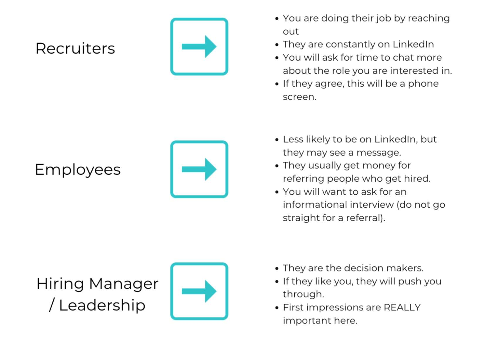

---
date: 2023-06-14
metadata: true
concepts: []
status: 'pre-lecture'
docs: 
cite: ['rithm']
---

- Most messages will be very short - linkedin restriction

## Understand target audience

- Recruiters:
	- Make sure you make a *clear* request
	- NOT can we talk, seen that you’re hiring, I’m interested but have questions
	- & Reach out - after you’ve applied - be direct
		- I’m a software engineer
		- I’m looking for a job
		- I’ve seen your job posting
		- I’m really interested
		- I’ve submitted my application
		- Looking forward to our chat
	- Worry about referrals later on
	- Likely to not respond
	- May not respond but reach out via email
	- & Helpful to add a link to your calendar so they can schedule time
- Employees
	- may have connection in common, or a stranger
	- Good idea to get info about team, role, etc.
	- Some of this informational interviewing
	- likely to be
		- hey i have seen this job
		- i’m really interested in learning more about what it’s like to work on team
		- would you have a few minutes to chat
	- You have already applied
	- regarding asking for referral
		- build the relationship first
		- if it seems appropriate, then ask for referral
- Hiring Managers/ Leadership
	- can fast track app
	- You’ve already applied
	- first impressions are really important
	- have a polished message
- every time you send a message
	- think about → what can you do for them?

### RESEARCH

Take time to look into whoever you are writing to (use LinkedIn / Google) to make sure you are asking the right person and ask yourself: 

- How long have they been at this company?
- What can you see about their career/passions?
- Have they written a blog post you could refer to?
- Anything interesting/unique about them?
- Any shared interests, skills, or background (location, alma mater)?
- Any new news on the company you could reference?
- Note anything else that feels relevant/professional.

### STRUCTURE

- The structure of a LinkedIn message:
	- Greeting
	- Acknowledge human / engage them with a question
	- Share why you are reaching out
	- Offer value
	- Ask for call
	- Sign off

- Be mindful of not using “I” too much.  Make this about the person you are writing to.  
- Add value.  
- YOU ARE VALUABLE! Come from that place as you write.

##### EXAMPLES

 Greeting: Hey Sarah!  Happy Monday! / Hope you are well. / How are you?

Acknowledge human + engage with a question: Congrats on your role at SpaceX! Your recent blog post about the future brought up some mind-bending points! You mentioned that we'll be living on Mars by 2035, would you go if you had the chance? 

Share why you are reaching out: I am reaching out because I saw the Technical Recruiter position you posted and would love to learn more. 

Offer value: My current role is coaching job seekers on the job search and interview process, so I have an intimate understanding of their needs and career goals and would love to contribute to the growth of the SpaceX team!

Ask for a call: Do you have 15 mins to talk more about the role?

Sign off: Thanks for your consideration and have a great day!**

#### More Examples From Former Clients:

###### To A Friend

Hi [Name], hope you’ve been well! I feel like we haven’t talked in ages, [where are you living now]? Reaching out because I saw a [X] role open up at [Company] while job searching. Would love to connect to hear your thoughts about the company!

  

Any chance you’re free to catch up this [Date and Time]?

  

###### To An Acquaintance

Hi [Name]! It’s been quite a while, I hope life has been treating you well since we last talked. [where are you living now?] Reaching out because I saw a [X] role open up at [Company] while job searching. Would love to connect to hear your thoughts about the company!

Any chance you’re free to catch up this [Date and Time]?

###### To A Rithm Alumni

Hi [Name]! My name is X  and I’m a recent r26 grad from Rithm. Reaching out because I saw a [X] role open up at [Company] while job searching. Would love to connect to hear your thoughts about the company!

Any chance you’re free to catch up this [Date and Time]?

Hi Bob! 

How have you been? 

I have recently transitioned into software engineering and begun the job search in the growing field. I was wondering if you could share about your job searching experience? Is there anything that you would have done differently? I see that there are openings at company X, could you tell me more about how you like it there? 

  
Hi Chuck!

Hope you are well!

I'm reaching out because I'm very interested in a Full-Stack Developer role at X. 

While I bring a diverse range of software experience, database management and server support were at the core of my work for my last two roles. I'm very interested in cybersecurity and would love to be part of a company where I can turn my passion into a career.

I submitted my application on LinkedIn and would love to learn more about the role and the team. Would you have 15 minutes this week for a quick chat?

Thank you!

Name

  
Hey [friend]!

I recently graduated from the Rithm bootcamp and am starting my transition into tech. I know you've been at [company] for [number] years, and I'd love to hear about your experience there and your career story. I'd love to chat and catch up! Do you have time for a 15 minute call next week?

  

###### 3rd degree connection

Hi [engineer at company] - I’m considering applying to open [role] role at [company]. Would you be willing to meet with me later this week to talk about the company/team and potentially submit a referral on my behalf. I’ve attached my resume. Thanks so much!

