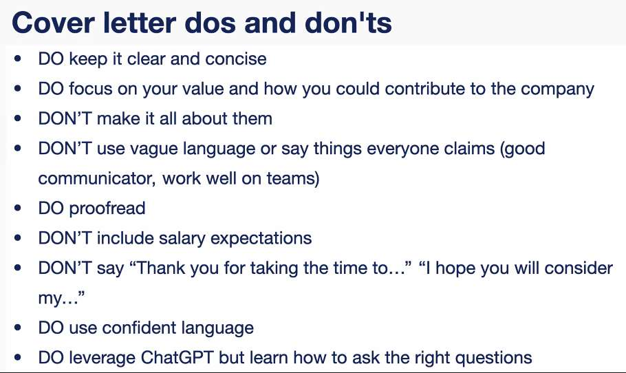
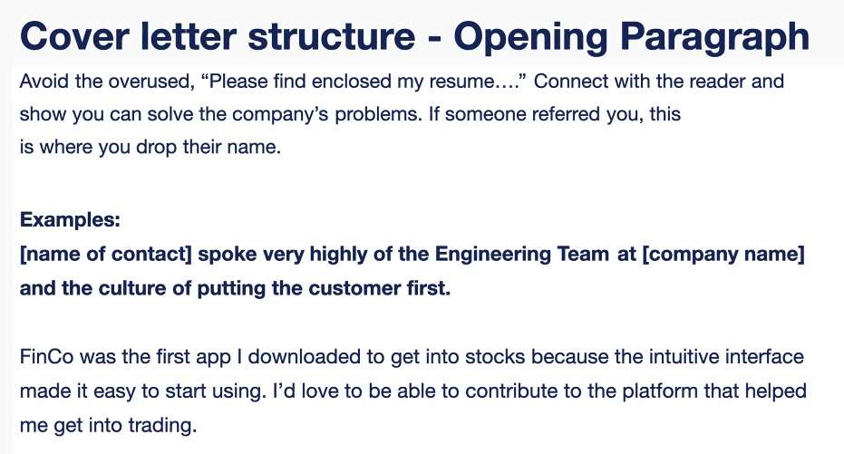
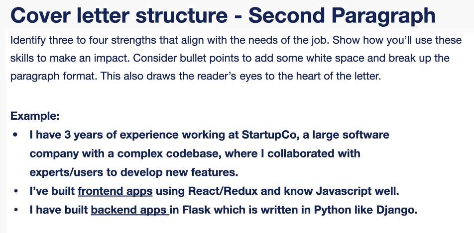
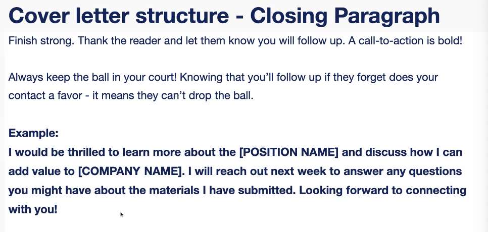

---
date: 2023-06-15
metadata: true
concepts: []
status: 'pre-lecture'
docs: 
cite: ['rithm']
---

## Cover letters:

- Keep to 1/2 page
- too long and they’ll stop reading

- end cover letter with:
	- Looking forward to talking, when can we meet

- Chat GPT:
	- first is very impersonal
	- prompt it:
		- hey chat gpt, add more details about X value
	- ask to change the tone of the cover letter:
		- change based on your personality

