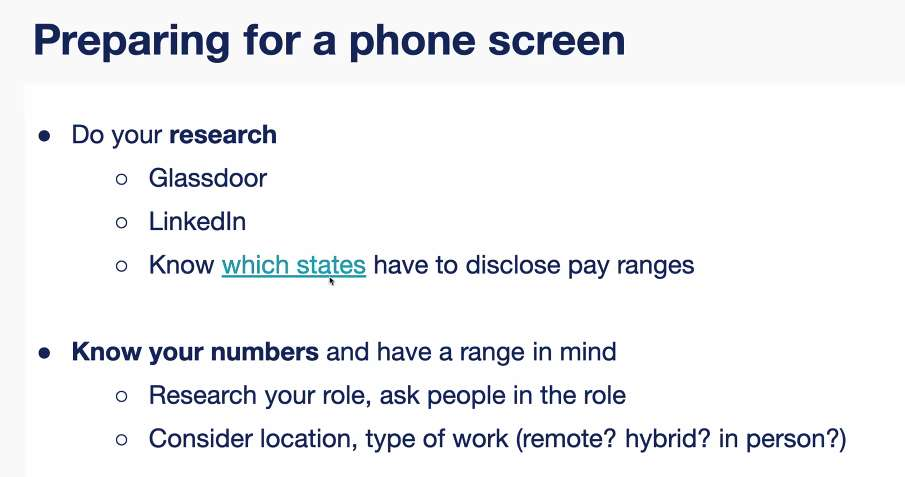
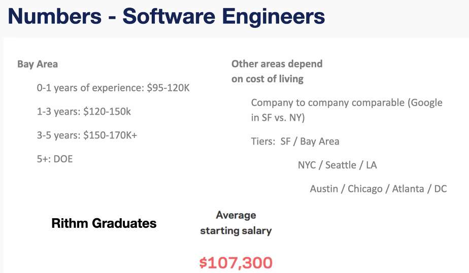
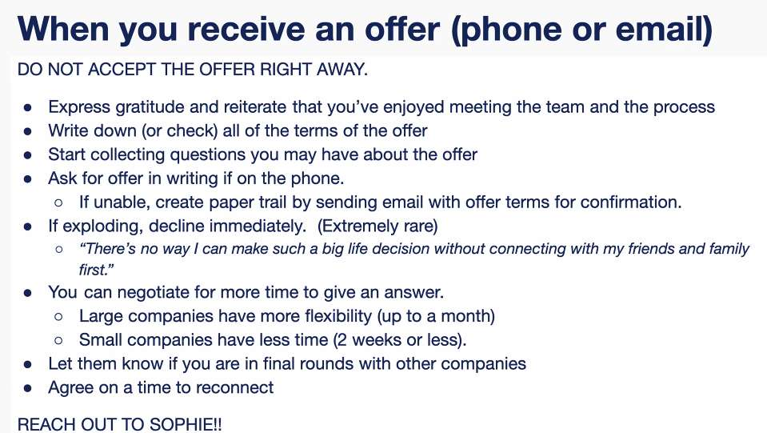
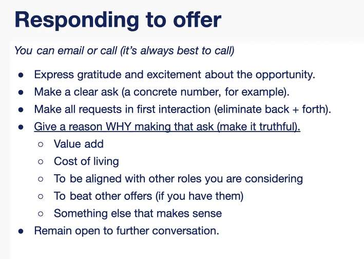

---
date: 2023-06-15
metadata: true
concepts: []
status: 'pre-lecture'
docs: 
cite: ['rithm']
---

- Room for negotiation: 10-12% above offer

If ask salary expectations:
Text box: Flexible, N/A, Would love to discuss later in the interview process
Dropdown:  Respond based on your budget/research
Sophie recommendation: 110-120, 120-130

Also salary.com - can look at median salary

Tiers:
Tier 1: bay area/seattle

Slight decrease in comp when everything is remote, but this is changing back - shouldn’t be huge difference between remote v in person.

3 salary bands per tier
Remove 5-10K between each tier

- Need to share an exact location with company
	- needs to be accurate

if they don’t put in writing: you can respond in writing:
“just to confirm, your offer includes base compensation of X”

if you only have 1 lead - don’t wait more than 1-2 days.

other things to ask: computer/phone provided
computer - typically provided
phone - rare

if not clear about remote - ask 
if flexible - ask about number of days.
if you need to be home on X day for X reason, you can negotiate this, just tell them/ask

1. first negotiate base salary
	1. Thank you so much
	2. Wanted to ask if there was any room in the base salary - I was hoping to make X

## Matthew

UDP - fire and forget for applying job

how to avoid getting filtered out - not only by ATS, but at all

what are the best questions to ask?
- demonstrate resourcefulness and preparation, or lack thereof
- the list of questions you can find online are a starting point
	- if you don’t understand the question
	- or don’t genuinely have an interest
	- these are bad questions

first - define what you want in your job search:
- think about everything you need
	- values
	- min salary
- this sets you up for success

when you’re looking for a job, everything is an interview

#### How to prepare once you’ve found something that matches your values and objectives

- Dig deep
	- read engineering blogs
	- look for news
	- culture
	- challenges their facing
	- request demo
	- explore their api
	- learn everything you can publicly
- reach out to employees - don’t fall into trap of asking question easily found on google or the website
	- recruiters
		- job is to find best talent
		- your advocates
		- intimate knowledge of every step, and will likely readily share this info, or tell you how to stand out
		- don’t hold back when talking to recruiters
		- can ask pointed questions
			- ask specific question about interviewers
			- common reasons ppl get rejected
			- 
	- engineers
		- potential future colleagues
		- ask about intriguing work, or blog post
			- demonstrate interest
		- shows team dynamic and culture
		- referrals - 
			- many companies have referral programs
			- place premium on referrals from engineers
	- chat gpt
		- can use it to help analysis
		- or write professional messages
		- Does well when provided info, and you tell it exactly what you want
		- stream of consciousness to gpt, tell it what you want with iteration
		- lets you do more in less time
- leverage your network
	- matthew
	- sophie
	- elie
- 