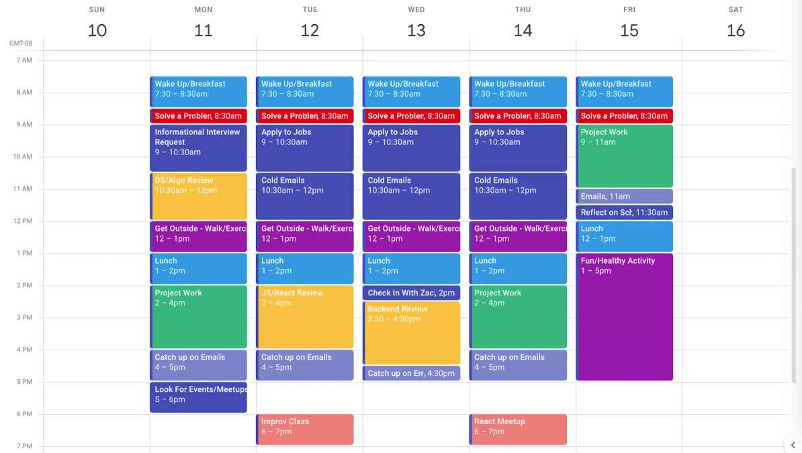
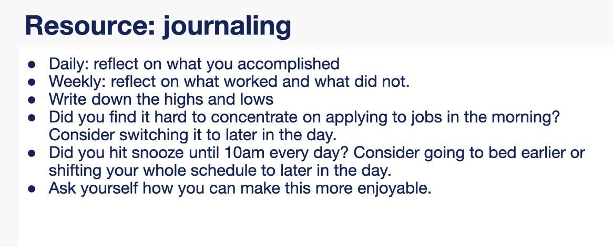
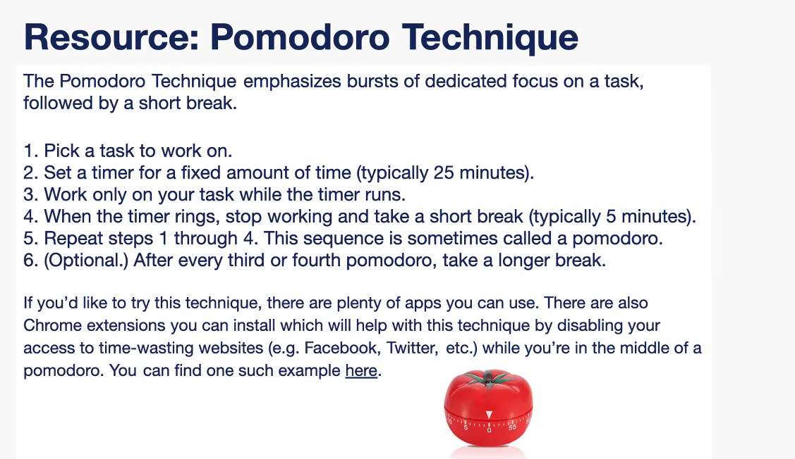
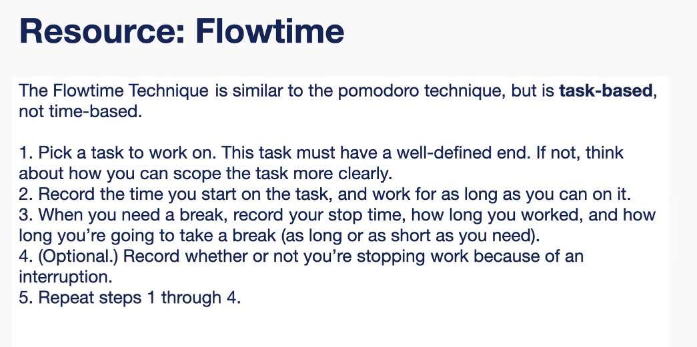
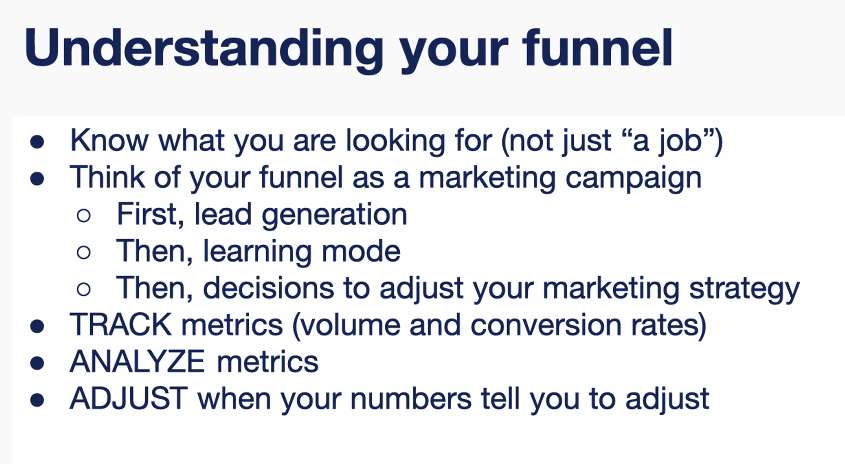
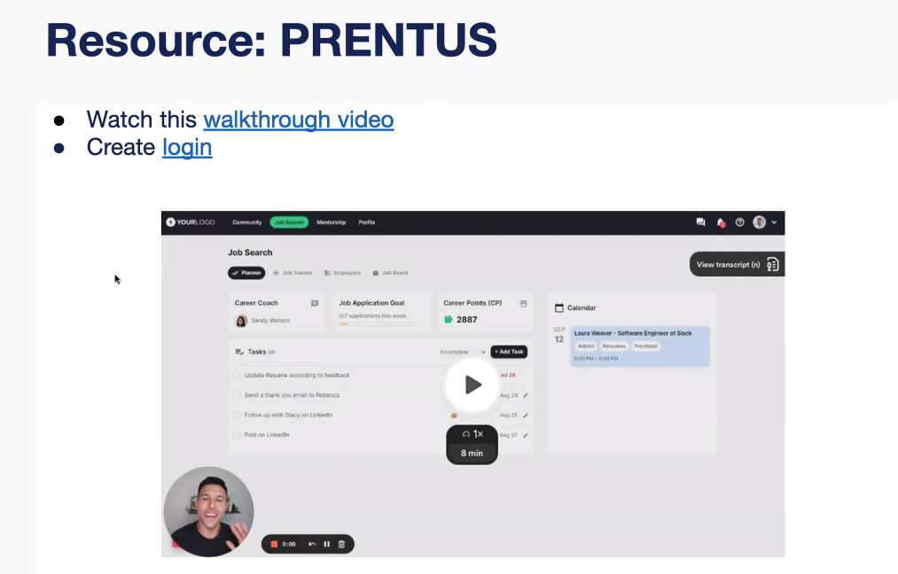

---
date: 2023-06-12
metadata: true
concepts: []
status: 'pre-lecture'
docs: 
cite: ['rithm']
---

- Focus on connecting with the people during the technical interview

- market
	- cold applications shouldnt be first thing you do
	- start with warm applications

- Question everything you do
	- it’s been 3 weeks - not hearing back → what do I need to change

- Keep eye out on trends
	- show curiosity and engagement

- hackerrank annual skills report - all tech being used by who and why

1. Apply
2. Reach out to someone - tell them you’ve applied
	1. If you need to 

## Steps

### Application Step
expect 1-1.5 hr per application

1. knowing where to look for jobs
	1. making sure these are a good fit for you
2. Find a job
3. Research the company
	1. potentially add something specific about the company into your application
4. Check your linkedin network
	1. Do you know someone at the company?
5. Write cover letter
6. Apply to job

### Learning and development
maintaining skills for swe

- Continuing to work on projects, 
	- Open source projects
	- Don’t go back to previous projects and improve, build new things
- DSA
	- 1 hour with problem
	- 1 hour reviewing the dsa/problem
- The more you do here, the more you’ll have to talk about

### Self Care

- Don’t work on weekends
- Don’t just job search all the time
	- burnout quickly

### Interviewing

- Don’t get too invested when you get an interview
- After each interview
	- 30 mins - reflection, learnings, findings
		- keep track of questions asked and answers
- Prep for interviews
	- taks so much time
- Phone screen
	- research company
	- research person
	- think about the types of questions they are going to ask
		- what kind of engineer are you? 
- Practice whiteboarding interviews 2x/week

### Networking

- Local Events
- Goal: every week needing to be somewhere - putting it on calendar

## Calendar

## Journaling

end of week or every other week

1. book reccurring meetings
2. create calendar

