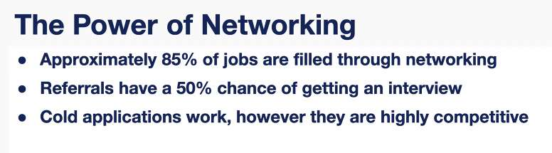
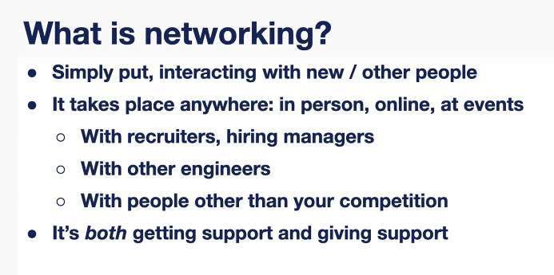
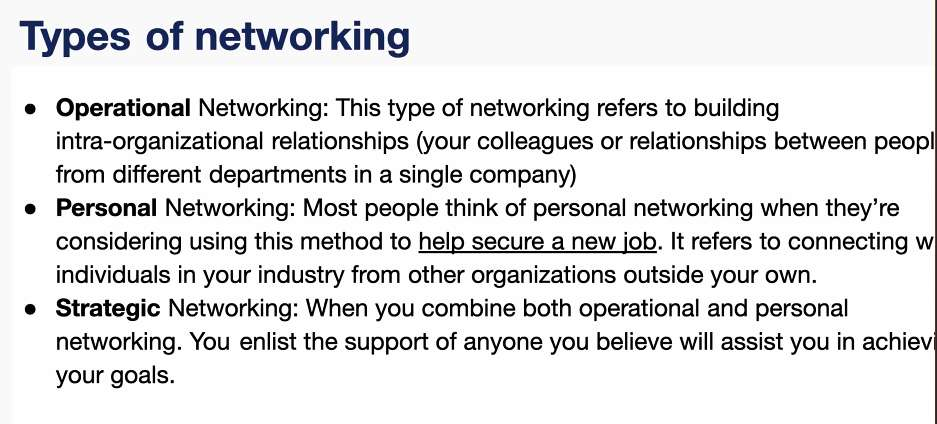
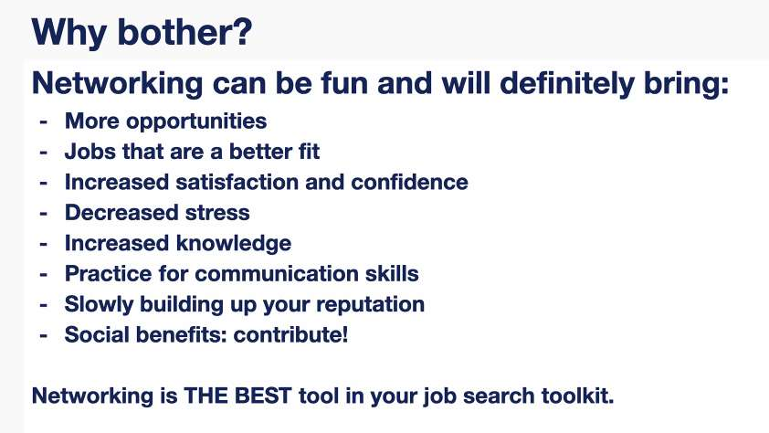

---
date: 2023-06-13
metadata: true
concepts: []
status: 'pre-lecture'
docs: 
cite: ['rithm']
---

##  Cold Application

- resume
- cover letter
- outreach on linkedin

## Networking events

- look for general networking events
- the fewer engineers there, the more you can stand out

- important to build reputation within an industry
- don’t stop networking once you have a job

– Resource groups: opportunity for networking

## where to find events:

- on all you can find 
- eventbrite
- meetup
- google
- local engineering events
- local general networking events
- Network after work
- check for online events
- check for annual conferences, company events

– Can turn event into content you can share:
 - Choose something you want to know about, ask a number of people about them 
 - Take a couple photos
 - Make a linkedin post about it

## Assignments

1. Resume
2. LinkedIn Profile
	1. groups
	2. about section
	3. work experience
	4. featured: add your resume
	5. update industry settings
3. Posting on linkedIn
	1. like/share/comment each others posts
4. Create few outreach templates to use starting next week

## Tomorrow

- answers to prepare for interviews