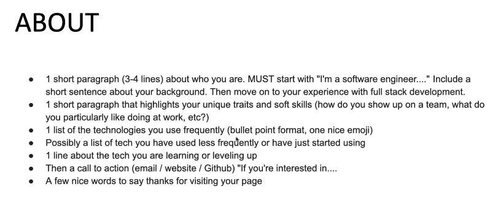

---
date: 2023-06-13
metadata: true
concepts: []
status: 'pre-lecture'
docs: 
cite: ['rithm']
---

## Linkedin

title, location, dates, name of company 
- exactly the same

- Groups:
	- strong recommendation
	- join 5-10 groups
	- javascript developer
	- react developer
	- ted talks
- Open to work
	- nice to have
	- can help recruiters find you
- Creator mode
	- record saying your name
	- video intro
		- excellent way to present yourself
		- warmer intro
		- strongly recommend

## Looking for jobs

- filters:
	- years of exp
	- remote/ in person
- look for companies where you have 1st/2nd/3rd degree connection

1. Job description
2. Company website - confirm interest in company

## Looking for people

- People who are hiring
	- type in search bar “hiring” “software engineer”, then click on people
		- get ppl with the banner, or have “we’re hiring” in banner

## groups

- Takes 1-3 days to join group
- Interact with the posts - like, comment, share, repost, tag ppl who are responding to those conversations
- the more engaged you are - the more visible you are
	- if you don’t post/interact etc. for 90 days, you disappear for the recruiter
	- recruiters will look at your profile
		- then will look for engagement
		- will want to see own posts
- Goal of the groups is for them to support your job search
- helpful to find groups that post content
- Should always be positive & supportive, and relative
	- don’t hesitate to leave if this isn’t the case

- Premium subscription:
	- Yes very helpful but only if your profile is ready
	- free for 30 days
	- reasonable investment
	- gives a lot of info about companies
	- insight into job posting
		- how many ppl applied
		- seniority
		- location
	- access to inmail
		- 5 credits per month
		- ability to send a long private message to someone your not connected with
	- gives reputation on linkedin
	- linkedin learning - helpful but 60-70/month
		- integration with public library?
		- can share accomplishment on linkedin
	- but need to use it well

## Other sites

- Indeed Jobs similar to those on linkedin
- AngelList - > now WellFound
	- focuses on startups, small orgs
- Google
- Otta → daily/weekly digest → jobs that are good matches
- simplify

## Github

- Next place the hiring manager or recruiter will look
- may be way to integrate github and linkedin with a profile section
- pin current projects
	- keep these updated
- 1 excellent readme
- looking for documentation
- leethub - auto pushes your code from leetcode to github

## Technical recruiters from previous grads discussion

- Recommendation:

