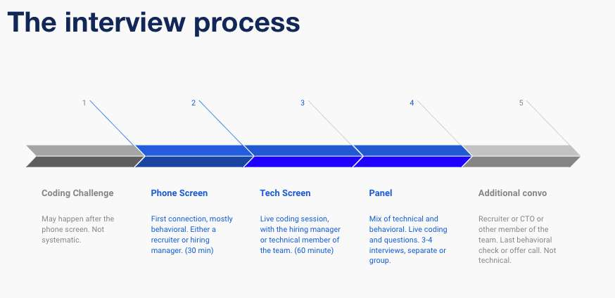
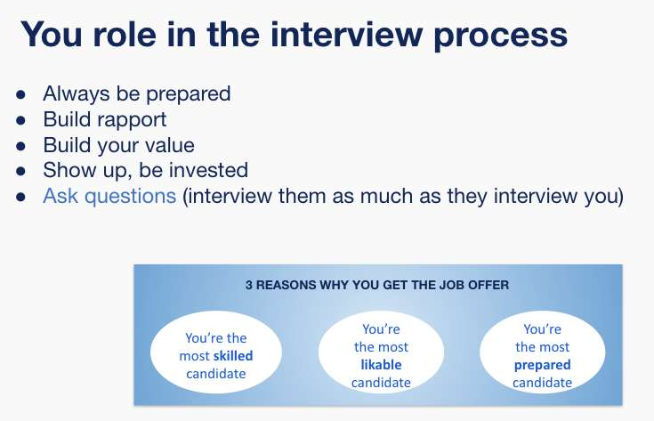
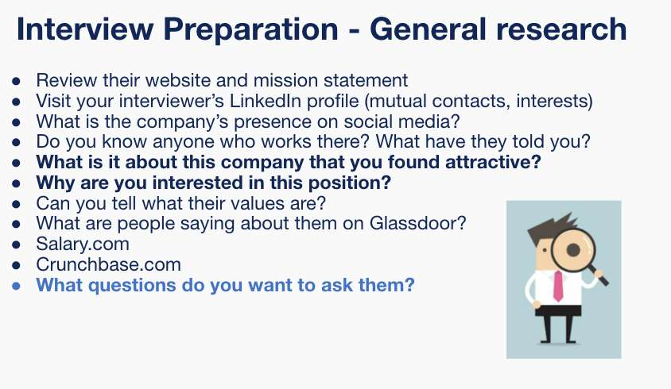
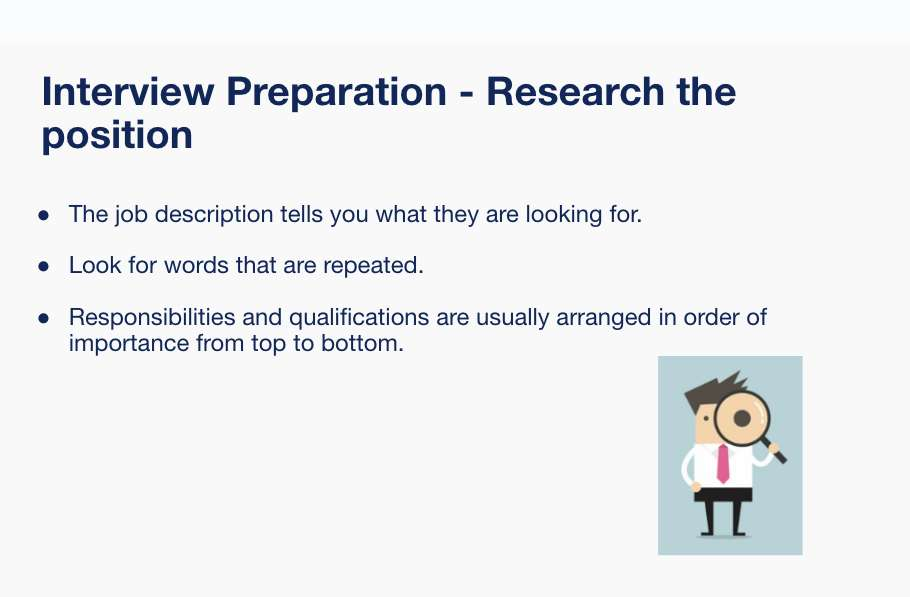
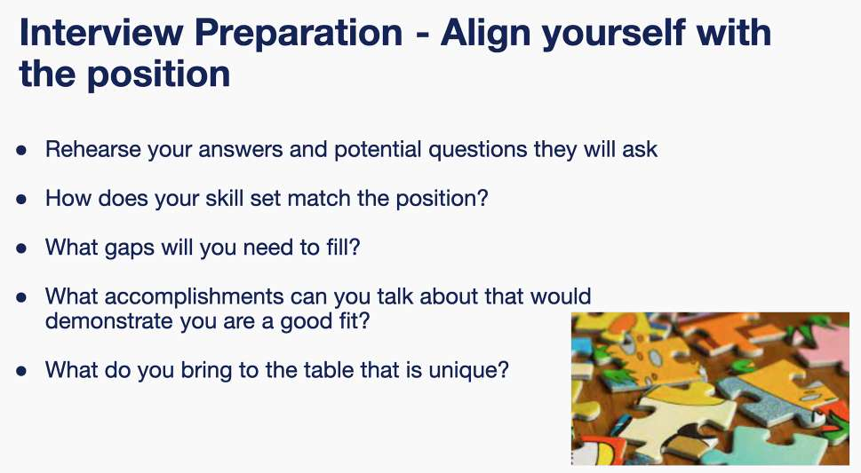
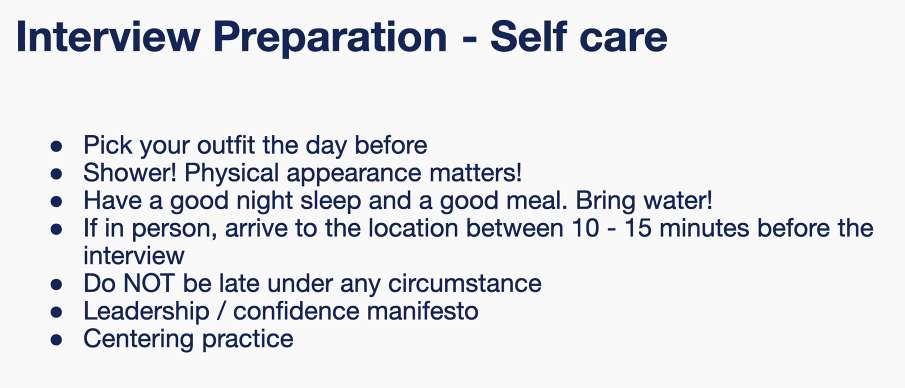
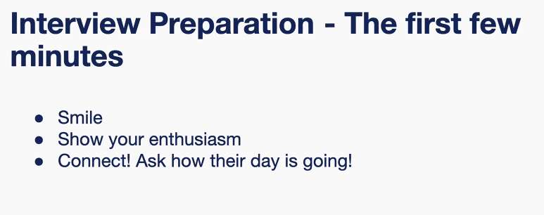
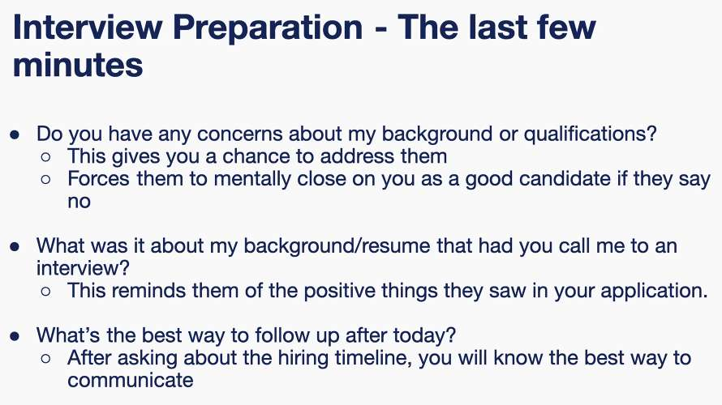
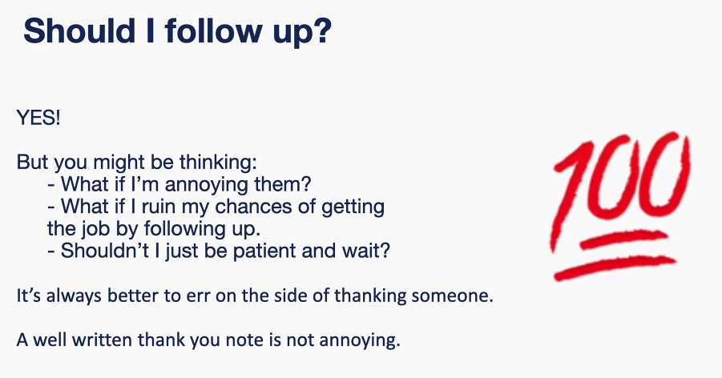
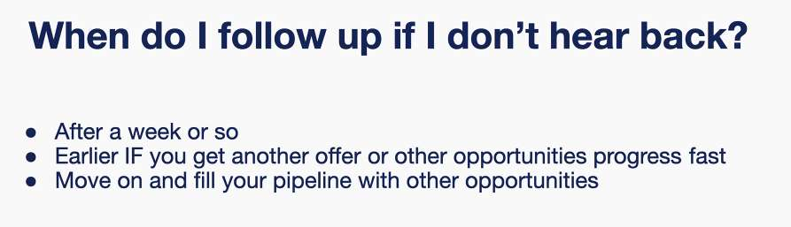

---
date: 2023-06-14
metadata: true
concepts: []
status: 'pre-lecture'
docs: 
cite: ['rithm']
---

- Don’t avoid talking about knowledge gaps
	- I don’t have experience with C sharp, but I’ve researched it and expect it would take me X time to learn.

5-10 things you’re really good at 
centering practice 5-10 mins before interview
phone interview especially - stand - gives you more energy, you sound more engaged.

after 2-3 email follow ups, move on, focus on other opps

- Look for technical recruiter
- look for engineering manager
- look for other software engineers
- look for anyone
- okay to reach out to 3-4-5 people at company

- you can feel that it went well → and it actually didnt’
	- or you can think it went horribly
- boxes
	- confidence - talk about yourself confidently.
		- personal narrative most important
	- excited - want to see excitement & interest. Why are you interested in talking with them. Find a connection to the organization and the role
		- if you talk about yourself, but don’t connect yourself to org - they’re not going to be as interested in you
	- curious
		- did you ask questions

Assignment:

mock interview prep
- being ready for a conversation with a recruiter at pintrest
- Prep:
	- document each step you take to prep for interview with recruiter
		- what page do you go to
	- do you have connection
	- do they hire bootcamp grads, etc.

## Activity:

- target info that is helpful to you
	- question to ask
- don’t invest hours of research for each phone screen, but is helpful to do some focused search
- glassdoor: mixed reviews
	- look for trends
- recruiter - hard to find
	- company is large
	- general description
	- hiring multiple software engineers for multiple teams
		- opportunities that are finally opening up
	- larger companies hiring for multiple positions
	- possible to look for linkedin - technical recruiter - pintrest
- reading through website to see how pintrest views themselves
	- picking out keywords
- look at other job descriptions on the site
	- gave 
	- looked at financial statements - 5% over year growth - steady
	- 20% users from us, but 80% revenue from u.s.

- knowing when your ready to apply
- knowing what you’re going to be compensated for in your work
- post covid - salary tighter
	- closer to 110-115  typical
- how many engineers are you looking for?
	- whats the focus? what’s the need?
- enthusiasm and motivation
	- #1 inspiration biggest value
		- how do you get inspired
		- how you want to inspire other people
		- what inspires you, who inspires you
- looking through linkedin and seeing who also works at same college
- business interfaces and growth
	- & tip: look at other job descriptions
	- formatting of the other jobs match
- consumer facing app:
	- just want to be aware of the app
	- amazon recruiters:
		- pet peeve - have been an amazon prime member for # years
	- helpful to know the pain points for the user
		- obscure
		- hard to create a board

## star

- tell me about a time when… questions
- 1 technical, 1 soft skills 