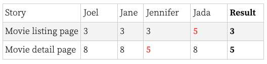
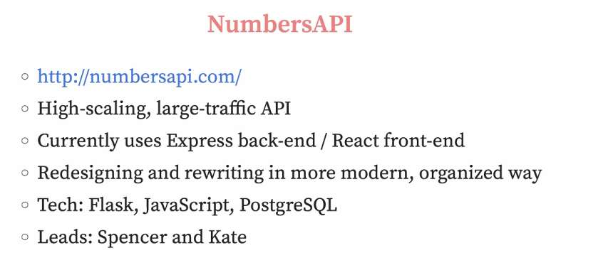
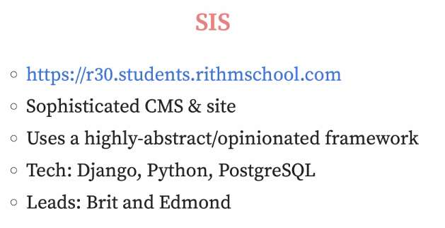

---
date: 2023-05-08
metadata: true
concepts: []
status: 'pre-lecture'
docs: 
cite: ['rithm']
---

## Intro

-   Quick orientation of agile development
-   Project estimation
-   Standups
-   Intro to Projects / Teams

### Goals of Projects

-   Work with existing code base
-   Practice common professional processes
    -   VCS process, standups, issue tracking
-   Deeper understanding of taught technologies
-   Introduction to other technologies

### How Things Work

-   Team meetings at the usual morning time
-   Lunch is on your own
-   We’ll work until 4:30-5:00pm
-   Fridays: no project work
    -   am: Lucy + Vanesa presentation on outcomes
    -   pm: Tech presentation & lightning talks

## Agile Development

### Agile Manifesto

-   **Individuals and interactions** over Processes and tools
-   **Working software** over Comprehensive documentation
	- used to be that user manual was written before the software
-   **Customer collaboration** over Contract negotiation
	- oftentimes on a daily basis
	- can’t finish 2 things by next week, which one do you want us to work on?
-   **Responding to change** over Following a plan

The introduction of the manifesto read:

> The Agile movement is not anti-methodology, in fact many of us want to restore credibility to the word methodology. We want to restore a balance. We embrace modeling, but not in order to file some diagram in a dusty corporate repository. We embrace documentation, but not hundreds of pages of never-maintained and rarely-used tomes. We plan, but recognize the limits of planning in a turbulent environment. Those who would brand proponents of XP or SCRUM or any of the other Agile Methodologies as “hackers” are ignorant of both the methodologies and the original definition of the term hacker.
> 
> —Jim Highsmith

### However

-   This doesn’t mean “no planning”.
	- window of planning: today, this week, this sprint
-   It’s helpful to think about what Agile was a response to.
	- older method of software development - waterfall
		- was a contractually formalized, rigid way
-   It means: “build what’s needed, planning at the right time & level”

### Principles

-   Daily **cooperation between client and developers**
	- the person who leads the budget for this
-   **Deliver frequently** (every day or week)
	- committing frequently, checking off bugs
-   **Working software** is the principal measure of progress
	- completed 26% features that have been storypointed
-   **Sustainable development** at a constant pace
-   **Simplicity** — the art of maximizing work not needed — is essential
	- simplify the features until you know they’re needed
	- build what’s needed - with a reasonable amount of planning

### Common Methodologies

-   Pair programming
	- some companies exclusively pair - every day
	- some do it intermittently
-   Testing and Test-Driven Development
-   Planning poker
-   Velocity tracking

## Estimation

- time estimation has been studied a lot
- software engineering planning different than other types of engineering

### Make “Stories”

- description of a feature
- oftentimes a feature will have several stories

For example:

> As a user, I want to see the details of a movie,  
> with a list of other users’ ratings and the output of my  
> estimated rating (calculated in a separate story)

### Estimation

It’s hard to know how long it takes to build software.

-   Really hard
-   Guessing based on previous projects sometimes helps a _little_
-   But speed on new projects can vary a lot

### Relative Estimation

Studies find we’re much better at “relative estimation”
- relative to other parts of the software
- when we remove the units, we are much more accurate

> “The movie detail page will take  
> twice as long as the movie listing page.”

### Planning Poker

Deck with: 0, ½, 1, 2, 3, 5, 8, 13, 20, 40, 100, and “Never”

-   For each story, everyone simultaneously reveals their estimate (also called secrets)
    -   High and low outliers are asked to explain their votes
    -   A group decision is made (by consensus or vote)
-   Record points for each story and for total of project

<table><colgroup><col width="30%"> <col width="14%"> <col width="10%"> <col width="18%"> <col width="14%"> <col width="15%"></colgroup><tbody><tr><td>Story</td><td>Joel</td><td>Jane</td><td>Jennifer</td><td>Jada</td><td><strong>Result</strong></td></tr><tr><td>Movie listing page</td><td>3</td><td>3</td><td>3</td><td>5</td><td><strong>3</strong></td></tr><tr><td>Movie detail page</td><td>8</td><td>8</td><td>5</td><td>8</td><td><strong>5</strong></td></tr></tbody></table>

### But What Are Those Numbers?

“Story points” = “Relative units of effort”

- no index of X points = 1 day, because we are bad at that estimation
- Try to let go of hours/days, but relative for what is a reasonable question
- Or might start off 1 point  = 2 hours, but don’t keep thinking in these terms

3 sprints: roughly 1 sprint per week
Team lead will give a bunch of stories, will rate each
At end of each sprint: will come back and review - often called sprint retro

## Velocity

- As the team works on the project, revisit the estimations
    - Over time, calculate _velocity_: effort-unit to developer-time
- Often, the velocity is reasonably stable
    - This allows you to better estimate what future phases will take

## Standups

-   Agenda
    -   What did you do **yesterday**
    -   What are you going to do **today**
        - ex: we have few more tests to write
    -   List any **blockers**
        - something that is *preventing you from doing work*, that *someone else* can do for you
        - ! not: reading documentation about X
-   Timeframe
    -   Try to keep your report to 90 seconds
    -   Questions/offers for help after _everyone_ is done

- & Remember, a “blocker” means “I’m stuck and won’t make progress on this without someone helping me.” It doesn’t mean “this is something I’m working on that’s challenging.”

- & Jot notes down for yourself for these meetings

- @ All the people on the team/ roles
- team lead, project owner, client
	- Team lead - Brit/Edmond
	- Team lead - Kate/Spencer
- Joel - owner of the codebase

- When you ask for help:
	- What is happening
	- Your team lead is always busy
	- Think about strategies to help them like you the most

## Resources

-   [Agile Overview](https://en.wikipedia.org/wiki/Agile_software_development)
-   [Velocity](https://en.wikipedia.org/wiki/Velocity_(software_development))
-   [Test-Driven Development](https://en.wikipedia.org/wiki/Test-driven_development)

Projects:

- Numbers API

- SIS

