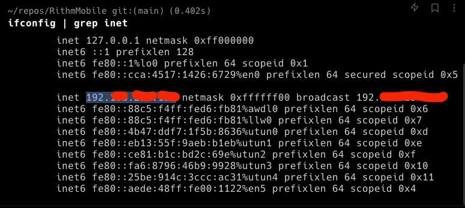

---
date: 2023-05-25
metadata: true
concepts: []
status: 'pre-lecture'
docs: 
cite: ['rithm']
---

## Local Server Calls in Development

1. Determine your specific IP address by running this in terminal:
   `ifconfig | grep inet`
	1. Get your IP from this line in the output:
	   
2. Run backend server using the following: 
	1. Run this command in the same folder that manage.py lives (for django) or app.py (for flask)
	   `./manage.py runserver ipaddress:8000`
3. Make sure domain name of data matches your ipaddress:8000
	1. (in sis, with django, this meant going to ipaddress:8000/admin and changing a cohort’s domain to be the ipaddress) (NO 8000)
4. In React Native’s code that calls the backend API, update the BASE_URL to start with ipaddress:8000 (and then add endpoints after that)
   