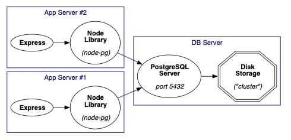
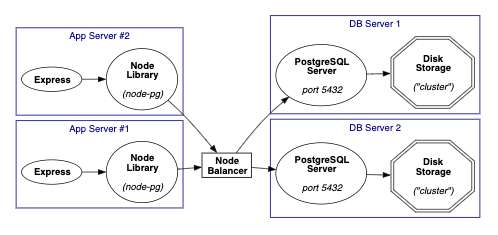
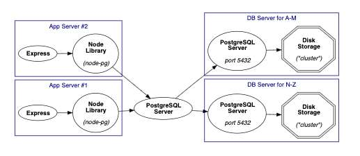

---
date: 2023-05-19
metadata: true
concepts: []
status: 'pre-lecture'
docs: 
cite: ['rithm']
---

## Overview

### Topics & goals

> -   Additional features/ideas for PostgreSQL & rel dbs
> -   Key-Value Stores (redis)
> -   NoSQL databases (mongodb)

##### Goals

Get interested & get exposure — this isn’t core curriculum.

## Deploying & scaling

### Clients can share server


Multiple clients sharing a server

-node pg - python psycopg2

- how much ram
- how much disk space
- how much raw cpu - calculating power 
For each server: how much of each of these do they need

DB Server: uses lots of disk space
Flask/Django:


### Can have several servers


Balance traffic against multiple database servers

- May want this for:
	- security: customers vs staff
	- redundency: if one goes down
		- failover
	- split up if you have so much data
		- customers A-M, N-Z on separate servers
	- need more due to scale
- But how do you sync both servers?
	- NAS - network attached storage literally talking to same hard-drive
	- Or servers talk to each other directly

- Possible setups:
	- One server is normally live, but constantly updates backup (_hot backup_)
	    - If main server goes down, balancer switches to backup
	    - Server 1 then always sends data to server 2
	- All servers are kept up to date _(more complex to do)_

### Can “shard” database

- split a database into pieces/shards


Direct clients to correct shard for their data

- Works well when data can be split easily.

## Data types

### Types

- In addition to standard SQL types, PostgreSQL can directly store many others.
	- can store JSON directly  with JSONB
	- Geometric types
	- Others

### JSON data type

```sql
CREATE TABLE invoices (id SERIAL PRIMARY KEY,
                       data JSONB);

INSERT INTO invoices (data) VALUES (
  '{"vendor_id": 17,
    "parts": ["A12", "B45"]}');

SELECT * FROM invoices WHERE data @> '{"parts": ["A12"]}';
```

- Can be useful for storing/querying JSON results from APIs

- ~ Note: JSONB
	- That’s not a typo — the JSONB (note “B”) type is a “binary” version of JSON. This is not stored as a string in the database, but as a parsed object, making it much faster.

### Geometric types

```sql
CREATE TABLE geo (id SERIAL PRIMARY KEY, p POLYGON);

INSERT INTO geo (p) VALUES(
    '( (10, 10), (20, 10), (20, 20), (10, 20) )');
INSERT INTO geo (p) VALUES(
    '( (60, 60), (70, 60), (70, 70), (60, 70) )');
```

Can find if a point is inside
```sql
SELECT * FROM geo WHERE '(15, 15)' <@ p;
```

Can find if polygons overlap:
```sql
SELECT '( (15, 15), (25, 15), (25, 25), (15, 25) )'
    && p FROM geo;
```

### Others

- Arrays
	- original 
	- scalar data classic relational database
	- flexibility in querying
	- querying often, changing often
	- when okay to collapse data
- Precise decimal number types
- Geospatial information
    - Via **PostGIS** add-on
- Ranges
	- Good for birth-death
- Network addresses
	- IP addresses, etc.

You can even write your own!

## Features

### Views

- An abstraction of a query — it looks & feels like a table!
	- but is a living breathing question
- Great for:
	- hiding complexity
		- separation of concerns
	- security - protect this way of accessing this data, so if the query needs to change, people that use it don’t have to change their way of accessing it
- Not postgres specific, almost all relational databases provide views

```sql
CREATE VIEW full_time AS
  SELECT * FROM emps WHERE full_time;
```

```sql
SELECT * FROM full_time WHERE dept_code='legal';
```

- This really runs the underlying query

### Updatable views

For single-table views, can update/delete from view:

```sql
UPDATE full_time SET salary = 80000;
```

### Materialized views

- Normal views actually re-run the underlying query when used — materialized views “freeze” the data and are faster

```sql
CREATE MATERIALIZED VIEW dept_report AS
  SELECT dept, phone, count(emps), sum(salary)
    FROM depts LEFT OUTER JOIN emps USING (dept_code)
    GROUP BY dept_code;
```

```sql
REFRESH MATERIALIZED VIEW dept_report;
```

### Full text search

- Can search with `LIKE '_term_'` and regular expressions
	- `LIKE` is not a flexible search
- Can search with `ILIKE` for case insensitive search
- Also includes specialized full-text search option
    - Handles stemming, thesaurus, sounds-like, etc.
    - Excellent for building site search
- Different across sites - postgres vs MySQL etc.
- 

### Security

- Discrete user/group-level security
    - Can control database access
    - Or individual table, view, column, row access

```sql
GRANT SELECT ON emps TO employees;

GRANT SELECT, UPDATE, DELETE on emps TO managers;
```

Pro:
- If you want to reuse the database
- Most secure to have it at database level for sensitive data
- centralizing trust
Con:
- transparency of what security is
- ease of use for developers

- Some programs have the security in both

## Database indexes

### Indexing

- A _database index_ makes a special, fast “index” to search/filter on a column.
- If username column is indexed, queries searching or filtering on username may execute faster because fewer records need to be scanned because of the efficient structure.

- great if you plan to sort, search, filter often
- Makes a copy of info already structured
- much faster cause it can binary search
	- log n vs O(n)

### Index efficiency

- Databases use tree-like data structures to store the index, which can make some searches in O(log n) rather than O(n).
- With 1,000,000 records and looking for a single value in an indexed column, instead of reading each record, it reads log<sub>2</sub>(1000000) ≈ 20 rows.  
- This can be an incredible improvement!

- ~ Note: BTrees
	- The data structure most databases use is a _btree_, a specialized kind of tree, similar to a binary tree, that offers logarithmic sorting. BTrees focus on working with extremely large datasets, and can work well if the index is too large to fit into memory, or requires lots of reading from disk while searching.

### Why not index everything?

- There is a tradeoff with indexing! For every indexed column, a copy of that column’s data has to be stored as a tree, which can take up a lot of space.
- Also, every INSERT/UPDATE/DELETE query becomes more expensive, as data in both the table AND the index have to be updated.

### Creating an index

```sql
CREATE INDEX index_name ON table_name (column_name);
```

- Indexes are automatically added for primary key columns
	- Also FK potentially good idea if following that relationship often
- You can also create a multi-column index — this is useful if columns are commonly searched together (eg, first_name and last_name)

```sql
CREATE INDEX index_name ON table_name (column1_name, column2_name);
```

### How to drop an index in PostgreSQL

- ~ Tip: When to index
	- In your application is more read-heavy than write-heavy, indexes are your friend and can be safely placed on columns that are used frequently in queries to speed up performance. For write-heavy databases, poorly-chosen indexes can be a performance drag with little benefit.
	- However, there are other index types besides the default that may be more efficient for your data, so definitely read up on some PostgreSQL [performance optimizations](https://robots.thoughtbot.com/postgresql-performance-considerations) and [more about indexes](https://devcenter.heroku.com/articles/postgresql-indexes).

## How smart do want your db?

- Easier setup:
	-   Database is straightforward container for data
	-   Logic of joins & features lives in applications

- Possibly Better: database also has:
	-   Validity constraints
	-   Views to abstract away complex queries
	-   Custom functions
	-   Triggers: _(“when stuff is inserted, do this…”)_
	-   Intelligent caching

- Advantages of smarter storage:
	-   Don’t have to repeat logic in different apps that use storage
	-   Can be faster: apps can get less, smarter data
	-   Can enforce logic when database is used directly
	-   Often more likely to change app languages/frameworks than DBs

### Scripting

- Can write server-side functions:
```sql
CREATE FUNCTION slugify(text) RETURNS text
  LANGUAGE plpgsql AS $$
    begin
      return replace(lower($1), ' ', '-');
    end
  $$ STABLE;
```

- Can also write these in JS, Python, Ruby, C, or SQL
- Can access statistical/machine-learning libraries from these languages

### Triggers

- Can auto-slugify on insertion:
```sql
CREATE FUNCTION slug_from_title() RETURNS trigger
    LANGUAGE plpgsql AS $$
      begin
        new.slug := coalesce(new.slug, slugify(new.title));
      return new;
      end
  $$;

CREATE TRIGGER posts_autoslug
  BEFORE INSERT ON posts
  FOR EACH ROW EXECUTE FUNCTION slug_from_title();
```

- Can also use triggers to log data changes:
```sql
CREATE TABLE salary_changes (id SERIAL PRIMARY KEY,
                             emp_id INT,
                             old_salary INT,
                             new_salary INT,
                             ts TIMESTAMP);


CREATE FUNCTION log_salary_change () RETURNS TRIGGER AS $$
  BEGIN
    INSERT INTO salary_changes
        (emp_id, old_salary, new_salary, ts)
      VALUES (old.id, old.salary, new.salary, 'now');
    RETURN new;
  END;
$$ language 'plpgsql';


CREATE TRIGGER log_salary_change
  AFTER UPDATE ON emps
  FOR EACH ROW WHEN (new.salary <> old.salary)
  EXECUTE PROCEDURE log_salary_change();
```

## Transactions

- like a little safety box:
	- if anything fails, better that nothing happens

- Many operations should be _atomic_ (be indivisible)
    - Withdraw $100 from checking → Deposit $100 to savings
    - If program/database crashes midway, you’d lose $100!
    - Also: if Huse runs a query right in the middle of that transaction, want
        - it to pretend that nothing has happened
        - or wait for transaction to end
    - Can wrap in a _transaction_

- & Note Better jobly would have wrapped each (route?) in transactions

transaction
```sql
BEGIN;

UPDATE checking SET amt = amt-100 WHERE acct = 'ABC123';
UPDATE savings SET amt = amt+100 WHERE acct = 'ABC123';

COMMIT;
```

- Some web database frameworks wrap transactions around a request
    - All DB stuff in request succeeds or fails

## Other SQL databases

- SQLite
    - Fast, powerful, easy to use
    - No network protocol, runs on only one computer, stores DB as single file
    - Unusually flexible (eg, can store any data in any field)
    - Used when you have a program on your computer that wants to store data with the power of database/querying
    - embedded database: in apple watch, built in itunes, etc.
    - open source software written by one person - used in billions of places
- MySQL
    - Fast, powerful, high-scaling open source database
    - Less complex features than PostgreSQL
    - Can be easier to scale
- Commercial options _(not widely used at startups)_
    - Oracle
    - Microsoft SQLServer

### MongoDB

- Popular “No SQL” database
- Non-relational database - different way of thinking
	- no tables, no schema, no relationships between things
- Object database
- Dynamic schemas, “document-oriented” storage (vs table oriented)
- No specific standard: 
	- mongodb commands not the same as amazon dynamic db
- These kind of db have duplicate information by design

Good fit: data is hierarchical (possible recursive):

Boardgame collection
```
game: "Ticket To Ride USA"
  - designer: "Alan Moon"
  - rules: "..."
  - colors: ["orange", "white", "red", "blue", "yellow"]
  - num_players: {min: 2, max: 5}
  - variations:
    - game: "Ticket to Ride Europe"
      - rules: "..."
    - game: "Ticket to Ride Scandinavia"
      - rules: "..."
      - num_players: {min: 2, max: 5}
      - colors: ["white", "purple", "black"]
```

### Features

-   When data is arranged well, can often be easily sharded
-   Can use map/reduce operations to do computations in parallel
-   Can map easily between storage and JSON
-   Can have custom functions and indexes, like a rel DB

### Trade-offs

-   There are other NoSQL dbs, but they’re not interchangeable
-   Common to use more storage, since there’s redundancy
-   Redundancies can make it difficult to update data everywhere

Although the title sounds inflammatory (“Why you should never use MongoDB”), this article presents an interesting discussion on the challenges of trying to use document-oriented storage for data which could be normalized: [http://www.sarahmei.com/blog/2013/11/11/why-you-should-never-use-mongodb/](http://www.sarahmei.com/blog/2013/11/11/why-you-should-never-use-mongodb/)

### Vs relational DBs

-   Mongo is getting more rel-db features every release
    -   Recently: custom types, improved validation at DB level
-   PostgreSQL gets more unstructured/recursive features every release
    -   High-performance JSON storage, recursively-nested querying


## Redis

- Super simple
	- faster
	- easier to write without bugs

- Very popular “key-value store” (KVS)
    - Like a network-served hash table
    - python dictionary - only js and python go out of memory when your program stops running
    - These are like persistant dictionaries
- Super-fast for getting a key/value and updating
- Can be easily massively scaled & is widely supported
- Often used to build *caching* systems
	- hold on to this
	- make it super fast to get it
	- transparent caching
- Often used in conjuction with the real database


Hard things in CS:
- Cache invalidation


- What do you need to know:
	- why might views be useful
	- get familier with the concepts
		- pushing that down to the database means you don’t have to write two different validation systems for two different systems

- sqlite comes with your computer and ships with python
	- can make new database right away in terminal
	- no server to set up, nothing to configure, etc.
	- comes with their version of psql
	- since it’s so simple, it can run really fast

- common use case:
	- 60% of apps on cellphone using sqlite
	- in app preference/data storage


