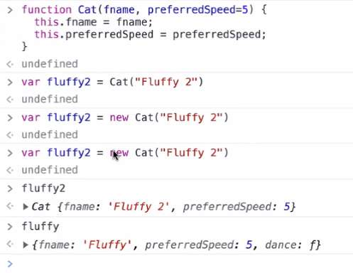

---
date: 2023-06-08
metadata: true
concepts: []
status: 'pre-lecture'
docs: 
cite: ['rithm']
---

## Simple objects and functions

```js
var fluffy = {
  fname: "Fluffy",
  prefSpeed: 5,
};


var puffy = {
  name: "Puffy",
  prefSpeed: 2,
};
```

A traditional kind of function that is given arguments:

```js
function dance(cat, style, speed=cat.prefSpeed) {
  return `${cat.fname} does the ${style} at speed ${speed}`;
}

dance(fluffy, "tango", 8);
```

```js
'Fluffy does the tango at speed 8'
```

## Functions with “context”

A function (method?) that has a clear **context (“noun”)**:

```js
function danceMethod(style, speed=this.prefSpeed) {
  console.debug("danceMethod: this =", this);
  return `${this.fname} does the ${style} at speed ${speed}`;
}
```

Not a property of `fluffy`, so this won’t work:

```js
fluffy.danceMethod("tango")
```

```js
TypeError: fluffy.danceMethod is not a function
```

### fn.call()

This is where `fn.call(context, ...args)` is useful:

```js
danceMethod.call(fluffy, "tango", 8)
```

```js
danceMethod: this = { fname: 'Fluffy', prefSpeed: 5 }
```

```js
'Fluffy does the tango at speed 8'
```

## Objects containing functions (“methods”)

```js
fluffy = {
  fname: "Fluffy",
  prefSpeed: 5,
  dance: danceMethod,
}
```

```js
{ fname: 'Fluffy', prefSpeed: 5, dance: [Function: danceMethod] }
```

- Now we’re keeping the data (the object) & our methods “together” — becoming an **object-oriented** approach.

- We can make fluffy dance like so:

```js
danceMethod: this = { fname: 'Fluffy', prefSpeed: 5, dance: [Function: danceMethod] }
```

```js
'Fluffy does the tango at speed 5'
```

(now we have _enscapsulation_: we’ve brought together the data object, `fluffy`, with the functionality that is related to it)

## When `this` is determined

You might expect this to work:

```js
var makeFluffyDance = fluffy.dance;
```

```js
'undefined does the tango at speed undefined'
```


- JavaScript determines `this` by looking at what the function was called on **at the time of its invocation**, so `makeFluffyDance` doesn’t just use the context of `fluffy`, where you originally got this function!

- & this context determined by *what is LEFT of the dot*  *at the point of invocation*

```js
var makeDanceBoundToFluffy = fluffy.dance.bind(fluffy);
```
- & binding fluffy to a *new* function that is *magically and permanently* bound to fluffy

```js
[Function: bound danceMethod]
```

(interesting implementation detail: under the hood, this happens via a _closure_ — it’s complex stuff, but you can dig in if you’re really curious about sophisticated use cases for closure)

Now, we can use that _bound_ function:

```js
makeDanceBoundToFluffy("tango");
```

```js
danceMethod: this = { fname: 'Fluffy', prefSpeed: 5, dance: [Function: danceMethod] }
```

```js
'Fluffy does the tango at speed 5'
```

- When do you actually use this?
	- when *you* aren’t the one calling it –> when its a callback function
	- super common with react, event listeners, etc.

- How does bind work?
	- using a closure
	- bind is built out of closures

## Sharing methods with other objects

```js
puffy = {
  fname: "Puffy",
  prefSpeed: 2,
  dance: danceMethod,
}
```

```js
{ fname: 'Puffy', prefSpeed: 2, dance: [Function: danceMethod] }
```

```js
danceMethod: this = { fname: 'Puffy', prefSpeed: 2, dance: [Function: danceMethod] }
```

```js
'Puffy does the tango at speed 2'
```

- Now you have 50 cats…..
	- and each have their own methods, that were individually put on each
	- and now you’ve learned that they can sing
		- Kate adds sing to as many cats that she knows about
	- also wastes a lot of memory, tho we do have a lot more memory on computers nowadays

- Of course, hand-creating each cat isn’t realistic: it would be tedious and error-prone.
- We could make a cat by _copying_ an existing cat, therefore getting the original’s properties and methods:

```js
var bob = Object.create(fluffy);
bob.fname = "Bob";
```

```js
danceMethod: this = { fname: 'Bob' }
```

```js
'Bob does the cha-cha at speed 5'
```

- This idea, of not defining methods in any structured way, but just basing new objects on existing objects, was a fundamental idea in the design of JS — but it never truly caught on, and you’ll see this pattern quite infrequently.

```js
danceMethod.call(thisArg, ...arg)
```
- on every function, there is a method “call” which calls that function, letting you control what the context will be.
	- original intention was for .call to always be used
	- () had to be argued
- idea that you could take the data and function and smush them together at the point of invocation
	- gives lots of flexibility, but not a lot of structure

- Two reasons this isn’t done much:
	-   each object is a bit bigger: they both have their own individual copy of `dance()`
	-   if post-creation of `bob`, you add a new method, `sing()`, on `fluffy`, `bob` won’t have it

## Prototypes

- Instead, we can make a _constructor function_ that can make a cat:

```js
function Cat(fname, prefSpeed=5) {
  this.fname = fname;
  this.prefSpeed = prefSpeed;
}
```

- Now, we can make _instances_ of `Cat` with the `new` keyword:
	- mental model for new:
		- new Cat(“Fluffy 2”) same as newCatIAmCurrentlyMaking.Cat(“Fluffy 2”)


- new means that the object remembers that it was made from Cat

- On the function itself:
	- has a prototype

```js
var fluffy2 = new Cat("Fluffy");
var puffy2 = new Cat("Puffy");
```

```js
fluffy2
```

```js
Cat { fname: 'Fluffy', prefSpeed: 5 }
```

… and we can add methods onto _all_ Cats by adding it to the “prototype object” that the Cat function ties each cat to:

```js
Cat.prototype.dance = danceMethod;
```

```js
[Function: danceMethod]
```

```js
fluffy2.dance("tango");
```

```js
danceMethod: this = Cat { fname: 'Fluffy', prefSpeed: 5 }
```

```js
'Fluffy does the tango at speed 5'
```

- ALL functions
	- have method called call
	- have method called bind
	- have a prototype
- What is a function? What is a method?
	- for comparison: in java - all functions are in classes - there are only methods
	- methods: defined inside of class - or if its a function that cares what it’s context is
	- functions: don’t care what their this context is
	- ….some…technically…could say that all functions are methods because you *could* call a function with a particular context


- Now, we have “classes”, basically – a definition of “what is shared” that is separate from the “what are the individual attributes of the objects”.
	- & this is an important piece of intent that is now shared with the code
	- 

- Except that this syntax, of dealing directly with prototype objects, while flexible, is often clunky and hard for new users to understand (in particular, when you start to want to do things like subclassing or adding class methods and such, you really have to get into the grotty details of JS’ implementation of the OO ideas)

- **tl;dr**: this is 100% OO but the syntax blows.

## ES2015 adds “class” keyword

So, JS added a “class” keyword, which is pure “syntactic sugar” over the functionality the JS could always do – but it is much nicer to read/write:

```js
class Cat {
  constructor(fname, prefSpeed=5) {
    this.fname = fname;
    this.prefSpeed = prefSpeed;
  }

  dance(style, speed=this.prefSpeed) {
    return `${this.fname} does the ${style} at speed ${speed}`;
  }
}
```

```js
fluffy2 = new Cat("Fluffy");
```

```js
Cat { fname: 'Fluffy', prefSpeed: 5 }
```

```js
fluffy2.dance("tango");
```

```js
'Fluffy does the tango at speed 5'
```


## Instance properties

- You can add instance properties to your class in a constructor function, like above, so the values can be determined by the caller. That’s common.

- If the property doesn’t need to be in a special constructor function, modern JS lets you just define it in the class:

```js
class CatWithProps {
  constructor(fname, prefSpeed=5) {
    this.fname = fname;
    this.prefSpeed = prefSpeed;
  }

  numDances = 0;

  dance(style, speed=this.prefSpeed) {
    this.numDances += 1;
    return `${this.fname} does the ${style} at speed ${speed}`;
  }
}
```

```js
var fluffyWithProps = new CatWithProps("Fluffy");
var puffyWithProps = new CatWithProps("Puffy");

fluffyWithProps.numDances
```

```js
0
```

```js
fluffyWithProps.dance("tango");
fluffyWithProps.dance("salsa");
fluffyWithProps.dance("twerk");

fluffyWithProps.numDances
```

```js
3
```

```js
puffyWithProps.numDances
```

```js
0
```

## Static methods

- JS gives us “static methods”, where the method is called on a Class, not an object — therefore it cannot have access to individual object attributes

```js
class CatWithStaticMethod {
  constructor(fname) {
    this.fname = fname;
  }

  static myStaticMethod() {
    console.log("myStaticMethod this =", this);
  }

  myMethod() {
    console.log("myMethod this = ", this);
  }
}

var fluffyWithStatic = new CatWithStaticMethod("Fluffy");
```

```js
CatWithStaticMethod.myStaticMethod()
```

```js
myStaticMethod this = [class CatWithStaticMethod]
```

```js
CatWithStaticMethod.myMethod()
```

```js
TypeError: CatWithStaticMethod.myMethod is not a function
```

```js
fluffyWithStatic.myStaticMethod()
```

```js
TypeError: fluffyWithStatic.myStaticMethod is not a function
```

```js
fluffyWithStatic.myMethod()
```

```js
myMethod this =  CatWithStaticMethod { fname: 'Fluffy' }
```

- Almost every other OO language more properly calls this a “class method” not a static method – since it does have access to this class itself (that’s what the “this” is in a JS “static method”)

- More consistent OO langs, like C++/Java/Python, _also_ have true static methods, where they don’t have access to the class itself. This isn’t a super-important thing to worry about.

## Static properties

#review 6-8-23 part 3

- Modern JS also offers “static properties”, where individual pieces of data are on the class, not on instances.

```js
class CatWithStaticProp {
  constructor(name) {
    this.name = name;
  }

  // good example of a static property --
  // all instances of cats are the same species;
  // it doesn't vary from one cat to another
  static genusSpecies = "feline catus";

  describe() {
    return `${this.name} is a ${CatWithStaticProp.genusSpecies}`;
  }
}

var fluffyWithStaticProp = new CatWithStaticProp("Fluffy");
```

```js
console.log(CatWithStaticProp.genusSpecies)
```

```js
feline catus
```

```js
console.log(fluffyWithStaticProp.genusSpecies)
```

```js
undefined
```

(other OO languages often call this idea a “**class attribute**”)

## Binding methods for convenience

- Especially if you’ll use them often as callbacks, you find it useful to “pre-bind” methods in your class to the instance:

```js
class BoundCat {
  constructor(fname, prefSpeed=5) {
    this.fname = fname;
    this.prefSpeed = prefSpeed;

    // so much happening here! this puts an attribute (property) onto this
    // instance of cat, where that prop is a new, bound version of dance that
    // is permabound to the cat in question!
    this.dance = this.dance.bind(this);
  }

  /* a method that you might use often in callback, or need to pass around
     [like in React, where parents often hand functions to children] */

  dance(style, speed=this.prefSpeed) {
    return `${this.fname} does the ${style} at speed ${speed}`;
  }
}

var fluffyBound = new BoundCat("Fluffy");
```

- Now this _just works_:

```js
var cb = fluffyBound.dance
cb("tango")
```

```js
'Fluffy does the tango at speed 5'
```

- [ ] #questions  if you were to update the dance method later, would the bound method still show the old/pre-updated copy


## Experimental syntax for method binding
(though this says experimental - this is here to stay)

```js
class FancyBoundCat {
  constructor(name, prefSpeed) {
    this.name = name;
    this.prefSpeed = prefSpeed;
  }

    // same method, but now an arrow fn assigned to instance property

    dance = (style, speed=this.prefSpeed) => {
        return `${this.name} does the ${style} at speed ${speed}`;
    }
}

var fluffyFancyBound = new FancyBoundCat("Fluffy");
```

```js
var cb = fluffyFancyBound.dance
cb("tango")
```

```js
'Fluffy does the tango at speed undefined'
```

- **DO NOT** just “decide you like arrow functions” and do this for all of your methods!
	- arrow functions have a very real difference
- using arrow functions within methods
	- This bloats up every instance of this class with that bespoke pre-bound method, which is a waste of space *unless* you need it bound to use as a callback.

## Inheritance / subclassing

```js
class FrenchCat extends Cat {
  // can have a static property for all French Cats
  static likesEdithPiaf = true;

  // can have instances property for cats of this type
  baguettesEatenToday = 0;

  // can have methods
  climbEiffelTower() {
    return "Wheeeee!";
  }

  // can "override" ancestor method -- french cats always dance slowly!
  dance(style) {
    return super.dance(style, 1);
  }
}
```

```js
var céline = new FrenchCat("Céline");
céline.dance("farandole")
```

```js
'Céline does the farandole at speed 1'
```

Of course, non-French cats won’t get those properties or methods:

```js
fluffy.climbEiffelTower()
```

```js
TypeError: fluffy.climbEiffelTower is not a function
```

- This is called *”method overriding”*

- When does this become object orientation?
	- bringing data + functionality together
		- abstraction
		- encapsulation
- “class” and so on is a helpful /easier way to implement this, but it’s not the idea itself

- Polymorphism:
	- interface compatibility 
	- have a car full of animals and you want them all to make noise
	- actual method might be bark, meow, hiss, but you can call "`speak()`" and they will all make noise
		- don’t need to remember which one barks vs hiss etc.
	- if it “works the same way” as strings as arrays, then it’s polymorphic