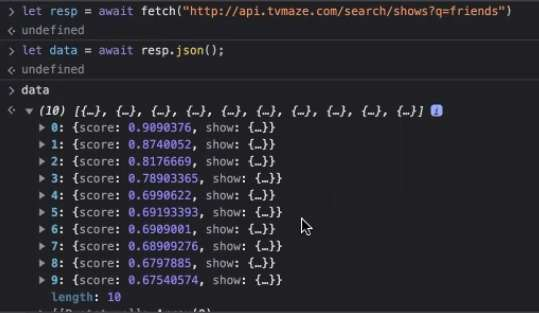

---
date: 2023-06-08
metadata: true
concepts: []
status: 'pre-lecture'
docs: 
cite: ['rithm']
---

- front-end is a really broad term

## Goals

-   Review the must-knows for frontend
-   Review HTML
-   Review CSS
-   Review JavaScript
-   Review React
-   Make sure you’re ready for interview questions!

## Web Fundamentals

-   “How the web works”
    -   HTTP / Other Protocols / Request / Response
        - hypertext transfer protocol - how the web communicates
        - https is http but secure
        - be super clear in your language between request and response
            - know some status codes
    -   Headers
        - requests have headers, responses have headers
            - be familier with some common ones
                - cookie headers: request have cookie, response has set cookie header
                - redirect location header
    -   Cookies / Session
        - be able to have the conversation about why important
            - web being stateless
                - can maintain info by having cookies and sessions
            - know that server is the one that says “save this cookie and send it to me”
            - sessions: layer of abstraction
                - signed but *not* secret
    -   Web security
        - same origin policy
            - CORS - opt in to share resources across origins
        - CSRF
-   “What happens when I google X”
    - what happens when I type this url into the url bar #interviewQuestions 
        - break the url into parts
        - be able to talk through this
        - remember the step - that if another request is present: these steps are repeated 
            - for an image requested, stylesheet requested, etc. 
    -   DNS
        - domain name system: translates host name to IP address
            - can think of this like a contact name in your phone
    -   IP
        - unique address to find that computer on a network
    -   HTTP / HTTPS
        - https is http but secure
        - application engineers don’t usually need to know much more than this
- Accessibility
    - Labels
        - always have labels for your form controls
        - make sure it has a for attribute that matches an ID of the form control
    - ARIA
        - accessible rich i. applications
        - attributes that help communicate the role
            - what is this button actually about?
        - if you are using a semantic element - don’t assign a role that just matches the type. like don’t do `<h2 role="heading">Heading </h2>`
    - Lighthouse
        - & open source tool can run audits about a webpage
        - one of these audits is for accessibility

## Front-end

-   HTML
-   CSS
-   JS

### HTML

- Semantic HTML
    - Additional elements
    - Specific attributes (alt / for / href / src)
        - href: 
        - src: specifies location of a resource: image or script
- SEO: company will likely hire consultants for this
    - Title tags
        - used by search engines to set up clickable headlines
        - optimize what you have in your title tags 
    - Meta tags
        - descriptions under the clickable headlines: don’t always use this, but is one of the things they look for
    - Alt tags
    - One h1 per page
    - google SEO gives your site more juice if you do accesibility things

### CSS
css diner

-   Selectors
    -   element / class / id
    -   descendant li a
        - `$("div p")` selects all paragraph elements that have any div above them
    -   adjacent / direct descendant
        - `$("div + p")` selects the first paragraph element after a div
        - `$("div > p")` selects paragraph elements who is directly nested within a div
    -   attribute / pseudo class / nth-child
        - pseudo class: hover, active link 
            - key words that specify a special state of that element
        - nth-child
            - select every element that is the Nth child of its parent
-   Specificity
    -   element / class / id / inline / !important
        - most specific style gets used
        - calculates a weight to each element
        - inline styles always override anything in the stylesheet unless there is an !important tag - but this !important tag should be used cautiously if at all
-   Responsive Design
    -   Fluid units (em / rem / vw / vh)
        - would you always use fluid units? 
            - if you are trying to build something responsive, yes use fluid units
            - sometimes use fixed units for small things:
                - border around an image
        - 
    -   Flexible images
    -   Media queries
-   Modern layouts
    -   Flexbox
    -   Grid
    -   BEM
-   Mobile first
	- smaller devices have loaded up their site first
	- cellphone less powerful 
		- better to have the “main” section be mobile
			- then more css loads if it’s on a larger/more powerful advice
	- mobile is first class 
	- design for mobile first, then think about how you would design differently if you had a larger screen
- SCSS: not a priority
	- not going to get quizzed about it

### JavaScript

-   Language Fundamentals
	- want to be solid on underlying js
-   DOM manipulation (don’t neglect vanilla JS)
	- #interviewQuestions  Common to get interview questions in vanilla js
-   Async programming
    -   Promises
        - one time guarantee of a future value
        - pending resolved rejected
    -   AJAX (fetch)
        - ajax: javascript in the browser making a web request 
        - built in js api to make web requests
        - helpful to know in case you have a coding challege where you aren’t allowed to use any external libraries
          
    -   async/await

-   OOP
    -   this: context
        - reserved keyword in js who’s value is determined at the point a function is invoked
    -   class / extends / static / super / constructor
        - what’s a class?
            - let me give you an example…
            - classes are a blueprint of functionality
                - classes are not the triangle itself, but what it means to be a triangle
        - what is a constructor?
            - method called when making a new instance
        - what is the static keyword? 
            - would be used in the class definition before methods/properties that you want on the class itself and not the instance of that class
            - static properties: piece of data about the class itself, can define as static
        - what is super refer to? 
            - the parent class/ the class that the current class is inheriting from
                - when you call super: you are invoking the parent’s constructor function
-   The tricky parts
    -   call / apply / bind
        - what is the call function?
            - gives a way to call a function and provide the context as 1st arg
            - every function has a call method
            - can be useful if we need to specify certain context
            - limitation: only called immediately
        - what is the bind function? 
            - returns a new bound copy of a function whose context is permanently bound to that context
            - can also be used to bind arguments
    -   Closures
        - long after that outer function has returned
        - gives us functions that can remember things

### React
shouldn’t be sole focus, but should be a part of your practice
go back and re-do some react exercises

-   Fundamentals (state, props)
	- what is state?
	- what is prop?
-   Component Design
	- what is a component?
		- basic building block of react, self contained - manage their own state and render html, css, js. Bring together the view and the logic. 
		- what is good for? why would you use it? 
	- What to think about for the design component?
		- separate concerns: have dumb component that just returns the UI, and smart components
		- where should state live?
			- as high as it needs to - and no higher
		- Make sure your components do 1 thing
		- review productiv exercise
			- has really good design patterns
-   Hooks: functions that react gives us that let us hook into some react functionality
    -   useState
        - call useState function with the initial state, returns in an array `[stateVal, setState]`
        - be able to recap rendering of state
    -   useEffect
        - when we have side effects: something after and unrelated to a render: 
            - fetch data? etc.
        - to use an effect register with useEffect: always take a callback, always runs on first render, second argument= array of dependency list
    -   useContext
        - what is context in a react application?
            - universal data across your application
            - the value may come from a piece of state at the very top of your application, but it isn’t state itself
            - use sparingly for data that isn’t about the business logic, but instead universal small things like name/dark theme, etc. okay
    -   Less important - useMemo / useCallback / useRef
        - be familiar and have a short definition for these 3
            - useCallback: give you a way to say I don’t want this function to be redeclared
            - useMemo: similar, but instead of remembering a function, it takes other values that react wont’ recompute if the dependencies stay the same.
                - helpful for caching the results of an expensive operation
            - useRef
-   Context

### JS Ecosystem

-   Babel
	- transpiler that lets you take newer js and translate it into older js
-   NPM
	- comes with node
	- cli tool, massive library
-   Webpack
	- we didn’t use it directly ourselves, but were introduced to it through create react app
	- helps bundle things together
	- puts all the js into one file
	- can give dev environment with dev server
	- create react app - built ontop of webpack
	- webpack watches for changes - similar to nodemon
	- bundling reduces the number of requests
	- uses babel to turn jsx to js 

