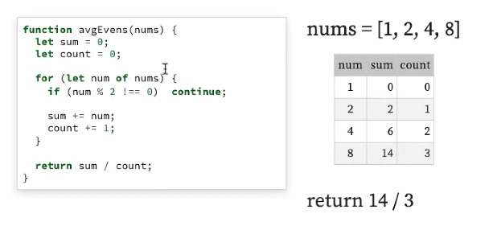

---
date: 2023-06-05
metadata: true
concepts: []
status: 'pre-lecture'
docs: 
cite: ['rithm']
---

## Introduction

-   Overview of whiteboard interviews
-   Process for answering whiteboard challenges
-   Live demo
-   Practice

### Whiteboarding interview
either on a whiteboard if in person
or in text editor of your or company’s choice

-   An interview style that poses a coding challenge …
-   Which you do either live at a whiteboard or on a computer

### Why do they do this?

They want to assess

-   Your understanding of algorithms
-   Your problem-solving techniques
-   How you communicate your thought process
-   How you work under pressure
- can’t cheat, they know this is you

## Process

### Listen carefully

> “Write a function that is given a list of numbers.
> 
> Find all the even numbers in the list  
> and return the average of them.”

### Repeat it back

> “Ok, so you want me to write a function  
> that’s called with a list of numbers,  
> and returns average of the even numbers?”

- gives you a chance to check your understanding of the problem
- Let’s you remember it more b/c when you say something, more likely to remember it

### Ask clarifying questions

- Can I trust that the input will always be a string?
	-   
- Do I need to handle other kinds of things in list?
    -   For example, if a string were in the list?
-   Will these all be integers?
-   Do I just skip over odd numbers?
-   By “average”, do you mean the mean? Median? Mode?
-   Do I print the result or return it?
-   Am I allowed/not allowed to use certain built-in methods?
	- want to know this ahead of time

Why?
-   To buy more time.
-   To understand the challenge details
-   So you write bug-free code

### Write down the requirements

-   Make a short, bulleted list of requirements on whiteboard
    -   So you can’t forget any details
    -   Gives you a moment to think with less pressure
-   For example:
    -   function given integers
    -   just skip odd numbers
    -   get mean of even numbers
    -   return mean

### Write down a test case

```
[1, 2, 4, 5] => 6 / 2 => 3
```

Any other test case you’d want?

Perhaps one with non-integer average:

```
[1, 2, 4, 8] = 14 / 3 => 4.6666
```

### Stop and think

Don’t just start writing code!

Think about your strategy

> “I’ll loop over the list, skipping odds and non-numbers.  
> I’ll keep the sum of the evens, and the number of them.  
> Once I finish looping, I can divide the sum by the count.”

### Pseudocode

This can keep you from getting lost in the weeds

```
for number in list
  if not even, skip
  add number to sum
  increase count by 1
return sum divided by count
```


### Code

-   Start at top-left of the board
    -   You want space to fit code!
-   Write neatly and evenly
    -   In Python, you may find it helpful to show indentation with lines

avgEvens
```js
function avgEvens(nums) {
  let sum = 0;
  let count = 0;

  for (let num of nums) {
    if (num % 2 === 0)  continue;

    sum += num;
    count += 1;
  }

  return sum / sum;
}
```

### Test your code

```js
function avgEvens(nums) {
  let sum = 0;
  let count = 0;

  for (let num of nums) {
    if (num % 2 === 0)  continue;

    sum += num;
    count += 1;
  }

  return sum / sum;
}
```

- Go slowly. Be the computer.
- Keep track of vars (use a table)
- Bugs!
	- We’re skipping _even_ numbers!
	- Dividing sum by sum, not count


```js
function avgEvens(nums) {
  let sum = 0;
  let count = 0;

  for (let num of nums) {
    if (num % 2 !== 0)  continue;

    sum += num;
    count += 1;
  }

  return sum / count;
}
```

nums = \[1, 2, 4, 8\]

| num | sum | count |
| --- | --- | --- |
| 1 | 0 | 0 |
| 2 | 2 | 1 |
| 4 | 6 | 2 |
| 8 | 14 | 3 |

return 14 / 3

## Demo

- asked to take notes on a piece of paper
- & Make sure to “test” your code by hand with your test case
	- Walk through step by step with each iteration
- Getting it right is always most important
	- beyond that, don’t do anything even remotely clever
		- doing things that you’re not sure of is a hell no from the interviewer perspective
	- Could make algorithmic improvements - like mentioning that runtime could be improved using a set instead of an array, etc. 
		- they may then ask you to rewrite using a set, but let it be a request from them

## Things to think about

### Whiteboarding is a new skill

-   It’s not the same as programming
-   The first few times, your brain will fall out
-   Like any skill, it takes time — practice!
	- get lots of practice
	- programming is not the same as whiteboarding
	- leetcode != interview prep

### Partial credit

- It’s not pass/fail
- Do what you can,
    - even if it’s only pseudocode
    - even if it’s a simpler case
    - even if it’s just 1 part of the problem
- They want to see how you think
- They want to see how you handle pressure
- Sometimes, the questions are _really hard_
	- not always designed for you to finish them
	- could be intentional could be purely unintentional - its hard to gauge the difficulty of a problem
- They typically don’t want you to solve it with a built-in function
    - eg, for “find max number,” you can’t use `Math.max()`
    - You can get partial credit/bonus point by knowing Math.max() exists

### Don’t go radio silent

- It’s fine (good, even!) to stop and think
    - Don’t go entirely silent for too long — let them know where you are
    - Set expectations: “let me just think about this for a min”
        - female presenting - will give you hint/step in to help you then dock you for it
- Use the whiteboard for scratch space
    - Helps keep you organized
    - Helps them see where you are

### Hints

- It’s fine to ask for a hint
	- try not to ask for a general hint
- Some questions are designed so that’s expected
- If you know part of the answer, say that before asking for help
	- prevents you from getting a hint that you already knew

### Keep it simple

- This isn’t the time to be clever or try out a new approach you’re learning
    - Solve the problem with an approach that’s familiar and comfortable to you
- & Don’t over optimize or ask about runtime/space constraints if they aren’t given
- Premature optimization is the root of all evil

### Good variable names

- Think for a second before writing down `x`
    - You want something short but helpful
- Good rules of thumb:
    - For _indexes of list_: i, j, k
    - For _items in list_: a, b, c (or x, y, z)
    - Use mnemonics: n for number, s for string, etc

### Test, don’t hand-wave

- Some parts are hairy and you might feel shaky
- It’s easy to try to “hand-wave” past them
    - “And now I recurse and find the longest string”
- Resist that temptation
    - The parts you’re less sure of need the slowest testing
    - Be the computer
    - Walk it through line by line

### It’s (usually) not an API quiz

- Try to remember the very most common operations
    - eg, to add to an array, it’s myArray.push()
- But whiteboarding isn’t an API pop quiz
    - It’s ok to ask what a method is called
    - It’s ok to use a best-guess name (mySet.addItem())
- They want to test your thinking, not memorization of APIs!

### Take your time

- Interviewers will not be checking watches
- They want you to think deeply
- Don’t let nerves speed up your speech
- Don’t feel like you have to be talking the entire time
	- be organized in your thinking instead

## Remember

 **Listen** carefully

 **Repeat** it back

 Ask **clarifying questions**

 Write down **requirements**

 Write down **test case(s)**

 Stop and **think**

 **Pseudocode**

 **Code**

 **Test** your code

- You have a useful, new skill
- They’re hungry for people they can hire — they want you to succeed!
	- they want to get back to their normal job and hire you
- Think of them as a _pair programming partner_, not a _test proctor_
- Think first, go slow, code out loud, test your work


## Extra questions

- You should generally know what language you are whiteboarding in ahead of time
- Think less about DMV proctor who was waiting for you to fail, and more about 
- don’t necessarily have to narrate every line
- 


